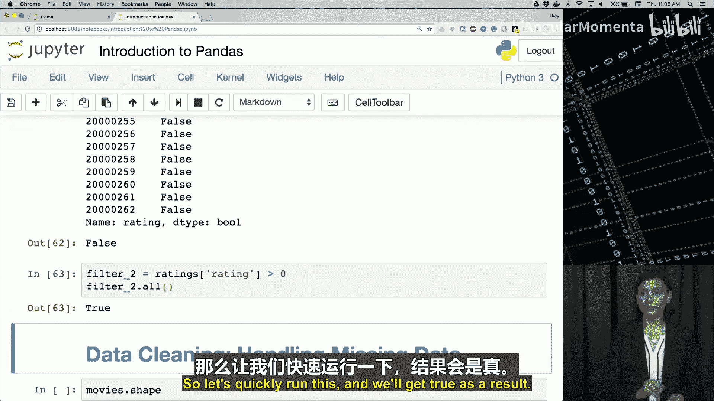

# 015：为何选择Pandas


在本节课中，我们将聚焦于Pandas库的价值。Pandas是Python中主要的数据分析库。通过本视频的学习，你将能够描述Pandas对数据科学和Python的价值，强调Pandas的关键数据结构，并讨论Pandas因其广泛的分析能力而被广泛采用的原因。

## Pandas库的价值

Pandas库提供了一系列对数据分析友好的功能，这使其成为最受欢迎的数据科学工具之一。Pandas构建于NumPy之上，因此NumPy的大部分优势仍然适用。然而，Pandas独特地支持以直观的方式摄取和操作异构数据类型。

Pandas还支持使用`merge`和`join`操作合并大型数据集。它提供了一个非常高效的库，用于拆分数据集、进行转换和重新组合。

Pandas提供的另一个重要功能是其可视化能力。通过DataFrame内置的函数，绘图数据变得非常简单。

使用简单函数进行描述性统计是Pandas的另一个优点。这个功能极大地简化了探索性数据分析以及结果的沟通。

此外，Pandas库通过其原生方法有效地处理时间序列数据，提供了摄取、转换和分析时间序列数据的能力。

使用Pandas的其他好处包括：利用原生方法处理缺失数据和数据透视，轻松的数据排序和描述能力，快速生成数据图，以及用于快速图像处理和其他掩码操作的布尔索引等。

## Pandas的核心数据结构

Pandas之所以能实现这些功能，得益于两种主要的数据结构：**Pandas Series** 和 **Pandas DataFrame**。

Series是一个一维的、类似数组的对象，它为我们提供了多种索引数据的方式。Series的行为类似于NumPy的ndarray，但它支持多种数据类型，如整数、字符串、浮点数、Python对象等。由于它与数组的相似性，它可以作为大多数NumPy函数的有效参数。轴标签统称为索引，我们可以通过这些索引标签来获取和设置值。因此，Series在这方面就像一个固定大小的字典，但它非常灵活。

尽管Series是一个灵活的数据结构，但使用更广泛的数据结构是Pandas的DataFrame。DataFrame是一个二维的、可变的数据结构，支持异构数据，并为行和列提供了带标签的轴。算术运算可以在行和列标签上进行。我们可以将其视为Series对象的容器，其中每一行都是一个Series。

如果你正在寻找执行某些数据转换的功能，很可能Pandas已经具备了。它提供了数据科学家所需的大部分主要数据整理能力，拥有活跃的开发者社区支持，并且功能在不断增长。我们认为Pandas在未来十年将在数据科学过程中扮演更重要的角色。

## 开始使用Pandas

我们已经回顾了为什么Python中的Pandas库非常有用，并讨论了其中的两种主要数据结构。现在，让我们开始使用Pandas笔记本来回顾这些数据结构。

要跟随操作，请打开你第四周文件夹中的“Introduction to Pandas”笔记本。如果你准备好了，现在让我们尝试导入pandas模块。你会看到这一行代码：`import pandas as pd`。运行它，我们的笔记本就可以使用Pandas函数了。

在我们深入探讨Pandas函数的细节之前，让我们先回顾一下刚刚讨论过的两种主要数据结构。

### Pandas Series

首先，我们创建一个名为`s`的Series对象。它类似于NumPy数组，但我们可以定义索引标签，就像你在这里看到的那样，与数据一起定义。

```python
s = pd.Series(data=[100, 200, 300, 400, 500], index=['Tom', 'Bob', 'Nancy', 'Eric', 'Sue'])
```

运行这段代码，Series将被创建。当我们输出`s`时，会看到数据数组被我们放入数据结构中的那些名称索引。因此，索引不再是0到4，而是一个具有定义为Tom、Bob、Nancy等索引的五元素Series。

虽然在这个例子中我使用清晰的格式定义了数据和索引，但我们也可以省略`data=`和`index=`，因为Pandas知道如何将这两个数组解析为Series数据结构。

与NumPy数组相比，Series的另一个特点是数据类型可以是异构的。所以，如果我将一些数据替换为字符串，这些值将会改变。

如果你在任何时候对索引感到困惑，可以像我们在这里做的那样显示索引：`s.index`，它会给你所有索引的列表。

我们可以使用方括号内的任何索引来访问该位置的数据。例如，`s['Nancy']`会指向值300。运行这个，我们确实得到300作为输出。或者，我们可以使用Series对象的`.loc`函数来获取某个位置的值。所以，如果我说`s.loc['Nancy']`，意思是给我由Nancy索引的位置的值，我们会看到输出是相同的。

现在，如果我们想访问多个位置，我们可以输入`s[['Nancy', 'Bob']]`。运行这个，它会给出由Nancy和Bob索引的两个数据值。

访问Series中数据的另一种方法是使用数字索引。这里我们访问`s`中的第4、3和1个元素。提醒一下，像所有其他数组索引一样，Series索引也从0开始。运行这个，我们会看到由Eric、Sue和Bob索引的位置被显示出来。

我们也可以使用`.iloc`函数通过输入`.iloc[2]`来实现同样的效果，它应该给出第二个索引（0,1,2）指向的值，即Nancy。

接下来，在这个笔记本中，你会看到索引的使用以及检查索引是否存在于Series中。所以，你可以快速检查由Bob索引的数据值是否存在于`s`对象中。我们也可以对Series使用Python操作，就像我们在NumPy中做的那样。这里我们将整个Series乘以2。

当我们这样做时，你会发现一些关于字符串的有趣现象。当我将字符串值乘以2时，它们会被重复两次。

我们也可以对Series数据元素的平方进行计算。但在这个例子中，如果我们对整个包含字符串的Series求平方，会得到一个错误，因为它不知道如何计算字符串的平方。所以，我们只取出数值部分（例如，Nancy和Eric）并重复相同的操作，你会看到在我们从Series对象`s`中取出的那部分Series上，我们可以计算这些平方。

### Pandas DataFrame

接下来，我们将讨论Pandas DataFrame。创建DataFrame的方法有很多。我们通常只是将数据读取并摄取到DataFrame中，但在这样做之前，让我们手动创建DataFrame，并回顾一些使用这些DataFrame的简单方法。

让我们从由Series对象字典创建DataFrame开始。记住，我们正在向数据结构中添加另一个维度，所以我们需要标记每个Series对象。

```python
d = {
    'one': pd.Series([100, 200, 300], index=['apple', 'ball', 'clock']),
    'two': pd.Series([111, 222, 333, 444], index=['apple', 'ball', 'cyril', 'dancy'])
}
```

现在我们已经有了一个字典，我们可以将这些数据加载到一个名为`df`的DataFrame中。输入`df = pd.DataFrame(d)`并显示`df`的内容。

运行这个，我会看到生成了两列数据，字典中的Series被合并到了DataFrame中。注意，索引标签也被合并了，这导致了行标签为apple、ball、clock和dancy。而列标签是‘one’和‘two’。我们看到，第一列（标记为‘one’的Series）没有某些索引（如cyril和dancy），而第二列有。在那里，这些值将显示为`NaN`，表示“非数字”，表示在该Series中该索引没有值或该值未定义。

然后我们说`df`，输出以清晰的表格格式显示。但我们也可以打印`df`，这会稍微改变格式。如果你再次对这些列和索引标签感到困惑，你可以通过`df.index`和`df.columns`打印出来。

现在，我将在这里使用一些索引和列。如果你说`pd.DataFrame(d, index=['dancy', 'ball', 'apple'], columns=['two', 'five'])`，我们选择了字典`d`中Series的索引子集（dancy, ball, apple）来创建DataFrame。我们添加了新的列，记得我的字典有‘one’和‘two’作为列，但我要求的是列‘two’和‘five’。当我们这样做时，我们选择了一个不存在的标签‘five’，所以该列中的所有值，正如我们在这里看到的，都将显示为`NaN`（未定义）。

我们也可以从常规的Python字典而不是一组Series对象创建DataFrame。这里我们有一个包含两个字典的数据数组。我们可以使用`pd.DataFrame()`函数将其加载到DataFrame中。运行这个，我们会看到Alex、El Dora、Imajo等标签被创建为列，而行标签是0和1，因为我们没有提供索引标签，所以将使用从0开始的数字索引。我可以为这个DataFrame提供一个索引标签数组。所以，如果我指定`index=['orange', 'red']`，同样的DataFrame将被创建，但行标签将是orange和red，而不是0和1。

就像我们之前做的那样，我们可以从字典中选择一些元素作为列，以限制我们处理的数据集。所以这里，我们创建DataFrame时只选择了‘Joe’, ‘Dora’, ‘Alice’这些列。我们将再次拥有由0和1索引的行，并且只有我们从原始数据集（数据字典）中选择的列。

## 从DataFrame中获取数据

现在，我们如何从DataFrame中获取数据以及如何使用这些基本的DataFrame操作？让我们回到我们原始的DataFrame `df`。我们可以使用列的标签从框架中选择一列。当我们说`df['one']`时，我们收到一个Series对象作为返回，由apple、ball等行索引，但显示的是这些列中的一列。

使用这些列，我们实际上可以创建新列，并动态地将它们添加或插入到DataFrame中。所以这里，我将在我的DataFrame `df`中创建第三列，我们称之为`df['three']`，它将是`df['one']`和`df['two']`中值的乘积。运行这个，我们会看到第三列被创建为第1列和第2列的函数。

在下一个例子中，我们有一个逻辑操作。我想添加另一个名为‘flag’的列，它不是一个像乘法那样的数值操作，而是一个逻辑操作，结果生成一个布尔值。我们将使用`df['flag'] = df['one'] > 250`。它会为第1列中大于250的值给出True。所以当你查看时，100和200是False，`NaN`本质上是False，但300是一个大于250的数字，所以它会被评估为True，而`NaN`我们无法与任何数字比较，所以是False。这样我们就有了名为‘flag’的第四列。

## 删除数据

那么，我们如何从DataFrame中移除或删除数据呢？`df.pop()`用于返回并删除提供的列。所以如果我们说`three = df.pop('three')`，第3列作为一个Series对象被返回。当我再次显示`df`时，我们会看到第三列消失了，所以我们把它弹出来，赋值给一个变量，并永久地从我们的DataFrame中删除了第3列。

我们也可以使用`del`函数来删除列。所以这里我们看到`del df['two']`。运行这个并显示`df`，你会看到第二列（由‘two’索引）已经消失并从`df`中永久删除。然而，在这种情况下，我们没有得到输出显示，这与pop操作不同。

最后一个例子很有趣，它通过选择另一列的前两行来创建一个新列。我们在这里做的是`df.insert()`，所以我们正在向`df`（我们的DataFrame）中插入一些东西。我们将命名该标签为‘copy of one’。它会精确地将‘one’列复制到第二列。所以它将在DataFrame的末尾添加一个看起来完全像第1列的列，但其索引列的标签是‘copy of one’。这里，我们实际上稍微改变了一些东西。我们说的是获取DataFrame第1列中的前两个值，并将其赋值给一个名为‘one upper half’的DataFrame列。当我们这样做时，我们会看到该列的前两个值是第1列的值，而该列的其余行显示为未定义。

## 案例研究：电影数据集分析

在本课的剩余部分，我们将使用电影数据集分析作为案例研究。在接下来的视频中，我们将提供一些使用Pandas进行数据摄取、生成数据描述性统计、数据清洗、子集化、过滤、插入、删除和聚合的示例，并向你介绍处理时间序列数据的基础知识。

在本课中，我们将专注于将数据导入Python。通过本视频的学习，你将能够描述Pandas提供的将数据导入内存的高效且易于使用的方法，识别诸如`read_csv`之类的用于将CSV（逗号分隔值）文件读入DataFrame的函数，并讨论Pandas可以直接导入的其他数据资源。

使用Pandas的最大优势之一是其能够从各种来源摄取各种数据类型和格式的数据。我们可以简单地说，Pandas为我们所有人简化了数据摄取。让我们看看其中一些数据格式和使其成为可能的函数。

最流行的数据格式之一是逗号分隔值，简称CSV。CSV是一种用于存储表格数据（如电子表格或数据库）的简单文件格式。可以使用Pandas的`read_csv`函数将CSV格式的文件作为DataFrame摄取到Python中。

JSON（JavaScript对象表示法）是一种用于结构化数据的格式，通常用于Web应用程序内部的通信。使用Python Pandas中的`read_json`函数，我们可以将JSON文件的结构和内容作为Pandas DataFrame或Series数据结构摄取。

HTML（超文本标记语言）是一种文件格式，用作每个网页的基础。使用`read_html`函数，HTML文档中的数据作为Pandas DataFrame列表存储。

SQL（结构化查询语言）用于通过查询与数据库通信，以插入、删除和选择感兴趣的数据。Pandas中的`read_sql_query`函数为我们提供了一种从关系数据库子集化并将数据加载到Python中的方法。类似地，我们可以使用Pandas的`read_sql_table`函数加载整个关系表，然后它将简单地以表格格式显示为Pandas DataFrame数据结构。

总之，将数据摄取到Python中并不总是容易的。Pandas使其成为一个直观的过程，并为数据科学家提供了工具来操作摄取的数据，以及关键的数据结构，以支持各种各样的数据格式。我们只列出了可以摄取到Python中的少数几种源类型，但如果你遵循本摘要幻灯片中提供的链接，还有更多示例。

## 数据摄取实战

我们现在进入刚刚回顾过的关于数据摄取的实战编码环节。在本笔记本的其余部分，我们将使用来自MovieLens网站的电影数据集。我们使用的数据集应该位于你第四周的文件夹中，名为“movielens”的目录下。请确保在我们开始之前找到它。

让我们查看该movielens目录的内容。这里我们将使用感叹号`ls`命令。我看到我有README.txt、genome-tags.csv、movies.csv以及该目录中的其他一些CSV文件。让我们实际查看其中一些文件的内容。我们将使用`cat`命令。运行`cat movies.csv`，这将需要一些时间。你会看到一些以逗号分隔的文件。在那个目录中，我们正在运行`cat`来显示movies.csv文件的内容，我们会看到里面有许多格式相似的行，它们有MovieID、Title和Genre的值，用逗号分隔。这就是我们所说的逗号分隔值，当我们将它们加载到DataFrame中时，这三个值（例如8、Tom and Hawk 1995、Adventure|Children）将被逗号分隔，并成为我们DataFrame中的列。

让我们检查这个输出的第一行。我们看到第一行是movieId、title、genres。这些是DataFrame将使用的数据列的标签。如果它们不存在，它将简单地以数字方式索引。现在，让我们通过将这个命令的输出通过管道传输到带有`-l`选项的`wc`命令来找出有多少部电影。我们看到这个电影数据库中大约有27,000多部电影。我们可以对tags.csv和ratings.csv做同样的事情，以确保数据存在，并理解其格式。

最快的方法是使用`head -5`命令来显示movielens数据文件movies.csv中的前五个元素。运行这个，我很快会看到第一行是movieId、title、genres，我们有第一部玩具总动员，前四行让我们对这个数据文件中的元素有了一个概念。我可以对tags做同样的事情，我们会看到tags.csv加载时的列标签是userId、movieId、tag和timestamp。我们在这个笔记本中感兴趣的另一个文件是ratings，让我们也显示它的前五个元素，我们看到列是userId、movieId、rating和timestamp。

现在我们将使用Pandas读取数据集并将其加载到DataFrame中。既然我们知道数据集是好的，并且理解了标签，我们将开始将数据加载到三个DataFrame中。

让我们从movies开始。这里我们将利用`read_csv`函数。我们需要将数据的分隔符指定为逗号。简单地说，`movies = pd.read_csv('movies.csv', sep=',')`。让我们显示`movies`的类型，以查看它是一个DataFrame，并使用`head`函数查看该DataFrame中的前五个元素。这里我显示了类型，以表明我们创建的movies DataFrame对象的类型是DataFrame类。我们使用DataFrame的`head`函数来显示前五行，这是默认值。对于`head`函数，我们可以指定行数。如果我想查看更多，我可以说`head(15)`。现在让我们以类似的方式将另外两个CSV文件加载到两个名为`tags`和`ratings`的新DataFrame对象中。我们对tags做同样的操作，读取我们检查过的movielens tags.csv，并用逗号分隔它们，我们使用`head`函数查看前五行。对ratings也是如此。我们会看到它正在内核中执行，一旦执行完成，`in`可能会更新为56。

这里我们对解析日期做了一些特殊处理。对于ratings，当我们谈到时间戳以及如何处理它们时，我们会在本课末尾再讨论。现在，对于当前的分析，正如我提到的，时间戳稍后再处理，我们将删除timestamp列，稍后再回来处理。所以，正如你从我们的DataFrame讨论中记得的，我们可以使用`del ratings['timestamp']`，给出该列的索引或标签，并将其从DataFrame中删除或删除。这样ratings和tags就不再有时间戳了。

好了，现在我们有了三个DataFrame。现在让我们回顾一下如何使用Series和DataFrame函数与对象交互。首先提取tags中的第一行。我们看到该第一行的类型是一个Series，如果我们打印该第一行，你会看到userId、movieId和tag是索引，用于我们拥有的值，例如userId 18。如果你对这些索引感到困惑，同样的规则适用于Series，你可以说`row_0.index`，它会给出索引值。你可以使用这些索引来获取由该标签索引的值。

你也可以进行一些布尔操作，你可以说`'rating' in row_0`，我能从中获取rating吗？正如你看到的，索引有userId、movieId和tag，所以那里没有rating，因此它将评估为False。

现在让我们使用一些DataFrame函数来处理DataFrame。我们已经见过`head`、`index`和`columns`。要提取一系列行，我们需要提供一个索引数组。所以我去tags，并给出索引。使用`.iloc`，因为记住，在这个DataFrame中有很多行。所以`tags.iloc[[0, 11, 200]]`，我们给它一个包含索引0、11和200的数组作为那些行的名称。如果我们这样做，我们会看到我们可以提取这些值，并从技术上讲，从该DataFrame中选择这些值。

## 描述性统计

让我们在这里停下来，在继续实战编码环节之前，回顾一下下一个视频中的一些描述性统计。

在本讲座中，我们将专注于Pandas中一些用于生成描述性数据统计的有用函数。通过本视频的学习，你应该认识到Pandas对数据科学和Python的价值，描述Pandas执行数据统计分析的能力，并利用诸如`describe`之类的常用函数。我们还将探索Pandas中的其他统计函数，这些函数在不断演变。

摘要统计是用于捕捉数据集及其值各种特征的量，用一个数字或一小组数字表示。你应该为数据集计算的一些基本摘要统计是均值和标准差。Pandas通过`describe`函数自动完成这些。查看这些度量将让你了解数据的性质，并且它们可以告诉你数据是否有问题。例如，均值或最大值超出0到5范围可能指向我们的评分数据库中的一个不良数据集。

相关性或`corr`函数用于计算皮尔逊相关系数，可用于探索数据中不同变量之间的依赖关系。还有其他一些相关系数可用，如Kendall和Spearman相关性，Pandas也支持这些。作为旁注，负相关分数意味着如果x变大，则y变小；正相关意味着两个变量是相关的。我们将按原样使用`corr`函数，并等到下一节统计课再进一步探索相关性度量。

Pandas还提供了许多统计函数，你可以在整个DataFrame、DataFrame的一部分或单个列上执行。我们在这张幻灯片上将这些函数统称为`func`。只需用你喜欢的统计操作（如`max`、`min`、`mode`和`median`）替换它，你就会在Pandas中找到该函数。在这张幻灯片上，我们为你提供了一些关于均值和标准差输入和输出的基本信息，除了之前提到的那些。

Pandas还提供了在整个DataFrame或列上检查条件的能力。`any`和`all`函数然后分别应用于比较结果的对象，告诉我们是否有任何比较结果为真，或者是否所有比较结果都为真。

总之，Pandas提供了广泛的函数用于执行统计分析。虽然我们在这里通过回顾少数几个函数来浅尝辄止，但我建议你花一些时间探索本幻灯片提供的链接上的其他函数。

现在让我们花一些时间在我们的笔记本来回顾我们讨论的内容。好的，让我们开始查看我们数据集的简单描述性统计。我们承认你可能现在没有统计学背景，因此我们将专注于对这些函数进行非常轻量级的概述。你在这个微硕士项目中的下一节统计课将为你提供正确的背景知识，以便在Pandas中做更多统计操作。

现在让我们专注于本视频剩余部分中存储在ratings DataFrame中的rating列。正如你可能记得的，我们探索了这个数据集，评分在一个名为`ratings`的DataFrame中，就像你在这里看到的，前五行是该DataFrame中的索引。

让我们回到笔记本的描述性统计部分。我们将首先使用`describe`函数描述该列中的值。记住，`describe`函数会给我们一些关于数据的统计信息。我们看到那部分正在运行，我们得到了计数、均值、标准差等。该列中已定义或有用的值的计数显示有超过200万条评分记录，均值为3.53（我四舍五入为3.53）。标准差是衡量数据中离散度或变异性的指标。当涉及到误差时，较小的偏差是好的。然而，如果你的数据自然包含很多变异性，那是你对该数据观察的属性。然后我们有百分位数。如果50%是3.5，这意味着超过一半的评分是3.5或更低。类似地，这里75%的评分低于4.0。

请注意，我们本可以将整个DataFrame提供给`describe`。这里我们只提供了ratings列，但我可以快速复制粘贴这个，并描述整个DataFrame。虽然这通常非常有用，但在我们的数据中，userId和movieId是仅存储标识符而非测量值的列，因此我们可以安全地忽略它们的统计信息。这就是为什么我们选择只选择ratings列。

接下来，我将计算评分的均值，就像我们用`describe`做的那样，但这次它只会给我们那个均值。所以，如果你只想知道像你在这里看到的评分列那样的均值，你会调用`mean`函数，而不是调用整个`describe`函数。我们本可以再次在整个DataFrame上做均值。所以，如果我们那样做了，我们会有每列的均值。作为一行或表格，userId均值、movieId均值和ratings均值，就像这三个值会一个接一个地打印出来。

好的，接下来，我们将查看评分的最小值和最大值。运行这两个。我们说的是`ratings['rating'].min()`和`ratings['rating'].max()`。最小值是0.5，最大值是5.0，所以它们都在可能的良好值范围内，评分应该在0到5之间，我们看到最小值和最大值都在该范围内。

我们现在可以使用评分之间的标准差，再次提醒，这是它们与平均值的离散程度。所以它给出了这些评分中变异性或方差的度量。我们只需使用`std`函数。

了解最常见的评分值可能也很有趣。`mode`函数将给出这个信息，所以让我们在该评分列上运行`mode`函数。它计算每个值并找到最频繁的那个，所以在这种情况下，4.0是最频繁的评分，所以电影最常被评分为4.0。

在这一点上，我通常会查看具有可测量变量的列之间的相关性。在我们的数据集中，由于我们只有一列这种类型（rating），在整个DataFrame上运行相关函数不会给我们太多信息，不幸的是。但让我们这样做只是为了展示相关函数如何格式化其输出。所以这里我们只说`ratings.corr()`。运行这个，你会看到一个表格，行和列都有我们DataFrame中的列标签，所以这些理想情况下是每个可测量变量。该表格显示了每个变量与另一个变量的相关性分数。所以，正如你会记得的，这里的负相关分数意味着我们数据集中的那些特征是负相关的，所以一个上升，一个下降，增加一个意味着另一个减少。然而，正如我之前提到的，我们不会将这个结果纳入分析考虑，因为我们知道这些变量不可能相关。这也向你表明，要理解相关性，我们确实需要更多的信息。在其他笔记本中，我们将能够看到具有更确定性结果的相关性分数。

在下一行，我将检查是否有任何评分高于零。所以我们可以对整个列进行全局逻辑比较，得到一个Series对象，其中包含我们DataFrame每一行的布尔值。我们可以这样做：选择`ratings['rating']`并比较它是否大于五。它会给我们那个带有布尔值的Series对象。所以，如果一行中的值大于五，该行将为True；如果一行中评分列的值小于五，我们将得到False。运行这个，`any`会告诉我们`filter1` Series中是否有任何值为True。在这种情况下，我们得到False作为输出，因为数据集中没有评分大于五。

为了理解那个过滤器是什么样子，让我们打印Series对象`filter1`。我实际上可以先打印它的类型，所以我们知道它是一个Series对象。让我们暂时去掉这个`any`。我们知道它是一个Series对象，对吧？所以让我们回去，不打印类型，而是打印过滤器对象。当我这样做时，我们看到那个对象，那个Series对象，是一个将评分与五进行比较的列，我们从0、False、False、False、False开始，一直到所有行。我们有大约200万行或更多，它们都是False，所以这就是我们评分数据库中的评分。从它的一小部分我们看到，确实没有True值。

我们也可以使用`all`函数做相反的事情。然后我们检查该列中的所有值是否为True。一个需要我们做的条件是，我们想确保所有评分值都高于零，并且我们已经查看了最小值，我们知道情况确实如此。所以我们将在这里运行一个条件：`ratings['rating'] > 0`，并将结果的Series对象赋值给`filter2`。我将检查`filter2`布尔Series中的所有值是否为True。快速运行这个，我们会得到True作为结果。

好的，现在我们已经探索了数据集的一些统计信息，让我们继续数据清洗，并首先回顾一下Pandas中的数据清洗函数。




在本节课中，我们一起学习了Pandas库的核心价值、其关键数据结构（Series和DataFrame）、如何创建和操作这些结构、如何从各种来源导入数据、以及如何使用Pandas进行基本的描述性统计分析。这些基础知识是进行更高级数据操作和分析的起点。