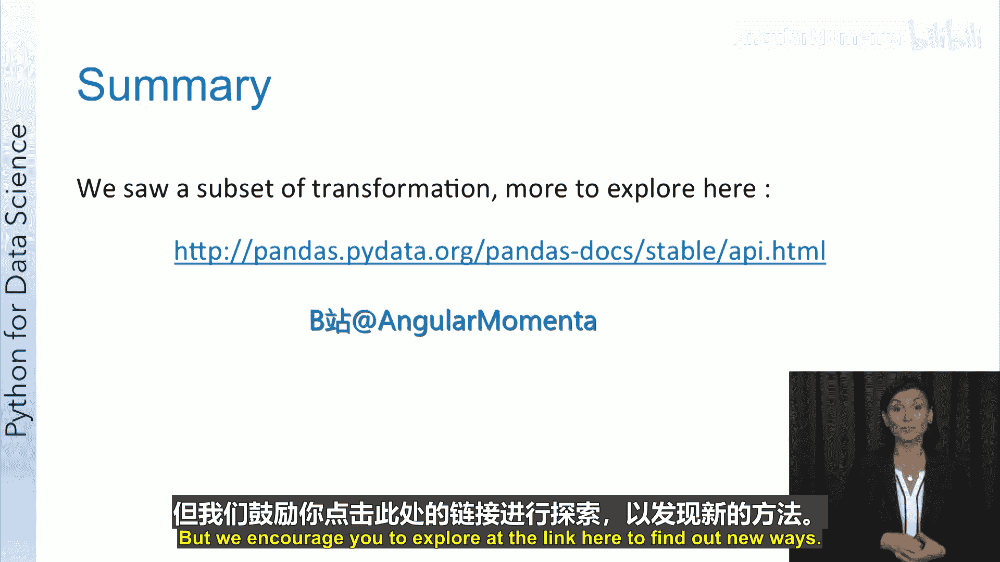
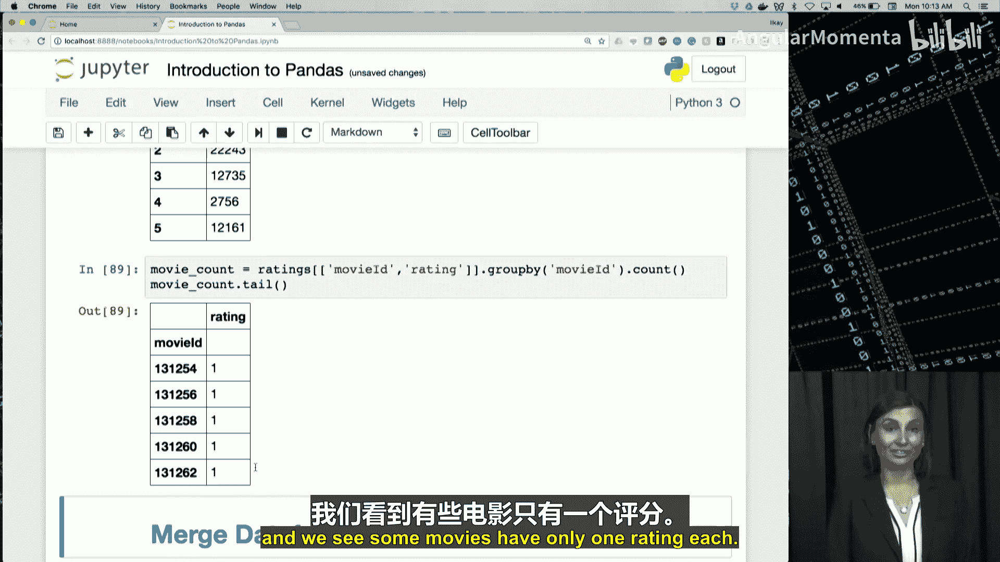

# 016：Pandas数据清洗与操作


在本节课中，我们将学习Pandas库中用于数据清洗、可视化以及数据操作的核心功能。我们将了解如何处理现实世界中不完美的数据，如何通过可视化初步探索数据，以及如何使用切片、过滤、分组等操作来高效地处理和分析数据。

## 数据清洗的必要性与方法 🧹

上一节我们介绍了Pandas的基础数据结构。本节中，我们来看看如何处理数据中常见的问题。现实世界中的数据通常是混乱的，可能存在缺失值、异常值或无效数据。例如，年龄字段出现负值，或者在Python数据框中出现`NaN`值。由于我们通常无法控制上游数据的收集方式，因此必须通过检测和纠正来解决这些质量问题，使数据最终可用于分析。

以下是Pandas中处理数据质量问题的几种方法：

*   **替换无效值**：可以将无效值或`NaN`值替换为更合适的值。
*   **填充数据**：对于缺失值或数据缺口，可以尝试填充数据，而不是直接删除。通常需要根据领域知识或使用插值等技术来估算一个合理的值。例如，可以根据员工的入职年限来估算其缺失的年龄。
*   **删除数据**：根据探索性分析和统计分析的结果，可以考虑删除对当前任务不重要的字段或值。例如，在某些情况下可以删除异常值。

## 核心数据清洗函数 🔧

现在，我们来具体了解Pandas中一些重要的数据清洗函数。

### 替换函数：`replace`
`replace`函数可以全局更改数据框中的值。例如，可以将所有`9999`替换为`0`。

### 填充函数：`fillna`
`fillna`方法会用已知值向前或向后填充缺失值。向前填充（`method=‘ffill’`）会用上方单元格的值填充`NaN`；向后填充（`method=‘bfill’`）则用下方单元格的值填充。

### 删除函数：`dropna`
`dropna`函数用于删除包含缺失值的行或列。
*   使用`axis=0`（默认）会删除任何包含缺失值的**行**。
*   使用`axis=1`会删除任何包含缺失值的**列**。

### 插值函数：`interpolate`
`interpolate`函数可以对序列和数据框对象进行插值。默认方法是线性插值，即使用线性多项式来拟合数据点。Pandas也提供了其他插值方法。

**总结**：Pandas提供了多种处理缺失数据的简便方法。我们在此仅做入门介绍，更多方法请参考相关文档。

## 数据清洗实战演练 💻

现在，让我们切换到Jupyter Notebook，看看上述讨论的实际应用。

我们首先检查电影数据集的形状：
```python
movies.shape
```
结果显示约有27,000行记录。

接下来，我们检查数据集中是否存在空值：
```python
movies.isnull().any()
tags.isnull().any()
```
检查发现，`tags`数据框的`tag`列确实存在一些`NaN`值。

我们将使用`dropna`函数删除包含缺失值的行：
```python
tags = tags.dropna()
tags.isnull().any()
tags.shape
```
操作后，所有列均返回`False`，表明缺失值已被成功删除。数据行数从465,564减少到465,548，共删除了16行。

## Pandas数据可视化入门 📊

在深入数据可视化课程之前，我们先简单介绍Pandas的绘图功能。Pandas底层使用Matplotlib库进行绘图。

要在Jupyter Notebook中内嵌显示图形，需要先执行以下魔法命令：
```python
%matplotlib inline
```

Pandas的`plot`包提供了多种可视化图表：

*   **条形图**：`plot.bar()`，每列以不同颜色表示。
*   **箱线图**：`plot.box()`，展示数据分布，包括最小值、最大值和中位数。
*   **直方图**：`plot.hist()`，显示数据分布，可揭示数据的偏态或异常离散情况。
*   **折线图**：`plot()`，可以快速创建数据集的折线图。

**总结**：Pandas提供了一套多样化的绘图方法。通过可视化数据，我们常常能发现仅查看原始数据时不易察觉的规律。

## 可视化与数据操作实战 🎨

现在，我们在Notebook中实践一些可视化和数据操作。

首先，为`ratings`数据框的`rating`列绘制直方图：
```python
ratings[‘rating’].hist(figsize=(15,20))
```

接着，为`rating`列生成箱线图：
```python
ratings[‘rating’].plot.box(figsize=(15,20))
```
箱线图清晰地展示了评分的平均值（约3.5）、最小值（0.5）和最大值（5）。

## 高效的数据操作 ⚙️

拥有高效的数据操作能极大加速所有使用这些操作的算法。本节我们将学习如何在Pandas中利用这些操作。




我们将使用一个示例数据框`df`进行演示。

### 数据切片与选择
*   **选择列**：通过列名直接选择，例如`df[‘sensor2’]`。
*   **选择行范围**：使用索引切片，例如`ratings[0:10]`选择前10行，`ratings[-10:]`选择最后10行。
*   **条件过滤**：基于条件筛选行。例如，`df[df.sensor2 > 0]`会选出`sensor2`列值大于0的所有行。

### 增删行列
*   **添加列**：通过赋值创建新列。例如，`df[‘sensor4’] = df.sensor3**2`会创建一个名为`sensor4`的新列，其值为`sensor3`列的平方。
*   **删除行**：使用`drop`函数并指定行索引。例如，`df.drop([4])`会删除索引为4的行。
*   **删除列**：使用`del`函数。例如，`del df[‘timestamp’]`会删除名为`timestamp`的列。

### 数据聚合：`groupby`
`groupby`是一个非常有用的方法，用于获取数据框的聚合统计信息。例如，按`student_id`分组并计算每个科目的平均分：
```python
df.groupby(‘student_id’).mean()
```

**总结**：Pandas拥有大量高效的方法来操作数据集。通过组合这些简单的操作，可以构建出复杂的数据分析流程，将原始数据转化为可分析、能获取深刻见解的形式。

## 数据操作实战演练 🛠️

现在，我们应用这些操作来处理电影数据集。

首先，查看`tags`表`tag`列的前几行：
```python
tags[‘tag’].head()
```

选择`movies`表中的`title`和`genres`列：
```python
movies[[‘title’, ‘genres’]].head()
```

对`ratings`表进行行切片：
```python
ratings[0:10] # 前10行
ratings[-10:] # 后10行
```

使用`value_counts`统计`tag`列中各值的出现次数，并绘制前10个最常见标签的条形图：
```python
tag_counts = tags[‘tag’].value_counts()
tag_counts[:10].plot.bar()
```

### 条件过滤
创建一个过滤器，标记评分大于等于4.0的电影：
```python
is_highly_rated = ratings[‘rating’] >= 4.0
ratings[is_highly_rated].tail()
```

创建一个过滤器，标记类型中包含“Animation”的电影：
```python
is_animation = movies[‘genres’].str.contains(‘Animation’)
movies[is_animation][5:15]
```

### 数据聚合
按`rating`分组，统计每个评分出现的次数：
```python
ratings[[‘movieId’, ‘rating’]].groupby(‘rating’).count()
```

按`movieId`分组，计算每部电影的平均评分：
```python
avg_rating = ratings[[‘movieId’, ‘rating’]].groupby(‘movieId’).mean()
avg_rating.head()
```

按`movieId`分组，统计每部电影收到的评分数量：
```python
rating_count = ratings[[‘movieId’, ‘rating’]].groupby(‘movieId’).count()
rating_count.tail()
```

---



**本节课总结**：我们一起学习了Pandas中数据清洗的核心方法（如处理缺失值）、基础的数据可视化技巧（如直方图和箱线图），以及一系列高效的数据操作，包括数据切片、条件过滤、增删行列和数据聚合（`groupby`）。掌握这些技能是进行有效数据分析和数据科学项目的基础。