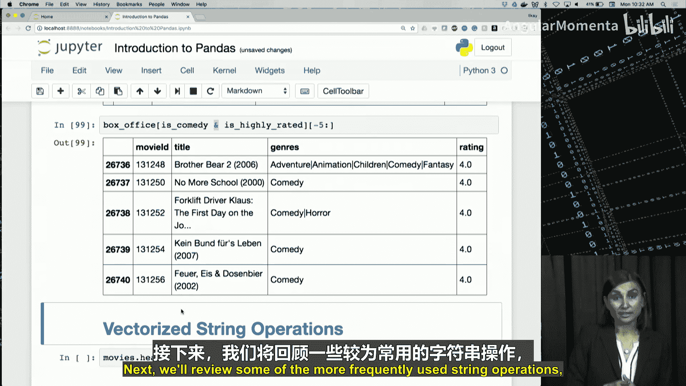
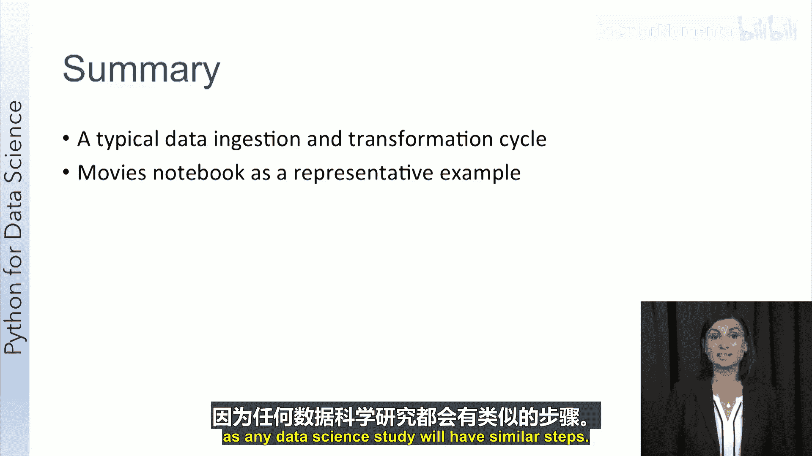

# 017：Pandas 合并数据框


在本节课中，我们将学习如何使用Pandas库合并来自不同数据框的数据。数据通常分布在不同的位置和表格中，合并操作能让我们将这些数据整合起来，获得更全面的视角。我们将介绍几种合并数据的方法，并了解它们之间的区别。

## 合并数据框的必要性

处理数据框时，我们经常需要处理来自多个数据框的数据。常见的做法是将两个数据框中所需的数据合并到一个单一的数据框中，然后对这个新数据框执行操作。如果你熟悉数据库管理系统，这与其中的连接操作非常相似。

## 合并方法概览

Pandas提供了多种方法来合并数据框。以下是几种主要的方法。

### 使用 `concat` 函数

`concat` 函数可用于堆叠数据框，从而创建一个新的数据框。例如，将一个名为 `Left` 的数据框与自身连接。

```python
import pandas as pd
result = pd.concat([Left, Left])
```

如果提供给 `concat` 函数的两个数据框拥有不同的列，那么生成的数据框将包含两个数据框的所有列。在这种情况下，原始数据框中不存在的列，其单元格将填充为 `NaN`（缺失值）。

### 使用 `append` 函数

除了 `concat`，我们还可以使用 `append` 函数将一个数据框附加到另一个数据框。它的行为与 `concat` 函数类似，但它是数据框本身的一个方法。

```python
result = left.append(right)
```

与首次使用 `concat` 类似，我们可能会再次得到许多空单元格。

### 使用 `merge` 操作

能真正将两个数据框组合起来的操作是 `merge`。使用 `merge` 操作的好处在于，它可以消除所连接数据框之间的重复列。

```python
result = pd.merge(left, right, on=['key1', 'key2'], how='inner')
```

它的行为非常类似于使用内连接的 `concat`，但会剔除我们之前遇到的重复列。

虽然这些方法根据情况各有其用途，但在尝试合并来自多个不同来源的数据时，我发现自己经常使用 `merge` 操作，尤其是当这些数据共享相同的键时。

## 实践操作：合并电影与标签数据

现在，让我们通过一个实际的编码会话来了解这些功能。我们将使用电影和标签数据框。

首先，我们查看一下 `tags` 和 `movies` 数据框中的列。

```python
print(tags.columns)
print(movies.columns)
```

两个数据框都有一个 `movieId` 列。我们可以使用这个 `movieId` 列对这两个数据框执行内连接合并。

```python
merged_df = movies.merge(tags, on='movieId', how='inner')
print(merged_df.head())
```

这样，我们就将标签数据和电影数据合并到了一个数据框中。

## 综合应用：计算平均评分并合并

接下来，让我们尝试将目前所学的知识综合运用起来。

首先，我们根据 `movieId` 列对所有评分进行分组，并计算平均评分。

```python
avg_ratings = ratings.groupby('movieId', as_index=False)['rating'].mean()
avg_ratings = avg_ratings.drop(columns=['userId'])
print(avg_ratings.head())
```

现在，我们有了每部电影的平均评分。接下来，我们可以将这些平均评分与电影表合并。



```python
box_office = movies.merge(avg_ratings, on='movieId', how='inner')
print(box_office.tail())
```


合并后的 `box_office` 数据框包含了电影ID、标题、类型和来自平均评分数据框的评分。

## 应用过滤器

我们可以利用合并后的数据应用过滤器。例如，设置一个筛选高评分电影的过滤器。

```python
is_highly_rated = box_office['rating'] >= 4.0
high_rated_movies = box_office[is_highly_rated]
print(high_rated_movies.tail())
```

再设置一个筛选喜剧类型电影的过滤器。

```python
is_comedy = box_office['genres'].str.contains('Comedy')
comedy_movies = box_office[is_comedy]
print(comedy_movies.head())
```

我们还可以同时应用这两个过滤器，寻找高评分的喜剧电影。

```python
high_rated_comedies = box_office[is_highly_rated & is_comedy]
print(high_rated_comedies.tail())
```

通过将合并操作与之前视频中的技能相结合，我们可以看到这些功能非常强大。

## 字符串操作简介

字符串是常用的数据类型，因为数据科学经常涉及文本数据的研究。Pandas提供了许多有用的字符串操作。接下来，我们将回顾其中几个。

### `split` 函数

`split` 函数有助于围绕分隔符将数据分割成多个部分。例如，将数据框 `df` 中 `city` 列的值以下划线为分隔符进行分割。

```python
df['city'].str.split('_', expand=True)
```

### `contains` 函数

`contains` 函数提供了一种简单的方法来检查字符串是否包含给定的字符。

```python
df['city'].str.contains('2')
```

### `replace` 操作

使用 `replace` 操作，我们可以将一个子字符串替换为另一个。

```python
df['city'].str.replace('_', '##')
```

### `extract` 函数

`extract` 函数将返回它找到的第一个正则表达式匹配项。它可以是从文本数据中构建新特征的快速方法。

```python
df['title'].str.extract(r'\((\d{4})\)', expand=True)
```

## 实践操作：处理电影数据中的字符串

电影表中的 `title` 和 `genres` 列都包含复合信息。例如，`Toy Story (1995)` 包含了年份，而 `genres` 则通过竖线字符将多个类型连接在一起。

让我们使用一些字符串操作来分离这些值。

首先，使用 `split` 函数将 `genres` 列中的每个值转换为单独的列。

```python
movie_genres = movies['genres'].str.split('|', expand=True)
print(movie_genres.head(10))
```

你还可以添加一个新列来检测每个类型是否为喜剧。

```python
movie_genres['is_comedy'] = movie_genres.apply(lambda row: 'Comedy' in row.values, axis=1)
print(movie_genres.head())
```

最后，让我们从 `title` 列中提取出年份作为一个单独的列。

```python
movies['year'] = movies['title'].str.extract(r'\((\d{4})\)', expand=True)
print(movies.tail())
```

现在，`year` 成为了 `movies` 数据框中的一个新列，这对于按年份进行分组等操作非常有用。

## 处理时间戳数据

处理时间戳可能很困难，因为存在多种不同的时间数据格式和精度。在本节中，我们将介绍一些时间数据格式、结构和操作。

Unix时间通过计算自特定时刻（UTC时区1970年1月1日）以来的秒数来跟踪时间的进展。这是一个整数，我们需要将其转换为可读的日期和时间。

`datetime64[ns]` 是datetime的通用数据类型。我们的主要任务是将自1970年UTC时间以来的原始整数时间戳转换为上述日期时间格式之一，以便Python能以人类可读的格式呈现它。

我们可以使用 `pd.to_datetime` 函数快速将时间戳转换为Python格式。

```python
tags['parsed_time'] = pd.to_datetime(tags['timestamp'], unit='s')
```

`unit` 参数在这里非常重要，因为它告诉函数输入的单位是什么。在这个例子中，输入列是来自 `tags` 数据框的 `timestamp`，输入的单位被声明为秒。输出存储在一个名为 `parsed_time` 的新列中。

一旦时间被转换为Python格式，你就可以用它来创建过滤器。例如，构建一个布尔过滤器，只选择在2015年2月1日之后的行。

```python
greater_than_t = tags['parsed_time'] > pd.Timestamp('2015-02-01')
selected_rows = tags[greater_than_t]
```

我们还可以利用时间戳按时间顺序对数据进行排序。Pandas数据框中的 `sort_values` 函数提供了多种排序选项，其中之一是按 `parsed_time` 排序。

```python
sorted_tags = tags.sort_values(by='parsed_time', ascending=True)
print(sorted_tags.head(10))
```

按时间顺序排序时间序列数据有助于改进和实现有效的可视化，因为你可以向可视化提供排序后的数据。

## 实践操作：处理时间戳数据

任何带有时间戳的数据都为洞察提供了巨大的可能性，因为当我们知道数据是何时获取的，我们就可以对该时间点有更多的理解。

首先，重新加载包含时间戳的原始 `tags.csv` 文件到 `tags` 数据框中。

```python
tags = pd.read_csv('tags.csv')
print(tags.dtypes)
```

`timestamp` 列的类型是 `int64`。我们需要将这个整数转换为Python可以呈现为可理解日期的数据类型。

```python
tags['parsed_time'] = pd.to_datetime(tags['timestamp'], unit='s')
print(tags[['timestamp', 'parsed_time']].head())
```

现在，`parsed_time` 列以人类可读的方式（年-月-日 24小时制格式）显示时间戳。

一旦时间被转换为人类可读的格式，我们就可以使用我们能理解的时间戳来创建过滤器并选择感兴趣的行。

```python
greater_than_t = tags['parsed_time'] > pd.Timestamp('2015-02-01')
selected_tags = tags[greater_than_t]
print(selected_tags.shape)
```

我们还可以按时间顺序对行进行排序，使数据从记录的开始时间开始流动，用户可以在这个框架中看到时间顺序。

```python
sorted_tags = tags.sort_values(by='parsed_time', ascending=True)
print(sorted_tags.head(10))
```

## 综合案例：电影评分随时间的变化

一个你可能回答的问题是：电影评分是否与上映年份相关？

我们已经有平均评分数据框 `avg_ratings`。现在，我们可以将其与包含年份信息的 `movies` 数据框合并。

```python
# 假设 movies 数据框已包含从 title 提取的 year 列
merged_with_year = movies.merge(avg_ratings, on='movieId', how='inner')
```

然后，我们可以按年份分组计算每年的平均评分。

```python
yearly_avg = merged_with_year.groupby('year')['rating'].mean()
print(yearly_avg.head())
```

通过绘制每年的平均评分图，我们可以看到某些年份的票房电影看起来更好。

```python
yearly_avg.plot(kind='line', title='Average Movie Ratings Over Time')
```

通过结合我们所学到的关于过滤、连接、计数、平均和添加列的所有知识，我们能够开始生成洞察，分析哪些年份更适合制作电影，以及它们如何随时间影响我们的评分。

## 课程总结

在本节课中，我们一起学习了Pandas库中典型的数据科学操作。我们基于电影数据库笔记本回顾了所学的实践技能：

1.  **数据摄取**：回顾了如何以多种格式摄取数据，以及与这些格式相关的基本读取操作。
2.  **Series和DataFrame**：介绍了Pandas中两种基本的数据结构。
3.  **基本统计操作**：概述了对Series和DataFrame执行基本统计操作的函数，包括联合描述性统计以及生成最小值、最大值、标准差、众数等单独函数，还回顾了相关性分析函数。
4.  **数据准备与探索**：介绍了Pandas中的数据准备和探索选项，如 `isnull` 和 `dropna` 函数。
5.  **数据可视化**：看到了内联图、箱线图和直方图的示例，以及如何调整图形格式和其他窗口属性。
6.  **数据切片与过滤**：讨论了切出行和过滤数据框，以及使用 `groupby` 操作聚合数据。
7.  **数据合并**：介绍了使用内连接等操作合并或连接来自多个数据框的数据。
8.  **字符串操作**：讨论了三种主要操作：`split`、`concat` 和 `extract`。
9.  **时间戳处理**：最后，讨论了如何处理时间戳。



我们构建的电影笔记本是一个具有代表性的示例，可以作为参考，因为任何数据科学研究都会有类似的步骤。