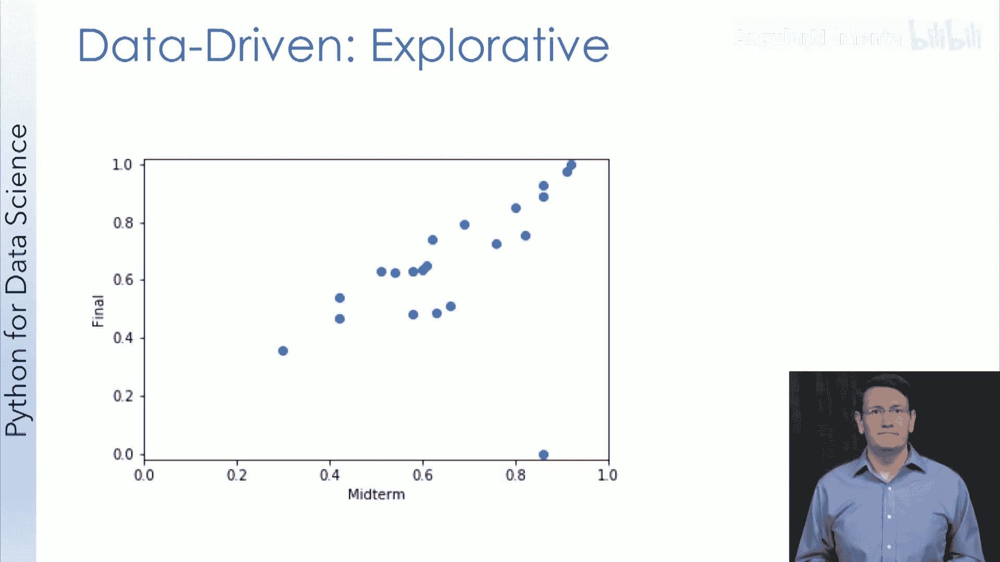

# 018：数据可视化概述 📊

在本节课中，我们将要学习数据可视化的基本概念、它在数据科学中的核心作用，以及如何评估一个可视化作品的质量。数据可视化是数据科学家的一项关键技能，它不仅能帮助我们理解数据，还能有效地传达分析结果。

## 数据可视化的定义与重要性

数据可视化是任何数据科学家的核心技能之一，其价值不容低估。然而，它本身也是一个广阔的领域。在全美各大学和设计实验室，有许多研究生课程专门研究数据可视化。因此，本周的内容只是对这个宏大主题的一个入门介绍。

我们将首先从概念上探讨数据可视化，然后直接使用Python库进行一些可视化实践。最后，我们将审视一些特别有效的数据可视化案例及其影响力。如果你对这个领域感兴趣并希望深入学习，我们也会提供相关教科书和其他资源的链接。

在数据爆炸的时代，正如第一周ILKI所讨论的，处理这些数据的相关技能至关重要。谷歌首席经济学家在2008年曾指出：“获取数据、理解数据、处理数据、从中提取价值、将其可视化并进行沟通的能力，在未来十年将是一项极其重要的技能。”这段引述不仅预示了对数据科学家的需求，也强调了统计学（数据科学的核心领域之一）和理解数据的另一种方式——可视化——的重要性。

事实上，可视化贯穿于他所描述的许多过程。处理数据、从中提取价值或理解数据，通常都需要通过可视化来获得洞察。当你想要传达结果时，也常常需要使用数据可视化。因此，可视化是他所描述技能的核心。

有两个关于可视化的定义我特别欣赏：
1.  **使用计算机支持的、抽象数据的交互式视觉表示来增强认知。**
2.  **数据的表示和呈现，以促进理解。**

这两个定义都强调了表示和呈现数据的重要性，这是数据可视化的核心。但它们最打动我的共同点是，都落脚于数据可视化的关键部分：**改善我们理解和思考数据的方式**。我们大脑的很大一部分专用于视觉处理，拥有强大的视觉处理能力。相比之下，我们并不擅长解读原始数据。这就是数据可视化的力量。

## 可视化实验：原始数据 vs. 图形

让我们快速做两个实验。以下所有数据点都来自同一个数据集。你能看出X和Y之间的关系吗？

（此处假设有一组原始数据点列表）

仅看这些数据点可能很困难。再看一些关于X和Y的统计量（如均值、标准差），帮助也不大。相关系数0.88暗示这两个值相关，可能存在线性关系，但我们仍然不完全理解数据。

然而，一旦我们将数据可视化，一切就清晰了。图形显示，Y相对于X呈指数增长，直到X大约为7。此后，Y达到约33的上限，增加X不再增加Y。值得注意的是，相关系数在这里有点误导，它暗示了线性关系，而数据外观并非如此。这个实验的关键在于，人类的视觉皮层非常强大。

让我们再看一组新数据。所有点都来自一个数据集。如果你仔细观察，可能会注意到X和Y值似乎很相似，但带有一些噪声。

同样，让我们通过图形来更好地理解。散点图显示它们确实高度相关：较高的X值意味着较高的Y值，反之亦然。事实上，这里的相关系数统计量会很有帮助，其值为0.5。这个值比你预期的要低，因为存在一个异常值。从视觉上，你可能也注意到了那个奇怪的异常点。

但如果没有上下文，我们不知道该如何处理这个信息或这个异常值。我们甚至不确定是否关心这些数据。**所以我们需要上下文。**

原来，这些是某个班级每个学生假设的期中考试和期末考试成绩。现在，我们知道期中表现与期末表现密切相关。对于教师来说，这可能导致他们对期中表现不佳的学生进行干预。对于异常值，上下文也有帮助。经过调查，你发现那名学生没有参加期末考试。在数据清理时，缺失的条目被填成了0，但考试得0分和未参加考试是两回事。如果移除这个因数据缺失造成的异常值，你会对数据有更好的理解，并且相关系数会上升到0.89。

这个例子说明，**没有数据背景的可视化毫无意义**。当我们不知道X和Y代表什么时，我们并不真正关心这些数据。背景使我们重视可视化，并赋予我们深入挖掘数据、解释异常值并对数据本身得出结论的能力。

## 数据可视化的分类与应用

现在我们有了数据可视化的工作定义，让我们来谈谈在数据科学中使用可视化的不同方式。可视化在数据科学中扮演多种角色，其角色决定了我们如何处理可视化。

有两种关键的方式来对数据可视化进行分类：
1.  **概念性 vs. 数据驱动性**：本周和本课程主要关注数据驱动性可视化。但概念性可视化（旨在解释事物如何运作）也很重要，例如经济学家可视化经典的供需曲线概念。
2.  **在数据驱动背景下，分为呈现性 vs. 探索性**：
    *   **呈现性**：当我们分析完数据，有了数据支持的结论，并希望向观众清晰阐述时，我们希望可视化能以最直接的方式向观察者传达这一结论。
    *   **探索性**：我们花费大量时间探索数据，可视化在其中扮演关键角色。可视化鼓励并使我们能够更深入地审视数据。

以下是来自这些类别的例子：
*   **概念性示例**：经典的供需曲线。
*   **呈现性示例**：一项研究中的图表，显示同伴教学法相较于标准教学，显著降低了加州大学圣地亚哥分校计算机科学课程的学生不及格率。目标是向读者清晰展示结果。
*   **探索性示例**：期中与期末考试成绩相关性的散点图。创建这样的图是为了更好地理解关系，并可能引导进一步的数据探索。

探索性可视化是数据科学过程的核心。当我们寻找异常值或趋势时，经常使用可视化工具。这些可视化引导我们深入数据。在此过程中，我们使用直方图查看数据分布，探索变量间关系或寻找其他趋势。我们不断地在数据集的不同部分“放大”和“缩小”，以更好地理解数据，而这个过程几乎总是由数据可视化伴随和促进的。

## 优秀数据可视化的特质

现在我们了解了数据驱动可视化的不同用途，接下来探讨衡量这些可视化成功与否的标准。

关于优秀数据可视化的标准有很多观点，但我非常喜欢数据可视化教育者安迪·柯克提出的三点：**可信、易懂、优雅**。

以下是关于这三点的详细说明：

**1. 可信**
可信意味着所呈现的数据被诚实地描绘。例如，如果你的展示方式暗示了某种关系、趋势或相关性，那么数据中就应该有证据支持这种关系。否则，你就是在误导观众。

看一个假设的例子：一张可能在商务会议上展示的图表，标题为“第四季度利润激增！”。如果你注意到Y轴，会发现这根本不是激增。Y轴被放大到图表的一小部分，Q1到Q4之间只有大约2%的增长。这很难称得上“激增”。这样的图表作者试图不诚实或至少是误导性的。一个更诚实的图表会诚实地设置Y轴，并可能绘制前几年的利润数据以进行比较。

关键要点：
*   **认真对待信任**：查看你结果的人信任你不会篡改数据或歪曲结果。他们希望根据你的发现采取行动。
*   **诚实贯穿始终**：诚实不仅限于可视化阶段，它必须贯穿数据科学的全过程。你需要认识到自己可能存在的偏见，并尽力让数据本身（而非你的偏见）驱动你的探究。

**2. 易懂**
易懂关乎关注你的观众以及他们使用你可视化的能力。这取决于你的受众是谁。

例如，一张报告计算机处理器“每周期指令数（IPC）”的图表。对于计算机架构专家，这张图可能是诚实且易懂的（取决于用途）。但对于非专业人士，这张图几乎无法理解，没有相关性，甚至可能无意中产生误导。

主要注意事项：
*   **了解你的受众**：了解他们知道什么，以及他们可能如何解读结果。
*   **明确可视化的目的**：你是在探索数据还是在呈现结果？这有助于你以适当的方式构建它。
*   **考虑受众的理解时间**：这取决于这是一张在演示中展示一分钟的幻灯片，还是与可能花时间深入研究的同事分享的图表。

**3. 优雅**
优雅可以联想到风格、清晰度和美学美感。在实践中，当呈现结果时，我会花更多时间在优雅的可视化上；在探索数据时，优雅是锦上添花，但绝非关键。

可以这样想：
*   如果我的图形要登上《纽约时报》头版，它最好完美无缺。
*   如果用于教学幻灯片，它应该非常扎实。
*   如果是我自己查看数据，它至少应该是可接受的。缺乏优雅不应妨碍我解读数据。

例如，一张显示各国人均二氧化碳排放量的地图覆盖图。其优雅之处在于：在地图上使用覆盖层帮助观察者快速看到不同国家；用颜色编码显示数值数据，帮助观众快速解读结果（尽管颜色方案可能不是最理想的）；没有不必要的其他数据；任何额外的装饰（如在高排放国图标上加烟囱）都应增色而非减分。

对于优雅的可视化，你应该专注于相关的内容，并移除任何没有为图形增添价值的东西。你试图让设计“隐形”，以便观众能在不受干扰的情况下尽可能多地获取可视化信息。这不同于有些人主张的极简主义，需要在包含多少内容之间取得平衡。同时，要考虑你的风格。装饰有时可能与诚实原则相悖，但了解你的目标受众是关键。

## 总结

在本节课中，我们一起学习了数据可视化的核心概念。我们定义了数据可视化，并理解了它在理解、探索和传达数据洞察方面的关键作用。我们探讨了数据可视化的主要分类：概念性与数据驱动性，以及呈现性与探索性，并了解了它们在不同数据科学场景中的应用。最后，我们介绍了评估数据可视化质量的三个关键原则：**可信、易懂和优雅**。记住这些原则，将帮助你在未来创建出既有效又负责任的可视化作品。