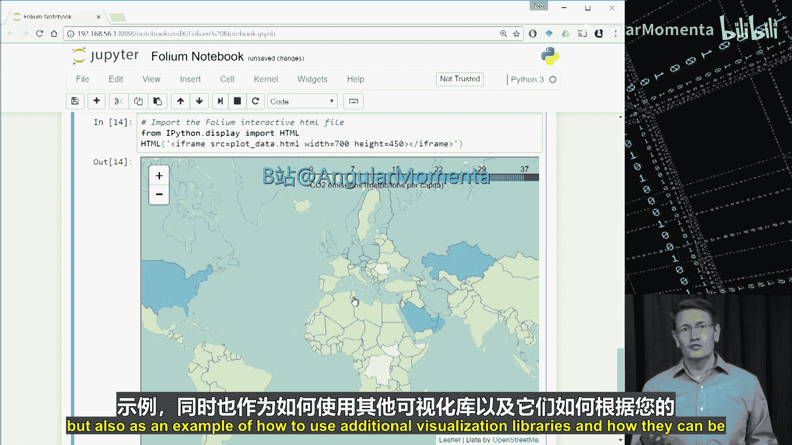

# 019：Matplotlib数据可视化教程

在本节课中，我们将学习如何使用Python的Matplotlib库进行数据可视化。我们将从基础概念讲起，逐步学习如何创建条形图、折线图、散点图和直方图，并探索如何利用世界发展指标数据集进行实际分析。课程最后，我们还将简要介绍其他高级可视化库，如Folium，用于创建地理覆盖图。

---

## 19.1：Matplotlib简介与数据准备 📊

Matplotlib是一个广泛使用的Python绘图库。它是在数据探索过程中快速创建数据图的常用工具。上一课中展示的几乎所有图表都是使用Matplotlib制作的。

Matplotlib的价值在于，在进行数据探索时，它能轻松快速地生成数据图，并且其生成的图表通常简洁美观。

Matplotlib主页上的一句话很好地概括了其特点：“让简单的事情变得简单”。这正是它在数据探索中成为首选工具的原因。只需几行代码，您就可以生成条形图、折线图、散点图、箱线图或直方图。这非常棒，因为您可以快速检查特征之间的关系、绘制趋势线，或者更好地了解数据分布。

“让困难的事情成为可能”则是您即使在创建复杂可视化或为展示结果定制图表时，也常常会使用Matplotlib的另一个原因。

一个关于Matplotlib的有趣故事是，我的一位同事曾花时间为我们在期刊上发表的一篇论文中的图表设置了脚本。由于他希望设计优雅，并且希望字体与论文文本无缝融合，这个设置花费了一些时间。如果您读过研究论文，您无疑会看到过与论文格格不入的图表。图表显得突兀的一个原因是所有字体完全不同。另一个原因是，如果您在论文中使用LaTeX，图表可能看起来不如论文优雅。因此，他的工作旨在解决这些常见问题。

他工作的伟大之处在于，由于他依赖Python脚本、读取CSV文件和Matplotlib，我们使用makefile将这些脚本集成到论文的构建过程中。因此，当我们用一些新结果更新CSV文件后，只需点击构建，就能获得带有这些非常清晰图表的更新论文。这一切都得益于Matplotlib。

在Jupyter笔记本和Python工具的大背景下，您可能知道Matplotlib是一个相当底层的绘图工具。市面上还有许多其他工具，包括Seaborn、ggplot、Altair、Bokeh、Plotly和Folium等。对我们来说，我们会根据可视化需求选择最适合的库。因此，在本课稍后部分，我们将提供一份阅读材料，概述何时可能想使用某个库而不是另一个，并且我们会随着新库的出现或库添加新功能而不断更新这份材料。

鉴于有这么多库可用，并且我们在日常工作中经常使用Matplotlib，我们将首先深入一个展示Matplotlib的笔记本。然后，稍后我们会有一个简短的笔记本，向您展示如何使用更高级的库。

在深入可视化之前，请记住，如果没有上下文，可视化几乎没有意义。因此，本周我们将开始使用世界发展指标数据集，这是Kaggle上的一个开放数据集。这只是世界银行实际可用数据集的略微修改版本。

到本视频结束时，您应该能够使用世界发展指标数据集进行数据科学分析。

处理任何数据集的第一步是进行初步探索。首先，让我们导入pandas、numpy、random和matplotlib.pyplot。

```python
import pandas as pd
import numpy as np
import random
import matplotlib.pyplot as plt
```

接下来，将CSV文件读入pandas DataFrame并显示数据的形状。为了让代码对您有效，请确保您已下载数据并将其放在适当的目录中。

```python
data = pd.read_csv('world_development_indicators.csv')
print(data.shape)
```

这是一个大数据集，读取可能需要一些时间。实际上，该数据集有560万行和6列。现在，让我们使用`head`方法查看这些列包含什么内容。

```python
print(data.head())
```

有趣。我们有国家名称、国家代码、指标名称、指标代码、年份和值。这实际上是一个四维数据集，维度分别是国家、指标、年份和值。查看这些指标，我已经看到一些非常有趣的东西。作为一个有环保意识的人，我对人均二氧化碳排放量相当好奇，我们稍后会用到这个指标。

我还想知道这个数据中有多少个国家。我可以通过对数据框的列使用`unique`方法来测试，以找出该列中有多少个唯一条目。

```python
print(data['CountryName'].nunique())
```

看起来我们大约有247个国家。我想对数据做一个快速的完整性检查：如果我们有247个国家，我们应该有247个国家代码。确实如此。我还想知道我们有多少个指标。

```python
print(data['IndicatorName'].nunique())
```

1344个指标是一个非常广泛的指标列表。如果您想探索指标本身的完整列表及其更多详细信息，我们在本笔记本顶部提供了一个链接。

好了，现在我们知道了有多少个国家和多少个指标，接下来我们需要知道我们有多少年的数据。

```python
print(data['Year'].nunique())
print(data['Year'].min(), data['Year'].max())
```

56年对于数据收集来说是一个相当不错的时间范围。让我们看看这个时间范围是什么：1960年到2015年，很好。至此，我们对数据集有了相当好的了解。我们拥有1960年至2015年期间每个国家的各种指标。在下一个视频中，我们将继续使用Matplotlib中的可视化来探索数据。

---


## 19.2：使用Matplotlib创建基础图表 📈

上一节我们介绍了数据集的基本情况，本节中我们来看看如何使用Matplotlib创建基础图表。

回到我们上一个视频中的Jupyter笔记本，我们已经对世界发展指标数据集中包含的内容有所了解。现在我想做的是探索美国的人均二氧化碳排放量。为此，我将使用上周介绍的字符串方法`contains`设置两个掩码。

第一个掩码用于所有指标名称包含“CO2 emissions”的行。第二个掩码是那些国家代码为“USA”的行。我将把该数据的结果保存在一个名为`stage`的临时数据框中。

让我们检查一下新数据框中有什么。在我们的新数据框中，所有国家都是美国，国家代码是US，指标是二氧化碳排放量。看起来我们拥有美国按年份划分的人均二氧化碳排放量数据。

现在，让我们使用Matplotlib探索这些数据如何随时间变化。我可以用两行代码完成这个操作：我将分别获取年份和二氧化碳排放量，然后将它们传递给`bar`函数。还记得我在上一课中说过，只需几行Matplotlib代码就能让我为数据探索创建一个图表吗？这就是一个完美的例子。

```python
# 筛选美国人均CO2排放数据
co2_mask = data['IndicatorName'].str.contains('CO2 emissions')
usa_mask = data['CountryCode'] == 'USA'
stage = data[co2_mask & usa_mask]

# 提取年份和值
years = stage['Year']
co2_emissions = stage['Value']

# 创建条形图
plt.bar(years, co2_emissions)
plt.show()
```

我可以看到，人均二氧化碳排放量从1960年到1970年有所上升，此后基本保持稳定。这个图表目前并不完美，我没有Y轴标签，这在这里实际上非常重要。如果不知道我绘制了什么，这个图表本身很难独立理解，但同样，如果我只是想探索数据，这也没关系。

为了让这个图形更具吸引力，让我们使用折线图。我将使用`plt.plot`，添加X轴和Y轴的标签，并添加标题。我不确定是否需要X轴标签，很明显这些是年份，但为了清晰起见，我们还是加上它。

```python
plt.plot(years, co2_emissions)
plt.xlabel('Year')
plt.ylabel('CO2 emissions (metric tons per capita)')
plt.title('USA CO2 Emissions per Capita Over Time')
plt.show()
```

更仔细地看一下这几行代码。首先，`plt.plot`方法用于创建折线图。在图表本身中标记坐标轴称为`xlabel`和`ylabel`，这些是绘图对象上的方法。这些函数中的每一个都接受许多参数，您可以使用这些参数更改字体大小、颜色等。同样，我们设置了标题，然后绘制了图表。

这很好，但请注意Y轴实际上是从15开始的，正如我们从之前的课程中学到的，这可能会产生误导。因此，让我们通过调用`axis`并传递我们想要绘制的范围来修复这个问题。

```python
plt.plot(years, co2_emissions)
plt.xlabel('Year')
plt.ylabel('CO2 emissions (metric tons per capita)')
plt.title('USA CO2 Emissions per Capita Over Time')
plt.axis([1960, 2015, 0, 25]) # 设置X轴和Y轴范围
plt.show()
```

现在的图表可以说比原始条形图更好，并且由于Y轴标签正确，它当然更能独立存在。

接下来，让我们使用直方图来探索数据。我将绘制数据中所有的人均二氧化碳排放量值，但我在注释中放了一些代码，可以让您只探索一个标准差范围内的值。有时对于直方图来说，避免数据因为异常值而过于分散是有帮助的，但我们现在先绘制所有数据。

```python
# 获取所有CO2排放值（NumPy数组）
hist_data = stage['Value'].values
print(len(hist_data)) # 数据点数量

# 创建直方图
plt.hist(hist_data, bins=10, normed=False, color='green')
plt.xlabel('CO2 emissions (metric tons per capita)')
plt.ylabel('Number of Years')
plt.title('Distribution of USA CO2 Emissions per Capita (1960-2015)')
plt.grid(True)
plt.show()
```

我们得到了一个对美国人均二氧化碳排放量进行分箱的直方图。这告诉我大多数年份落在18.5到20之间，有一些异常值。如果您觉得难以阅读，我们可以添加网格线。所以让我这样做：如果我设置`plt.grid(True)`然后重新运行，对我来说更容易获取年份的计数。

鉴于我们通常落在人均19到20公吨之间，我很好奇美国相对于其他国家的表现如何。所以让我们选择一个我有美国数据的最近年份：2011年。

我将查询指标为“CO2 emissions per capita”且年份为2011年的数据。这应该会给我提供在该时间窗口内向我们提供数据的所有国家。

```python
# 获取2011年所有国家的人均CO2排放数据
co2_2011 = data[(data['IndicatorName'].str.contains('CO2 emissions per capita')) & (data['Year'] == 2011)]
print(co2_2011.head())
print(len(co2_2011))
```

很好，看起来我得到了我们想要的东西。我们有不同的国家及其2011年的人均二氧化碳排放量。仅仅看这些数值，4.7, 6.9, 5.8, 5.3，我已经怀疑美国可能比其他国家产生更多的人均二氧化碳。事实上，在我们开始这个分析之前，我可能已经猜到了，但让我们用直方图来看看这是如何分布的。

我们这里有多少个国家？我们有232个。这包括美国，因为我没有做任何特殊的事情来排除美国。

现在让我们创建图表。请注意，我在开头做了一些稍微不同的事情：调用`plt.subplots`会分别返回图形和坐标轴对象。我将使用坐标轴引用进行注释，但在我们查看注释之前，让我们看看`plt.hist`调用，并看到我们设置的基本上与上一个直方图相同，只是这次我们计算的是具有特定人均排放量的国家数量，而不是年份数量。

```python
fig, ax = plt.subplots()
values_2011 = co2_2011['Value'].values
ax.hist(values_2011, bins=20, color='blue', edgecolor='black')
ax.set_xlabel('CO2 emissions (metric tons per capita)')
ax.set_ylabel('Number of Countries')
ax.set_title('Global Distribution of CO2 Emissions per Capita (2011)')

# 添加美国数据的注释
usa_value = co2_2011[co2_2011['CountryCode'] == 'USA']['Value'].values[0]
ax.annotate('USA', xy=(usa_value, 5), xytext=(usa_value+1, 15),
            arrowprops=dict(facecolor='red', shrink=0.05))
plt.show()
```

哇，看起来绝大多数国家的人均二氧化碳排放量在0到10公吨之间。美国在2011年约为17，实际上是一个真正的异常值。但是那个漂亮的“USA”标签是从哪里来的？这是我们在Matplotlib中讨论过的功能之一，它支持在图表上执行更复杂的操作，如添加注释或线条。

如果我们回到代码，我们会注意到我添加了一个字符串“USA”的注释。我将其放置在坐标(18, 30)处，然后从坐标(18, 30)到(18, 5)画了一条线。如果您希望阅读更多文档，`annotate`方法还有更多参数。但主要是，我想向您展示这一点，以指出（抱歉用了双关语）您可以使用Matplotlib进行更高级的图形绘制。

关于这些数据，我还有更多问题，但如果您愿意，我将留给您去探索。但在结束视频之前，我想指出，在仅仅看了这几个图表之后，您可能已经发现了Matplotlib图表的共同特征。让我们明确地陈述它们。

以下是Matplotlib图表的常见组成部分：
*   **图表类型**：例如，我们这里有条形图、折线图、直方图。
*   **X和Y值的范围**：通过`axis`或`xlim`/`ylim`设置。
*   **坐标轴标签**：使用`xlabel`和`ylabel`。
*   **图表标题**：使用`title`。
*   **图例**：当有多个数据系列时使用`legend`。
*   **美学设置**：如字体大小、线条粗细、图表尺寸，甚至更复杂的东西如注释。

现在我们已经了解了Matplotlib绘图的这些功能，我鼓励您使用这个笔记本以及我们本周提供的其他笔记本来获取更多示例。但在我们结束Matplotlib之前，我想探索二氧化碳排放量与GDP之间的关系，但让我们在下一个视频中做这件事。

---

## 19.3：探索数据关系：折线图与散点图 🔍

上一节我们学习了基础图表的绘制，本节中我们来看看如何使用折线图和散点图探索数据之间的关系。

我们将继续在这个视频中使用Matplotlib，继续探索我们开始时使用的世界银行数据集。到本视频结束时，您应该能够使用Matplotlib创建折线图和散点图。

关于数据的一个问题将允许我们使用折线图和散点图进行探索。我们看到美国的人均二氧化碳排放量在20世纪60年代上升，然后除了一些微小的变化外，此后基本保持稳定。我很好奇这与美国经济，特别是美国的人均GDP有何关系。

因此，让我们设置与上一个视频类似的掩码，以提取美国随时间变化的人均GDP。

```python
# 筛选美国人均GDP数据
gdp_mask = data['IndicatorName'].str.contains('GDP per capita')
usa_gdp = data[gdp_mask & usa_mask]
print(usa_gdp.head())
```

看起来我们拥有我们想要的数据：每年我们都有基于2005年美元价值的人均GDP。这与我们的人均二氧化碳排放量数据非常相似。

好了，在将它们相互绘制之前，让我们先看看美国人均GDP的趋势。我将为此使用折线图。

```python
gdp_years = usa_gdp['Year']
gdp_values = usa_gdp['Value']

plt.plot(gdp_years, gdp_values)
plt.xlabel('Year')
plt.ylabel('GDP per capita (constant 2005 US$)')
plt.title('USA GDP per Capita Over Time')
plt.grid(True)
plt.show()
```

在大多数情况下，我们看到随着时间的推移有稳定的增长。这里有一些下跌，2008年经济衰退期间有一次明显的下跌，但到2010年上升趋势就恢复了。因此，知道在同一时间段内二氧化碳排放量没有以相同的方式变化，使我认为它们之间没有密切关系。

但让我们看一个散点图来确认。首先，我想通过调用这些列的`min`和`max`来确保时间范围相同，我想确保它们相同的原因是散点图要求数据集中有相同数量的年份数据。

```python
print("CO2 years range:", stage['Year'].min(), stage['Year'].max())
print("GDP years range:", usa_gdp['Year'].min(), usa_gdp['Year'].max())
```

它们都从1960年开始，但我拥有的GDP数据比CO2数据多。因此，我需要为散点图准备相同数量的数据点，为此，我将修剪掉那些额外的数据。要进行这种修剪，我将要求年份在2012年之前，然后检查我们的数据在GDP和二氧化碳排放量方面是否具有相同数量的值。

```python
# 确保数据年份对齐（例如，都截至2011年）
stage_trimmed = stage[stage['Year'] <= 2011]
usa_gdp_trimmed = usa_gdp[usa_gdp['Year'] <= 2011]

print(len(stage_trimmed), len(usa_gdp_trimmed))
```

好了。我们两个都有52年的数据。要制作散点图，我们首先像之前一样使用`plt.subplots`调用图形和坐标轴。其余大部分应该相当容易识别，除了对`scatter`方法的调用，它用于用这两个数组创建散点图。

```python
fig, ax = plt.subplots()
ax.scatter(usa_gdp_trimmed['Value'], stage_trimmed['Value'])
ax.set_xlabel('GDP per capita (constant 2005 US$)')
ax.set_ylabel('CO2 emissions (metric tons per capita)')
ax.set_title('USA: CO2 Emissions vs. GDP per Capita (1960-2011)')
plt.grid(True)
plt.show()
```

现在当我运行这个时，我得到的是一个相当弱的关系。看起来当GDP和二氧化碳排放量在60年代上升时，它们是一起变化的。但此后，似乎根本没有太大关系。

我们也可以使用相关性来测试这一点。我将使用numpy中的相关系数函数来获取这两个数组之间的关系。

```python
correlation_matrix = np.corrcoef(usa_gdp_trimmed['Value'], stage_trimmed['Value'])
print(correlation_matrix)
```

主对角线是每个数组与自身的对比，因此我们期望在那里看到1.0或完全相关。但在另一条对角线上，我们看到0.077。这是这两个指标之间非常弱的相关性。

因此，我们刚刚开始研究这些关系，但如果有人争辩说我们需要更多的人均二氧化碳产量来提振经济，这个初步的数据分析并不支持这一说法。

关于如何处理这些数据，我还有更多想法：我们能否看看其他国家的人均二氧化碳排放量与GDP之间的关系？或者看看整体二氧化碳排放量和GDP（去掉人均部分）？这是一个极其丰富的数据集，因此我鼓励您继续自行探索。

---

## 19.4：高级图表与地理可视化 🌍

上一节我们探索了数据间的关系，本节中我们来看看更高级的图表类型以及如何使用其他库（如Folium）进行地理可视化。

这是一个简短的视频介绍，介绍了我们本周提供的包含额外Matplotlib示例的笔记本。到本视频结束时，您应该能够使用额外的Jupyter笔记本资源作为示例。

在我们的附加笔记本中，我们提供了许多示例的代码，仍然使用世界发展指标数据。我们随机挑选指标，并使用折线图和散点图将它们相互比较。

在处理完世界发展指标之后，我们还提供了一个如何在Matplotlib中创建3D绘图的示例。我们还提供了一个使用气泡图的示例。当您想轻松绘制三个维度时，气泡图会非常有帮助。您可以拥有X、Y和每个点的大小。在这个例子中，我们还使用颜色编码来提供第四个维度，所以在这个图像中，我们有角度、距中心的距离、气泡大小和颜色都编码在这里。

请注意，与我们早期的一些图形不同，您需要花时间解释和理解像这样的图形中的数据，但对于数据探索以及在呈现数据时传达更复杂的关系，它可能非常有价值。

除了直方图，我在试图理解分布时经常使用箱线图。这个示例为您提供了箱线图的模板，以及如何在Matplotlib中并排放置图形。箱线图告诉您四分位距内的中值、高于第三四分位数和低于第一四分位数的元素，以及最大值和最小值。这是一个图形中包含的大量有用信息。

因此，当您在使用Matplotlib和即将到来的项目周中寻找可视化数据的方法时，请务必查看这些额外的笔记本以及网上的其他示例。

我们之前提到，除了Matplotlib之外，还有许多有用的库，特别是在处理像世界发展指标这样的数据集时，创建地理覆盖图可能是可视化数据的强大方式。

到本视频结束时，您应该能够使用Folium库创建地理覆盖图。

跳转到我们的Jupyter笔记本。在您能够使用Folium之前，您可能需要在系统中安装它。您还需要获取下面列出的JSON文件，并将其放在您的文件夹中，路径为`geojson/countries.json`（如果尚未这样做）。

让我们进行设置。导入folium和pandas，然后设置地理数据。

```python
import folium
import pandas as pd

# 读取世界发展指标数据（可能需要时间）
data = pd.read_csv('world_development_indicators.csv')
print(data.head())
```

接下来我们想做的是，像之前一样，提取2011年所有国家的二氧化碳排放量。

```python
co2_2011 = data[(data['IndicatorName'].str.contains('CO2 emissions per capita')) & (data['Year'] == 2011)]
```

检查数据，看起来我们得到了我们想要的指标。让我们通过仅保留国家代码和我们绘制的值来设置我们的绘图数据。我们还将提取指标名称以用作图形中的图例。

```python
plot_data = co2_2011[['CountryCode', 'Value']]
indicator_name = co2_2011['IndicatorName'].iloc[0]
```

好了，现在我们实际上已经准备好创建Folium交互式地图了。我们将告诉它在一个相当高的缩放级别创建地图。接下来，我们将使用内置方法`choropleth`来附加国家的地理JSON和绘图数据。我们需要指定相关的列。`key_on='feature.id'`指的是JSON对象中的标签，该标签将国家代码作为`feature.id`附加到每个国家的边界信息上。您可以通过读取JSON对象找到这一点。但这是我们建立数据关联所需的：数据框中的国家代码与JSON对象中的`feature.id`匹配。

接下来，我们指定一些美学设置，如配色方案和不透明度，然后标记图例。因此，此绘图的输出将保存为HTML文件，并且该HTML文件实际上是交互式的。所以我们需要做的是保存它，然后将其读回笔记本，以便在地图上进行交互。

```python
# 创建基础地图
world_map = folium.Map(location=[30, 0], zoom_start=2)

# 添加地理覆盖层
world_map.choropleth(
    geo_data='geojson/countries.json',
    data=plot_data,
    columns=['CountryCode', 'Value'],
    key_on='feature.id',
    fill_color='YlOrRd',
    fill_opacity=0.7,
    line_opacity=0.2,
    legend_name=indicator_name
)

# 保存为HTML文件并显示
world_map.save('co2_emissions_2011.html')
# 在Jupyter Notebook中显示
world_map
```

然后我们得到了我们的地图。首先注意，深色意味着更高的人均二氧化碳排放量。美国和一些欧洲国家以及中东国家作为人均二氧化碳高排放国脱颖而出。但请记住，这不是二氧化碳总排放量，而是人均二氧化碳排放量，因此人口众多的国家可能二氧化碳总排放量很高，但人均二氧化碳排放量仍然较低。

因此，我们提供这个笔记本作为如何进行地理覆盖的示例，也作为如何使用额外可视化库的示例，以及它们如何根据您的可视化需求而变得强大。因此，请务必查看资源以及我们关于哪种可视化库最适合您需求的库推荐。

---



## 总结 📝

本节课中我们一起学习了如何使用Matplotlib进行数据可视化。我们从Matplotlib的基础介绍和世界发展指标数据集的准备开始，逐步学习了创建条形图、折线图、直方图和散点图的方法。我们还探索了如何利用这些图表分析数据间的关系，例如美国人均CO2排放与GDP的相关性。最后，我们简要介绍了高级图表（如3D图、气泡图、箱线图）和地理可视化库Folium的使用。Matplotlib作为核心绘图工具，其“易事易为，难事可为”的理念使其成为数据探索和结果展示的得力助手。