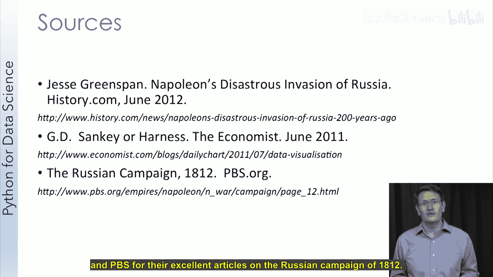

# 020：经典数据可视化案例研究

在本节课中，我们将通过两个历史案例，学习数据可视化如何帮助人们理解复杂问题并推动科学认知。我们将首先探讨约翰·斯诺如何利用地图可视化揭示了霍乱的真正传播途径，然后分析查尔斯·米纳绘制的拿破仑远征俄罗斯的经典信息图。

## 案例一：约翰·斯诺与1854年伦敦霍乱地图 🗺️

上一节我们介绍了课程目标，本节中我们来看看第一个经典案例：约翰·斯诺的霍乱地图。这个可视化帮助世界理解了霍乱的真正成因。

### 霍乱的背景知识

霍乱是一种细菌感染，可导致严重腹泻，可能因脱水而致命。接触细菌后，患者会在12小时至5天内出现症状，急性病例若未经治疗可在数小时内死亡。不幸的是，霍乱至今仍构成威胁，全球每年有数百万病例，死亡人数达数万至数十万。

霍乱在卫生条件差的地区尤其危险，极易导致疫情爆发。霍乱患者的腹泻物中含有细菌，感染后可持续排菌长达10天。若有人摄入这些细菌，就会感染疾病。因此，如果污水污染了食物或水源，就可能引发疫情。

今天，我们之所以了解霍乱的传播方式，得益于一位科学家的理论和1854年在伦敦发生的一次严重疫情。

### 19世纪伦敦的卫生状况

在19世纪的伦敦，卫生状况堪忧，尤其是在贫困社区。随着人口增长以及缺乏适当的污水和卫生管理规范，许多人的生活条件极其恶劣。他们通常从水井取水，但井水易受污染。

当时的人们并不知道霍乱通过水传播。那么，他们认为是什么导致了霍乱呢？他们实际上认为是“瘴气”（难闻的气味）和“体质虚弱”共同作用的结果。

第一种理论导致了医生佩戴口罩，如下图中的形象。这幅艺术作品实际上与医生试图避免黑死病有关，但同样的理论在19世纪仍然存在。人们认为难闻的气味会导致疾病，如果在口罩里放些香料，就能避免闻到这些气味。尽管我们现在知道这种想法是错误的，因为我们有了细菌理论。我猜想在过去，这种观念的起源很可能只是错误地将相关性当成了因果关系。在有人生病或卫生条件差的地区，往往气味也更难闻。由于大多数人在气味难闻的地区生病，他们便错误地将气味归咎为疾病的源头。

第二种观念在当时更令人反感。穷人往往更容易患病。考虑到我们现在对疾病传播方式以及当时他们生活条件的了解，这并不奇怪。但在当时，一些人认为穷人只是天生更虚弱，因其自身的弱点而容易患病。这同样是错误地将相关性当成了因果关系，但这次还夹杂着偏见。

### 约翰·斯诺的调查

现在你对他们认为的疾病成因有了基本了解，这引出了约翰·斯诺。他是19世纪生活在伦敦的一位科学家，背景是麻醉师，曾运用科学原理使麻醉实践对病人安全得多。他还在1849年发表了他的理论，认为霍乱是水媒传播的，但他的理论几乎没有引起关注。

1854年，约翰·斯诺住在伦敦，靠近霍乱疫情爆发的地方。这次疫情是由受污染的水进入宽街水泵的水井引起的。疫情爆发后，约翰·斯诺在疫情附近区域挨家挨户走访，追踪每一个死亡病例，以查明他们的住址和取水地点。他将所有这些死亡病例绘制在一张地图上。

😊，这是完整的地图。有点难以看清，但宽街水泵正好位于所有那些街区的中心。每一个小矩形块代表一例霍乱死亡。如果我们放大，可以看到水泵周围的社区有大量死亡病例，而远离水泵的地方，死亡人数减少。

通过与死者家属交谈，他得以了解受害者从哪里取水。在一个完美的数据科学案例中，**异常值**对于找到令人信服的答案至关重要。

宽街水泵附近有一个济贫院（或监狱），里面有许多囚犯，但几乎没有死亡病例。结果发现，济贫院有自己的水井，并从不同水源运水，因此他们没有使用那个水泵。附近还有一个啤酒厂，也逃脱了霍乱。同样，他们有自己的供水，或者喝厂里生产的酒，因此他们也不从那个水泵取水。

最后，有一位妇女和她的侄女住在离水泵较远的地方，却死于霍乱。经过一些调查，他发现这位阿姨以前住在该地区，非常喜欢宽街水泵的水，以至于让人把水送给她，并经常与她的侄女分享。

### 结论与影响

这张图与约翰·斯诺收集的数据相结合，促使城镇官员关闭了那口水井，移除了水泵手柄。尽管官员们对水泵是病源持怀疑态度，但新的感染病例几乎立即减少并很快停止了。

因此，尽管通过移除水泵手柄的行动遏制了这次疫情，但约翰·斯诺的观点被广泛接受还是花了一些时间。这个谜题的一个关键线索后来由该地区一位名叫亨利·怀特黑德的牧师提供。他曾试图证明约翰·斯诺是错的，但在这个过程中，他偶然发现了水泵如何被污染的谜底。疫情爆发前不久，水泵附近一所房子里有一个婴儿感染了霍乱。父母将婴儿的尿布清洗在一个靠近水井的污水坑里，污水随后渗入水井，造成了污染。

另一个与霍乱相关的关键进展发生在几年后，德国医生罗伯特·科赫在1883年分离出了导致霍乱的细菌。这些疫情及其成因的认识，促使欧洲和美国采用了水卫生处理措施。斯诺因其工作，常被视为流行病学领域的先驱之一。

需要指出的是，尽管世界上许多地方都能获得清洁用水，但霍乱的故事可悲地并未结束，正如我在本视频开头告诉你的数字。世界卫生组织估计，世界上近80%的人缺乏清洁用水供应，而且在许多这样的地区，也没有污水处理设施。尽管我们知道如何预防霍乱，它仍然是一个全球性的健康问题。

为了以积极的基调结束，我想分享一张我2013年在伦敦宽街水泵旁拍摄的照片。我当时在那里参加会议，并且非常欣赏围绕宽街水泵的科学、数据可视化及其背后的故事，这实际上是我那次旅行的第一站之一。😊。

我还想最后快速推荐一下《幽灵地图》这本书，副标题是“伦敦最恐怖疫情的故事，以及它如何改变了科学、城市和现代世界”，作者是史蒂芬·约翰逊。我对这个故事的大部分了解都来自阅读这本书。当我在斯基德莫尔学院教授一门关于科学素养和疾病的跨学科课程时，我们将这本书作为必读材料。因此，我实在无法更推荐它了。

## 案例二：拿破仑的俄罗斯远征图 📉

上一节我们学习了约翰·斯诺利用地图对抗霍乱的经典案例，本节中我们来看看另一个著名的可视化作品，它被用来描绘1812年法国的俄罗斯战役。

在本视频结束时，你应该能够解释为什么拿破仑1812年俄罗斯战役的数据可视化被认为如此有效。

### 可视化图的背景

查尔斯·约瑟夫·米纳于1869年创作了这幅图。图的标题翻译成英文是“1812-1813年法国军队在俄罗斯战役中连续兵力损失的象征性地图”。米纳是法国一位成功的土木工程师，被认为是工程和统计学中使用可视化的早期领导者。他最著名的就是创作了这幅描绘俄罗斯战役的图。

### 图解拿破仑远征

在图中，**前进中的法军**用浅色线条表示，从渡过涅曼河向莫斯科进军。**撤退中的法军**用黑色线条表示。**线条的宽度描绘了军队的规模**。

你可以快速放大到涅曼河，在那里找到战役开始和结束时军队的规模。你几乎可以立刻看出这次入侵俄罗斯对法国来说是多么灾难性。他们开始时拥有大约45万军队（尽管有些估计数字实际上更高），而结束时仅剩不到1万人。

那么，这些损失是如何发生的呢？让我们利用这幅图简要回顾一下这场战役。

首先，这一切是如何开始的？1812年，在沙皇亚历山大一世统治下的俄罗斯，作为法国的盟友，正在封锁英国货物，以遵守拿破仑禁止与英格兰贸易的法令。然而，与英格兰的贸易禁令对俄罗斯经济造成了灾难性影响，因此俄罗斯决定终止参与禁运。拿破仑在与俄罗斯谈判恢复禁运失败后，于1812年开始了他入侵俄罗斯的战役。

计划是在俄罗斯边境附近攻击规模较小的俄军，在战斗中将其击溃，从而结束战争。这是计划。然而，俄军拒绝与拿破仑的大军进行直接战斗。随着俄军向莫斯科撤退，他们会摧毁沿途的乡村，导致法军补给短缺。你可以在图中这个高亮区域看到这一点。此外，俄罗斯哥萨克会对法军进行小规模的袭扰攻击，既造成人员伤亡，也降低了士气。在没有进行任何战斗的情况下，法军遭受了巨大损失，主要是由于疾病和逃兵。

拿破仑终于在莫斯科郊外的博罗季诺村得到了他渴望的战斗。战斗非常残酷，最终法国取得了胜利，但并未取得其期望的决定性胜利。9月14日，法军进入莫斯科，却发现城市已被遗弃，不久后，大部分城区陷入火海。拿破仑在进入莫斯科时期待着俄罗斯投降，但他永远没有等到。在莫斯科等待谈判投降一个月后，开始飘起雪花。拿破仑意识到他的军队无法在莫斯科过冬。

离开莫斯科后，法军遭到俄军攻击，俄军此时已得到增援，实际上能够发起进攻了。他们的存在迫使拿破仑选择一条更北的路线逃跑，而随着冬季持续降临，这带来了问题。此外，俄军能够在法军继续逃跑时不断攻击他们。

撤退期间的条件极其恶劣。部队缺乏补给，在逃跑时不断遭到攻击，并且必须忍受提前到来且严酷的冬季。在这幅图上，还标注了部队在撤退期间面临的温度。温度常常低于零度，军队遭遇了大量降雪。

因此，当拿破仑的军队返回起点时，其规模已只是原先的一小部分。失去了昔日大军的威力，拿破仑在欧洲的权力开始受到挑战。

### 可视化图的卓越之处

那么，是什么让这个可视化如此特别？最值得注意的是，它在一个图形中可视化了**六种类型的数据**，我们已讨论过。

以下是图中编码的数据类型：
1.  军队的**纬度**和**经度**（地理位置）。
2.  军队的**行进方向**（前进与撤退）。
3.  军队的**规模**（线条宽度）。
4.  军队**行进的距离**（路径长度）。
5.  军队在撤退期间面临的**温度**（底部折线图）。
6.  关键的**时间点与事件**（文字标注）。

通过编码所有这些类型的数据，一幅图就能够完整呈现1812年俄罗斯战役中法国损失的故事。

## 总结

在本节课中，我们一起学习了两个历史上经典的数据可视化案例。

首先，我们回顾了约翰·斯诺的霍乱地图。通过将死亡病例精确地标注在地图上，并与水源信息结合，斯诺成功证明了霍乱是通过受污染的水井传播的，而非当时主流认为的“瘴气”。这个案例展示了**如何通过空间数据的可视化发现相关性，进而推断因果关系**，并强调了关注**数据异常值**的重要性。

接着，我们分析了查尔斯·米纳的拿破仑俄罗斯远征图。这幅杰作在一个视图内融合了军队规模、行进路径、方向、距离、温度和时间等多种维度的数据，生动而深刻地揭示了这场军事行动的灾难性后果。它展示了**多变量数据可视化**的强大叙事能力，能够将复杂的历史事件浓缩为一目了然的图形故事。

这两个案例共同表明，优秀的数据可视化不仅是展示数字的工具，更是发现真理、讲述故事和影响决策的强大手段。它们跨越时代，至今仍是数据科学和可视化领域的学习典范。