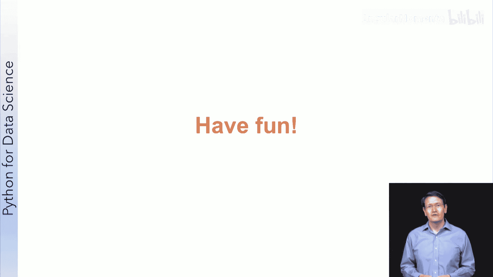

# 021：小型项目实践指南 🎯

在本节课中，我们将把之前学到的所有数据科学工具和流程整合起来，完成一个小型项目。你将选择一个数据集，提出研究问题，进行探索性分析，并最终提交你的工作成果进行同行评审。

## 项目概述 📋

本周的核心任务是综合运用你迄今为止学到的所有知识，完成一个实践项目。

到目前为止，你已经学习了数据科学流程、Jupyter Notebook、NumPy、Pandas以及Matplotlib数据可视化。我们也共同使用这些工具分析了WiFi数据、电影评分数据库和世界发展指标数据等。

你本周的目标是亲自处理其中一个数据集，并基于我们已有的发现进行扩展和深化。

## 项目要求与步骤 🔧

以下是完成本项目需要遵循的具体步骤。

1.  **选择数据集**：从我们提供的Notebook中已探索过的数据集中选择一个。
2.  **提出研究问题**：针对所选数据集，构思一个合适的研究问题。
3.  **进行初步探索**：对数据进行初步的探索性分析。如果能得出一些结论会很好，但务必诚实地呈现你的发现。
4.  **回答问题并提交**：完成后，你需要回答几个关于你所尝试解决的问题的简短问题，然后提交你的Notebook。
5.  **注重成果展示**：请务必在你的作品呈现上多下功夫，清晰地与他人沟通你的发现至关重要。

你将提交上述成果进行同行评审。评审不仅会根据你的工作质量进行评分，你还会收到关于未来如何改进的建设性反馈。

## 关于同行评审的说明 ✍️

上一节我们介绍了项目提交要求，本节中我们来看看如何进行有效的同行评审。请认真对待你作为评审者的角色。

你需要投入合理的时间来评审他人的工作。在此过程中，请意识到你代表了我们课程团队，因此请以你希望被对待的方式来评审你的同学。

作为一名科学家，我既以论文提交者身份，也以评审者身份参与过同行评审。对于那些尚未参与过此过程的学习者，一个好的评审应该是经过深思熟虑的，并能就如何改进提供建设性反馈，而不仅仅是赞扬。一个糟糕的评审则可能过于苛刻、批评过度、对工作的理解有误，或者过于肤浅而无法提供有价值的反馈。

请以同样的方式对待你的同行评审：你应该理解他们所做的工作，找出优点和不足，赞扬优点，并对不足之处提出建设性的建议。

请以有意义的方式权衡优缺点。不要仅仅因为笔记中的一个拼写错误就判定他人不及格，也不要因为一个存在明显缺陷的肤浅分析就给予满分。

最后，请保持公平、尊重和专业。如果你不确定在与他人互动时期望的行为准则，请查阅edX的行为准则。

轻松一点说，确实有人可能和你的想法不同。也许你是一个狂热的《哈利·波特》粉丝，不喜欢电影数据库分析显示《指环王》电影比《哈利·波特》更好。请尽量公平地评审他们的工作，即使你不喜欢他们的结论。

## 总结与鼓励 🌟

你已经走过了很长的数据科学和Python学习之路，这是一个将你的技能付诸实践的机会。

希望你能在一个自己感兴趣的数据集上进行这次实践，所以请尝试享受这个过程。

在本节课中，我们一起学习了如何规划并执行一个小型数据科学项目，从选择数据集、提出问题到进行分析和展示。同时，我们也深入了解了进行公平、建设性同行评审的重要原则。现在，是时候将所学知识整合起来，开始你的探索之旅了。