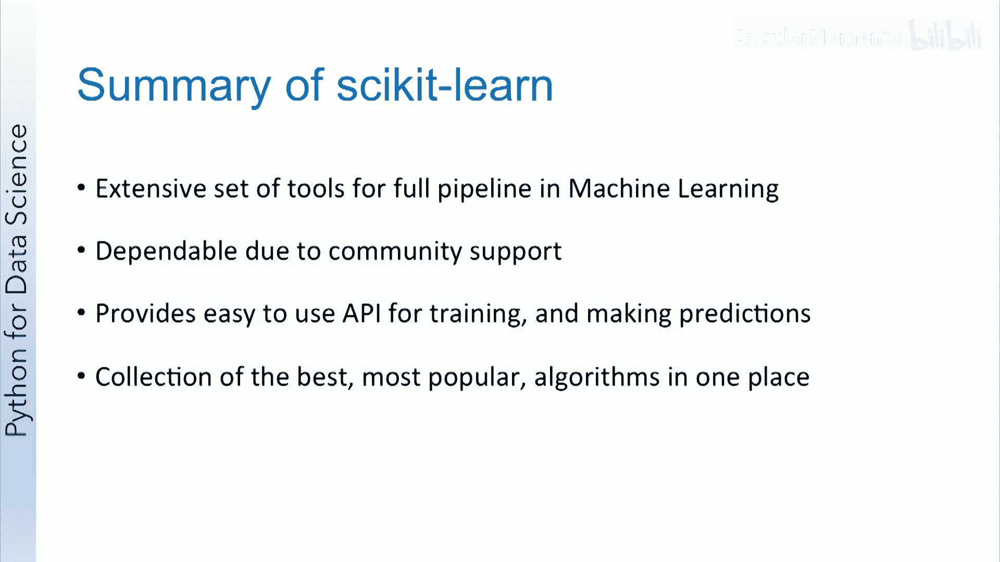

# 022：机器学习基础概念

在本节课中，我们将学习机器学习的基本概念，了解其定义、主要应用领域以及核心的分类方法。我们还将介绍机器学习中常用的术语，并概览一个强大的Python机器学习库。

---

## 什么是机器学习？

机器学习是计算机科学的一个研究领域，专注于构建能够从数据中学习的计算机系统。这些系统，通常被称为模型，可以通过分析特定问题的大量示例来学习执行特定任务。

例如，一个机器学习模型可以通过查看大量猫的图片来学习识别猫的图像。这种从数据中学习的概念意味着机器学习模型可以自行学习特定任务。机器学习算法被编程为从数据中学习，但算法或程序中并没有直接旨在学习给定任务的逐步指令。相反，模型从分析的数据中自行学习哪些特征对于确定图片是否包含猫是重要的。

因为模型从数据中学习执行任务，所以需要注意，用于构建模型的数据的数量和质量是模型学习效果好坏的重要因素。由于机器学习模型可以从数据中学习，它们也可用于发现数据中隐藏的模式和趋势。这些趋势和模式能带来对数据的宝贵见解。因此，使用机器学习可以为特定问题做出数据驱动的决策。

**总结**：机器学习领域专注于研究和构建能够从数据中学习、而无需明确编程的计算机系统。机器学习算法和技术用于构建模型，以发现数据中隐藏的模式和趋势，从而做出数据驱动的决策。

---

## 机器学习的日常应用

机器学习已被用于许多不同的应用，其中许多你可能在日常生活中遇到过，甚至可能没有意识到。

以下是几个常见的应用示例：

*   **信用卡欺诈检测**：每次使用信用卡时，当前的购买行为都会根据你的信用卡交易历史进行分析，以确定当前交易是合法的还是潜在的欺诈行为。如果购买行为与你过去的购买行为非常不同，例如购买你从未表现出兴趣的类别中的高价商品，或者销售点位置来自另一个国家，则该交易将被标记为可疑活动。
*   **手写数字识别**：当你将手写支票存入ATM时，会使用机器学习过程来读取支票上写的数字以确定存款金额。由于人们笔迹的多样性，手写数字比印刷体数字更难识别。机器学习系统可以筛选不同的变体，以找到相似的模式来区分例如“1”和“9”。
*   **网站推荐**：在网站上购买商品后，你经常会得到一个相关商品的列表。这通常显示为“购买此商品的顾客也购买了这些商品”或“你可能也喜欢”。这些相关商品已通过机器学习模型与你购买的商品关联起来，并展示给你，因为你可能也对它们感兴趣。这是销售和营销中常用的机器学习应用。

这些只是众多例子中的几个。正如我们所讨论的，数据科学植根于统计学、机器学习、人工智能和计算机科学等领域。因此，机器学习是这一领域的一部分，包含了用于从数据中学习的算法和技术。

---

## 机器学习的主要类别

机器学习技术有不同的类别，适用于不同类型的问题。我们将讨论的主要类别是分类、回归、聚类分析和关联分析。

### 1. 分类

在分类中，目标是预测输入数据的类别。例如，预测天气是晴天、雨天、有风还是多云。输入数据是指定温度、相对湿度、大气压力、风速、风向等的传感器数据。要预测的目标或类别（如晴天、有风、雨天和阴天）被称为**分类**。

另一个例子是将肿瘤分类为良性或恶性。在这种情况下，分类被称为**二分类**，因为只有两个类别。你也可以有很多类别，如天气预测问题所示。分类的另一个例子是识别手写数字，将其归类为0到9这10个类别之一。

### 2. 回归

当你的模型需要预测一个数值而不是一个类别时，任务就变成了回归问题。回归的一个例子是预测股票价格。股票价格是一个数值，不是一个类别，所以这是一个回归任务。如果你要预测股票价格是上涨还是下跌，那将是一个分类问题。但如果你预测的是股票的实际价格，那就是一个回归问题。这是分类和回归之间的主要区别。

**总结**：在分类中，你预测的是一个类别；在回归中，你预测的是一个数值。

### 3. 聚类分析

在聚类分析中，目标是将数据集中相似的项目组织成组。聚类分析的一个非常常见的应用被称为**客户细分**。这意味着根据客户类型将你的客户群划分为不同的组或细分市场。例如，将客户细分为老年人、成年人和青少年是有益的。这些群体可能有不同的好恶和购买行为。当公司这样将客户细分为不同的群体时，他们可能能够为每个群体的特定兴趣提供有针对性的营销广告。

### 4. 关联分析

关联分析的目标是提出一组规则，以捕捉项目或事件之间的关联。这些规则用于确定项目或事件何时一起发生。关联分析的一个常见应用被称为**市场篮子分析**，用于理解客户的购买行为。例如，关联分析可以揭示，拥有支票或存款账户的银行客户也往往对其他投资工具（如货币市场账户）感兴趣。这些信息可用于交叉销售。

---

## 监督学习与无监督学习

对于我们所讨论的技术，有两种进行学习本身的方式。这些类别被称为**监督学习**与**无监督学习**。

*   **监督学习**：在监督方法中，提供了目标（即模型要预测的内容）。这被称为拥有**标记数据**，因为数据中每个样本的目标都被标记了。例如，在预测天气类别（晴天、有风、雨天、阴天）时，数据集中的每个样本都被标记为这四个类别之一。因此，数据是标记的。预测天气类别是一项监督任务。一般来说，分类和回归是监督方法。
*   **无监督学习**：在无监督方法中，模型要预测的目标是未知或不可用的。这意味着你拥有**未标记数据**。因此，你无法使用这些标签进行训练。回到将客户细分为不同群体的聚类分析例子，你的数据中的样本并没有被标记为正确的组。相反，分割是使用聚类技术根据项目共有的特征对项目进行分组来执行的。因此，数据是未标记的，将客户分组到不同细分市场的任务是无监督的。一般来说，聚类分析和关联分析是无监督方法。

**总结**：在本节中，我们探讨了机器学习技术的不同类别，并讨论了分类、回归、聚类和关联分析作为其中一些技术。我们还定义了机器学习中无监督和监督方法是什么，以及我们之前讨论的哪些类别属于这两类。

---

## 机器学习术语

在我们深入研究处理和分析数据的方法之前，让我们首先定义一些用于描述数据的术语，从样本和变量开始。

*   **样本**：样本是数据中实体的一个实例或示例。这通常是数据中的一行。下图显示了与天气相关的数据集的一部分。每一行都是一个样本，代表特定日期的天气数据。在该表中，每个样本有五个与之相关的值。这些值是关于该样本的不同信息片段，如样本日期、最低温度、最高温度和该日期的降雨量。
*   **变量/特征**：我们称这些不同的值为样本的**变量**，有时也称为样本的**特征**。事实上，样本和变量有很多名称，其中一些我们已经在前几周使用过。

以下是样本和变量的一些其他术语：

*   **样本的其他术语**：记录、示例、行、实例、观察值等。所有这些术语在机器学习上下文中都指代数据中实体的特定示例。
*   **变量的其他术语**：特征、列、维度、属性、字段。所有这些术语都指代数据集中每个样本的特定特征。

关于变量的一个重要点是它们是具有类型的数字值。每个变量都有一个与之关联的数据类型。最常见的数据类型是**数值型**和**分类型**。还有其他数据类型，如字符串和日期，但在数据挖掘的背景下，我们将重点关注更常见的数值型和分类型数据类型。

*   **数值型变量**：顾名思义，数值型变量是取数字的变量。它们可以被测量，并且它们的值可以按某种方式排序。数值型变量可以只取整数值，也可以是连续值。它也可以只有正数、负数或两者兼有。
*   **分类型变量**：具有标签、名称或类别作为值（而不是数字）的变量称为分类型变量。例如，描述物品颜色（如汽车颜色）的变量可以具有诸如红色、银色、蓝色和黑色等值。这些是非数值，用于描述实体的某些质量或特征。这些值可以被视为可以分类的名称或标签。因此，分类型变量也被称为定性变量或名义变量。

**总结**：样本是数据中实体的实例或示例。变量捕获每个实体的特定特征。因此，一个样本有许多变量来描述它。来自实际应用的数据通常是多维的，这意味着有许多维度或变量描述每个样本。每个变量都有一个与之关联的数据类型，最常见的数据类型是数值型和分类型。

---

## Python机器学习库：Scikit-learn 概览

既然我们已经讨论了机器学习的基础知识，让我们概览一个名为 Scikit-learn 的 Python 机器学习库。

Scikit-learn 是一个用于端到端机器学习的开源 Python 库。它建立在 NumPy、SciPy 和 Matplotlib 的优势之上，就像许多其他 Python 库一样。它由一个活跃的开发者社区快速开发和改进。

当我说端到端机器学习时，我指的是整个数据科学过程，包括机器学习、数据清洗和数据转换。Scikit-learn 通过提供数据转换的实用函数以及一系列数据清洗和准备函数来支持整个过程，这些函数有助于许多任务，包括缩放、归一化、特征工程和缺失值处理。

Scikit-learn 还为许多机器学习算法提供了内置函数，可直接用于建模和分析。虽然需要一些专业知识才能为正确的任务适当地使用这些算法，但网上有许多资源使学习曲线更容易。此外，Scikit-learn 网站上的文档包括入门教程。我们发现这个文档非常易于遵循。例如，文档的聚类部分很好地概述了可用的算法、它们的度量标准、可扩展性、参数甚至潜在的用例。

Scikit-learn 还包括降维算法的专门实现。虽然我们不会在本课程中详细介绍这些算法，但它将在你即将开始的微硕士课程中的机器学习课程中派上用场。在机器学习中，我们使用许多技术来评估和选择正确的模型。你也会发现许多有助于此的方法。

**总结**：Scikit-learn 为完整的机器学习过程提供了广泛的工具集。得益于 Python，我们可以将这些工具与我们迄今为止学到的 Python 中其他数据科学工具结合起来。这个开放且可扩展的机器学习库由一个非常活跃的社区充满活力地开发和记录。

---

## 课程总结

在本节课中，我们一起学习了机器学习的基本定义，即构建能够从数据中学习、无需明确编程的系统。我们探讨了机器学习的几个日常应用，如欺诈检测和推荐系统。我们详细介绍了机器学习的主要技术类别：用于预测类别的**分类**、用于预测数值的**回归**、用于分组的**聚类分析**以及用于发现关联规则的**关联分析**。我们还区分了**监督学习**（使用标记数据）和**无监督学习**（使用未标记数据）。最后，我们介绍了机器学习中的关键术语（如样本、特征）并概览了强大的 Python 库 **Scikit-learn**，它为整个机器学习流程提供了全面的工具集。