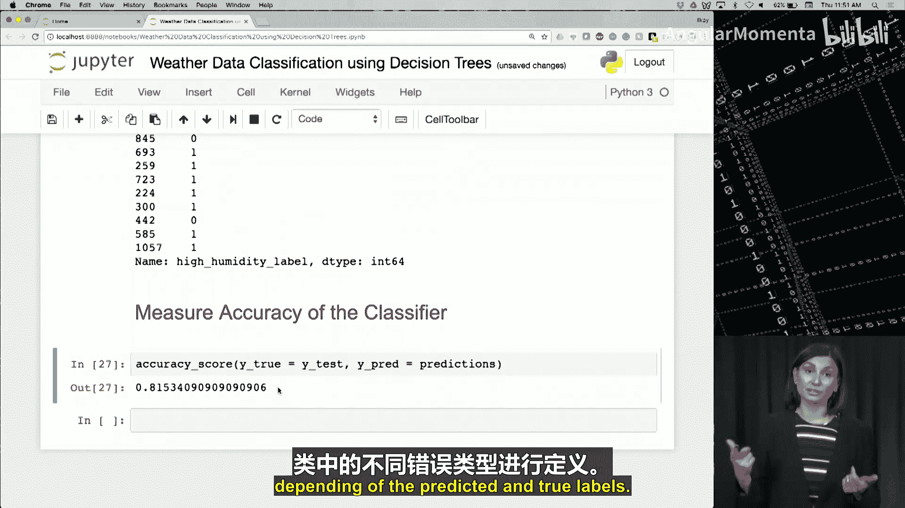

# 023：视频分类

在本节课中，我们将重点介绍一类称为分类的机器学习问题。

通过本视频的学习，你将能够定义什么是分类，讨论分类属于监督学习还是无监督学习，并描述二项分类与多项分类的区别。

## 分类概述 📋

正如我们之前讨论的，分类是机器学习问题的一种类型。

在分类问题中，输入数据被呈现给机器学习模型，任务是预测与输入数据对应的目标。

目标是一个分类变量，因此分类任务是根据给定的输入数据预测目标的类别或标签。

例如，我们之前讨论并在本图中说明的分类问题是预测天气类型。

模型必须预测的目标是天气，在这种情况下天气的可能值是晴天、有风、雨天或多云。

输入数据可以包含温度、相对湿度、大气压力、风速、风向等测量值。

因此，给定温度、相对湿度及其他所有测量的具体数值，模型的任务是预测当天的天气是晴天、有风、雨天还是多云。

这是天气分类问题数据集可能的样子。

每一行是一个样本，包含输入变量（温度、湿度、压力）和目标变量（天气）。

每一行都有输入变量的具体值以及目标变量的对应值。

分类任务是根据输入变量的值预测目标变量的值。

由于提供了目标，我们拥有带标签的数据，因此分类是一项监督任务。回想一下，在监督任务中，每个样本的目标或期望输出是给定的。

请注意，目标变量有许多名称，例如目标、标签、输出、类别变量、分类和类。

分类问题可以是二元的，也可以是多元的。

在二元分类中，目标变量有两个可能的值，例如“是”和“否”。

在多元分类中，目标变量有两个以上的可能值。例如，目标可以是“矮”、“中”和“高”。

多元分类也被称为多项分类或多标签分类。

但请记住，在分类中，目标始终是一个分类变量。

二元分类的一些例子包括：预测明天是否会下雨（这里只有两种可能的结果：是，明天下雨；或否，明天不下雨）。

另一个例子是识别信用卡交易是合法的还是欺诈性的（同样，目标只有两个可能的值：合法和欺诈）。

多元分类的一些例子包括：预测客户将购买的产品类型。

在这种情况下，目标变量的可能值将是产品类别，例如厨房用品、电子产品、服装等。由于产品类别不止一个，因此这是一个多元分类问题。

另一个例子是将一条推文的情感分类为积极、消极或中性。同样，这里目标可能值的数量超过两个（尽管是三个），因此这也是一个多元分类任务。

总而言之，在分类中，模型必须预测与输入数据对应的类别。由于为每个样本提供了目标，因此分类是一项监督任务。在分类中，目标变量始终是分类变量。

## 构建分类模型 🛠️

既然我们了解了分类的含义，接下来让我们谈谈构建分类模型意味着什么，以及构建模型与应用模型有何不同。

通过本视频的学习，你将能够讨论构建分类模型意味着什么，解释构建模型和应用模型之间的区别，总结为什么需要调整模型参数，描述分类算法的目标，并列举一些常见的分类算法。

机器学习模型在广义上是一个数学模型或关于输入的参数化函数。

这意味着模型具有参数，并使用方程来确定其输入和输出之间的关系。

模型使用其参数来修改输入以生成输出。

模型调整其参数以纠正或完善这种输入输出关系。

这是一个简单模型的例子。这个数学模型代表一条直线。`Y` 是输出，`X` 是输入。`M` 决定直线的斜率，`B` 决定 y 轴截距或直线与 y 轴的交点。`M` 和 `B` 是模型的参数。

给定 `X` 的具体值，模型使用其参数和 `X` 来确定 `Y`。

通过调整参数 `M` 和 `B` 的值，模型可以调整输入 `X` 如何映射到输出 `Y`。

在这里，我们可以看到当参数 `B` 改变时，对于相同的输入 `X` 值，输出 `Y` 如何变化。

回想一下，`B` 是 y 轴截距或直线与 y 轴的交点。对于红线，`B` 的值为正1；对于蓝线，`B` 的值为负1。

对于输入 `x = 1`，红线的 `y` 值为3（如红色箭头所示）。对于蓝线，参数 `B` 从正1变为负1。对于 `x = 1`，`y` 值为1（如蓝色箭头所示）。

因此我们看到，仅通过一个模型参数的简单改变，输入到输出的映射就发生了变化。

机器学习模型的工作方式非常相似。

它将输入值映射到输出值，并调整其参数以纠正或完善这种输入输出映射。

机器学习模型的参数是使用学习算法从数据中调整或估计出来的。

本质上，这就是构建模型所涉及的内容。

这个过程有许多术语，如模型构建、模型创建、模型训练和模型拟合。

在构建模型时，我们希望调整参数以减少模型的误差。

对于监督任务（如分类），这意味着使模型的输出尽可能匹配目标或期望输出。

由于分类任务是根据输入变量预测类别，你可以将分类问题在视觉上理解为将输入空间划分为对应于不同类别标签的区域。

例如，在此图中，分类模型需要形成边界来定义分隔红色三角形、蓝色菱形、绿色圆形和黄色正方形的区域。

在此示例中，如果一个样本落在右上角的区域内，它将被分类为蓝色菱形。

分类决策基于这些区域，而区域由边界定义，如本图中的虚线所示。因此，这些边界被称为决策边界。

那么，构建分类模型意味着使用数据调整模型参数，以形成决策边界来分隔目标类别。

请注意，术语“分类器”通常用来表示分类模型。

一般来说，构建分类模型以及其他机器学习模型涉及两个阶段。

第一阶段是训练阶段，在此阶段使用所谓的训练数据构建模型并调整其参数。训练数据是用于训练或创建模型的数据集。

第二阶段是测试阶段。在此阶段，将学习到的模型应用于新数据，即未在训练模型中使用过的数据。

这是看待这两个阶段的另一种方式：在训练阶段，学习算法使用训练数据调整模型参数以最小化误差。在训练阶段结束时，你得到训练好的模型。

在测试阶段，将训练好的模型应用于测试数据。测试数据与训练数据是分开的。请记住，训练数据是模型先前见过的，而测试数据是模型先前未见过的。

然后根据模型在测试数据上的表现对其进行评估。

构建分类器模型的目标是让模型在训练数据和测试数据上都表现良好。

我们将在讨论模型评估时更详细地讨论训练和测试的使用。

总结我们到目前为止所学的内容：为了调整模型的参数，我们需要应用学习算法。

现在让我们概述一些用于构建分类模型的常用算法。

回想一下，分类任务是根据输入变量预测类别。分类模型处理接收到的输入数据并提供输出。

由于分类是监督任务，因此为每个样本提供了目标或期望输出。

目标是使模型输出尽可能匹配目标。

分类模型调整参数以使其输出匹配目标。为了调整模型参数，需要应用学习算法。

这发生在构建模型的训练阶段。

有许多算法可用于构建分类模型，包括 KNN（K 近邻）、决策树和朴素贝叶斯。

KNN 代表 K 近邻，该技术依赖于这样的概念：具有相似特征（即输入值相似）的样本很可能属于同一类别。因此，样本的分类取决于邻近点的目标值。

另一种非常流行的分类技术被称为决策树。决策树是一种分类模型，它使用树状结构来表示多个决策路径。我们看到每条路径都通向一种不同的方式来分类输入样本。

朴素贝叶斯模型使用概率方法进行分类。贝叶斯定理用于捕捉输入数据和输出类别之间的关系。简单来说，贝叶斯定理比较在另一个事件存在的情况下某个事件的概率。例如，天气炎热时发生火灾的概率。你可以想象事件 `B` 依赖于多个变量，例如天气炎热且有风。

还有许多其他分类技术，但现在我们将继续讨论决策树作为一种分类算法，以便在 Python 中使用 Scikit-learn 进行更好的分类。

## 决策树模型 🌳

在继续我们的笔记本之前，让我们先回顾一下决策树。

现在让我们看看决策树模型，这是一种用于分类的流行方法。

通过本视频的学习，你将能够解释如何使用决策树进行分类，描述为分类构建决策树的过程，并解释决策树如何得出分类决策。

决策树分类背后的思想是将数据分割成子集，其中每个子集仅属于一个类别。

这是通过将输入空间划分为纯区域（即仅包含一个类别样本的区域）来实现的。

对于真实数据，完全纯的子集可能无法实现，因此目标是将数据分割成尽可能纯的子集。也就是说，每个子集尽可能多地包含单个类别的样本。

在图形上，这相当于将输入空间划分为尽可能纯的区域。

分隔这些区域的边界称为决策边界，决策树模型基于这些决策边界做出分类决策。

决策树是一种具有节点和有向边的层次结构。

顶部的节点称为根节点。底部的节点称为叶节点。既不是根节点也不是叶节点的节点称为内部节点。

根节点和内部节点具有测试条件。每个叶节点都有一个与之关联的类别标签。

分类决策是通过遍历决策树做出的，从根节点开始。在每个节点，测试条件的答案决定了遍历哪个分支。当到达叶节点时，叶节点处的类别决定了分类决策。

节点的深度是从根节点到该节点的边数。根节点的深度为零。决策树的深度是从根节点到叶节点的最长路径中的边数。决策树的大小是树中的节点数。

这是一个决策树的示例，可用于将动物分类为哺乳动物或非哺乳动物。

根据这个决策树，如果一个动物是温血动物、胎生且有脊椎，那么它就是哺乳动物。如果一个动物不具备这三个特征中的任何一个，那么它就不是哺乳动物。

决策树的构建始于将所有样本放在一个节点（根节点），并在数据分割成子集时添加额外的节点。

从高层次来看，构建决策树包括以下步骤：从一个节点开始，将所有样本放在该节点。根据输入变量将样本分割成子集。这里的目标是创建尽可能纯的记录子集，即每个子集尽可能多地包含仅属于一个类别的样本。另一种说法是，子集应该是同质的或尽可能纯的。重复将数据分割成越来越纯的子集，直到满足停止标准。

构建决策树模型的算法被称为归纳算法。因此，你可能会听到术语“树归纳”用来描述构建决策树的过程。

请注意，在每次分割时，归纳算法只考虑分割数据特定部分的最佳方式。这被称为贪心方法。贪心算法一次解决一个问题子集，当解决整个问题不可行时，这是一种必要的方法。这里的“可行”指的是在合理的时间或空间内无法计算。

使用贪心算法对于决策树是必要的，因为确定给定数据集的最佳树是不可行的。因此，树必须通过在每个步骤确定分割当前节点的最佳方式，并将这些决策组合在一起形成最终的决策树来逐步构建。

在构建决策树时，数据是如何分割的？决策树如何确定在节点处分割样本集的最佳方式？同样，目标是将节点处的数据分割成尽可能纯的子集。在此示例中，右侧显示的分割产生了更同质的子集，因为这些子集包含更多属于单个类别的样本，优于左侧显示的结果子集。因此，右侧的分割产生了更纯的子集，是首选的分割方式。

因此，我们需要一种方法来衡量分割的纯度，以便比较分割数据集的不同方式。事实证明，从数学上讲，衡量分割的不纯度比衡量纯度效果更好。因此，节点的不纯度度量指定了结果子集的混合程度。由于我们希望结果子集具有同质的类别标签，而不是混合的类别标签，因此我们希望最小化不纯度度量的分割。

用于确定最佳分割的常用不纯度度量称为基尼指数。基尼指数越低，分割的纯度越高。因此，决策树将选择最小化基尼指数的分割。除了基尼指数，其他不纯度度量还包括熵（或信息增益）和误分类率。

确定分割节点最佳方式的另一个因素是选择基于哪个变量进行分割。决策树将测试所有变量，使用纯度度量（如基尼指数）来比较各种可能性，以确定分割节点的最佳方式。

回想一下，树归纳算法重复分割节点以获得越来越同质的数据集。那么，这个过程何时停止构建子集？算法何时停止生长树？

有几种标准可用于确定何时不应再将节点分割成子集。

归纳算法可以在节点中所有样本具有相同类别标签时停止扩展该节点。这意味着这组数据尽可能纯，进一步分割不会导致数据的任何更好划分。由于在真实数据中实现完全纯的子集很困难，此停止标准可以修改为：当节点中一定比例的样本（例如90%）具有相同的类别标签时。

当节点中的样本数量低于某个最小值时，算法可以停止扩展节点。此时，样本数量太少，对分类结果影响不大，因此无需进一步分割。

当不纯度度量的改进太小，对分类结果影响不大时，归纳算法也可以停止扩展节点。

此外，当达到最大树深度时，树或算法可以停止扩展节点。这是为了控制结果树的复杂度。

可能还有其他标准可用于确定树归纳何时应停止，但我们就此打住。

让我们看一个例子来说明归纳过程。

假设我们想根据贷款申请人的收入和债务金额，将其分类为可能偿还贷款或不可能偿还贷款。

为此分类问题构建决策树的过程可能如下进行。

考虑此问题的输入空间，如左图所示。

将此数据分割成更同质子集的一种方法是考虑决策边界，其中收入等于 `T1`。在此决策边界的右侧，主要是红色样本；左侧主要是蓝色样本。子集并不完全同质，但这是基于变量“收入”分割原始数据的最佳方式。

决策边界在决策树中由条件“收入大于 `T1`”表示，位于根节点。这是用于分割原始数据集的条件。收入大于阈值 `T1` 的样本被放置在右侧子集，收入小于或等于 `T1` 的样本被放置在左侧子集，如左图所示。

由于右侧子集几乎完美地预测贷款人会正确还款，因此右侧子集现在被标记为红色，意味着贷款申请人可能偿还贷款。

第二步是确定如何分割左图中红色边框勾勒的区域。分割此数据的最佳方式由第二个决策边界指定，其中债务等于 `T2`。这在右侧的决策树中通过添加条件为“债务大于 `T2`”的节点来表示。债务值大于 `T2` 的样本显示在决策边界周围的区域。该区域包含所有蓝色样本，因此相应的节点被标记为蓝色，意味着贷款申请人不可能偿还贷款。

第三次也是最后一次分割着眼于如何分割左图中红色边框勾勒的区域。最佳分割由边界“收入等于 `T3`”指定。这将红色区域分割成两个纯子集。该分割在决策树中通过添加条件为“收入大于 `T3`”的节点来表示，左侧的结果节点标记为蓝色，右侧的结果节点标记为红色，对应于左图中带有红色边框的结果子集。

我们最终得到右侧的最终决策树，它实现了左图中虚线所示的决策边界。这些决策边界按所示方式分割数据集。每个区域的标签由该区域内大多数样本的标签决定。这些标签反映在右侧决策树的叶节点中。

你可能已经注意到，决策树的决策边界平行于变量形成的轴。这被称为是直线性的。边界是直线性的，因为每次分割只考虑单个变量。然而，存在考虑多个属性进行分割的树归纳算法变体。但是，每次分割必须考虑组合变量的所有组合，因此这种归纳算法计算量更大，或者说计算成本更高。

关于这个决策树分类器，有几点需要注意：结果树通常易于理解和解释。这是决策树分类的最大优势之一。通常可以查看结果树，了解哪些变量对分类问题很重要，并理解分类是如何执行的。因此，许多人会从决策树分类器开始，以感受分类问题，即使他们最终可能会使用更复杂的模型。

本课描述的树归纳算法计算量相对较小，因此训练决策树进行分类可以相对较快。

树归纳算法使用的贪心方法确定了在节点处分割数据部分的最佳方式，但不能保证整个数据集的最佳整体解决方案。

决策边界是直线性的，这可能会限制结果模型的表达能力，意味着它可能无法解决需要更复杂决策的复杂分类问题。

总而言之，决策树分类器使用树状结构来指定一系列测试条件，以确定类别标签。决策树是通过重复分割数据并将数据分割成越来越同质的子集来构建的。结果树通常易于解释。

## 在 Python 中应用决策树 📓

现在让我们看看我们的笔记本，在 Python 中对我们的天气数据进行决策树分类。

在这个笔记本中，我们将使用 Scikit-learn 对天气数据执行基于决策树的分类。

这些天气数据是从位于加利福尼亚州圣地亚哥的气象站的传感器数据中整理出来的。气象站有传感器，可以捕获与天气相关的测量值，如气温、气压和相对湿度。数据收集自三年期间（从2011年9月到2014年9月），这确保了捕获了不同季节和天气条件的足够数据。

现在让我们导入必要的库。我们进入笔记本，希望你在提供的本周 zip 文件中找到了名为“Better Data Classification using Decision Tree”的笔记本。

我们在第七周，使用决策树进行字母分类。所以我要进入我的第一个单元格，开始导入必要的库以开始分析。

正如你刚刚学到的，分类任务是一项监督学习任务，我们通过训练来监督算法学习如何标记给定样本。在这里，我们将利用 Scikit-learn 库中的现有方法。从我们的导入中可以看到，我们将在这个例子中使用决策树分类器。

我们导入 pandas 作为 pd，sklearn.metrics 的 accuracy_score，sklearn.model_selection 的 train_test_split，以及 sklearn.tree 的 DecisionTreeClassifier。

这些是我们这个笔记本的所有导入。作为旁注，你可以在笔记本的任何时候导入这些库，例如当你使用它们时。但在实践中，将它们全部列在笔记本顶部也是一个好习惯，这样确保你的笔记本用户在打开笔记本时了解你将使用什么。但在实践中这并不重要。

让我们导入 CSV 文件。同样，CSV 文件也在本周的文件夹中提供给你，文件夹名为“Weather”，文件名是“daily_weather.csv”。你已经学过这个，我们将使用 `read_csv` 函数将其导入到 pandas DataFrame 中，我们称之为 `data`。

让我们导入数据。

我们将快速查看 pandas DataFrame 及其中的空值，以了解数据。但在此之前，请记住，这些数据是从气象站收集的。让我们看看其中的列。我们会看到气压、上午9点的气温等都在数据集中，所有的列。

如果你查看下面的 Markdown 单元格，我们描述了每一列是什么，为什么这样命名，例如，上午9点的气压是从8:55到9:04期间的平均气压，单位是华氏度。你可以通过阅读这个 Markdown 来了解更多关于数据集的信息，当然你也可以在继续之前查看这个 DataFrame。

现在我们可以查看其中的空值。如果存在任何空值，我们会看到数据集中有一些 NaN。所以数据集中有一些包含空值的行。

让我们稍微清理一下 DataFrame，为分析做好准备。这些数据已经过一些整理，所以实际上需要清理的地方不多，但例如“number”列只是每个条目的唯一数字 ID，我们不需要它，所以我会继续删除该列。

我们已经看到有一些空值，我们将删除这些空值。请记住，pandas 中的 `dropna` 函数将为你提供删除所有缺失值的机会。

我将删除空值之前的行数存储到一个名为 `drop_before_rows` 的变量中。它是1095行。然后我们使用 `data.dropna()` 删除空值，并将该 DataFrame 切片存储回 `data` 本身作为切片。之后，我们获取其形状。清理空值后，我们有1064行。让我们看看实际删除了多少行，我们会发现总共删除了31行。

我们称之为清理了数据集，现在可以开始我们的分类任务了，这是从这个笔记本中获得的学习目标。

我们将使用分类器通过观察早晨的天气来预测给定下午的湿度。这使我们能够在某些情况下仅通过观察早晨的天气来预测下午的天气。

请记住，我们使用 `.copy()` 函数生成数据的切片并将其分配给 DataFrame，而不是复制切片。现在，我们将切片复制到一个新的 DataFrame 中，该 DataFrame 不是切片，而是一个真正的 DataFrame，或者如果我们分配的数据是原始数据的视图，我们会称之为视图。我们将称这个清理后的数据将再次成为一个真正的 DataFrame。

在此步骤之后，我们将向 `clean_data` 添加一个新列，名为 `high_humidity_label`。这个新列将存储湿度值高于24.99时的值1。

如果我们查看下午3点的相对湿度，如果它高于24.99，它将给我们一个真/假值。我们将这个由比较运算符“大于”生成的真/假值乘以1，将该列转换为整数值0或1。

当我们实际打印该列时，我们看到有1和0。

总结一下我们在这里所做的：我们创建了一个新变量，是0或1，这是我们的目标变量。我们称这个目标变量为 `high_humidity_label`，因此我们标记我们的目标变量为高湿度，所以如果它是1，我们知道该值是高湿度或高于24.99；如果它是0，我们知道它低于该值。

按照参数化函数类比 `y = f(x)`，我们现在将创建一个名为 `y` 的新 DataFrame，用于存储我们试图预测的内容。因此，通过查看 `x`，我们将尝试预测 `y`，这就是类比。

我们将通过将 `clean_data` 中的 `high_humidity_label` 列存储到 `y` 中来实现。

现在我们将 `clean_data` 中的高湿度标签存储到 `y` 中。让我们在这里查看 `y`，看看其中存储了什么。应该不奇怪，它存储了来自 `clean_data` 的高湿度标签。

现在我们有了存储的标签。为了整洁起见，我将注释掉打印 `y` 的代码并继续。

我们还可以打印 `y` 和 `clean_data` 的前五行，以比较湿度值与高湿度标签并进行验证。

我们看到这些五行中的湿度值范围从12到76，然后查看 `y.head()`，当我们查看这些值时，记住高于24.99的值（36和76）被转换为标签1（高湿度标签），低于该值的值被转换为0。

现在我们将选择早晨数据的特征。请记住，我们使用早晨数据来创建下午的预测器。我们将所有这些上午9点的变量或特征放入一个名为 `morning_features` 的列表中。

运行这个后，`morning_features` 列表包含了上午9点的气压、气温等。之后，我们将创建一个矩阵或 DataFrame（在本例中），仅包含这些早晨特征作为列。我们将字面上将这些早晨相关列中的值复制到一个名为 `X` 的 DataFrame 中。再次记住，我们试图做 `y = f(x)`，这就是为什么我们称标签为 `y`，而用于训练的输入为 `X`。因此，给定 `X`，我们将尝试得出 `y` 值，这就是我们要做的。

这里 `X` 中 `clean_data` 的值是相当标准的数据类型。然而，如果它们是列表或其他更复杂的数据类型，我们可能不得不使用深拷贝。在这种情况下，我们会在 `copy()` 函数括号内说 `deep=True`，以确保如果你的输入矩阵中有任何复杂的数据类型（如数组或列表），它们会被复制到 `X` 中。在这种情况下，我们不需要。

现在让我们再次检查 `x` 和 `y` 的列。我们可以说 `x.columns`，我们看到我们在 `morning_features` 中选择的所有内容都是 `x` 的列。而 `y` 将有一个标签 `high_humidity_label` 作为列索引。很好，到目前为止一切顺利。

现在我们将开始构建我们的第一个模型，一个使用决策树的分类模型。

为此，我们需要将数据集分割为测试样本和训练样本。提醒一下，我们需要使用部分数据进行训练（训练数据），其余部分用于测试。为了做到这一点，我们使用 `train_test_split` 函数来生成这两个数据集。现在这两个数据集将是我们存储在 `X` 中的原始数据和存储在 `y` 中的标签的切片。

让我们稍微讨论一下这里的参数。我们有 `train_test_split`，我们给它 `X`（我们的输入）和 `y`（训练标签）。除了这两个，我们还提供了一个值，表示我们想要用多少数据进行测试，称为 `test_size`。因此，我们告诉这个函数保留33%的数据，不要显示给训练器，稍后用于测试。我们还将 `random_state` 种子在此笔记本中设置为324。尽管这个种子是可更改的，但它将导致原始数据集的不同划分，进而导致不同的预测准确性。因此，我强烈建议你保持原样，如果你想跟着做，稍后你可以用不同的种子进行测试。

好的，让我们看看这个函数的摘要。这里的 `train_test_split` 接受两个 DataFrame 并返回四个 DataFrame：`X_train`、`X_test`、`y_train` 和 `y_test`。现在请随时暂停视频，我实际上建议你这样做，并在下一个代码单元格中添加或取消注释行，以便在我们继续之前探索这些 DataFrame。

希望你能运行取消注释并运行代码块中的那些行。

现在让我们使用决策树分类器在训练数据集上进行训练，我将命名这个训练数据。我们的决策树本质上是一个湿度分类器。在这里，我们试图在训练数据上进行拟合。我们有了湿度分类器。

对于决策树分类器，我们将设置 `max_leaf_nodes` 为10。这是我们树归纳的停止标准。如果保留默认值，它将是无限的，可能导致对训练数据的过拟合，我们不希望那样。但一般来说，你需要稍微实验一下。

此算法中的 `random_state` 参数用于分割节点。这里的0是用于构建决策树的内部状态之一。尽管就像之前的随机种子一样，这个也是可更改的。如果你想在本地复制本视频的结果，请保持为0。

好的，我们使用 `DecisionTreeClassifier`，给它 `max_leaf_nodes` 和 `random_state`，并将其分配给 `humidity_classifier`。接下来，我们创建了一个名为 `humidity_classifier` 的决策树分类器对象。我们将使用该对象的 `fit` 方法使分类器根据样本调整自身以进行学习。

因此，我们有 `humidity_classifier.fit`，并给它我们在之前代码单元格中分割的训练集 `X` 和 `y`。在此函数结束时，我们将拥有一个基于决策树的分类器模型。

如果我们运行这个，我们看到 `humidity_classifier` 对象的类型确实是决策树分类器。

现在我们将使用测试数据进行预测，以测试我们刚刚构建的模型。我们将使用决策树分类器对象的 `predict` 函数，也就是我们的 `humidity_classifier`。这个函数将接受我们的测试数据。因此，我们执行 `humidity_classifier.predict`，它将接受 `X_test` 数据。这意味着我们要求分类器在测试集上进行预测，该测试集在训练阶段完全没见过。

让我们运行这个，并显示这些预测中的前十个值。同时，让我们看看 `y_test` 是什么，因为那是我们从原始数据中保留的标签。因此，我们有我们的预测，这是基于模型学习到的预测湿度标签。当我们给它测试数据 `X_test` 时，它得出了这些预测。

现在，在我们继续查看错误之前，让我们总结一下我们所做的。我们有 `X`（输入数据）和 `y`（标签）。我们为输入和标签创建了训练集。我们还为输入和标签创建了测试集。我们所做的是使用训练 `X` 和训练 `y` 创建了一个模型。然后我们使用测试 `X` 来创建预测的 `y`。刚刚显示的预测就是预测的 `y`。但请记住，在我们的 `y_test` 中，我们有测试数据的实际标签。因此，现在我们可以将预测与 `y_test` 进行比较。当我们查看时，前两个值是0，然后预测中有四个1，实际数据中有五个1，所以有一个错误，对吧？其中一个没有被正确预测。然后我们有0、1、1，这里有0、0、1，所以又是另一个错误值。

因此，这里大约有十个值，其中两个是错误的。所以总的来说，这被称为分类任务的错误。当模型的类别标签预测与真实类别标签不同时，就会发生错误。

我们可以通过计算正确标签的数量来衡量这些错误，就像我刚才做的那样。我们有两个错误，所以如果我们有10行，错误数就是那么多，我们可以将其转化为错误度量。例如，就像我们做的那样，如果我们只看生成标签的前10行，我们可以看到预测中的值与 `y_test` 中的值非常接近，但你知道，当行数很大时，我们无法总是计算有多接近。我们如何通过计算准确率分数来测试分类器的准确性？我们实际上有一个函数。它被称为 `accuracy_score`，如果你看那个，我们算法的准确率大约是81%。

我们还可以根据预测标签和真实标签定义分类中的不同类型错误。但在这里我们将停止，并称这81%为我们的准确率分数。

最后，考虑到它只查看上午9点的测量值来预测下午3点的天气，这是一个足够好的分类器吗？我会说是的，特别是对于圣地亚哥来说，天气总是变化无常。

