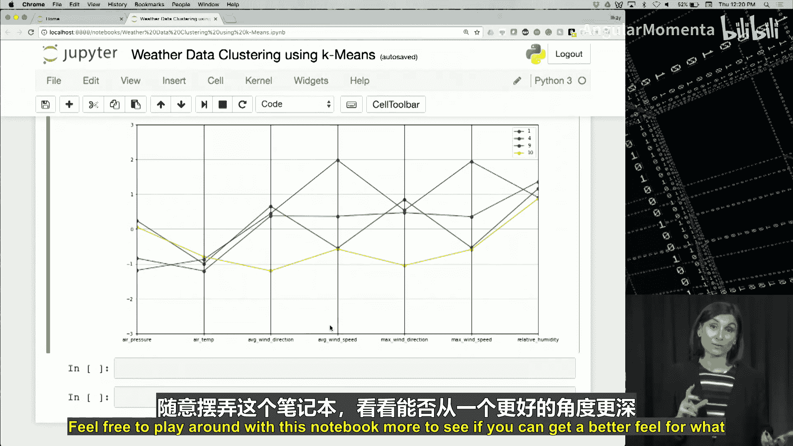

# 024：聚类分析


在本节课中，我们将学习机器学习中的聚类分析。我们将探讨其目标、核心概念、常用算法（K均值聚类）以及如何在实际数据集中应用它。

## 概述

聚类分析的目标是将数据集中的相似项目组织成组或“簇”。通过将数据分割成簇，我们可以更仔细地分析每个组。这是一种无监督学习任务，意味着数据没有预先定义的标签。

## 什么是聚类分析？

聚类分析，通常简称为聚类，其目标是根据某种相似性度量，将数据集中的所有样本划分到不同的组中。

在聚类中，我们希望实现两个目标：
1.  最小化同一簇内样本之间的差异。
2.  最大化不同簇之间样本的差异。

视觉上，这可以理解为让每个簇内的样本尽可能靠近，而不同簇的样本尽可能远离。

## 相似性度量

聚类分析需要某种度量标准来衡量两个样本之间的相似性。以下是一些常见的相似性度量：

*   **欧几里得距离**：两点之间的直线距离。公式为：`distance = sqrt((x2-x1)^2 + (y2-y1)^2)`
*   **曼哈顿距离**：在严格水平和垂直路径上计算的距离。公式为：`distance = |x2-x1| + |y2-y1|`
*   **余弦相似度**：测量两个点之间夹角的余弦值。

由于欧几里得距离等距离度量常被用于衡量样本间的相似性，因此可能需要对输入变量进行**归一化**，以防止某个值在相似性计算中占据主导地位。归一化可以将所有变量置于同一尺度上，确保它们在确定样本相似性时具有相等的权重。

## 聚类分析的特点

关于聚类分析，有几点需要注意：

*   **无监督任务**：与分类和回归不同，聚类通常是无监督任务。数据集中没有任何样本带有目标标签。
*   **无绝对正确结果**：不存在绝对“正确”的聚类结果。最佳的簇集合高度依赖于具体应用以及结果将如何被使用。
*   **簇没有标签**：聚类过程结束时，你可能会得到五个不同的簇，但你不知道每个簇代表什么。只有通过进一步分析每个簇中的样本，才能为簇提出合理的标签。

因此，**解释和分析簇**对于理解和利用聚类分析的结果至关重要。

## 聚类结果的应用

聚类分析的结果有几种应用方式：

*   **数据分割与洞察**：最明显的应用是数据分割及其带来的好处。例如，将客户群细分为不同类型的读者，单独分析每个细分市场可以深入了解每个群体的喜好、厌恶和购买行为。这些洞察可用于根据客户偏好进行更有效的营销。
*   **新样本分类**：当接收到一个新样本时，计算它与所有簇中心的相似性度量，并将其分配到最接近的簇。然后，通过手动分析确定的簇标签可用于对新样本进行分类。
*   **为分类任务提供标签**：一旦确定了簇标签，每个簇中的样本就可以用作另一个分类任务的标记数据。样本将是分类模型的输入，而簇标签将是每个样本的目标类别。这个过程可以为分类提供急需的标签数据。
*   **异常检测的基础**：如果一个样本距离任何簇中心都非常远或非常不同，那么该样本就是一个簇的**异常值**，可以被标记为异常。然而，这些异常需要进一步分析。在某些应用中，这些异常可能被视为噪声并从数据集中移除；在其他情况下（如信用卡欺诈检测），这些异常是需要仔细研究的案例。

## K均值聚类算法

K均值是一种用于聚类分析的经典算法。该算法非常简单直接。

K均值算法的步骤如下：
1.  选择K个初始**质心**。质心即簇的中心点。
2.  将数据集中的每个样本分配到最近的质心。这意味着你需要计算样本与每个簇中心的距离，并将样本分配给距离最近的质心所在的簇。
3.  计算每个簇中所有样本的均值，以确定新的质心。
4.  重复步骤2和3，直到达到某个停止标准。

### 初始质心的选择

最终聚类结果对初始质心的选择很敏感。这意味着使用一组初始质心得到的结果可能与使用另一组初始质心得到的结果不同。

选择初始质心最简单且最广泛使用的方法是：使用随机选择的不同初始质心多次运行K均值算法来聚类数据集，然后选择能给出最佳聚类结果的质心。

### 评估聚类结果

可以使用一种称为**簇内平方和误差**的度量来评估聚类结果。

一个样本在簇内的误差是该样本与簇质心之间的距离。该样本的平方误差是该距离的平方。我们对一个簇内所有样本的平方误差求和，得到该簇的平方误差。然后对所有簇进行相同的操作，得到一次聚类分析运行结果中所有簇的最终WSSE值。

给定两个聚类结果，WSSE值较小的那个在数值上提供了更好的解决方案。然而，正如我们之前讨论的，没有数学上的“基本事实”来确定哪一组簇比另一组更正确。

此外，请注意，增加簇的数量（即K值）总是会减少WSSE。因此，应谨慎使用WSSE。只有在比较**相同K值**且**来自同一数据集**的两组聚类结果时，使用WSSE才有意义。而且，WSSE最小的那组聚类结果可能并不总是手头应用的最佳解决方案。同样，关于簇应该代表什么以及它们将如何使用的**解释和领域知识**对于确定最佳聚类结果至关重要。

### 如何选择K值？

确定K的最佳值始终是使用K均值时的一个大问题。有几种方法可以确定K值：

*   **可视化技术**：可用于检查数据集，查看样本是否存在自然分组。散点图和使用降维技术在这里对可视化数据很有用。
*   **领域知识**：一个好的K值取决于应用。因此，应用的领域知识可以驱动K值的选择。例如，如果你想对客户购买的产品类型进行聚类，K的自然选择可能是你提供的广泛产品类别的数量。
*   **数据驱动方法**：这些方法计算不同K值的某些度量，以确定K的最佳选择。其中一种方法是**肘部法则**。

肘部法则通过绘制不同K值对应的WSSE曲线来寻找“拐点”（肘部）。曲线中的弯曲处表示增加更多簇所带来的收益下降，因此曲线中的这个“肘部”为K值提供了一个建议。但请注意，肘部并非总能明确确定，尤其是在复杂数据中。

### 何时停止迭代？

在使用K均值时，如何知道何时停止迭代？

*   **标准一**：当质心不再发生变化时。这意味着没有样本会改变簇分配，重新计算质心也不会导致任何变化。因此，额外的迭代不会给聚类结果带来更多变化，是时候停止了。
*   **标准二**：当改变簇的样本数量低于某个阈值（例如1%）时。此时，簇仅因少数样本而改变，对最终聚类结果的影响微乎其微，算法也可以在此停止。

### 解释聚类结果

在K均值结束时，我们得到了一组簇，每个簇都有一个质心。每个质心是该簇中所有样本的均值。你可以将质心视为该簇的代表性样本。

因此，为了解释聚类分析结果，我们可以检查簇质心。比较质心之间变量的值将揭示簇之间的差异或相似程度，并提供关于每个簇代表什么的见解。例如，如果不同客户簇的“年龄”值不同，这表明簇正在通过年龄（以及其他变量）编码不同的客户细分。

## 实战：使用Python进行天气数据聚类

在了解了聚类的概述之后，我们现在将学习如何使用Scikit-learn和Python执行聚类。我们将使用聚类分析来生成本地气象站的天气概况模型，使用的是分钟级粒度的数据。

### 1. 导入库与数据

首先，我们导入所有必要的库并加载数据。

```python
import pandas as pd
from sklearn.preprocessing import StandardScaler
from sklearn.cluster import KMeans
import matplotlib.pyplot as plt

# 加载数据
data = pd.read_csv('minute_weather.csv')
```

该数据集包含超过150万条记录，每条记录代表一分钟间隔的测量值，共有13个特征（如时间戳、气压、气温、风速等）。

### 2. 数据探索与采样

我们先查看数据的基本信息和前几行。

```python
print(data.shape)
print(data.head())
```

由于数据集很大，为了分析方便，我们可以对其进行下采样，例如每10分钟取一个样本。

```python
sampled_df = data[(data['rowID'] % 10) == 0]
print(sampled_df.shape)
```

我们还可以查看数据的统计摘要，并注意到某些列（如`rain_accumulation`和`rain_duration`）有大量零值。

```python
print(sampled_df.describe().transpose())
# 检查零值较多的列
print(sampled_df[(sampled_df['rain_accumulation'] == 0) & (sampled_df['rain_duration'] == 0)].shape)
```

### 3. 数据清洗与特征选择

我们将删除零值过多的列以及任何包含缺失值的行。

```python
# 删除列
sampled_df = sampled_df.drop(columns=['rain_accumulation', 'rain_duration'])
# 删除包含缺失值的行
rows_before = sampled_df.shape[0]
sampled_df = sampled_df.dropna()
rows_after = sampled_df.shape[0]
print(f"Dropped {rows_before - rows_after} rows with null values.")
```

接下来，我们选择用于聚类的特征。

```python
features = ['air_pressure', 'air_temp', 'avg_wind_direction', 'avg_wind_speed', 'max_wind_speed', 'relative_humidity']
selected_df = sampled_df[features]
```

### 4. 数据标准化

由于所选特征具有不同的尺度，我们需要对它们进行标准化，以确保在聚类中具有可比性。

```python
scaler = StandardScaler()
X = scaler.fit_transform(selected_df)
```

`fit_transform`函数会计算并应用将数据缩放到标准尺度的转换。

### 5. 应用K均值聚类

我们的目标是创建12个簇。我们使用标准化后的数据`X`来拟合K均值模型。

```python
kmeans = KMeans(n_clusters=12)
model = kmeans.fit(X)
```

### 6. 检查与可视化聚类中心

模型训练完成后，我们可以获取每个簇的中心点。

```python
centers = model.cluster_centers_
```

为了便于可视化这些高维中心点，我们创建两个辅助函数：一个将中心点转换为Pandas DataFrame，另一个用于绘制平行坐标图。

```python
def pd_centers(features, centers):
    col_names = list(features)
    col_names.append('prediction')
    # 将中心点转换为DataFrame
    Z = [np.append(A, index) for index, A in enumerate(centers)]
    P = pd.DataFrame(Z, columns=col_names)
    P['prediction'] = P['prediction'].astype(int)
    return P

def parallel_plot(data):
    plt.figure(figsize=(15, 8)).gca().axes.set_ylim([-3, 3])
    parallel_coordinates(data, 'prediction', color=('#FF5733', '#33FF57', '#3357FF', '#F333FF', '#33FFF6', '#FFC300', '#DAF7A6', '#FFC0CB', '#00FFFF', '#FF00FF', '#C0C0C0', '#000000'))
    plt.show()
```

现在，我们可以生成中心点的DataFrame并绘制平行坐标图。

```python
P = pd_centers(features, centers)
print(P)

# 根据特定条件（如相对湿度）筛选并绘制簇
dry_days = P[P['relative_humidity'] < -0.5]
parallel_plot(dry_days)

warm_days = P[P['air_temp'] > 0.5]
parallel_plot(warm_days)

cool_days = P[(P['relative_humidity'] > 0.5) & (P['air_temp'] < 0.5)]
parallel_plot(cool_days)
```

### 7. 分析聚类结果

通过平行坐标图，我们可以比较不同簇在各个特征上的表现。例如：
*   在“干燥日”图中，红色和蓝色簇在气压、气温和风速相关特征上差异较大。
*   在“温暖日”图中，它们主要在与风相关的特征上有所不同。
*   在“凉爽日”图中，它们在平均风速和最大风速等特征上表现出差异。

通过观察这些图，我们可以尝试解释每个簇代表的天气状况。例如，某个簇可能对应于“炎热干燥且空气相对静止”的日子。

## 总结



在本节课中，我们一起学习了聚类分析。我们了解到聚类是一种无监督学习方法，用于将相似的数据项组织成组或簇。我们探讨了K均值这一经典聚类算法，包括其步骤、如何选择K值、如何评估结果以及如何解释簇的含义。最后，我们通过一个实战案例，使用Python和Scikit-learn对天气数据进行了聚类分析，并利用平行坐标图可视化和解释了聚类结果。记住，聚类结果的最终意义需要通过结合领域知识进行分析和解释才能获得。