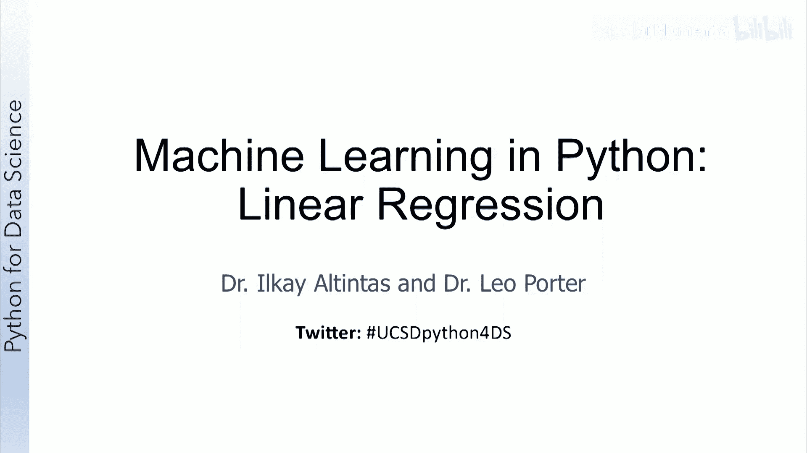
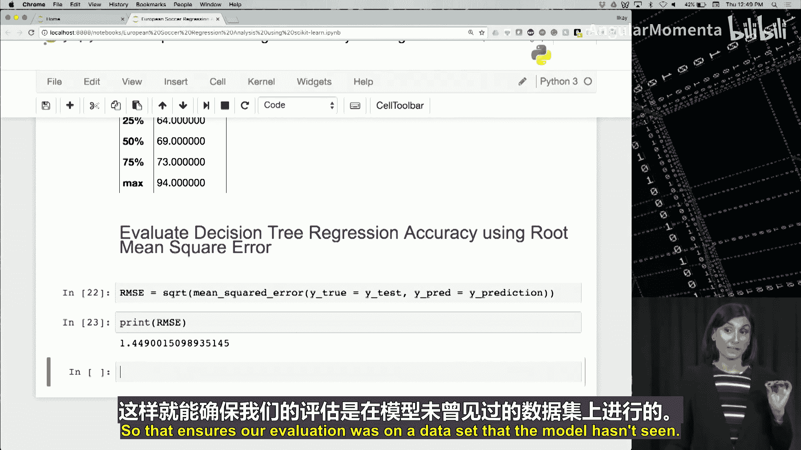

# 025：回归分析

在本节课中，我们将学习回归分析，并回顾Scikit-Learn中的回归分析工具包。课程结束时，你将能够定义什么是回归，解释回归与分类的区别，并列举回归的一些应用。

## 分类回顾

在讨论回归之前，我们先回顾一下分类问题。在分类问题中，输入数据被提供给机器学习模型，任务是预测与输入数据对应的目标。目标是一个分类变量，因此分类任务是根据输入数据预测目标的类别或标签。

以下是一个我们之前见过的分类示例：输入变量是温度、相对湿度、大气压力、风速和风向等测量值。模型的任务是预测与输入数据相关的天气类别。天气类别的可能值是晴天、有风、雨天或多云。由于我们预测的是类别，这是一个分类任务。

## 回归的定义

当模型需要预测一个数值而不是类别时，任务就变成了回归问题。回归的一个例子是预测股票价格。股票价格是数值，不是类别，因此这是一个回归任务，而不是分类任务。

需要注意的是，如果你预测的不是股票的实际价格，而是股票价格会上涨还是下跌，那么这将是一个分类任务。这是分类和回归之间的主要区别：在分类中，你预测一个类别；在回归中，你预测一个数值。

## 回归的应用示例

以下是回归可以应用的一些场景：
*   预测第二天的最高气温。
*   估算特定区域的平均房价。
*   基于现有类似产品，确定新产品（例如一本新书）的需求。
*   预测特定智能电网的用电量。

## 回归数据集示例

这是一个用于预测明天最高气温的回归任务数据集可能的样子。输入变量可能是：今天的最高气温、今天的最低气温和月份。目标是明天的最高气温。模型必须为每个样本预测这个目标值。

## 监督学习与模型构建

回想一下，在监督任务中，目标值是已知的；而在无监督任务中，目标值不可用或未知。由于这里的每个样本都提供了一个数值形式的目标标签，回归任务是一个监督学习任务，与分类类似。

与分类一样，构建回归模型也涉及两个阶段：训练阶段（构建模型）和测试阶段（将模型应用于模型未见过的数据）。模型使用训练数据构建，并在测试数据上进行评估。

同样，与分类一样，构建回归模型的目标也是让模型在训练数据上表现良好，并能泛化到新数据。

## 数据集划分

我们之前讨论过的两个不同数据集的用途也适用于回归。训练数据集用于训练模型，即调整模型参数以学习输入到输出的映射。测试数据集用于评估模型在新数据或剩余数据上的性能。

我们尚未讨论但你在后续机器学习课程中会经常听到的是验证数据集。验证数据集用于确定何时停止训练，以避免模型过拟合。

## 总结

在回归中，模型必须预测与输入数据对应的数值。由于为每个样本提供了目标，回归是一种监督学习任务。在回归中，目标始终是一个数值变量。

接下来，我们将讨论一种构建回归模型的具体算法。

## 线性回归

现在我们将讨论线性回归，这是一种简单但强大且流行的回归算法。在本节结束时，你将能够描述线性回归的工作原理，讨论最小二乘法在线性回归中的应用，并定义简单线性回归和多元线性回归。

线性回归模型捕捉数值输出与输入变量之间的关系。这种关系被建模为线性关系，因此称为“线性”回归。

为了理解线性回归的工作原理，让我们看一个来自Iris花卉数据集的例子，这是一个常用的机器学习数据集。该数据集包含不同种类鸢尾花的样本及其测量值，例如花瓣宽度和花瓣长度。

这里我们有一个散点图，x轴是以厘米为单位的花瓣宽度测量值，y轴是花瓣长度测量值。假设我们想根据花瓣宽度预测花瓣长度。那么回归任务是：给定一个花瓣宽度的测量值，预测花瓣长度。

我们可以构建一个线性回归模型来捕捉输入花瓣宽度和输出花瓣长度之间的线性关系。这些样本的线性关系在图中显示为红线。

从这个例子中，我们看到线性回归的工作原理是通过样本找到最佳拟合的直线。这被称为回归线。在只有一个输入变量的简单情况下，回归线就是一条直线。

直线的方程是 **y = m * x + b**，其中 **m** 决定了直线的斜率，**b** 是截距，即直线与y轴相交的位置。**m** 和 **b** 是模型的参数。训练线性回归模型意味着调整这些参数，使回归线拟合样本。

回归线可以使用最小二乘法来确定。这个图说明了最小二乘法的工作原理：黄点是数据样本，红线是回归线，即穿过样本的直线。这条线代表模型在给定输入时对输出的预测。

每条绿线表示每个样本到回归线的距离，因此绿线代表预测值（即红色回归线的值）与样本实际值之间的误差。这个距离的平方被称为与该样本相关的残差。

最小二乘法找到使残差之和尽可能小的回归线；换句话说，我们希望找到一条线，使预测的平方误差之和最小化。

因此，线性回归的目标是使用最小二乘法找到一条通过样本的最佳拟合直线。

一旦回归模型建立，我们就可以用它来进行预测。例如，给定一个1.5厘米的花瓣宽度测量值，模型将根据其构建的回归线预测花瓣长度为4.5厘米。

在线性回归中，如果只有一个输入变量，则该任务被称为简单线性回归。在具有多个输入变量的情况下，则被称为多元线性回归。

## 总结

线性回归捕捉数值输出与输入变量之间的线性关系。最小二乘法可用于通过找到通过样本的最佳拟合线来构建线性回归模型。

现在让我们切换到实际编码，看看线性回归的实际应用。

## 实战：使用回归预测球员表现

我们了解到回归允许我们预测连续变量。现在我们将使用回归技术，根据球员的属性来预测其整体表现。为此，我们将使用第一周见过的FIFA数据集进行整体分析。

在过去的七周里，你已经学到了不少知识，所以我们现在将对这个数据集进行更深入的分析。我们已经准备好使用学到的工具了。

让我们找到我们的笔记本，它名为“European S regression Analysis using Psyit Learn”，位于你本周的文件夹中，以及它需要的数据集。

打开后，我们首先导入库，然后再导入数据。快速浏览一下，我们导入了一些回归方法、pandas、SQLite（用于与关系数据库交互，这是本数据的数据源，我们将在第8周了解更多），以及其他一些数学和错误检测相关的模块。

现在我们将数据集导入到一个数据框中，然后查看这个数据框。

我们在这里做的是：连接到数据集，并使用这个连接选择球员属性，将它们加载到一个名为`df`的数据框中。

你可能已经注意到，一旦你习惯了数据导入，将数据导入pandas数据框总是使用类似的函数。所以，查看我们给你的其他示例笔记本，应该足以让你找到数据并将该类型数据加载到pandas数据框中，用于你的练习等。

让我们查看这个数据框的前五行，以熟悉数据。我们看到有一些与球员相关的特征：整体评分、潜力、惯用脚、进攻工作率、防守工作率等。

我们可以查看这个数据框的形状，大约有42个特征。让我们声明这些特征的列表。现在我们将选择其中一些特征，用于预测整体评分。当然，在本视频之后，你可以进一步调整这个列表并减少特征数量，以观察对预测准确性的影响。但现在，我们将使用很多这些特征来开始。

这里我们不会选择整体评分，因为那是我们的预测目标。基于从这些特征中选择的输入数据，我们将预测球员的数值整体评分。

让我们声明特征列和目标变量（命名为`overall_rating`）。现在开始清理数据，我们将简单地删除空值，因为我们从第一周就知道这是这个数据集的一个问题。我们使用数据框的`dropna`方法。

现在我们有了一个没有空值的数据切片。现在创建两个数据框，就像你现在习惯的那样：我们需要一个输入X和一个目标y。X将是我们的输入数据框，我们将选择之前声明的特征列表中的特征，加载到没有空值的数据框中。y将是目标值。

你可以随时停下来查看X和y里面有什么，以防混淆，但我们正在执行本周机器学习早期笔记本中相同的操作。

让我们看一下数据的概览，打印X的一行。我们看到X数据框中的值：潜力、传中等。我们也可以显示y，看看其中的值范围，了解存在哪些整体评分分数，我们看到它的范围大约在67到81之间。

请参考第一周的足球数据分析笔记本，对这个数据集进行进一步的探索，现在你应该能够理解那个笔记本中的很多代码了。所以，现在是时候去享受那个分析了。

我们假设你暂停了视频，可能做了一些探索，现在我将开始回归分析任务。

我们使用`train_test_split`执行相同的操作，将数据拆分为测试集和训练集，以便我们可以使用一个进行训练，另一个用于测试回归算法。

我们将使用两种不同的建模操作，采用不同的回归技术。首先，我们将使用线性回归器，选择特征并使用线性回归器来预测球员的整体评分。

这里我们存储一个线性回归对象，称之为`regressor`。这是我们从Scikit-Learn中选择的线性回归模块。然后，我们将使用该回归器，给它我们的训练输入和标签数据集（在这种情况下是数值标签，`X_train`和`y_train`）。使用回归器的`fit`方法，我们微调线性回归器的参数，以捕捉两个集合（`X_train`和`y_train`）之间的相互作用。我们试图拟合`X_train`和`y_train`，并创建一个模型。

然后，我们可以使用这个训练好的模型的`predict`方法来对测试集（即我们的`X_test`）进行预测。提醒一下，请注意模型从未见过这个测试集中的任何样本，所以它是在一个新的数据集上进行预测。

执行后，我们看到了y的预测值集合。如你所知，我们可以将它们与`y_test`中的值进行比较，看看它们有多准确。

如果我们查看并描述这个数据集的一些信息，我们看到整体平均值大约在67.6左右，最小值和最大值分别是33和94。我们看到预测的分数实际上在合理范围内。

我们也可以尝试描述预测值并进行比较，但我们将做一些不同的事情：实际上，我们使用均方根误差来衡量回归器的预测准确性。RMSE捕捉了预测值与观测值之间的差异。RMSE分数为0意味着预测完美无误差，这是理想情况，几乎从未发生。当比较两个回归模型时，RMSE较小的那个更好，因为它的预测与观测值或之前测量值的差异更小。

让我们计算一下：RMSE等于均方误差的平方根，`y_true`是`y_test`，`y_pred`是`y_prediction`（这里我们给出的参数）。当我们计算RMSE并打印出来时，我们看到线性模型给出的RMSE是2.8，这是一个好的开始。因为整体评分的范围是从33到94，平均值大约是68。

很好。现在让我们看看是否可以通过使用一个稍微复杂一点的模型来提高预测准确性。那就是决策树回归器。

决策树回归器以自顶向下的方式构建模型，通过在属性上拆分数据集。该算法选择能最大程度减少标准差的属性。你将在你的机器学习课程中了解更多，所以我在这里快速描述一下，然后继续应用它，希望这能为你即将到来的机器学习课程开胃，你将在那里学习所有这些知识。

现在让我们使用决策树回归器来捕捉球员表现与其属性之间的函数关系。`fit`方法再次执行微调，所以我们做的是完全相同的事情：我们有一个回归器，但由于这是一棵树，它有一个深度，最大深度是20。我们使用那个回归器来拟合训练输入和输出数据集，即`X_train`和`y_train`。我们改变了方法，但`fit`这一行保持不变。回归器只是另一个类和另一个方法。

完成了，我们现在有了一个模型，我们将再次使用这个模型来预测测试数据。执行后，我们看到值发生了一些变化。为了了解RMSE，我们注意到，例如，100的均方根误差会太高，因为我们的平均值是68，而我们的RMSE比我们的平均值还高。

所以让我们运行这个。再次，我们可以描述测试集，并为这个决策树回归器计算RMSE。记住，我们的线性回归操作给出的RMSE是2.8。决策树回归算法给出了一个更低的RMSE，1.44，在预测准确性方面比线性模型更好。

再次强调，RMSE捕捉了系统预测值与实际值之间的差异，因此它是衡量模型对操作表现如何的一个指标。所以，我认为对于一个目标变量平均值为68的测试集来说，1.44的RMSE是相当不错的，而且模型在预测之前从未有机会查看测试集。这确保了我们的评估是在模型未见过的数据上进行的。

我们看到线性回归模型的表现比基于决策树的回归器稍差一些。

很好，我们完成了本周（第七周）的机器学习讲座内容。我希望你会喜欢我们给你的测试笔记本，并对我们刚刚讨论的内容有更多的实践经验。