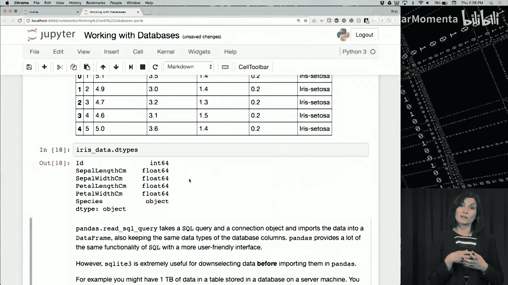

# 026：关系数据模型与SQL查询


在本节课中，我们将学习关系数据模型的基本概念，并了解如何使用SQL语言从关系数据库中检索数据。课程将分为两部分：首先回顾关系数据模型的核心组件，然后通过一个具体的Jupyter Notebook示例，演示如何与SQLite数据库交互并执行查询。

## 关系数据模型回顾

在开始实际操作之前，我们先花几分钟时间回顾一下关系数据模型的基本概念以及如何与关系数据交互。

在本节结束时，你将能够描述关系数据模型的结构组件，演示构成数据模型模式的组件，解释主键和外键的用途，并描述连接操作。

### 核心数据结构：表

关系模型的主要数据结构是**表**。如下图所示，这是一个用于演示的简单应用表。


你可能会注意到，表的结构与Python的**DataFrame**非常相似。实际上，DataFrame可以用来表示关系表，后者也被称为**关系**。

### 关系与元组

这个表实际上代表了一组**元组**。关系中的每一行就是一个元组。我们之前非正式地称其为记录，但现在我们称其为元组。因此，这个关系是一个包含六个元组的集合（即六行六列）。

根据集合的定义，它是**相同类型的不同元素**的集合。这意味着我不能将图中底部的红色记录作为元组添加到此关系中，因为这会引入一个重复项。在实践中，许多系统允许关系中存在重复的元组，但通常会提供机制来防止重复条目。

另一个红色元组包含了所有正确的信息，但顺序完全错误。那么，这个元组与关系中的其他六个元组相似吗？系统如何知道这个元组是不同的呢？

### 模式与键

这让我们注意到表格的第一行，即黑色的表头。这一行是表**模式**的一部分。这些是我们的列，类似于Pandas DataFrame中的列。

关系表中的模式还可以指定**键**。第一列表明`ID`是一个**主键**。这意味着对于每个员工，`ID`是唯一的。知道一个员工的主键，我们就能唯一地确定该员工的其他五个属性，如`first_name`、`last_name`、`department`、`title`和`salary`。

现在你应该明白，一个带有主键的表在逻辑上意味着该表不能有重复记录，否则将违反与主键关联的唯一性约束。

我们将第一个表称为`employees`，其主键为`ID`。

### 外键与表关联

现在，我们引入第二个表`emp_salaries`，其中包含员工的薪资历史记录。员工由`emp_id`列标识，但这些值并非随意存在，它们必须与前面`employees`表的`ID`列中的值相同。

这体现在右侧的声明中。术语“引用”意味着，此列中的值只有在被引用的`employees`表中出现相同的值时才能存在。被引用的表也称为**父表**。

在关系模型的术语中，`emp_salaries`表的`emp_id`列被称为**外键**，它引用了`employees`表的主键。请注意，`emp_id`不是`emp_salaries`表的主键，因为它有多个具有相同`emp_id`的元组，反映了员工在不同时间的薪资。

### 连接操作

你可能还记得我们在Pandas中讨论过的**连接**操作。下图展示了一个关系连接操作的示例，该操作在`employees`表的前三列和`emp_salaries`表上进行，条件是`employees.id`和`emp_salaries.emp_id`列相等。



输出表显示了所有涉及的列，公共列只出现一次。这种形式的连接称为**自然连接**。

理解连接是最昂贵（即耗时和占用空间）的操作之一非常重要。随着数据量变大，表包含数亿个元组时，连接操作很容易成为大型分析应用的瓶颈。因此，对于涉及大数据的科学计算，当我们需要进行连接时，选择一个能使此操作高效运行的合适数据管理平台至关重要。

### 本节小结

总而言之，关系模型提供了一种描述数据记录之间唯一关系（包括记录标识符之间的关系）的方法。Pandas的DataFrame实现了关系数据模型的一些特性，使得处理关系数据库更加容易。

## 从关系数据库检索数据

在简要回顾了关系模型之后，我们现在来讨论如何从关系数据库中检索数据。

在本节结束时，你将能够描述数据检索的含义，解释SQL的用途，并创建简单的SELECT查询。

### 什么是数据检索？

**数据检索**指的是用户指定所需数据并从数据源获取数据的方式。在本课程中，我们以两种方式使用“数据检索”这个术语。

假设你的数据存储在一个遵循特定数据模型（例如关系数据模型）的数据存储中。通过数据检索，我们将指代你如何指定从关系数据存储中获取所需数据的方式，以及数据管理系统内部为计算或评估该指定检索请求而进行的处理。

### SQL：结构化查询语言

现在，让我们看看如何使用一种称为**结构化查询语言**或**SQL**的特定语言进行查询规范。

SQL是处理结构化数据时无处不在的查询语言，但它已经以多种方式扩展以适应其他类型的数据。在本课中，我们将坚持使用该语言的结构化方面。

你应该知道，SQL既用于Oracle等经典数据库管理系统，也用于Spark等现代分布式大数据系统（以Spark SQL的形式）。

### 一个示例数据库模式

现在让我们用一个示例来工作。我们为此业务设计的模式包含三个关系（或表）。

以下是这些表：
*   **第一个表**列出了酒吧。它包含酒吧的名称、地址和许可证号。请注意，名为`name`的属性带有下划线，因为它是`bars`关系的**主键**。回想一下，主键指的是一组属性（在本例中仅为`name`），它们使记录唯一。
*   **第二个表**称为`beers`，列出了啤酒的名称和制造商。
*   **第三个表**是`sells`表。并非每个酒吧都销售相同品牌的啤酒，即使销售，同一产品也可能因经营成本不同而有不同的价格。因此，`sells`表记录了哪个酒吧以什么价格销售哪种啤酒。

### 基本的SQL查询结构

SQL查询最基本的结构是`SELECT ... FROM ... WHERE`子句。

在这个示例中，我们正在查找由“Heineken”制造的啤酒名称。因此，我们需要指定：
*   输出属性：在本例中是啤酒的`name`。
*   用于回答查询的逻辑表：在本例中是`beers`。
*   所有所需数据项应满足的条件：即名为`manf`的属性值等于“Heineken”。

我们的查询是：
```sql
SELECT name FROM beers WHERE manf = 'Heineken';
```
需要注意以下几点：
1.  字面值“Heineken”用单引号括起来，因为它是一个**字符串字面量**。在这种情况下，字符串应该完全匹配，包括大小写。
2.  回顾我们在Pandas中讨论过的数据操作，你会认识到这种形式的查询也可以表示为对`beers`关系的一个**选择**操作（条件是`manf`属性），然后是一个**投影**操作（从选择操作的结果中仅输出`name`属性）。因此，选择操作找到`beers`中制造商为“Heineken”的所有元组，然后从这些元组中仅投影`name`列。

此查询的结果是一个具有单个属性`name`的表。在Pandas中，这将是一个列或一个Series对象。

### 更多SQL查询示例

我们使用另外两个示例查询来说明SQL的更多特性。

**第一个查询**查找昂贵的啤酒及其价格：
```sql
SELECT DISTINCT beer, price FROM sells WHERE price > 15;
```
假设我们认为价格超过15美元一瓶的啤酒是昂贵的。从模式中我们知道，价格信息来自名为`sells`的表，因此`FROM`子句应使用`sells`。`WHERE`子句很直观，指定价格大于15。

现在请注意，`sells`关系还有一个`bar`列。如果两个不同的酒吧以相同的价格销售同一种啤酒，我们将在结果中得到两个条目，但这并不是我们想要的。无论有多少酒吧以相同价格销售同一种啤酒，我们只希望结果出现一次。这是通过第一行中的`SELECT DISTINCT`语句实现的，它确保结果关系没有重复项。

**第二个示例**展示了结果必须满足多个条件的情况：
```sql
SELECT * FROM bars WHERE addr = 'San Diego' AND license LIKE '32%';
```
在此查询中，业务必须在圣地亚哥，同时必须是临时许可证持有者（即许可证号应以“32”开头）。如图所示，这些条件通过`AND`运算符组合在一起。因此，此查询将选择表中的第三条记录，因为前两条记录满足第一个条件但不满足第二个条件。

### 限制返回结果数量

如果我们的数据库很大，而我们只需要返回五个结果（例如，用于显示的样本），我们可以使用`LIMIT`子句：
```sql
SELECT * FROM bars WHERE addr = 'San Diego' LIMIT 5;
```
`LIMIT`子句的确切语法可能因数据库管理系统供应商或Python环境而异。

### 本节小结

总而言之，SQL是结构化关系数据的标准查询语言，它类似于Pandas DataFrame，尽管它可以提供更多操作。除了我们在本视频中重点介绍的简单数据选择查询外，SQL还允许进行连接和其他操作，但我们不会深入探讨这些操作的细节。

接下来，我们将在一个Jupyter Notebook中向你展示如何在Python环境中使用这些选择查询。

## 实践：在Jupyter Notebook中使用SQLite

在本笔记本中，我们将使用一个名为**Iris**的流行数据库。它包含了150个鸢尾花样本及其被分为三个物种的分类信息。

我们将使用Kaggle上SQLite格式的Iris数据库来完成本笔记本的其余部分。

### 准备工作

如果你能在你的`week8`文件夹中找到这个笔记本，它名为`Work_with_Database.ipynb`。笔记本顶部有一个Kaggle链接：`kaggle.com/uciml/iris`。你需要从这个链接下载数据，数据文件名为`database.sqlite`。它应该放置在你为`week8`准备的`data/iris`文件夹中。

现在请暂停视频，前往此链接并下载数据集。

假设你已暂停视频并下载了数据集，在我们继续之前，请运行接下来的两个代码单元格，以检查你是否成功完成了此步骤。

### 检查数据文件

以下是接下来两个单元格的内容：
```python
import os
data_iris_folder_contents = os.listdir('data/iris')
assert 'database.sqlite' in data_iris_folder_contents, 'Please download the database.sqlite file and place it in the data/iris folder.'
```
第一个单元格导入`os`模块，并将`data/iris`目录的内容加载到名为`data_iris_folder_contents`的对象中。错误消息是一个字符串，如果文件不存在或数据库文件不在该文件夹中，我们将显示该消息。我们使用`assert`语句进行检查。`assert`语句通常是通过创建此类内置测试来定位或识别Python程序中错误的好方法。如果你进行大量测试，实际上会使用很多`assert`语句。

如果运行成功，我们就可以继续与数据库交互了。

### 连接数据库

我们将首先导入`sqlite3`。`sqlite3`是一个Python模块，允许我们执行简单的SQL操作。我们将使用它来连接我们放置在`iris`文件夹中的数据库文件。
```python
import sqlite3
connection = sqlite3.connect('data/iris/database.sqlite')
cursor = connection.cursor()
```
现在我们有了一个连接对象。我们将使用这个连接对象来获取一个游标对象。这个游标对象实际上是我们与数据库交互的接口。

在继续之前，我还想提一下，SQLite随标准Python一起提供，因此它不是你需要单独安装的库，这是一种与简单数据库查询交互的便捷方式。

### 探索数据库

让我们看看游标对象的类型：
```python
type(cursor)
```
输出是`sqlite3.Cursor`。正如我提到的，这是我们与数据库交互的接口，主要通过游标对象的`execute`方法，我们能够在已连接的数据库上运行任何SQL查询。

例如，我们可以获取数据库中保存的所有表的列表。这是通过从`sqlite_master`元数据表中读取`name`列来完成的。
```python
cursor.execute("SELECT name FROM sqlite_master")
for row in cursor:
    print(row)
```
此执行的输出将转换为一个迭代器。如果我直接运行`cursor.execute(‘SELECT ...’)`，我会得到一个迭代器。现在我正在`for`循环中使用该迭代器来打印每一行。

在Iris数据库的情况下，我们只有一个表，所以你会看到它在这里被称为`Iris`。

直接执行查询并收集结果的快捷方式也称为`fetchall`方法。因此，我们可以使用`SELECT`查询从特定表检索数据，并一次性获取所有结果，而无需使用`for`循环。
```python
cursor.execute("SELECT * FROM Iris")
results = cursor.fetchall()
print(type(results))
```
我们应该得到一个列表。如果我们打印这个结果的类型，我们会看到它是`list`类。我们可以处理这个列表，但这种方式非常低级且效率不高。

还记得我们在动手操作环节之前的视频中提到的`LIMIT`子句吗？最后一个查询语句，比如`SELECT * FROM Iris LIMIT 3`，会给我们带来前三行。你可以将其更改为5、20或任意行数并执行。
```python
cursor.execute("SELECT * FROM Iris LIMIT 20")
sample_data = cursor.fetchall()
for row in sample_data:
    print(row)
```
现在我们可以看到列表中所有的20行数据，这个列表是`fetchall`的结果。我们知道如何处理这种数据结构，对吧？我们得到了这个列表的列。

### 使用Pandas进行高效交互

虽然可以使用SQLite创建许多这样的操作，但正如你所知，Pandas提供了一种更直观、更高效的方式来与数据交互。就像我们之前处理欧洲足球数据库一样，我们现在将使用Pandas的`read_sql_query`函数将`Iris`表中的数据加载到Pandas DataFrame中。

你以前见过这个，但现在让我们结合对SQLite的了解再回顾一下这里发生了什么。
```python
import pandas as pd
iris_data = pd.read_sql_query("SELECT * FROM Iris", connection)
print(iris_data.head())
print(iris_data.dtypes)
```
我们导入了`pandas as pd`。在这里，我们创建了一个名为`iris_data`的DataFrame对象。我们使用pandas的`read_sql_query`方法，并给它一个SQL查询（`SELECT * FROM Iris`）和连接对象。通过这个连接令牌和查询，pandas的`read_sql_query`函数知道如何获取该查询的结果并为我们创建一个DataFrame。

运行这些代码后，我们可以使用`head`操作查看前五行，也可以查看每列的数据类型。现在使用pandas处理数据就很简单了。

### 创建更复杂的查询


我们还可以创建更复杂的查询来限制加载到DataFrame中的数据。因为如果数据很大，表可能有很多行和列，而我们可能只想选取其中的一部分。现在你了解了这些SELECT查询，实际上可以使用SQL查询来创建约束。

例如，下面的查询与之前完全相同，但它只选择`Iris-setosa`物种，而不是所有三个物种。
```python
query = "SELECT * FROM Iris WHERE species = 'Iris-setosa'"
iris_setosa = pd.read_sql_query(query, connection)
print(iris_setosa.shape)
print(iris_data.shape)
```
我们有一个查询说：`SELECT * FROM Iris WHERE species = 'Iris-setosa'`。执行后，我们会看到结果DataFrame中只有一个物种。如果我们查看`iris_setosa.shape`和之前`iris_data.shape`的对比，我们会发现`iris_setosa`只有50行，而`iris_data`有150行。在Iris数据库中，每个物种有50个样本，总共150行。通过这个新查询，我们能够以关系查询的方式“切出”属于`Iris-setosa`物种的50个样本。

### 鼓励练习

虽然我们可以扩展这些SQL查询，但为了简单起见，我们在此停止。和往常一样，我鼓励你使用这个数据库为自己构建练习。例如，使用Iris数据库和我们上周讨论的机器学习库来构建模型。事实上，Iris数据库通常用于演示不同的机器学习算法。因此，现在是介绍这个数据集的好时机，希望你能用它来为自己创建练习。

## 课程总结

在本节课中，我们一起学习了关系数据模型的核心概念，包括表、元组、模式、主键、外键以及连接操作。我们还介绍了如何使用SQL语言从关系数据库中检索数据，学习了基本的`SELECT ... FROM ... WHERE`查询结构，并通过`DISTINCT`、`AND`、`LIKE`和`LIMIT`等关键字增强了查询功能。最后，我们在Jupyter Notebook中实践了如何使用Python的`sqlite3`模块和Pandas库与SQLite数据库进行交互，执行查询并将结果加载到易于处理的DataFrame中。这些技能是进行数据科学分析和处理结构化数据的基础。