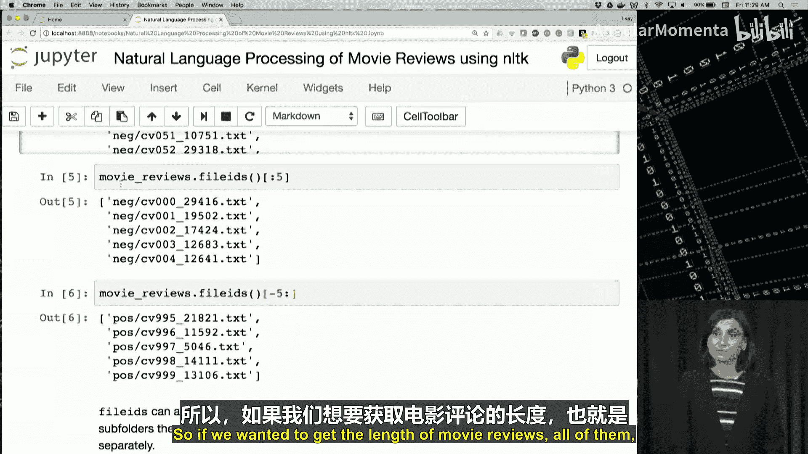
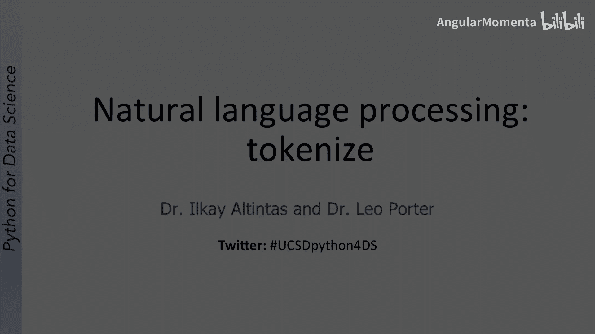
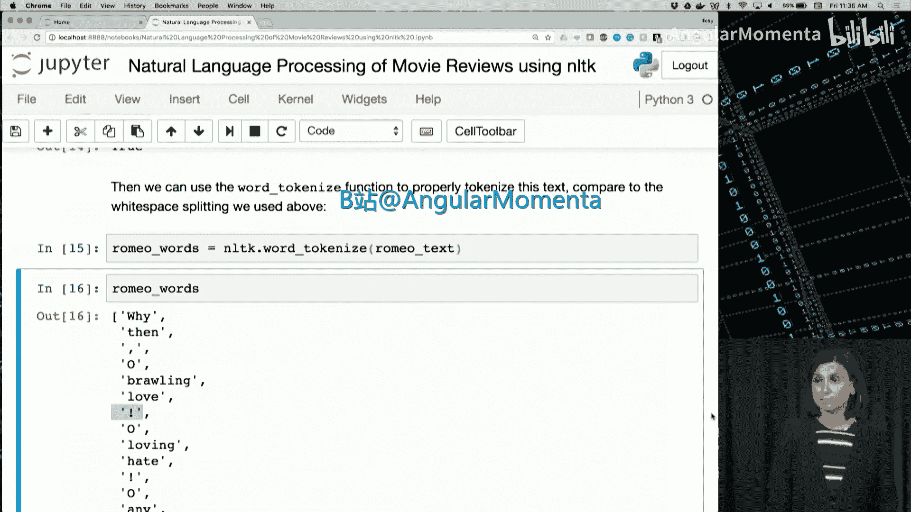
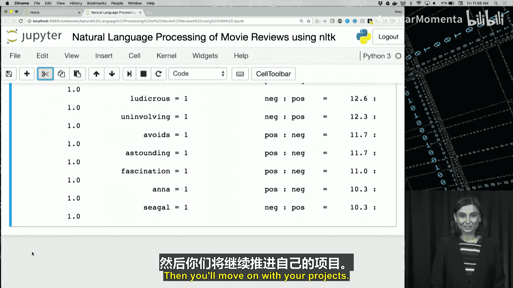

# 027：使用自然语言工具包进行自然语言处理 🗣️


在本节课中，我们将学习如何使用一个名为NLTK的流行Python包进行自然语言处理。

## 概述

自然语言处理，简称NLP，是一个数据科学术语，指计算机与人类使用的自然语言之间的交互。这是一项不简单的任务，因为人类语言具有歧义性。作为人类，我们擅长理解话语的上下文，并将其与我们周围概念的理解联系起来。然而，以算法方式实现这一点并不简单。NLP领域致力于改进和发展算法及数据技术，以有效且快速的方式实现这一目标。

你可能已经使用过NLP应用，例如在线新闻或书籍摘要、搜索最热门Twitter话题的关键词，或者使用手机上的虚拟助手。让我们列举一些这类应用。

以下是NLP技术的一些应用实例：
*   **语音识别引擎**：如Siri、Google Now或Alexa。这些引擎旨在学习人类说话的内容和方式，并不断提高其准确性。
*   **自动翻译器**：如Google Translate或Facebook的自动状态翻译。它们使用NLP，并采用了一些近期非常有效的基于神经网络的技术，不仅考虑单词和短语，还通过查看待翻译文本周围的单词来考虑上下文。
*   **聊天机器人**：能够通过Facebook Messenger回答问题的聊天机器人是NLP的另一个例子。它们使用NLP引擎来处理问题，通常只是对问题进行简单分类，并将其与现有答案进行匹配。

在本课中，我们将通过一个使用NLTK进行自然语言处理的笔记本来学习。NLTK是最流行的用于NLP的Python包。它是一个开源库，提供了用于导入、清理、预处理人类语言文本数据的模块，然后对这些数据集应用计算语言学算法或机器学习算法（如情感分析）。它还提供了超过50个数据集供我们开始使用，包括我们将在示例笔记本中使用的电影数据库。

让我们开始使用我们的笔记本。

## 语料库与数据集 📚

上一节我们介绍了NLP的基本概念和NLTK库。本节中，我们来看看NLTK提供的数据集，即语料库。

NLP技术依赖于大量的文本或其他语言数据。这些数字化的集合统称为语料库。你会听到的另一个词是corpus，它是corpora的单数形式。

正如你在我们简短的实时会话中所见，NLTK提供了下载其中一些大型数据集的方法。导入NLTK后，你能够使用`nltk.download()`与所有这些数据集的下载界面进行交互。更具体地说，我们下载了电影评论语料库以开始处理我们的笔记本。

电影评论语料库已下载到你的主文件夹中。因此，如果你列出此文件夹下的目录，你会看到该语料库有2000条评论，其中一半是正面的，另一半是负面的。这些文件或目录中的每条评论都有大量的文本，不仅仅是关于电影的简短意见，平均约800个单词。

现在让我们切换到我们的笔记本，查看其中一些评论。

让我们从上次停止的地方继续，导入我们下载的电影评论。

```python
from nltk.corpus import movie_reviews
```



NLTK语料库中所有数据集提供的`fileids`方法可以访问所有可用文件的列表。我们可以使用`len`函数查看此列表的长度，但首先让我们找出从语料库中获得的所有文件。也许是前五个文件，它们位于负面的`neg`文件夹中。我们看到文件名和底部的五个文件。但这仍然是一个列表。所以我们可以实际运行长度操作。对于这两个列表都是如此。

因此，如果我们想获取电影评论的长度，即`movie_reviews`通过`fileids`提供给我们的所有评论，我们可以这样做。

当我们查看负面文件和正面文件时，我们看到它从负面评论开始，然后切换到`pos`目录中的正面评论，因此它显示我们有两个目录，每个目录有1000条评论。1000条是负面评论，1000条是正面评论。在这里的第7行，我们所做的是将列表过滤为正面和负面类别。我们看到每个类别有两个相等的列表。



因此，我们也可以使用`movie_reviews`的`raw`方法检查其中一条评论。每个文件被分割成句子，数据的策划者还从每条评论中删除了任何对电影评分的直接提及。

在下一个代码行中，我们获取了第一个正面评论。这是评论。它确实有大量的文本，但我们如何开始处理这些文本呢？一种方法是将此文本进行分词。在下一个视频中，我们将讨论这种对任何类似文本进行分词的技术，并将其用于自然语言处理。

## 文本分词 ✂️

现在让我们谈谈文本中的单词分词。在本视频结束时，你应该能够解释分词的含义并使用NLTK单词分词器。

NLP的第一步通常是将文本分割成单词。这个过程可能看起来简单，但要处理所有边缘情况非常繁琐。什么是边缘情况？它们包括标点符号的不一致使用、缩写或单词的缩短形式，也可能包括像“New York-based”这样的包含连字符的单词示例。我们如何对此类情况进行分词？NLTK提供了库来应对这些挑战。

当我们稍后切换到笔记本时，我们将首先使用一个简单的基于空格的分词器。然后我们将学习如何使用NLTK更好、更轻松地完成分词。

现在切换回我们的笔记本。对于我们的分词示例，让我们使用罗密欧的简短文本。我们看到这里的示例有一些标点符号。让我们看看这个罗密欧文本。这里有一些标点符号，比如“love”后面的感叹号，我们还有例如一个带连字符的“well-seeming”。如果我们现在在Python的下一行中使用字符串分割函数，它将给我们这些单词的列表。让我们执行它。哦，抱歉，我没有运行前一行，别忘了逐行运行代码。在第12行或代码单元格12之后，我们将使用这个罗密欧文本来分割。检查一下这个。我们看到有一些标点符号与单词连在一起，比如“love!”或“hate.”，以及像“well-seeming”这样的组合词。它们都被列为一个单词。理想情况下，我们希望“love”是一个单词，那个标点符号感叹号是另一个单词，或者我们甚至可能删除它，但我们如何删除这些标点符号呢？对于这个任务，我们需要下载一个已经训练好的英语分词器。那个分词器叫做`punkt`。所以它来处理标点符号。让我们执行这个代码单元格。

然后我们可以使用这个单词分词器来生成标记。记住，之前我们实际上只使用了分割操作，`romeo_text.split()`，这是字符串提供给我们的。我们正在尝试做更多，我们实际上正在尝试使用NLTK的`punkt`，它已经定义了这些标点符号，并且我们正在使用其中的`word_tokenize`来生成一个单词列表。现在如果你显示这些单词列表，我们确实看到上面有的“love!”被很好地分开了。



好消息是，NLTK中的所有语料库已经提供了一种为每个数据文件生成分词后单词的方法。


所以对于我们的电影数据库，让我们去找找看。第一个正面文件的单词可以使用这里的代码块访问。我们有`movie_reviews.words()`和`positive_fileids[0]`作为我们的第一条记录。让我们执行这个。我们这里有一个列表，对吧？我们拥有来自第一条正面记录的单词列表。现在我们有了单词，在接下来的系列视频中，让我们看看如何使用这些单词为它们构建一个简单的词袋模型。

## 词袋模型 🛍️

在本视频中，我们将回顾词袋的含义。在本视频结束时，你应该能够解释词袋的含义，理解如何从单词构建机器学习特征，并举例说明停用词。

词袋模型是将文本主体表示为松散单词集合的一种非常简单的方式。它将其扁平化为一个无序的单词集合。尽管它忽略了与单词相关的句子结构，但这种简单的技术对于识别文本中的主题或情感非常有用，例如产品评论是负面还是正面情感，或者文本主体谈论什么。

我们可以在特征矩阵中使用这些单词，其中每个单词是一列，每个文本主体或我们电影示例中的每条评论是一行，具有布尔数据值。评论行中的一个单元格被分配为`True`，如果该单词出现在评论中；如果未出现，则分配为`False`。

仅通过查看这个具有有限单词集的矩阵中的这三行，我们就可以识别出这些评论的主题是电影。并且可能评论1和评论3是正面的，评论2是负面的。

在我们继续到笔记本之前，我想提一下，在进一步分析之前，通常的做法是从词袋中过滤掉停用词，甚至可能过滤掉标点符号。停用词是像“the”、“a”、“and”、“is”这样的词，它们出现频率很高，但在识别被处理文本的上下文方面没有太大意义。

现在让我们切换回我们的笔记本，执行我们的第一个词袋模型。

正如我们刚刚概述的，从词袋模型中，我们可以构建供分类器使用的特征，这里我们假设每个单词是一个可以是真或假的特征。我们在Python中将其实现为一个字典。但是，句子中的每个单词，我们将其与`True`关联。如果一个单词缺失，那将等同于分配`False`，或者在这种情况下，我们不会有任何东西。所以让我们为`romeo_words`中的每个单词执行这个循环。正如你在这里看到的，一个字典，其中`romeo_words`中的每个单词都被分配了`True`，并且没有`False`值，因为我们没有为任何东西分配`False`。

你会记得我们早期的视频，这里的下划线是进入标准输出的最后一个输出。所以如果你已经将该字典分配给了一个变量，你需要在此单元格中写入该变量的名称。为了概括我们所做的，这里的字典创建，我们可以将我们在这里所做的转化为一个Python函数。

在这个代码单元格中，我们定义了一个Python函数。接下来我们将使用它。让我们执行这个Python函数，它叫做`build_bag_of_words_features`，所以我们正在为我们刚刚创建的单词字典构建词袋特征。所以这个函数将接受一组单词并返回其字典。让我们运行该函数，看看是否得到与刚才第20行相同的输出。很好，我们得到了相同的输出。这就是我们想要的。

但是，请注意，这里像感叹号、逗号或点这样的标点符号仍然显示出来，这些对于分类目的是无用的。同样，我们有像“of”、“that”、“is”或“in”这样的词。这些不需要被包含。所以这些词被称为停用词，NLTK实际上为每种语言（在这种情况下是英语）提供了一个语料库，所以我们可以实际从NLTK下载停用词。

我们现在可以在英语中使用停用词，以及`string`类中的标点字符。这些是列在我们第24行输出中的字符。我们可以使用它来创建一个我们不想要的列表。我们将这个列表称为`useless_words`。这里我将`useless_words`创建为一个列表，它是英语停用词和标点字符的组合。

如果你有好奇心，或者不完全理解停用词是什么，请随时打印出这里的停用词，`nltk.corpus.stopwords.words('english')`，稍微探索一下这些词，看看它们是什么。当然，我们现在可以打印`useless_words`。自己看看这个列表，所以这里有“i”、“me”、“my”、“myself”，列表从那里继续。为简单起见，我将注释掉那一行，然后再次运行。

现在我们将实际更新我们构建的词袋函数，添加一个`if`语句来检查单词是否存在于`useless_words`中，如果存在则跳过该单词。所以我们有相同的函数。之前是`True`，现在是`1`。对于`words`中的每个`word`，但我们有一个条件，`if not word in useless_words`，所以这意味着如果单词不在`useless_words`中，则将其添加到我们的字典中。

正如你可能已经注意到的，这里我们没有使用`True`作为单词的值，而是使用`1`在字典函数中。让我们运行我们的函数。现在我们将使用这个函数`build_bag_of_words_features_filtered`，特征已经过滤掉了无用词。给它`romeo_words`作为输入。如果你这样做，我们看到标点符号和我们之前有的一些停用词消失了，我们在字典中有了一个更清晰的单词列表。

我们正在取得进展。接下来，让我们看看如何计算和绘制此列表中单词的频率。

## 词频分析 📊

现在让我们看看我们可以进一步做些什么来分析词频。在本视频结束时，你应该能够计算一个项目在列表中出现的次数，在对数坐标轴上绘制词频，并绘制词数直方图。

当我们切换到笔记本时，我们将看到，快速检查我们电影评论数据库中的单词数量显示有160万个单词，通过移除我们所谓的无用词，可以减少到71万个。这仍然有很多单词。你如何找出每个单词的频率，即每个单词在这个语料库中出现了多少次？我们将为此目的使用Python中`collections`包的`Counter`对象。

`Counter`的工作方式与我们之前讨论过的`unique`命令非常相似。我们可以向它提供一个单词列表，它返回一个对象，通过该对象我们可以找出每个单词的重复次数。你可能已经猜到“movie”是电影数据库中一个非常频繁的单词，实际上它在这个语料库中出现了5771次。

一旦我们在计数器中有每个单词的频率，我们将看到如何使用`matplotlib`绘制单词的分布。这个图表是从我们的笔记本中复制的，我们排序了单词计数，并在对数坐标轴上绘制了它们的值，以检查分布的形状。这种可视化在比较两个或多个数据集时特别有用。较平坦的分布表示词汇量大，而峰值分布表示词汇量有限，通常是由于主题集中或语言专业化。

我们还将创建单词的直方图以可视化频率。

现在让我们切换到我们的笔记本，看看我们刚刚回顾的内容的实际操作。

我们现在开始计算电影评论语料库中单词的频率。让我们转到我们的笔记本，首先使用`len`函数快速检查单词数量。我们之前提到过，我们可以获取电影评论中的所有单词并将其分配给`all_words`。我们将对这些`all_words`使用`len`函数，并以百万格式打印。我们在非常早期的视频中回顾过其中一些，希望你仍然记得。所以我们在这里做的是将这个数字转换为百万格式。所以我们有大约160万个单词，这是一个很大的数字，但这个数字包括我们之前列出的无用词。

让我们在这里过滤掉那些单词。使用一个`for`循环。并将此结果或结果列表称为`filtered_words`。所以我们要做的是，我们将分配`filtered_words`，这个`for`循环的输出。它说`word for word in movie_reviews.words()`，所以对于电影评论中的每个单词，仅当单词不在`useless_words`中时才执行此操作。所以我们可以执行这个。如果你想查看`filtered_words`的类型，让我们再次执行这个。需要一点时间，因为它不断检查单词是否在列表中。我们看到`filtered_words`确实是一个列表。我们将得到此列表中的单词数量。现在下降到大约71万个，即0.71百万，所以大约是原来的一半。我们能够将单词数量减少到大约一半。

接下来，让我们使用这些过滤后的单词创建一个计数器对象。我们要做的是，首先从`collections`导入`Counter`。然后我们将给`Counter`这个`filtered_words`，即大约71万个单词。并将其转换为一个计数器对象，我们在这里初始化的这个`Counter`类将创建一个单词计数器对象。所以我运行这个，一旦我们有了这个单词计数器对象，它就成功运行了，正如你看到的，速度很快。

我们可以使用`Counter`类提供给我们的任何函数或此类的属性。计数器对象的`most_common`函数让我们看到电影数据库中最频繁的单词。让我们实际执行那个，在下一个单元格中，我将打印这些最常见的单词，前10个，正如你在这里看到的。正如我们在这里看到的，最常见的单词是我们电影数据库中频率最高的单词，正如预期的那样，是“film”、“one”和“movie”。

现在让我们绘制这个词频计数器。我们需要在绘制之前对这个列表进行排序。我们将使用`matplotlib`，正如你之前见过的`matplotlib`，你已经熟悉了。我们将使用它来生成列表的对数图。所以我们有排序后的`word_counter`及其中的值，我们将其分配给一个名为`sorted_word_counts`的列表。将这些`sorted_word_counts`提供给`loglog`函数以创建那个对数图，我们将命名我们的x轴标签为“word rank”，y轴标签为“frequency”。所以如果我们这样做，我们将得到之前在幻灯片中概述的那个图表。这是一个对数图。正如我们在这里描述的，这种较平坦的分布表示词汇量大，就像我们拥有的那样。

我们还可以绘制排序后单词计数的直方图，它显示有多少单词具有特定范围内的计数，不是每个单词，而是将具有相似计数的单词分箱在一起。所以，由于我们的语料库中有许多低频词，我们会看到直方图在这些低计数（接近0）处达到峰值，我们有一个巨大的单词峰值，然后逐渐减少到5000左右的数量级。在这种情况下，以对数刻度显示这将为我们提供一个更好的图表来传达此信息，所以我们要做的是，在直方图中，对于值计数，我们将在这里说`log=True`。同样的50个分箱。我们将得到一个更好、信息更丰富的图表。

随着你在这个专业课程中学习概率和其他课程，你将了解更多关于它的知识。

很好，我们几乎到了笔记本的结尾。像往常一样，我们把最好的留到最后，那就是将我们刚刚进行的探索性分析用于分类模型。让我们在接下来的系列视频中完成这个，看看我们如何实现它。

## 情感分析分类器 🧠

我们现在将开始使用我们创建的词袋模型，在电影评论的情感分析分类器中。在本视频结束时，你应该能够解释什么是情感分析，使用NLTK训练一个情感分析分类器，并检查此模型在训练和测试数据上的准确性。

那么什么是情感分析？该术语指的是识别编码在文本主体（如产品评论或文学作品）中的态度或情感的活动。使用机器学习进行分类是用于情感模型的一种技术。在我们的笔记本中，我们将使用电影评论语料库构建一个情感预测器。

正如你所记得的，分类是一项监督活动，需要来自真实数据的标签。这就是我们将利用词袋和我们下载的经过整理的负面和正面评论的地方。我们将使用之前实现的词袋函数为每条评论创建正面或负面标签。我们将为此任务使用朴素贝叶斯分类器。

虽然我们之前没有回顾过朴素贝叶斯，但它是一个非常简单的分类器，采用概率方法进行分类。这意味着输入特征和类别标签之间的关系被表示为概率。因此，给定样本的输入特征，估计每个类别的概率，然后具有最高概率的类别确定样本的标签。

现在让我们最后一次切换到我们的笔记本，以使用NLTK的朴素贝叶斯（这次不是scikit-learn）进行情感分类任务来结束。

我们现在将开始为分类器准备输入和标签数据集。所以我们再次使用朴素贝叶斯分类器。我们很幸运，数据库经过整理，将正面和负面评论分开，所以我们将以此作为真实数据，并为正面和负面评论构建两个词袋字典。

所以我将在这里快速完成这个。我们有负面特征`build_bag_of_words_features_filtered`。这是我们之前创建的函数。我们正在使用它，并给出负面文件ID的单词。我们将有一个标签“neg”与之关联。对于`negative_fileids`中的每个文件，我们将构建一个词袋并将其存储在`negative_features`中。所以我们可以打印`negative_features`中的一条记录。我们将看到对于一个评论有一堆单词，并且它被标记为负面。

我们可以对正面特征做同样的事情，并打印一条正面特征的记录。我们现在可以看到，例如，`positive_features[6]`，该数据框上的第六条评论是正面的。

所以现在我们有了我们的两个特征，记住我们每个里面有1000条记录。所以对于这些，我们将有大约1000条带有正面标签的记录，以及大约正好1000条带有负面标签的记录。所以现在我们将开始使用朴素贝叶斯分类器。让我们从这里导入，正如你看到的，这不是scikit-learn，这是NLTK分类器，所以它是NLTK附带的分类器。

记住我们在每个特征中有1000条记录，我们可以使用80%的数据在朴素贝叶斯中进行分类。当我们提供每个特征的前800行时，即80%，10乘以80%等于800，所以我们将第800个存储在名为`split`的变量中。我们将使用该分割来切片前800个用于训练，剩余的200个用于稍后的测试。

所以我们在这里做的是，我们给朴素贝叶斯分类器来构建一个我们将称为`sentiment_classifier`的分类器。我们正在使用朴素贝叶斯分类器来训练它。使用前800个正面特征和前800个负面特征，记住，它们有标签“pos”和“neg”，我们像这里看到的那样创建了它们。所以分类器将知道如何处理它。

所以我们创建了情感分类器。我们需要再次创建分割，别忘了在继续之前运行每个单元格，我们将使用正面和负面评论的前800条记录，使用朴素贝叶斯分类器创建我们的分类器，我们将其称为情感分类器。

所以我们现在将检查我们构建的模型的准确性，这个模型被称为情感分类器，在训练集上。我们将使用分类准确性函数，它是分类的实用函数。我们给它分类器以及用来训练它的数据，即正面和负面特征。记住，我们训练了它，模型已经看到了这个数据集，这些是训练数据集。所以你会期望什么样的准确性？它应该很高，对吧？因为模型已经见过这些数据。我们看到它大约是98%的准确性，所以很好，这是正常的。但是模型在它尚未见过的20%数据上表现如何？让我们继续，现在将那20%提供给准确性函数，我们正在应用情感分类器来预测其余数据的标签。所以这些是我们的测试数据。如果我们计算它的准确性，大约是71%。人类的估计准确性约为80%，因此对于这样一个简单模型来说，约70%的准确性是相当不错的，再次考虑到人类的估计准确性约为80%。

记住，我们有一个很大的词汇量，情感分类器使用了所有的单词。但是哪些单词给了我们这种较高的准确性？我们构建的情感分类器模型有一个函数叫做`show_most_informative_features`，你实际上可以运行它，看看哪些单词或哪些评论中的特征信息量最大。如果你看这个输出，像“outstanding”、“insulting”、“vulnerable”这些词实际上对结果影响很大。

所以我们在这里停止，让我们清理一下我们的笔记本。

## 总结



在本节课中，我们一起学习了自然语言处理的基础知识，并实际使用了NLTK库。我们首先了解了NLP的概念及其在日常生活中的应用。然后，我们探索了NLTK提供的语料库，特别是电影评论数据集。接着，我们学习了文本分词的重要性以及如何使用NLTK的分词器。之后，我们介绍了词袋模型，这是一种将文本表示为特征向量的简单而有效的方法，并学习了如何过滤停用词。我们还进行了词频分析，使用`Counter`对象和`matplotlib`来可视化单词的分布。最后，我们应用所学知识，构建了一个朴素贝叶斯分类器来进行电影评论的情感分析，并评估了其性能。通过这一系列步骤，你掌握了使用Python和NLTK进行基础自然语言处理任务的完整流程。