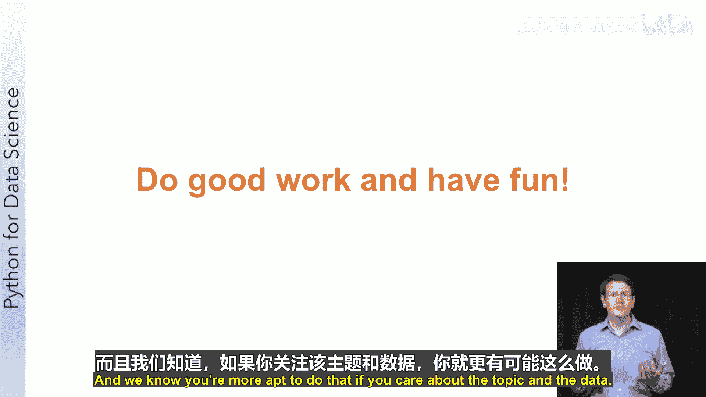

# 028：最终项目与高级示例

## 概述
在本节课中，我们将介绍课程的最终项目，并预览两个高级数据分析示例。最终项目要求你综合运用所学知识，独立完成一个完整的数据分析流程。此外，我们还将了解两个由专家和学生开发的示例笔记本，它们展示了如何将Python数据科学工具应用于天体物理学和生物信息学领域。

## 最终项目概览
首先，祝贺你在课程中取得的成就。你已经学习了大量关于数据分析的知识。

接下来，我们将把所有学习内容整合到一个最终项目中。我们为这个项目预留了充足的时间，希望你能够创作出令自己自豪的作品，并向朋友和家人展示你在完成本课程后所具备的能力。

还记得课程开始时展示的这张幻灯片吗？这是我们为你设定的课程目标。到课程结束时，你应该能够：找到有用的数据集、围绕数据提出研究问题、执行基本的数据分析以帮助回答研究问题，并展示你的发现。

在这个最终项目中，你将完整地实践这一流程。具体来说，你需要从零开始创建一个Jupyter笔记本，并对你选择的数据集进行数据分析。

接下来我将从宏观层面概述这个项目，但在开始之前，请务必仔细阅读项目描述和评分标准。

## 项目第一阶段：数据与问题
本周，你需要找到一个自己感兴趣的数据集。我们将在后续的阅读材料中提供一个包含有价值数据的网站列表，但你可以自由选择任何数据。如果你有与个人爱好或工作相关的公开数据，也可以使用。

以下是项目第一阶段的主要步骤：
1.  **探索数据**：你需要在Jupyter笔记本中探索数据，了解其内容。这个过程通常也涉及数据清洗。
2.  **提出研究问题**：在探索过程中，你应该思考哪些问题是可以通过数据回答的。你需要确定一个具体的研究问题：你想知道什么，而数据可能帮助你回答什么？

到本周结束时，你应该准备好用于下周分析的数据集和研究问题。

## 项目第二阶段：分析与呈现
在第十周，你将基于选定的数据继续工作。虽然探索性数据分析永远不会停止，但我们将主要专注于运用已学的建模方法进行深入分析。

以下是项目第二阶段的主要步骤：
1.  **数据处理**：根据数据的格式，你可能需要进行数据清洗或合并。
2.  **应用技术**：计划使用你在课程后期学到的机器学习和文本分析技术。
3.  **多角度审视**：从多个角度审视数据以构建答案。检查数据是否合理，如果适用，你执行了哪些检查来验证数据的准确性？
4.  **数据可视化**：通过可视化更好地理解数据。
5.  **批判性思考**：当你开始获得答案的洞察时，要保持怀疑态度。一个对你的结果持批评态度的人会提出什么问题？如果可能，尝试回答这些批评性问题，或者坦诚地承认你的结果可能因为基于某些假设而存在局限性。
6.  **整理与呈现**：当你对结果感到满意，并理解并记录了其局限性或支持性发现后，你将整理一份演示文稿，供其他学习者审阅并提供反馈。我们会提供一个幻灯片模板供你整理发现。你的责任是使用你的分析来支持结论，并以清晰简洁的方式传达你的发现。

我鼓励你让朋友或家人对你的演示文稿提供初步反馈。对你来说清晰的内容，对他人未必如此。

一旦你对演示文稿和笔记本感到满意，就可以提交进行同行评审。

## 关于同行评审
说到同行评审，我需要快速提醒你认真对待同行评审的重要性。就像在第六周一样，你需要保持批判性但公平。

我通常发现，人们在第一次进行同行评审时，往往会比必要的更苛刻。因此，如果你需要权衡，倾向于宽松一些。这并不意味着给一个糟糕的项目打高分，而是意味着，如果你在“良好”和“优秀”评级之间犹豫，可以倾向于给出更高的分数。

由于这个项目是开放式的，其他学习者选择的主题可能与你不同。例如，你可能是一位热心的环保主义者，而你发现自己正在审阅一个试图根据地理调查预测北极下一个石油钻探地点的笔记本。你可能不喜欢作者选择的主题，但你的工作不是评判他们的主题选择。你的工作是评判他们的工作。他们是否很好地分析了钻探地点？他们的预测是否准确？他们的方法是否恰当？例如，他们是否通过分离训练集和测试集来使用公认的机器学习方法？

换句话说，尽你所能客观地评审这项工作。

## 项目寄语
这个项目是开放式的，我们这样设计的部分原因是希望你能完全投入到你的数据中，并且我们知道，如果你关心主题和数据，你更有可能做到这一点。

因此，请进行一次仔细而有意义的分析，同时也试着享受这个过程。我们迫不及待想看到你的创作。

## 高级示例笔记本
本周，除了项目之外，我们还想为你提供一些示例笔记本，这些笔记本展示了如何将各种Python数据科学库应用于现实生活中的科学应用。

### 示例一：普朗克卫星数据模拟
一个关于天体物理学的应用是由我们的课程助理Andrea Zonka博士开发的。Andrea拥有米兰大学的天体物理学博士学位，现在在圣地亚哥超级计算机中心担任高级数据科学家和高性能计算专家。他还作为软件技能培训的一部分教授计算数据科学的实践课程。软件技能培训是一个非营利性基金会，为早期职业科学家教授计算技能，这对你来说可能是一个很好的资源。

你可以在week9目录下找到Andrea开发的这个笔记本，文件名为`Plan satellite data simulation using pandas`。这个示例的灵感来自Andrea在圣地亚哥超级计算机中心的一个项目，在该项目中，一个科学家合作小组分析了宇宙微波背景的卫星图像，以研究宇宙的起源。

该笔记本使用了本课程中你熟悉的Python库，但也包含了宇宙学领域的特定参考文献。这是数据科学中的典型情况，即特定领域的技能与数据科学技能相结合。

我们知道你没有天体物理学博士学位，但请不要气馁，因为该笔记本是自解释的，并且是为你们设计的。未来，你很可能会作为一个数据科学家加入一个跨学科团队。因此，这是一个绝佳的机会，可以开始磨练你的技能：理解一个领域问题，并尝试如何将数据科学方法和技术应用于它。

该示例有三个不同的部分，使用了pandas、numpy和matplotlib的高级功能：
1.  **第一部分**：我们将读取由普朗克卫星创建的地图，并探索一种名为HDF5的科学数据格式。
2.  **第二部分**：笔记本将使用NumPy来模拟普朗克卫星在一年观测期间如何扫描天空，并绘制不同参考系下的扫描环。
3.  **第三部分**：笔记本将使用第二部分创建的扫描坐标来模拟对第一部分中使用的地图的观测。

希望你享受阅读这个高级笔记本的过程，并庆祝你在过去九周里取得的巨大进步。

### 示例二：蛋白质数据库分析
本周的另一个示例笔记本名为“蛋白质数据库分析”。该笔记本由David Dorner开发，他是加州大学圣地亚哥分校数据科学与工程高级研究硕士项目的顶尖学生之一。

虽然这个笔记本的格式与你的最终项目不同，也没有完全包含我们概述的所有步骤，但它包含了优秀最终项目的许多组成部分。具体来说，这个笔记本提供了一个通过API使用结构化科学数据并对其进行可视化的绝佳示例。

PDB是一个大型的半策划、众包蛋白质结构数据存储库。该笔记本使用PDB的RESTful网络服务来访问PDB中可用的数据，并使用Bouquet库来可视化数据。尽管你们大多数人不是生物学家，但我们希望你能探索这个笔记本，寻找可能用于自己项目的想法。

## 总结
本节课中，我们一起学习了最终项目的完整流程，从选择数据集、提出研究问题，到进行深入分析、批判性思考和最终呈现。我们还预览了两个高级示例，展示了数据科学在跨学科领域（天体物理学和生物信息学）的强大应用。请记住，最终项目是你展示所学技能的机会，选择一个你真正感兴趣的主题，享受探索和创造的过程。