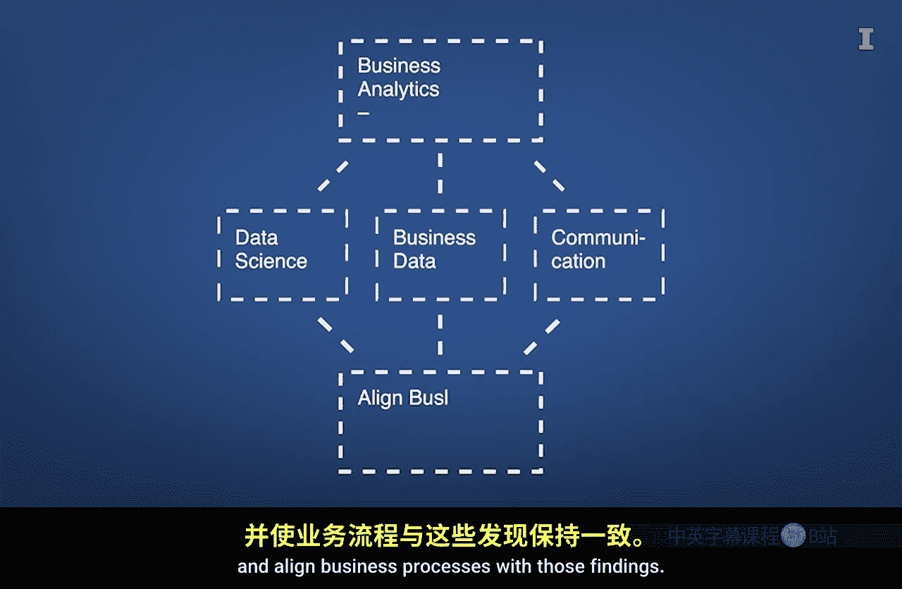
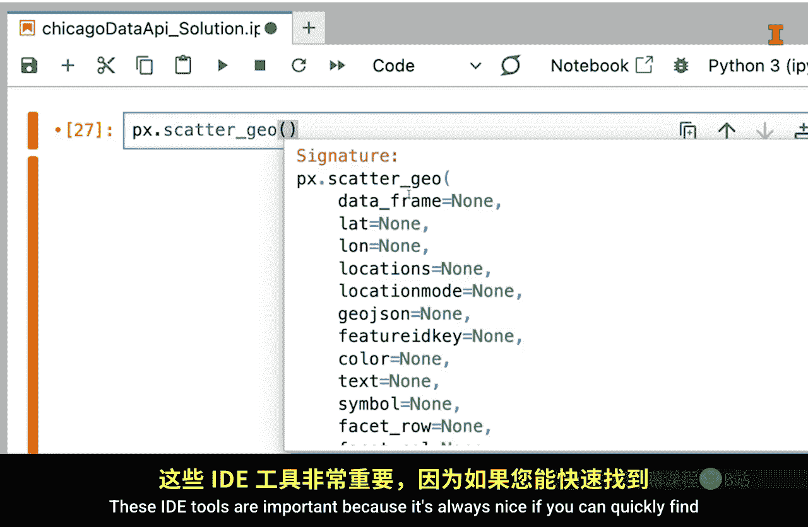
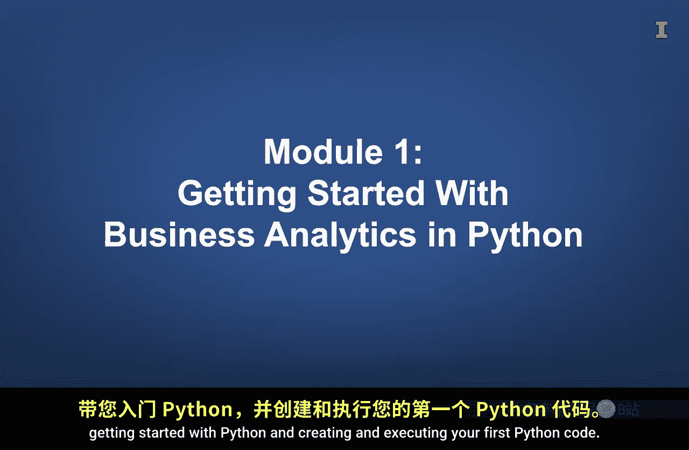
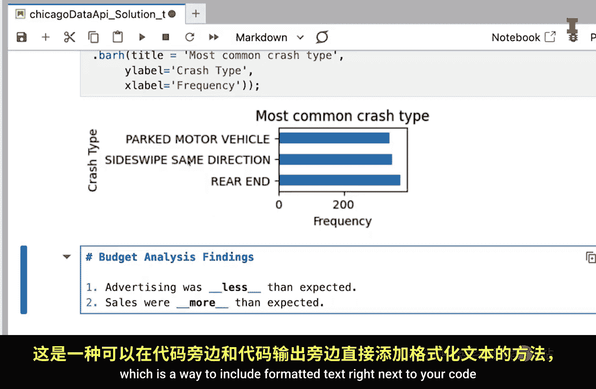
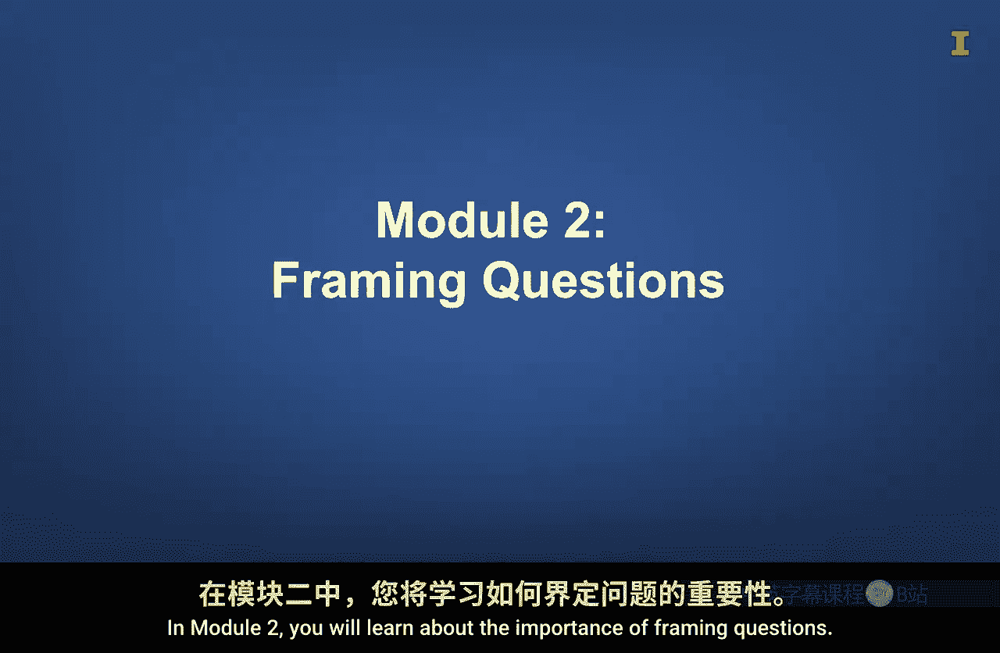
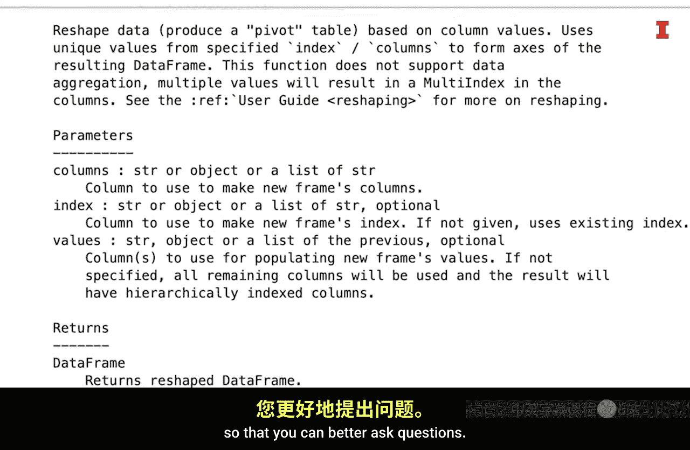
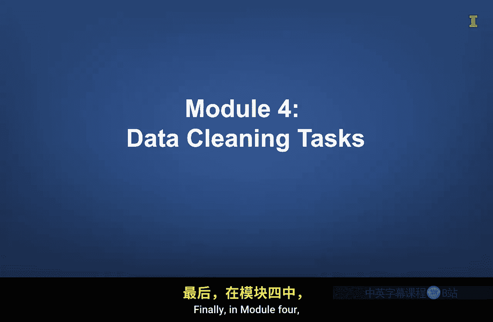
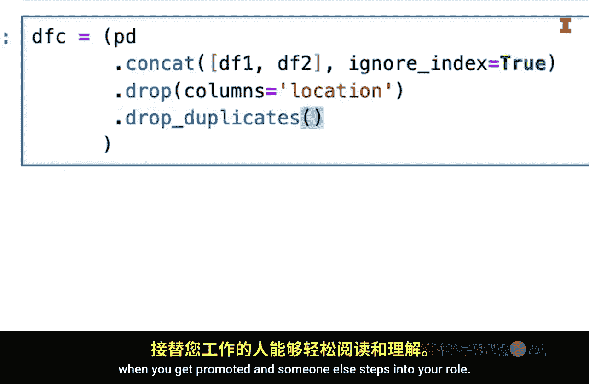

#  001：课程介绍 🎯

在本节课中，我们将要学习商业分析专项课程的第一部分，了解课程的整体结构、核心概念以及你将掌握的关键技能。我们将从商业分析的定义开始，逐步介绍Python编程、数据分析工具以及如何利用AI辅助学习，为你后续的学习打下坚实基础。

## 课程概述

我是Ron Geyman。正如布莱斯峡谷这些令人惊叹的岩层揭示了漫长而复杂的历史，在本课程中，我们将探索数据的各个层面，以揭示有价值的商业洞见。

你将学习商业分析的概念。在本课程中，**商业分析是将数据科学应用于商业环境的过程**。重要的是，它还包括与组织内其他人沟通发现结果，并使业务流程与这些发现保持一致的能力。

## 实践是最好的学习方式

让你理解商业分析的最佳方式之一是开始分析商业数据。因此，在本课程中，你将学习Python，这是一种功能强大的编程语言，可用于执行许多数据分析任务。

你不仅会学习Python，还会获得一些使用它的实践机会。学习编程语言可能是一个挑战，对我而言也是如此。但不必担心，除了让你练习使用Python，你还会学习到帮助你创建代码的工具。

## 核心工具：Jupyter Lab

主要工具是Jupyter Lab，这是一个用于开发脚本的集成开发环境（IDE）。需要知道的一个重要事实是，开发者并非记住他们创建的所有代码。相反，他们知道如何使用集成在IDE中的工具来查找和自动补全代码。

这些IDE工具很重要，因为如果你能快速找到所需内容而无需切换环境，那总是很好的。

## 学会搜索与利用AI

然而，你应该习惯一个事实：你将需要进行大量搜索。Python是开源的，这意味着许多人创建了可以免费使用的代码。所有这些代码无法放入一个简单的用户手册中，因此请准备好使用互联网和未嵌入你所用IDE的AI工具进行搜索。

说到AI，你应该学会使用AI来帮助你创建数据分析代码，这将为你节省大量时间。因此，在整个课程中，我们将探索AI如何帮助你。

尽管如此，学习使用Python进行分析的基础原理对你仍然很有价值，这样你才能为AI创建有效的提示、评估AI的输出，并创建那些难以用语言描述的东西。

## 课程模块结构

本课程分为四个模块，每个模块包含多节课。

### 模块一：入门基础

在模块一中，我们将向你介绍商业分析、Python入门，以及创建和执行你的第一个Python代码。

你还将学习Markdown，这是一种将格式化文本直接包含在代码旁边和代码输出旁边的方法，这样你就不必将文本输出复制粘贴到文字处理文档或演示文稿软件中。

### 模块二：问题框架与Python基础

在模块二中，你将学习构建问题框架的重要性。这不仅从商业角度很重要，从学习如何使用Python的角度也很重要。

虽然你不需要像计算机科学学生那样在理论上了解相同的编程概念，但理解一些基本概念（如对象）将有助于你更好地提出问题。

我们还将向你介绍Python中的一些基本数据对象。

### 模块三：数据价值与探索

在模块三中，你将探索是什么让数据变得有价值。然后，你将获得使用Python探索数据集以确定其数据是否有价值的经验。

这部分探索将包括学习如何使用Python创建可视化图表。当你开始操作和分析数据时，探索数据集的能力将是无价的。

### 模块四：数据清洗与代码整理

最后，在模块四中，你将学习如何执行常见的数据清洗任务，例如更改列名、重新排列和删除数据集中的列、处理缺失值、重塑数据集以及合并数据集。

我们还将演示如何清理你的代码，以便在你晋升或其他人接替你的角色时，他人能够轻松阅读。

## 总结与展望

以上就是四个模块的概述。由于这是使用Python的商业分析专项课程系列中的第一门课，希望本课程能为你打下坚实的基础，让你能够在商业环境中欣赏并执行数据分析任务，而不会感到过于吃力。

未来的课程将向你介绍数据可视化的更多细节、高级分析算法，以及将商业分析应用于市场营销、会计和其他商业领域。

正如布莱斯峡谷激发敬畏和理解其奇迹的渴望，我希望这门课程能点燃你对数据分析的热情。如果运用得当，这些技能可以改变企业。我的目标是，在本课程结束时，你将装备齐全并充满热情地使用数据来改进你的业务并做出自己的发现。