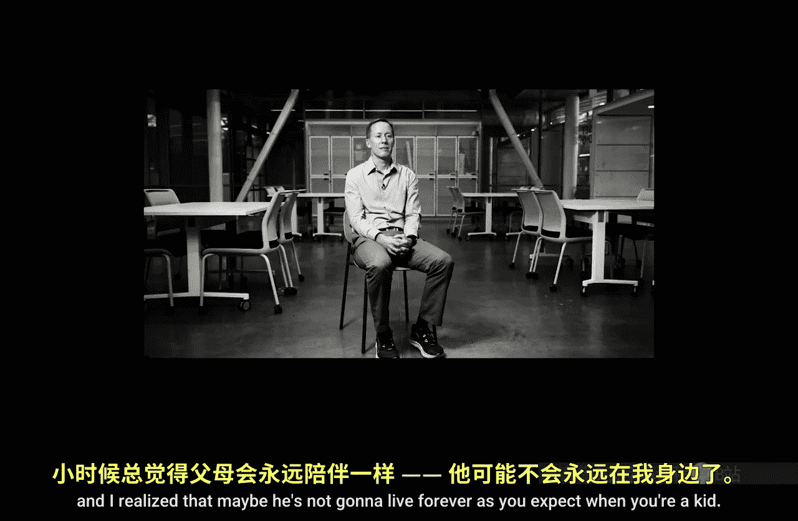

#  002：遇见罗恩·盖蒙教授

在本节课中，我们将跟随罗恩·盖蒙教授的分享，了解他对数据分析的见解、个人经历以及他在伊利诺伊大学的教学理念。这将帮助我们打破对数据分析师的刻板印象，并理解数据分析中蕴含的创造性与价值。

---

关于数据分析，人们普遍存在一种误解。有人认为数据分析师是声音尖细、缺乏热情、只喜欢整天埋头处理数字的人。但这完全不是事实。

我在伊利诺伊大学教授会计和数据分析课程。年轻时，我曾梦想成为一名NBA篮球运动员。但我知道自己必须选择另一条道路。

我一生中大部分时间都在从事教学工作。我的父亲热爱教学，并且非常擅长让教学变得生动有趣。我深受这种理念的影响：将一个复杂的概念变得易于他人理解，实现知识的传递。成长过程中，我一直希望成为像他那样的人——尽管他没打过NBA，但他总能享受生活的乐趣。

后来，我不得不做出一个非常艰难的职业决定。当时我父亲中风了，我住在佐治亚州，而他住在犹他州。我意识到，正如你小时候所认为的那样，父母可能不会永远陪伴我们。那时，我获得了一个加入一家商业智能公司的机会。他们最终向我发出邀请：“嘿，你愿意加入我们担任首席数据科学家吗？”

这是一个非常艰难的决定，但关键在于，这份工作地点离我父母居住的地方很近。我最终做出了这个决定，并为此感到非常感激，原因有很多。首先，因为在我们搬回去之后，我父亲只活了七个月。其次，我也很感激我们搬了回去，因为我有机会从事研究中最好玩的部分——分析数据。这段经历对我来说是无价的。

如今，我重返学术界，拥有了绝佳的机会。我能够与学生分享这些知识，帮助他们更好地服务于自己的公司。伊利诺伊大学非常出色。对我来说，能成为伊利诺伊大学的一员一直是一个梦想。我可以将自己的大量经验带入课堂，帮助这些商科学生学习如何分析数据，并让这些知识变得易于他们掌握。

在数据分析中，我最喜欢的事情之一就是能够从数据中提炼出一个故事。数据分析中有很大的创意空间。我认为它在很多方面是一门艺术，因为你拥有各种工具、算法、可视化软件，你可以创造出对人们具有巨大价值且非常优美的东西。利用数据分析创建的一些可视化作品确实非常漂亮。当然，我可能有偏爱，因为我热爱数据，我能看到许多可能大多数人看不到的应用场景。但你可以呈现一个具有“眼外伤式冲击力”的可视化效果——一个结论直接冲击你的视觉，这可以是一件非常酷且富有成就感的事情。

在在线学位项目中工作，我最喜欢的一点就是能够结识来自世界各地的人。仅仅听人们交谈就非常酷，我真的很享受在线学位项目工作带来的这个机会。

来到伊利诺伊大学工作是一种怎样的体验？在驱车前往这里的路上，穿过田野，你会突然发现自己置身于一个知识与技能的绿洲之中。我们是遍布全球的大家庭的一部分，这是一个非常棒的大家庭。我们拥有众多才华横溢、技能出众的人，他们非常乐于彼此分享，并在前进的道路上互相帮助。因此，来到这里令人兴奋，因为你知道离开时一定会学到新东西。至少，你会更了解这里的优秀人才，或者加深与他们的现有关系。

---

本节课中，我们一起学习了罗恩·盖蒙教授对数据分析的深刻理解。我们了解到数据分析远非枯燥的数字处理，而是一门融合了技术、艺术与讲故事的创造性学科。教授的个人经历也告诉我们，职业选择与家庭价值可以找到平衡，而实践经验对于学术教学具有不可估量的价值。最后，我们感受到了伊利诺伊大学作为一个全球性学术社区的活力与包容性。