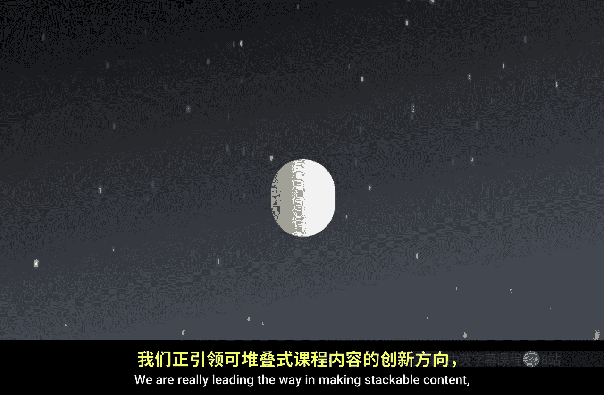

#  003：盖斯社区的影响 🚀

在本节课中，我们将了解伊利诺伊大学盖斯商学院社区的影响力、其创新教育模式以及它为全球学习者创造的独特价值。

---

加入盖斯商学院社区正逢其时。我们的创新方式其他商学院无法比拟。

我们在国内和国际层面因这些成就而获得认可。我们的学生和校友是盖斯商学院卓越教育的活生生的证明。

我坚信我们的盖斯品牌及其产生的影响力从未如此强大。

我们在同行中确立了真正的领导地位。我们在在线研究生教育领域成就斐然。

我们正在重新思考商业教育的交付方式。我们正在尽可能打破财务和地理上的障碍。

我们正在触及成千上万原本可能没有机会或能力获得研究生学位、证书或学习新技能的学习者。

通过扩大教育机会，我们创造了前所未有的多样性，体现在经验、文化、人口统计、性别、种族和民族各个方面。我们的校友网络正以比其他任何项目都更快、更广的速度增长，校友基础遍布全球和各行各业。

最令人兴奋的发展之一是我们扩展教育内容的方式。并非每个人都想要或需要一个完整的学位。

或者他们可能需要，但不确定是否已准备好全身心投入。我们正引领“可叠加内容”的发展方向，这为来自不同背景、经验水平和拥有不同目标的学习者创造了大量机会。你可以只修一门课，然后将其叠加成一个专项课程，再进一步叠加成一个完整的研究生学位，而无需重复已修读的课程。

这是我们承诺的一部分：让所有渴望并致力于追求教育的人都能获得并实现教育目标。这正是盖斯商学院的核心所在，也是我以之为荣并称之为家的原因。我希望你能在这里看到自己的潜力，并考虑加入我们的学习者、学者和领导者社区。

---

本节课中，我们一起学习了盖斯商学院社区如何通过创新教育模式、打破传统壁垒以及提供可叠加的学习路径，为全球多样化的学习者创造价值并扩大影响力。其核心在于让优质商业教育变得更具可及性和可实现性。