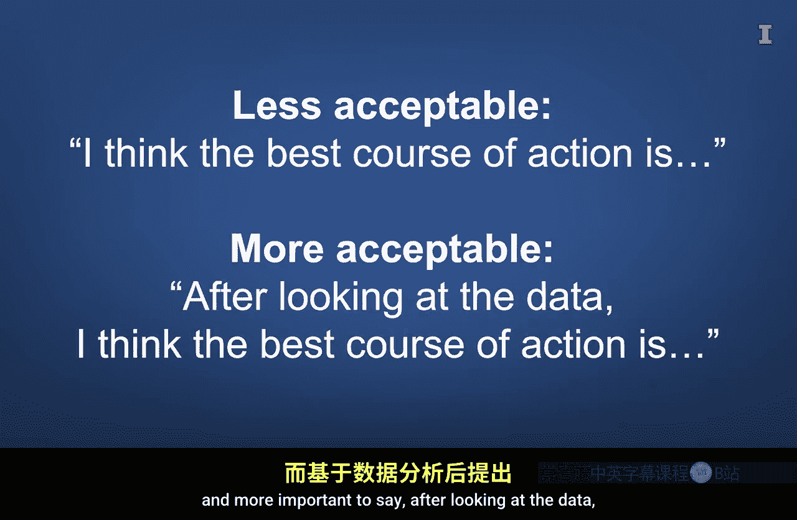

#  005：商业分析概览 🧭

在本节课中，我们将要学习商业分析的基本概念，了解它如何通过数据驱动决策来增强我们的直觉判断，并探索其在现代商业环境中的广泛应用。

---

我身后的风景很美，稍后我会再回到这个话题。但首先，我想分享一个与商业分析相关的故事。

《点球成金》是迈克尔·刘易斯的一本书，它对我如何看待商业环境中的数据驱动决策产生了巨大影响。即使在人工智能时代，这个故事仍然是一个相关范例，展示了我们如何用数据驱动决策来增强我们的直觉。正如奥克兰运动家队利用数据寻找被低估的球员，从而能够与更富有的球队竞争一样，我们也可以使用商业分析来发现商业环境中隐藏的机会，识别被低估的增长领域。这就像在布莱斯峡谷中发现独特的岩层。

---

上一节我们提到了《点球成金》的故事，本节中我们来看看球队内部面临的一个核心冲突。球队内部挣扎的一个焦点是，应该在多大程度上依赖球探的直觉，而不是数据分析的结果。电影中有一些相当幽默的部分，球探们在讨论球员是否看起来像运动员、球员击球时球的声音如何，甚至球员的女朋友长什么样。可以推测，球探们试图处理这些无形因素，以识别那些即使不符合优秀棒球运动员刻板印象也能表现出色的球员。球队总经理比利·比恩很难说服球探们，最重要的事情是球员上垒的频率。

这个故事蕴含的教训可以应用于许多商业环境。如果你没有读过这本书或看过这部电影，我推荐你去看，这是一种有趣的方式，可以了解在一个依赖直觉的文化中为实证探究留出空间的重要性。

---

现在，直觉并非全是坏的，人脑和直觉的能力是惊人的。例如，我们能在片刻之间，结合一个人的说话方式、外貌、谈吐、气味和动作等信息，然后判断这个人是否适合公司的文化，或者至少我们认为是这样。通常我们可能是正确的。然而，我们的能力是有限的，并且在某些情况下容易受到弱点的影响。如果使用得当，数据分析可以增强我们的心智能力，帮助我们认识到仅依赖直觉时产生的思维弱点。

---

上一节我们讨论了直觉与数据的平衡，本节中我们来正式定义商业分析。应用数据科学、商业数据、沟通，并使业务流程与分析结果保持一致，这被称为**商业分析**。

商业分析的目标并不总是消除所有直觉和判断，而是考虑如何利用数据为战术和战略性的商业决策提供信息。商业分析可以帮助确认或否定一个直觉，它也可以帮助我们发现那些不付出巨大努力就无法识别重要模式的场景。它还可以引导我们思考未曾考虑过的问题，甚至帮助我们制定新的商业策略。

---

那么，商业分析通常是如何运作的呢？一般来说，商业分析利用历史数据帮助我们回答以下问题：
*   **发生了什么？**
*   **为什么会发生？**
*   **现在正在发生什么？**
*   **如果不加干预，接下来会发生什么？**
*   **应该采取什么干预措施才能实现最理想的结果？**

---

自《点球成金》出版以来，体育分析几乎在每项运动中都已变得非常重要。更广泛地说，数据分析似乎影响着每一个企业和生活的方方面面。事实上，像ChatGPT和Gemini这样的人工智能工具正是以这种方式创建的。

从与我们的锻炼、睡眠和营养相关的健康分析，到分析我们的祖先来自哪里以及我们观看的节目，商业分析都扮演着重要角色。

因为越来越多的公司采用数据驱动决策工具，所以只说“我认为最佳行动方案是……”变得越来越不可接受，而更重要的是说“在查看数据后，我认为最佳行动方案是……”。

作为一名商业专业人士，人们也越来越期望你知道如何分析数据，从而为决策情境带来洞见。

---

本节课中我们一起学习了商业分析的核心概念。我们通过《点球成金》的故事，理解了数据如何补充甚至挑战传统直觉。我们明确了商业分析的定义是**应用数据科学、商业数据、沟通，并使业务流程与分析结果保持一致**，其核心目标是回答关于过去、现在和未来的关键问题。最后，我们看到了数据分析在现代商业和社会中的普遍性与重要性，以及掌握相关技能对商业人士的必要性。