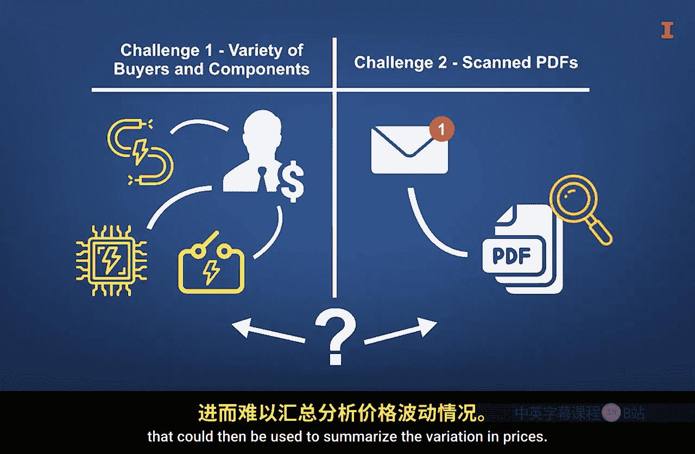

#  006：商业分析实例 🏔️

在本节课中，我们将回顾商业分析如何影响各类公司的具体实例。这些案例将阐明你如何在当前职责中应用分析技术，从而改进业务流程。

## 太阳能公司的成本控制案例

上一节我们提到了商业分析的广泛应用，本节中我们来看看一个具体的小型企业案例。一家快速发展的太阳能公司怀疑自己在采购电气元件时经常被多收费。然而，两个因素使他们难以验证这一情况。

首先，公司有多名员工采购多种电气元件，这使得采购人员难以在脑海中追踪所有成本。其次，尽管发票都发送到同一个电子邮箱，但文件是扫描的PDF格式，本质上是插入PDF文件的照片。因此，将图像转换为可用于汇总价格变化的表格数据并不直接。

**解决方案**：
他们利用编程语言和计算机调度工具，建立了一个自动化脚本。该脚本定期访问接收发票的邮箱，下载PDF文件，使用光学字符识别技术将文本图像转换为表格数据，然后将所有数据合并到一个综合的价值文件中。

**成果**：
随后，他们利用该文件快速识别出被多收费的情况并追回了款项。最终追回的金额约为建立该脚本所花费用的四倍。这个例子展示了小公司如何利用技术来收集数据，甚至无需依赖复杂的数据处理就能改善业务。

## 市场营销中的数据分析案例

现在，我们将聆听乌纳蒂南甘博士的分享，了解数据分析在市场营销中的应用实例。在市场营销领域，分析已成为游戏规则的改变者，也是企业保持竞争力的必要条件。我将分享来自零售业和数字平台（如社交媒体）的两个例子，这些领域我拥有超过十年的行业经验和学术研究专长。

### 零售业的促销优化

想象一家零售公司试图优化其促销活动，以提升销售额，同时最大限度地减少浪费的广告支出。历史上，企业会依赖通用促销或单纯凭直觉来定位客户。现在，通过使用分析工具，公司可以更深入地研究客户的购买行为。

以下是利用数据分析可以实现的改进：

*   **分析销售点数据与忠诚度计划**：结合来自零售商移动应用程序的忠诚度计划数据，可以揭示新趋势，例如哪些产品经常被一起购买，哪些促销活动最受特定客户群体欢迎等。
*   **设计定向营销活动**：利用此类数据，公司可以设计定向营销活动，个性化他们的优惠，甚至优化库存以减少积压或缺货的情况。
*   **提升消费与忠诚度**：在我与一家在美国拥有超过4000家门店的大型消费电子零售商的一些研究中，我已经证明了零售应用程序分析在增加消费者支出和忠诚度方面的强大作用。

### 社交媒体平台的分析应用

让我们切换到另一个例子，在社交媒体网站等平台上，分析工具使企业能够衡量参与度指标，如点击率、分享率，以及来自客户评论的情感分析。这超越了枯燥的数字，帮助营销人员了解什么类型的内容在每个平台上效果最好，以及他们的受众在什么时间最活跃。

以下是社交媒体分析带来的策略转变：

*   **内容策略优化**：例如，一家户外装备公司可能通过社交聆听和情感分析发现，展示冒险故事的帖子比传统的产品广告能带来更高的客户参与度。
*   **强化品牌连接**：基于这一洞察，他们可以调整策略，更多地专注于讲故事，从而建立更强的品牌联系，并获得更高的客户转化率。他们甚至可以整合生成式AI工具。

这两个例子都强调了营销分析如何将数据转化为可操作的见解，使公司能够做出更智能、更快速、更具影响力的决策。创造性的数据分析方法可以直接改善客户关系并推动增长。

## 体育产业中的创新分析

体育是一门大生意，因此让我们考虑来自该领域的分析案例。棒球是一项非常适合进行统计分析的运动，因为每个比赛回合都是一个离散的事件序列，开始方式几乎相同。相比之下，篮球则是一种流动性强得多的比赛，回合之间相互交融，球员在一个回合开始时可能处于许多不同的位置。

因此，一些有进取心的公司开发了视频软件，每秒拍摄25张图片，并追踪球员和球的坐标。这使得可以考虑新的指标来识别被低估的球员，例如那些在防守者非常接近时仍能得分的球员。这也使得分析师能够使用复杂的统计分析来评估球员的防守价值。可穿戴技术还帮助球队监控球员，确保他们在关键时刻得到休息并做好准备。这些例子突显了创新性地使用数据来提升表现。

## 高频交易中的数据分析

这个例子说明了数据收集和分析的创造性应用如何改进业务。考虑快节奏的股票交易世界。为了竞争，交易员使用自动化系统来跟踪新闻和社交媒体，解释信息并在几分之一秒内执行交易，速度远超人类。

**核心机制**：
你可以假设设置了一个机器人来跟踪新闻源或社交媒体帖子，解释这些新闻片段，然后快速进行交易。实际上，机器人的速度比人类快得多，比如在新闻发布后三秒内就能完成。

这个例子阐释了利用数据收集和分析来改进业务。

## 总结：拥抱技术，聚焦价值

我认为，像数据分析工具、视频捕捉软件技术和人工智能这样的技术进步是值得热爱而非恐惧的。有些人担心机器正在接管许多工作，我理解他们的出发点。然而，这些工作通常相当重复和枯燥。因此，许多平凡的任务可以委托给机器，以便人类能够从事更有趣的事情。

在本节课中，我们一起学习了从太阳能、市场营销、体育到金融交易等多个行业中商业分析的具体应用实例。这些案例共同表明，无论是通过自动化脚本处理发票，还是利用复杂模型分析球员表现，创造性地收集和分析数据都能直接带来流程优化、成本节约和业绩提升。关键在于将技术视为解放人力、聚焦高价值创造性工作的工具。