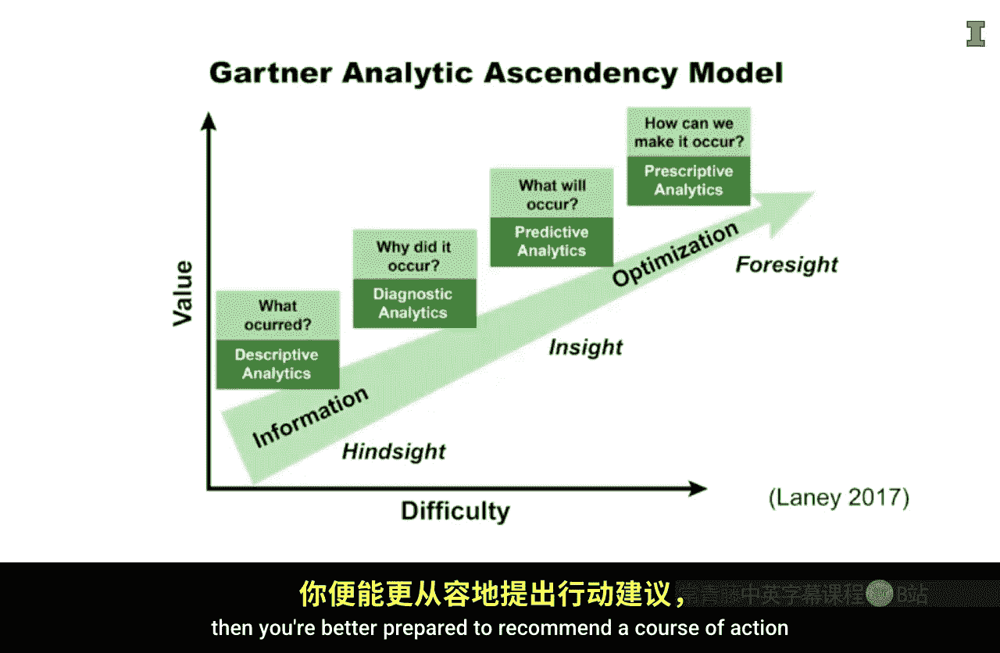

商业分析专项课程：P7：数据驱动决策的事实框架

在本节课中，我们将学习一个用于进行数据驱动决策的简单框架——FACT框架。这个框架将指导我们如何系统地利用数据来解决问题并创造商业价值。

在深入探讨这个框架之前，我们先听听一位业内人士的看法。我采访了布法罗比尔队（一支NFL美式橄榄球队）的分析与应用开发总监路易斯·吉莫。在采访接近尾声时，我询问他对于使用数据分析进行决策有何建议。他是这样说的：

> 真正遵循一个结构化的流程来得出结论至关重要。始终遵循一个非常相似的方法来分解问题，有条不紊地进行，这对于准确性非常重要。这个过程带来准确性，准确性带来信任，而对数据和结果的信任将继续推动分析向前发展。无论是橄榄球、医疗信息还是零售业，如果你提供了不准确的结果，那么数据将失去信任，分析工作将难以持续。

正如路易斯所言，流程至关重要。现在，让我们来详细了解一下FACT框架。

**第一步：界定问题**

框架的第一步是界定问题。你需要识别一个需要解决的问题。思考如何以鼓励人们使用数据来寻找根本原因的方式构建问题，并且这种方式应能带来可付诸行动的洞见。在某些时候，你还需要考虑如何将问题构建成可以通过特定分析来解答的形式。

**第二步：收集数据**

接下来是收集数据。财务数据通常很重要，因为它有助于确定某事对利润的影响。然而，其他内部可用的非财务数据以及外部数据也应考虑在内。你甚至可能需要收集自己的数据。

一旦确定了数据，你需要找到提取、转换和加载数据的方法，这个过程通常被称为 **ETL过程**。最后，还需要进行大量的数据整理工作，以便将数据结构化，为你将要执行的计算做好准备。

**第三步：计算结果**

第三步是计算结果。首先，确保你对数据的基本汇总统计有良好的感觉。例如，数据中各个因素的分布情况如何？有多少缺失值？各因素之间的相关性如何？在对数据有了充分了解之后，你就可以开始对数据进行高级分析了。

这些高级算法可以通过揭示数据中的模式来提供洞见。有多种算法可供选择。了解每种算法的优缺点可以帮助你判断何时应该应用它们。你还应该知道如何评估这些算法所创建模型的结果。

**第四步：传达结果**

第四步，也是最后一步，是向他人传达结果。使用你的受众易于理解的技术和沟通方法。努力确保在主旨思想与细节之间取得平衡。细节过多，你会让受众感到困惑并失去他们；细节过少，你的受众可能会过度概括你的结果。

在向受众传达分析结果时，务必观察他们的反应。乐于接受反馈，并承认你分析的局限性。当你敞开心扉接纳其他意见和观点时，你很可能会改进你的分析，并因此获得额外的洞见。几乎总是如此，在你深入挖掘所解决问题的根本原因时，你会发现更多值得探究的新问题。

以上就是FACT框架的全部内容。但我想强调的是，框架的每个部分只有在与其他步骤结合使用时才重要且有用。

**框架各环节的关联性**

上一节我们介绍了FACT框架的四个步骤，本节中我们来看看如果缺失其中任何一步会怎样。

*   **如果未界定问题**：考虑一下，如果你在没有首先界定要回答的问题、或没有任何关于数据如何有用的想法、或不知道将用它进行何种计算的情况下，就开始收集数据，会发生什么？即使信息不像资产负债表上的存货那样有明确的会计价值，但它与存货有相似之处。你拥有的数据越多，你在存储、跟踪、更新、保护和授权访问方面的投入就越大。因此，先有意识地界定问题，然后收集数据来回答该问题是理想的做法。它也可以作为一个指南针，如果你在无关的分析上偏离了方向，它可以作为一个很好的参考点让你回到正轨。

*   **如果未收集数据**：界定问题是一个良好的起点，但如果你对可用数据一无所知，或者不知道能用它做什么，那么你将很难有效地界定问题。此外，人们常常认为复杂的算法可以在任何数据中找到模式，尤其是在数据量很大的情况下。这可能有一定道理，但更多时候，通过收集正确的数据，你能更好地利用时间和资源。因此，收集一组相关的数据非常重要。

*   **如果未进行计算**：虽然收集数据非常重要，但如果不进行计算呢？复杂的算法确实非常有用，因为它们可以识别数据中复杂的模式，而人类可能需要更长的时间才能识别。例如，确定最优票价通常需要考虑许多因素，如一年中的时间、星期几、节假日、天气条件以及宏观经济条件（如油价）等等。人类需要很长时间来评估所有这些因素的组合才能得出最优价格。因此，使用强大的计算很重要，因为它可以更快地得出最优价格。

*   **如果未有效传达结果**：最后，如果你没有有效地向他人传达结果会怎样？即使问题界定得很好，收集了优质的数据集，并进行了强大的计算，以正确的方式向正确的人传达正确的信息以便采取行动，这一点仍然至关重要。未能准确、简洁地传达结果是许多公司未能变得更加数据驱动的一个常见原因。因此，能够有效地向他人讲述数据至关重要。

**从洞见到行动**

FACT框架为将数据转化为改善的业务绩效提供了指导。《信息经济学》的作者道格·莱尼有一个很棒的图表，称为“高德纳分析进阶模型”，它也强调数据分析应侧重于行动。

我喜欢这个模型，因为它强调了如何将洞见转化为预见。识别数据中的关系可以帮助你从描述性分析转向规范性分析。换句话说，历史数据有助于识别关系，然后这些关系可用于预测未来会发生什么。如果预测结果不利或无利可图，那么你就可以更好地建议采取行动方案，以防止无利可图的情况发生。

**总结**

本节课中，我们一起学习了数据驱动决策的FACT框架。它包括界定问题、收集数据、计算结果和传达结果四个关键步骤。请记住，框架中的所有步骤都同等重要，缺一不可。通过系统地应用这个框架，你可以从简单的描述性分析，逐步迈向更具前瞻性的规范性分析，从而更好地利用数据为商业决策服务。