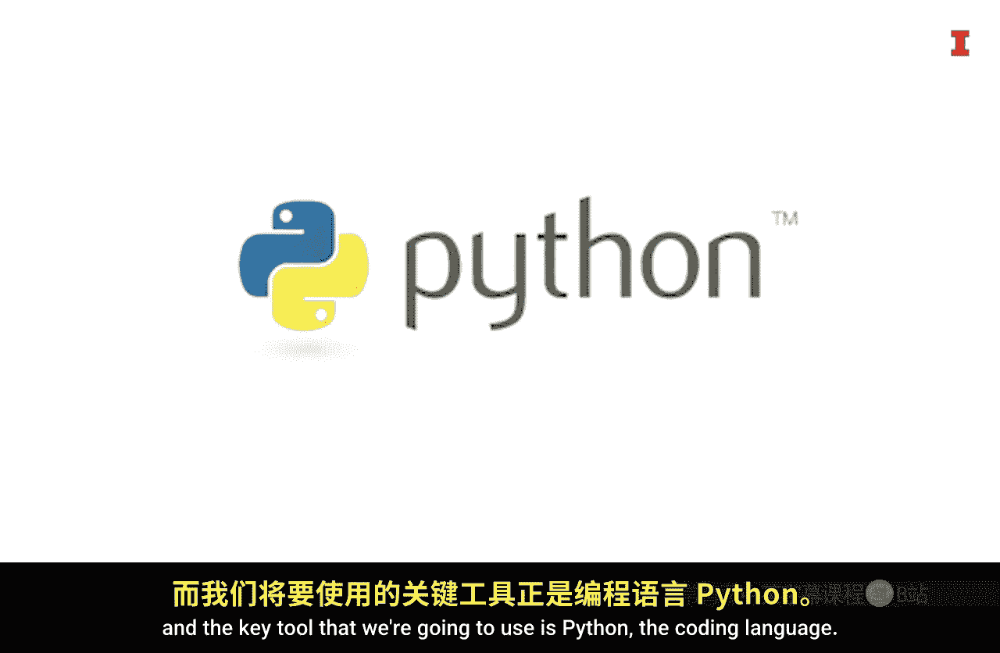

#  008：为什么选择Python进行商业分析

在本节课中，我们将探讨在商业分析领域选择Python编程语言的核心原因。我们将对比Python与低代码工具的区别，并解释Python如何为数据分析提供全面且灵活的支持。

我现在位于布莱斯峡谷纳瓦霍小径上一段非常蜿蜒的路段。你可能会好奇我为什么在这里，以及这与课程有何关联。我希望建立一些对你有帮助的联系。首先，这条蜿蜒的小径让我联想到一条蛇，而我们将要使用的关键工具是Python编程语言。

现在你可能会问，为什么我们使用Python，而不是像Excel、Power BI和Tableau这样的低代码工具？

主要原因是Python允许你执行FACT框架的每一个步骤，而低代码工具通常只允许你执行其中一两个步骤。这就像只能走小径的主要部分，而无法探索小径旁那些少有人走的路径。Python允许你做到后者。

使用Python的另一个好处是，它非常适合与人工智能助手协同工作。像ChatGPT和Gemini这样的工具，在生成可用于商业分析的代码方面提供了巨大的帮助。这就像拥有一位专家向导，可以带你探索这些岩石的上下左右。

因此，我希望你和我一样，对使用Python探索商业数据感到兴奋，就像我对探索布莱斯峡谷的其他小径一样兴奋。

---

本节课中我们一起学习了选择Python进行商业分析的两大核心优势：**全面性**与**AI友好性**。Python能够完整支持数据分析的整个流程，并借助现代AI工具极大地提升开发效率，这使其成为深入探索商业数据的强大工具。