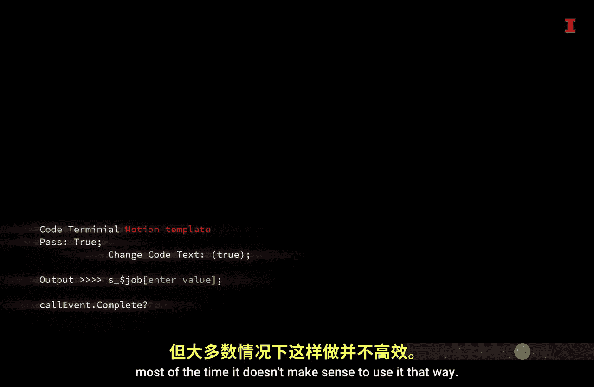

#  009：Python附加工具 🛠️

在本节课中，我们将学习如何在使用Python时，借助一些重要的附加工具来提高效率。我们将了解这些工具的作用，并通过一个生动的类比来理解它们之间的关系。



## 概述

Python本身是一个强大的编程语言，但单独使用它就像只用一把螺丝刀修理汽车，效率不高。为了更高效地编写、阅读和运行代码，我们通常会使用三种主要的附加工具：**计算机**、**编程模块**和**集成开发环境**。

## 核心概念与类比

为了更好地理解这些工具，我们可以将它们与汽车修理店的工作方式进行类比。

### 计算机：执行任务的“机械师”

当你需要修理汽车时，你会把它交给机械师。机械师能够比我们更快地执行特定任务。在我们的语境中，**计算机**就扮演着“机械师”的角色，它负责实际运行我们编写的Python代码。

### 编程模块：特定任务的“工具箱”

机械师拥有各种工具箱，每个工具箱里装着用于完成特定任务的工具。例如：
*   通用工具箱可能装有棘轮扳手和螺丝刀，用于大多数任务。
*   诊断工具箱可能装有多用表和扫描仪，用于检查发动机故障灯。
*   换胎工具箱可能装有千斤顶、支架和扭矩扳手。

**编程模块**就类似于这些工具箱。它们是一组预先写好的函数集合，让我们能更容易地执行特定任务，而无需每次都从头编写代码。就像机械师不会把所有工具都带到车旁一样，我们只根据任务需要**导入**特定的编程模块。

**代码示例：导入模块**
```python
import pandas  # 导入用于数据分析的“工具箱”
import numpy   # 导入用于科学计算的“工具箱”
```

### 集成开发环境：高效工作的“车库”

机械师很可能在一个车库里工作。这个车库能帮他管理工具，墙上有快速参考海报，可以调节灯光，甚至能发动汽车来测试修理是否成功。

**集成开发环境** 就相当于这个“车库”。它为编写Python代码提供了一个高效的环境，通常包含以下功能：
*   **代码提示与补全**：帮助你快速参考语法和函数，无需精确记忆。
*   **语法检查**：实时检查代码错误。
*   **调试与运行**：允许你运行部分代码并查看输出结果。

## 总结

本节课我们一起学习了使用Python的三个关键附加工具。**计算机**是执行代码的基础；**编程模块**是包含特定功能函数的工具箱，需要时导入即可；**集成开发环境** 则提供了一个功能齐全、便于编写和调试代码的工作空间。


理解这三者的区别非常重要。这不仅能让你更清楚地知道Python如何被使用，更重要的是，它能让你明白**你不需要记忆所有的代码**。对于Python新手来说，认识到这一点可以极大地减轻学习压力。在后续的课程和实践中，你将逐步积累使用Python及其附加工具的经验。