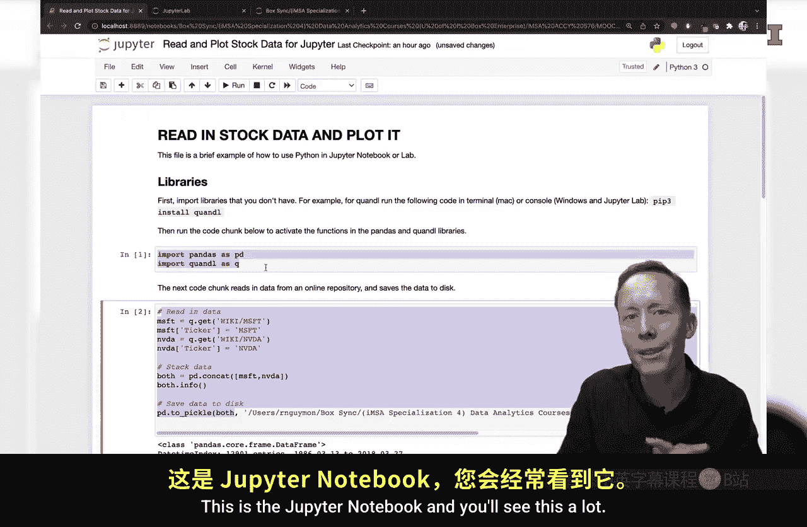
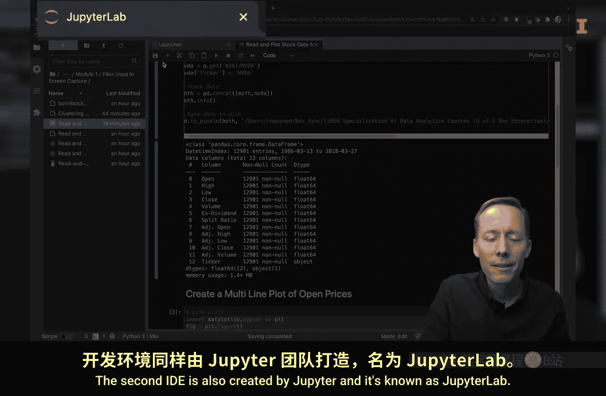
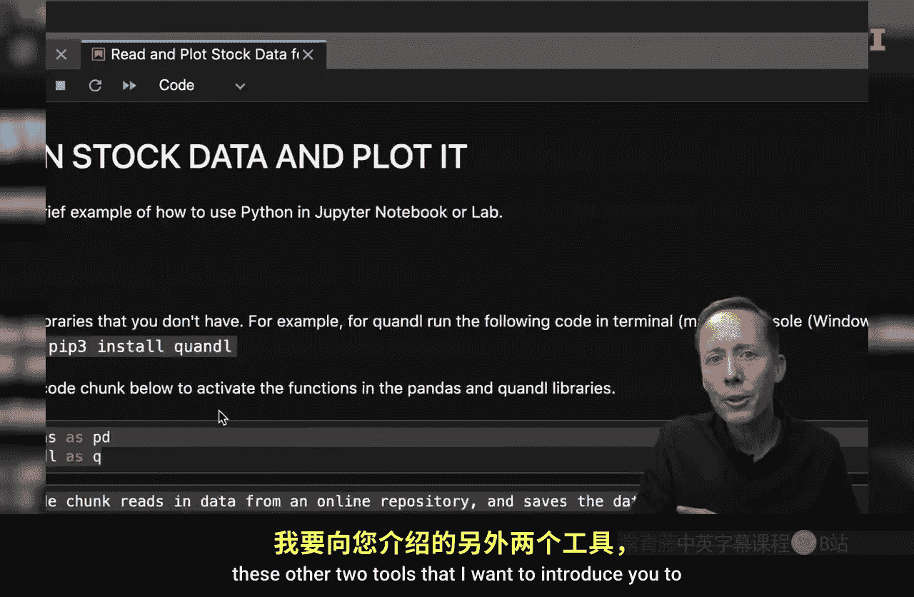
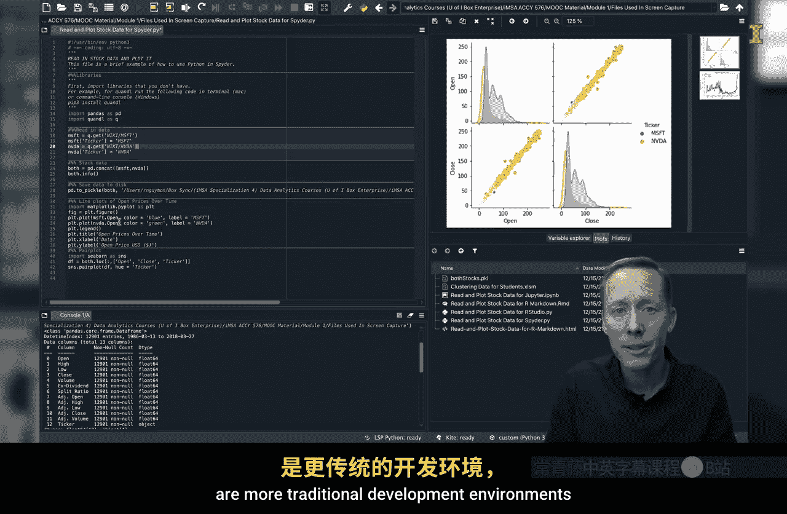
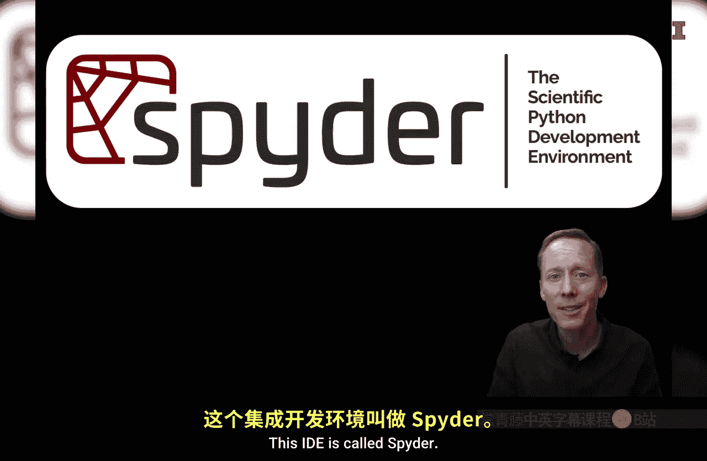
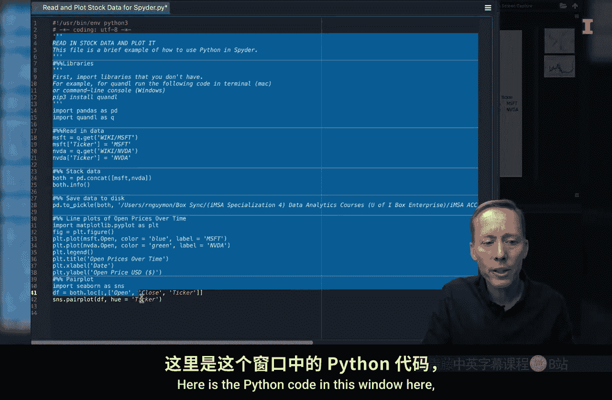
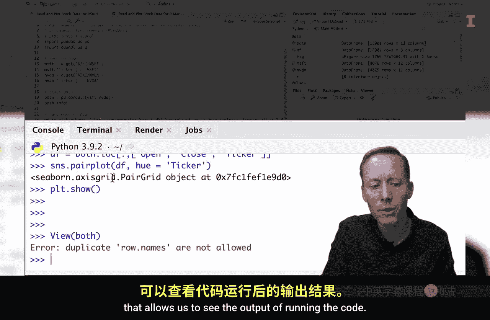

#  010：Python与集成开发环境（IDE） 🐍

在本节课中，我们将学习区分Python代码本身与用于帮助创建Python代码的集成开发环境（IDE）。我们将通过类比Excel中的VBA编辑器来理解IDE的作用，并介绍四种常用的Python IDE。

---

在之前的课程中，我们简要介绍了Visual Basic编辑器。它是一个用于运行Visual Basic for Applications语言的集成开发环境，该语言在Excel中用于创建宏。

屏幕上显示的是Visual Basic编辑器。在这个特定窗口中，是执行K均值聚类的VBA代码和注释。

这个环境非常有用。让我快速演示原因：在这段代码中，如果我想查看其运行过程，可以设置一个断点，然后点击播放按钮。现在，你可以在“本地窗口”中看到我创建的不同变量及其赋值。

如果我再次点击播放按钮，代码将继续执行。如果有任何值被更新，我可以滚动查看。这在我逐步检查代码、确保其按预期运行时非常有帮助。

在Excel中使用Visual Basic编辑器的另一个优点是它有不同的窗口。如果我使用双屏或分屏，我可以逐步执行代码，并同时在Excel工作表中查看数据本身或生成的图表的变化。请注意，当我点击播放按钮时，会进行新的聚类分配。我甚至可以移除这个断点，运行剩余的宏。完成后，可以看到它已经完成了K均值聚类分析，并将每个观测值分配到了一个聚类。

因此，能够在运行代码时看到输出，尤其是在开发代码时，是非常有帮助的。

拥有用于创建、调试和逐步执行代码的软件这一概念非常重要。因为你几乎不可能编写出完全没有错误的代码，也不太可能记住所有代码。因此，拥有工具来提醒我们需要运行什么，并让我们看到正在做什么，是至关重要的。

---

接下来，我们将介绍四种用于Python的IDE。我们将在后续视频中讨论如何安装这些IDE以及它们的优缺点。现在，我只想让你看到不同的环境，以便你能真正区分Python本身和代码。

以下是四种我们将介绍的IDE。前两种IDE由Jupyter开发。

第一种叫做Jupyter Notebook。它是一个基于浏览器的工具。界面看起来很不错，你可以在其中格式化文本，使其易于阅读。然后，你可以拥有其他包含Python代码的代码块或单元格。

这里的第一个单元格实际上只是文本，不是代码。但这有助于我展示代码和代码输出，使其易于阅读。而这里才是Python代码本身。

同样，这里还有更多的Python代码。这组特定的代码读入股票数据并绘制图表。我可以快速向下滚动，查看微软和英伟达股价随时间变化的多线图，以及所谓的配对图。这就是Jupyter Notebook，你会经常看到它，它非常简单易用。

第二种IDE也是由Jupyter创建的，被称为Jupyter Lab。

它同样是一个基于浏览器的工具，看起来与Jupyter Notebook非常相似。虽然这个背景是黑色的，但我们可以将其设置为白色，就像Jupyter Notebook一样。但它集成了更多的工具，在这个环境内部有多个窗口，还有一个文件浏览器。

这是我们希望你也能熟悉的一个环境。它的好处在于，虽然看起来更复杂一些，但随着你对Python经验的增加，你会非常喜欢拥有更多可用的工具。

---

现在我想介绍的另外两种工具是更传统的开发环境，它们类似于Visual Basic编辑器。

这个IDE叫做Spyder。

Python代码显示在这个窗口中。下方有一个控制台，用于查看运行代码的输出。我们可以在旁边看到生成的图表，这里还有文件浏览器。此外，这里还有其他几个工具，用于查看帮助文档。我需要在这里暂停一下，强调在IDE中知道如何寻求帮助至关重要。

这是编程时要知道的关键事项之一。一个关键的秘诀是：你不需要记住所有东西。你确实需要学习并记住很多内容，但知道如何使用内置的帮助功能，我认为是现阶段你能做的最重要的事情。

这就是Spyder集成开发环境。

我要展示的第四个IDE实际上与Spyder非常相似，尽管这个使用了白色主题。这个IDE是RStudio。

对于那些想学习如何同时使用R和Python的人来说，这个IDE很有用。这里是代码窗口，即编辑器，其中包含Python代码。下方有一个控制台窗口，允许我们查看运行代码的输出。我们还有文件浏览器以及图表窗口。我们可以查看图表，还有一个环境窗口，可以查看创建的变量，甚至可以打开它们并像在Excel工作表中一样进行探索。

---

本节课中，我们一起学习了Python代码与集成开发环境（IDE）的区别。我们通过Excel的VBA编辑器理解了IDE在代码编写、调试和可视化方面的价值。接着，我们快速浏览了四种主流的Python IDE：**Jupyter Notebook**、**Jupyter Lab**、**Spyder**和**RStudio**。前两者是基于浏览器的交互式笔记本，适合展示和分析；后两者是功能更全面的传统IDE，提供代码编辑、调试和变量探索等集成工具。了解这些工具将帮助你在后续课程中选择和高效使用合适的开发环境。