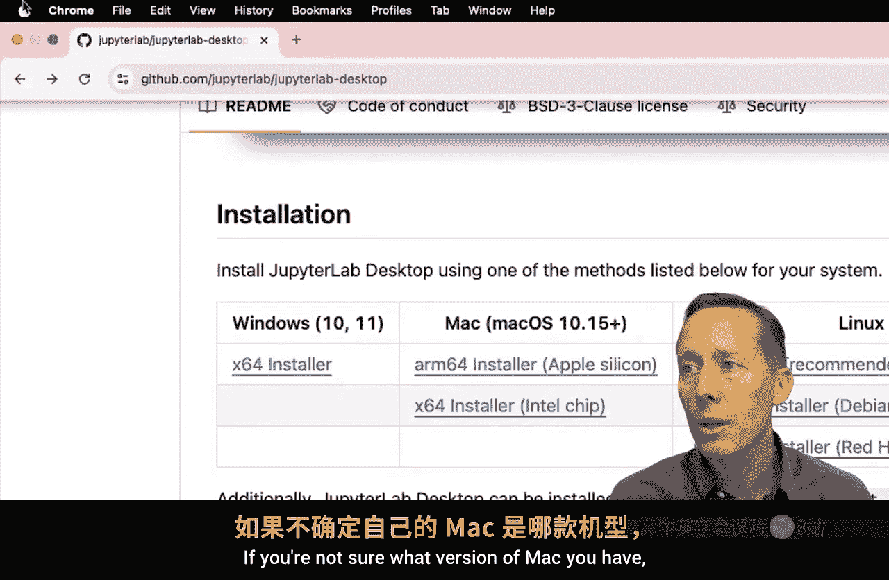
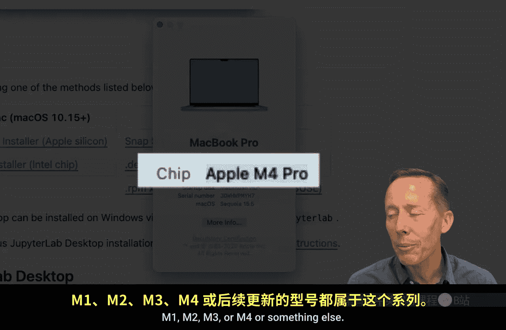
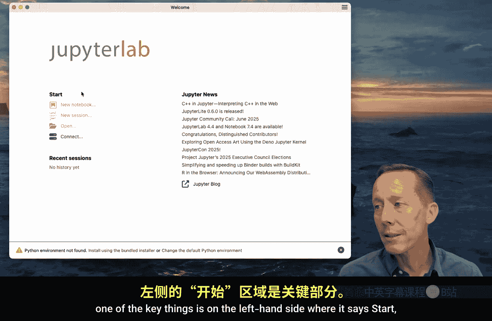
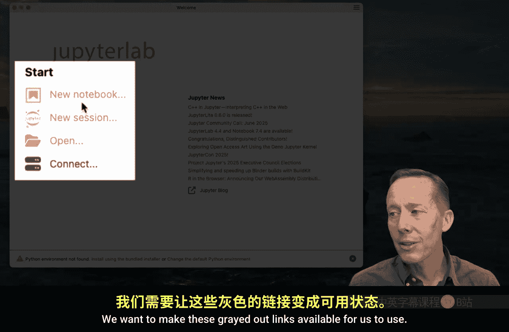
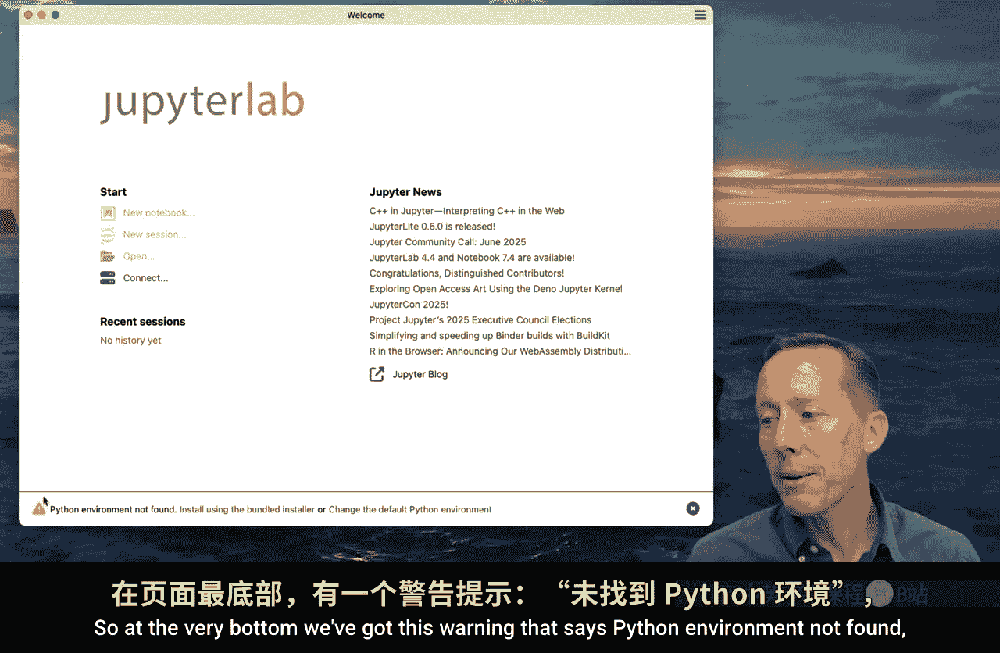
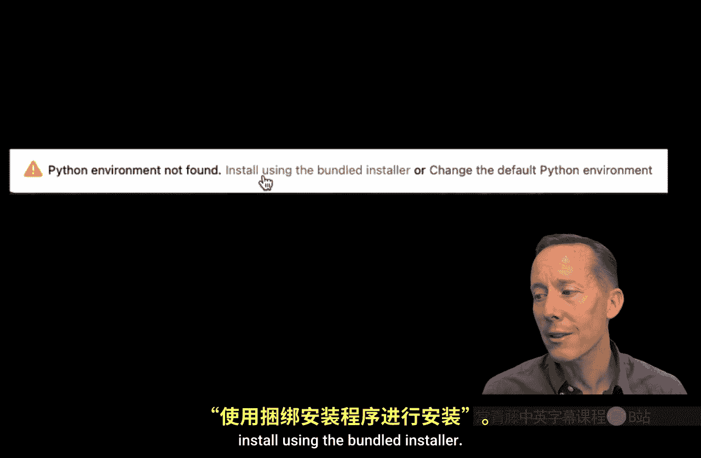
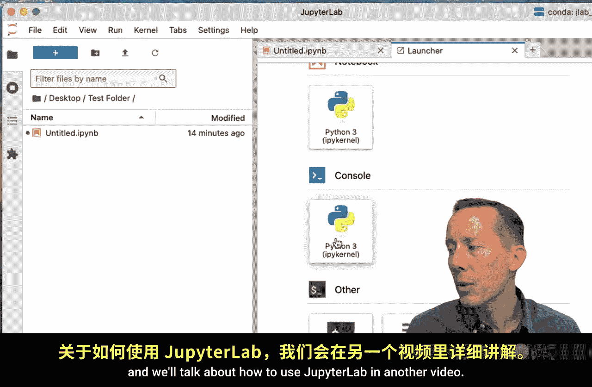

#  011：使用JupyterLab桌面安装Python（推荐Windows和Mac用户） 🚀

在本节课中，我们将学习如何通过最简单的方法之一开始使用Python，即下载并安装JupyterLab桌面应用程序。这种方法的一大优点是，无论您使用的是Windows还是Mac操作系统，其安装过程几乎完全相同。

## 概述

我们将通过访问GitHub仓库来获取JupyterLab桌面应用程序的安装程序，并根据您的操作系统选择正确的版本进行下载和安装。安装完成后，我们还会引导您完成初始的Python环境设置，确保您可以立即开始使用JupyterLab进行数据分析。

---

## 下载JupyterLab桌面应用程序

首先，您需要打开一个网页浏览器来下载安装程序。

以下是下载步骤：
1.  在浏览器中搜索“JupyterLab desktop”，请注意拼写为“JupyterLab”，它是一个单词，并且“Jupyter”的拼写是 **`J-U-P-Y-T-E-R`**。
2.  在搜索结果中，您应该会看到一个指向GitHub仓库的链接，标题通常为“JupyterLab desktop application based on electron”。请点击该链接。
3.  GitHub是一个开发者分享代码的网站，JupyterLab桌面版是一个开源免费的应用程序。进入仓库页面后，向下滚动。

## 选择并下载安装程序

在仓库页面中，找到安装部分。这里会有一个表格，列出了针对三个主要操作系统的安装程序。

以下是各操作系统对应的安装文件：
*   **Windows用户**：请点击“x64 installer”链接，下载安装程序到您的电脑。
*   **Mac用户**：这里有两个链接。一个适用于使用Apple Silicon芯片（如M1、M2、M3等）的新款Mac，另一个适用于使用Intel芯片的旧款Mac。
    *   如果您不确定自己的Mac型号，可以点击屏幕左上角的苹果图标，选择“关于本机”。在“芯片”一栏，如果显示“Apple M…”字样，则说明您使用的是新款Mac。

由于我使用的是新款Mac，我将点击对应的Apple Silicon版本链接进行下载。下载的文件大约300MB，根据您的网络状况，可能需要等待片刻。

## 安装应用程序

下载完成后，即可开始安装。

安装步骤如下：
1.  双击下载好的安装程序文件。
2.  对于Mac用户，这是标准流程：将JupyterLab图标拖拽到“应用程序”文件夹中。安装过程非常快。
3.  安装完成后，您可以退出安装程序，并可以选择删除下载的安装文件。
4.  像打开其他任何应用程序一样，在“应用程序”文件夹中找到并双击“JupyterLab”来启动它。
5.  如果是首次打开，Mac系统可能会要求您确认是否打开此应用，请点击“打开”按钮。

## 初始设置与安装Python

启动JupyterLab后，您会看到欢迎页面。页面左侧的“Start”区域有几个链接，其中前三个是灰色的不可用状态。

这是因为我们目前只安装了JupyterLab桌面应用程序，**尚未安装Python环境**。页面底部会有一个警告提示：“Python environment not found”。

要解决这个问题，请按照以下步骤操作：
1.  点击警告信息中的“install using the bundled installer”链接。
2.  系统将开始安装Python以及一些常用的数据分析Python模块。这个过程可能需要一点时间，但不会太长。
3.  安装成功后，灰色链接将变为可点击状态。

## 启动JupyterLab工作环境

现在，Python环境已准备就绪。您可以直接点击“New Notebook”创建一个新笔记本，但这会默认在您的根目录（如用户文件夹）下创建。

我通常的作法是点击“New Session”，这会直接打开JupyterLab的工作环境。首次启动时，可能会询问您是否希望接收Jupyter的官方新闻通知，您可以选择“否”。

如果您的界面布局与演示中不完全相同，可以通过以下步骤调整：
1.  点击顶部菜单栏的“View”（查看）。
2.  选择“Appearance”（外观），您可以查看或取消勾选“Simple Interface”（简单界面）等选项。
3.  一个简单的方法是直接点击“Reset Default Layout”（重置默认布局），这通常能让界面恢复到标准状态。

## 开始使用

至此，一切准备就绪。您可以在左侧文件浏览器中导航到电脑上的不同文件夹。进入目标文件夹后，点击顶部的“+”按钮即可创建新的笔记本或其他文件。关于如何使用JupyterLab进行编程和分析，我们将在后续视频中详细介绍。

---

## 总结

本节课中，我们一起学习了如何为Windows和Mac系统下载并安装JupyterLab桌面应用程序。我们完成了从GitHub获取安装程序、根据操作系统选择正确版本、执行安装、到最终通过捆绑安装程序设置Python环境的全过程。这种方法将所有必要工具集成在一起，极大简化了安装流程，非常适合编程初学者快速搭建数据分析环境。现在，您已经拥有了一个功能完整的Python和JupyterLab平台，可以开始您的商业分析之旅了。