#  012：在Mac上使用Homebrew和pyenv安装Python 🐍


在本教程中，我们将学习如何在Mac操作系统上安装Python。我们将使用Homebrew这个免费开源的软件包管理器来简化安装过程，并进一步使用pyenv工具来管理多个Python版本。这种方法虽然步骤稍多，但能让你轻松地在不同Python版本之间切换，以适应不同项目的需求。

---

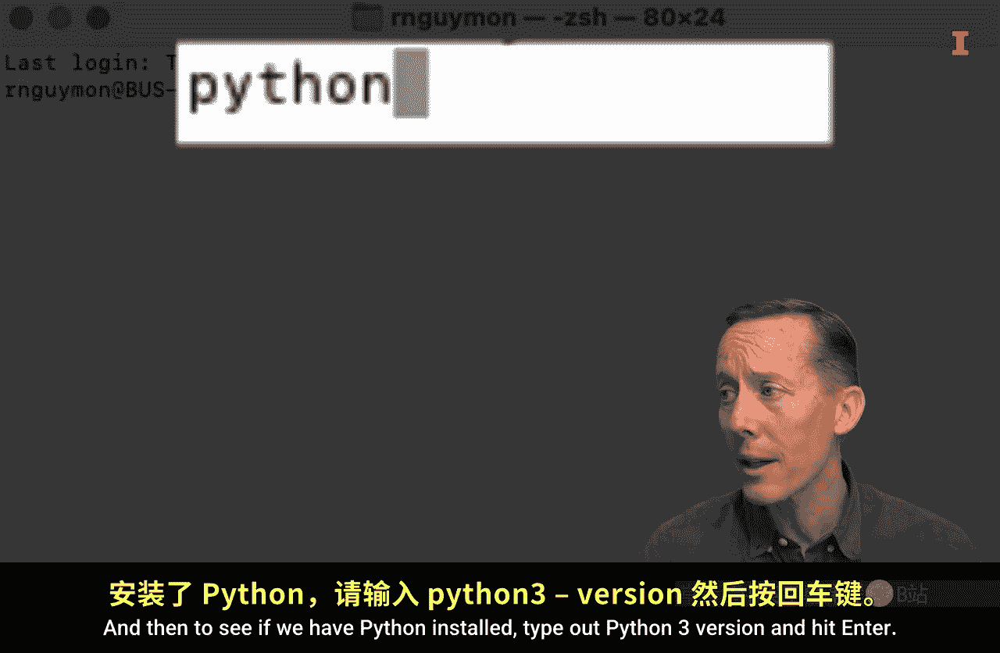

## 检查现有Python安装

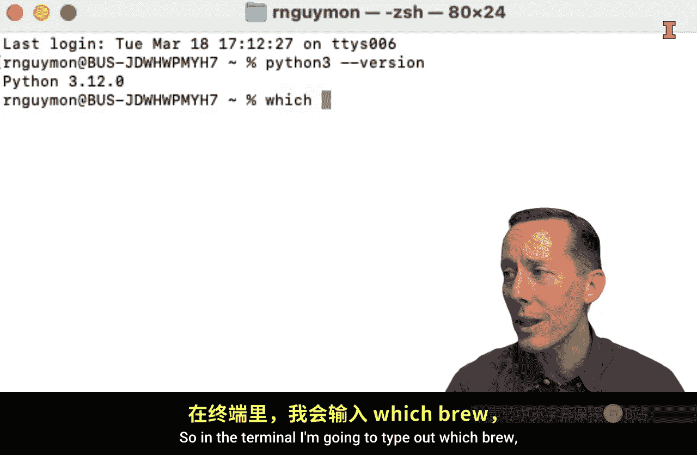

首先，我们需要确认你的Mac上是否已经安装了Python 3。

1.  打开终端应用程序。你可以使用Spotlight搜索（按下 `Command + 空格键`），然后输入“terminal”并回车。
2.  在终端中，输入以下命令来检查Python 3是否已安装：
    ```bash
    python3 --version
    ```
3.  如果系统返回一个版本号（例如 `3.12.0`），则说明Python 3已经安装。如果未安装，终端会提示“command not found”，我们将继续后续步骤。

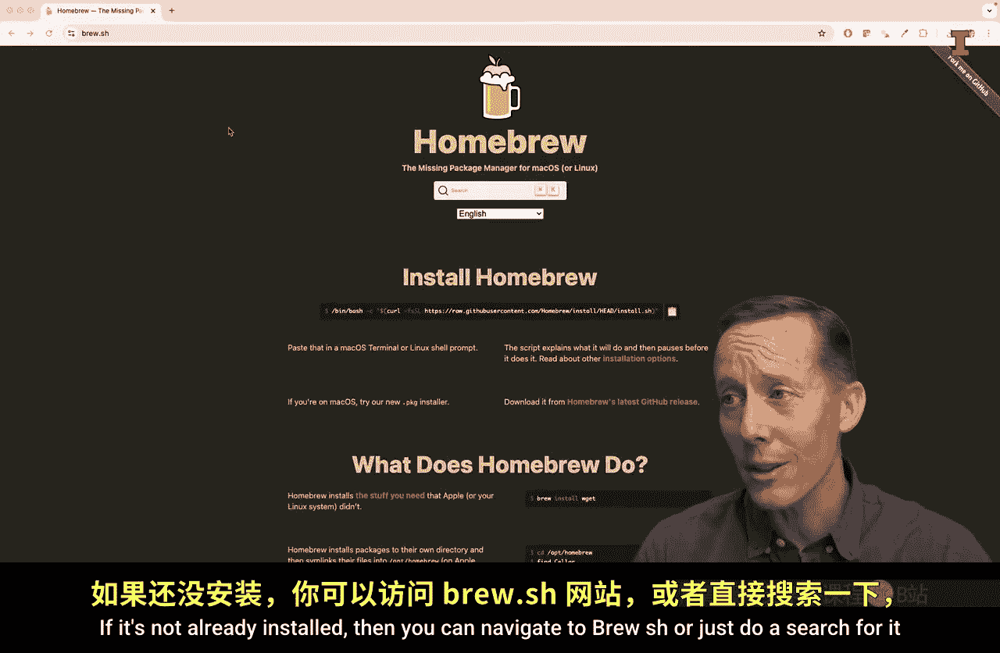


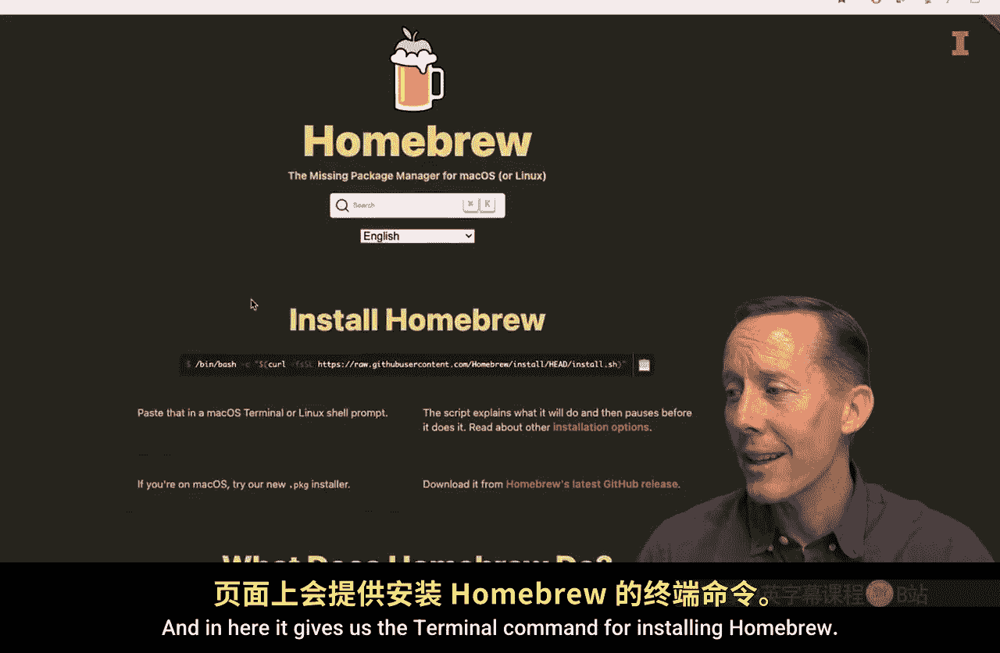


---

## 安装Homebrew

由于我们将使用Homebrew来安装Python，接下来需要确保Homebrew本身已安装。

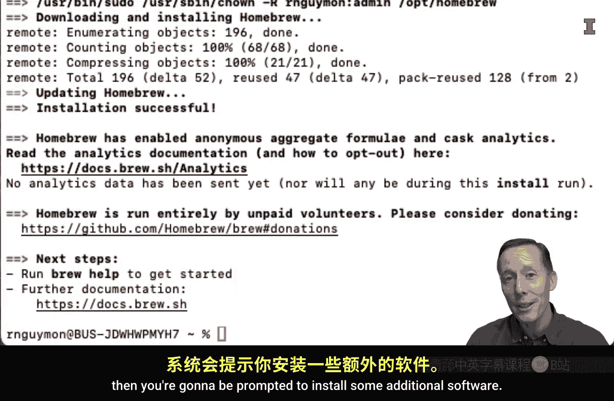

1.  在终端中，输入以下命令检查Homebrew：
    ```bash
    which brew
    ```
2.  如果命令返回一个路径（例如 `/opt/homebrew/bin/brew`），则说明Homebrew已安装。如果未安装，你需要先安装它。
3.  要安装Homebrew，请访问其官方网站 [brew.sh](https://brew.sh)。页面上会提供一个安装命令。
4.  复制该命令，返回终端窗口，粘贴并执行。系统可能会要求你输入管理员密码。
5.  安装过程中，可能会提示你安装Xcode命令行工具或其他软件，请按照提示同意并安装。
6.  安装完成后，再次运行 `which brew` 命令，确认已成功安装并显示路径。

---

## 安装pyenv

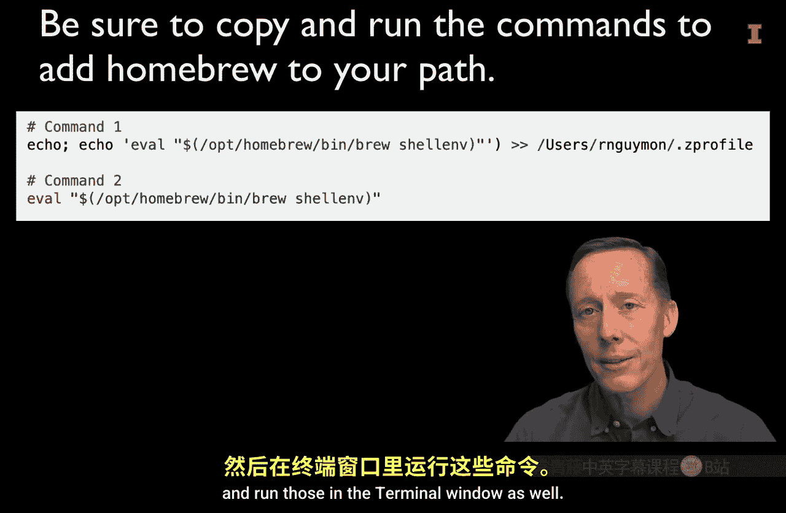

虽然可以直接用Homebrew安装Python，但我们更推荐使用pyenv。pyenv是一个Python版本管理工具，可以让你轻松安装、切换和管理多个Python版本。

1.  首先，检查是否已安装pyenv：
    ```bash
    pyenv --version
    ```
2.  如果命令返回版本号，说明已安装。如果未安装，使用Homebrew进行安装：
    ```bash
    brew install pyenv
    ```
3.  安装过程中，可能会提示你将pyenv的初始化脚本添加到shell配置文件中（如 `~/.zshrc` 或 `~/.bash_profile`）。请按照提示复制并执行给出的命令，这能确保pyenv在终端中正常工作。

---

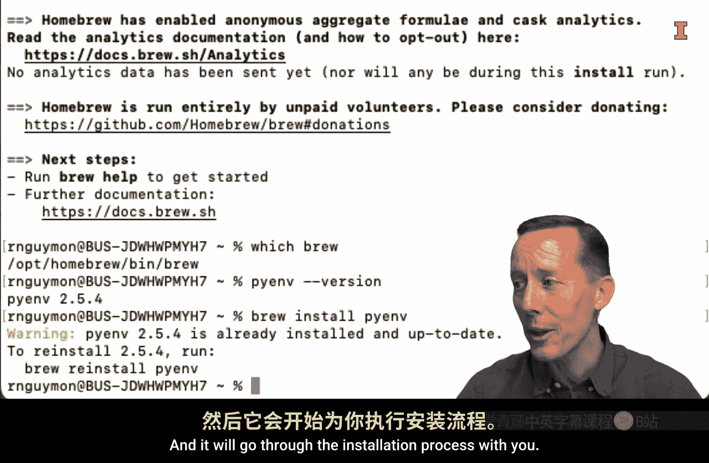

## 使用pyenv安装Python

现在，我们可以使用pyenv来安装特定版本的Python了。


1.  首先，查看pyenv支持安装哪些Python版本：
    ```bash
    pyenv install -l
    ```
    这会列出一个很长的版本列表。我们通常选择列表顶部不带任何后缀字母（如 `a`， `b`， `rc`）的最新稳定版，例如 `3.13.0`。
2.  选择你想要安装的版本，执行安装命令。例如，安装Python 3.13.0：
    ```bash
    pyenv install 3.13.0
    ```
    命令执行后，pyenv会开始下载并安装该版本的Python及其相关组件。

---

## 管理Python版本

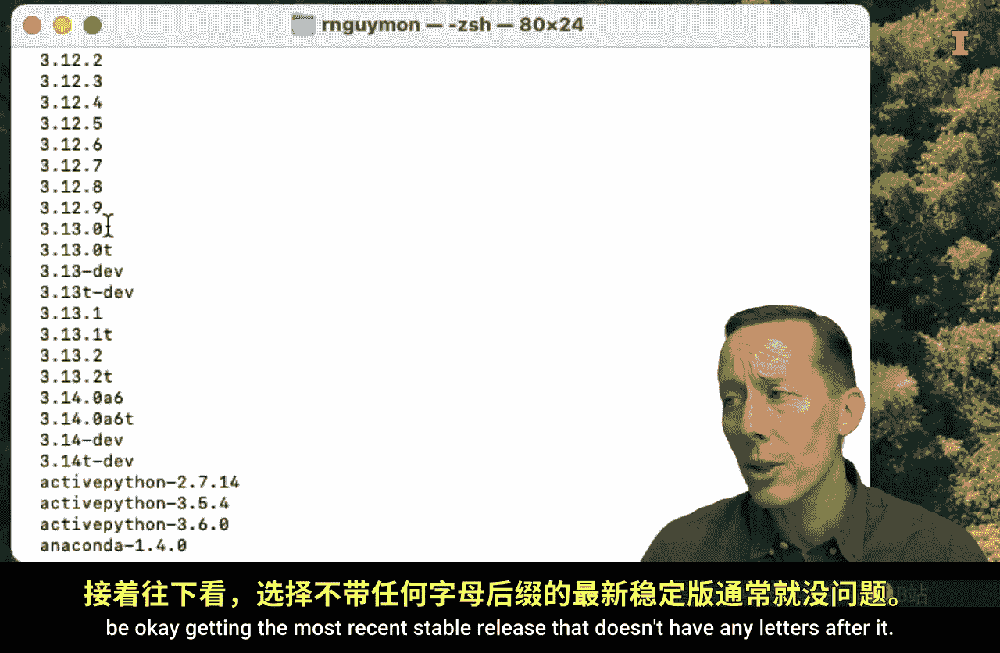

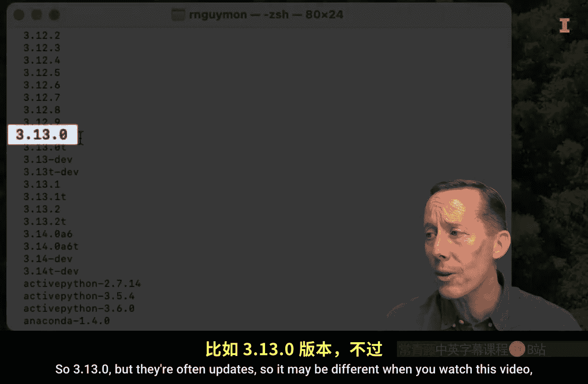

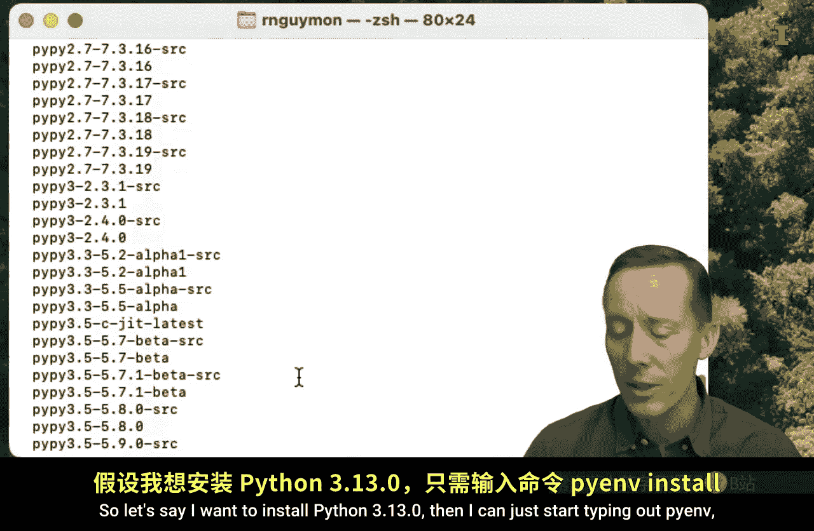

安装完成后，你可以查看和管理已安装的Python版本。

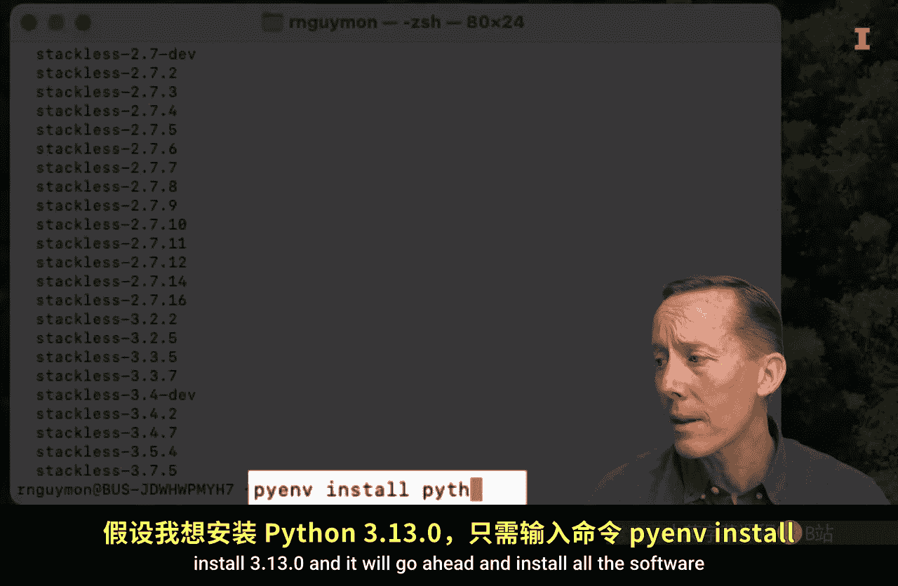

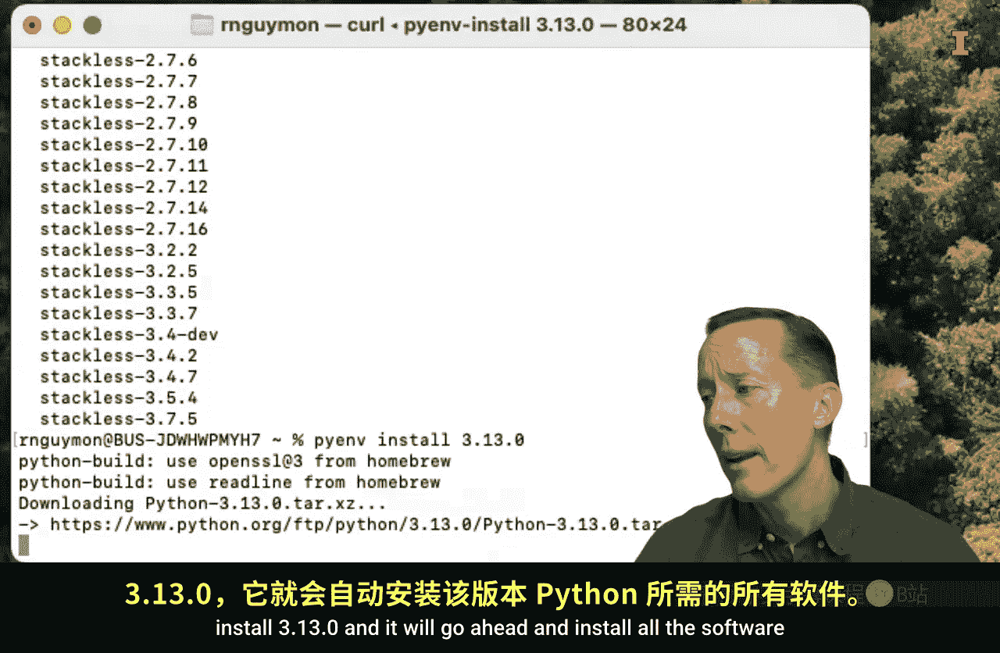

1.  查看当前系统上通过pyenv安装的所有Python版本：
    ```bash
    pyenv versions
    ```
    输出结果会列出所有版本，并用星号（`*`）标记当前全局正在使用的版本。
2.  如果你想切换全局使用的Python版本，可以使用 `global` 命令。例如，切换到刚安装的3.13.0版本：
    ```bash
    pyenv global 3.13.0
    ```
3.  再次运行 `pyenv versions`，你会看到星号已经移动到 `3.13.0` 旁边，表示切换成功。

---

## 总结

本节课中，我们一起学习了在Mac上安装Python的进阶方法。我们首先检查了系统是否已安装Python，然后安装了强大的软件包管理器Homebrew。接着，我们通过Homebrew安装了Python版本管理工具pyenv。最后，我们使用pyenv查看了可安装的Python版本列表，安装了一个特定版本，并学会了如何在不同的Python版本之间进行切换。


使用pyenv管理Python版本的优势在于，你可以为不同的项目轻松配置不同的Python环境，并且卸载不再需要的版本也非常简单。在后续的课程中，我们将介绍如何安装集成开发环境（如Visual Studio Code或Jupyter Lab），以便更高效地编写和运行Python代码，而不仅仅是在终端中使用。