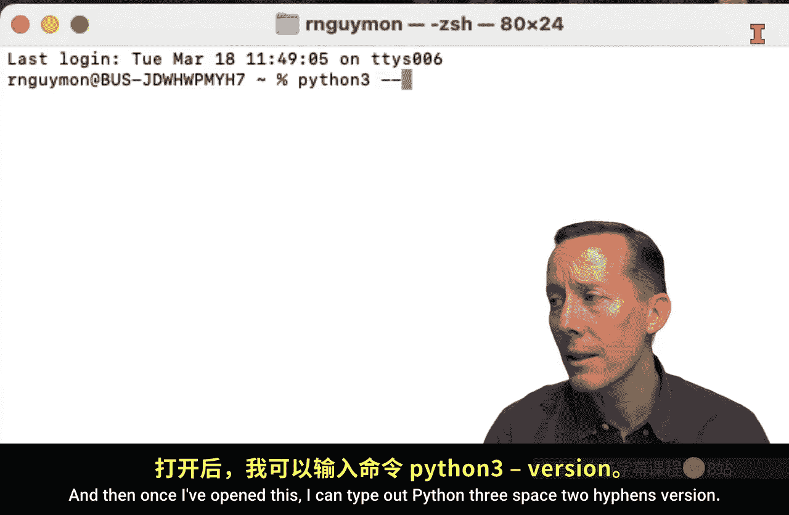
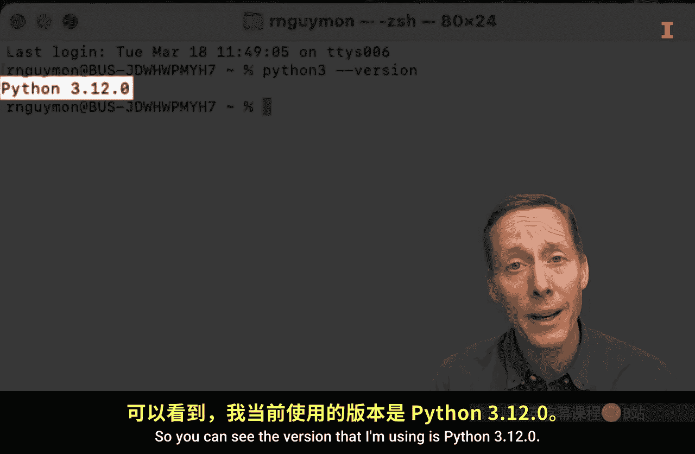
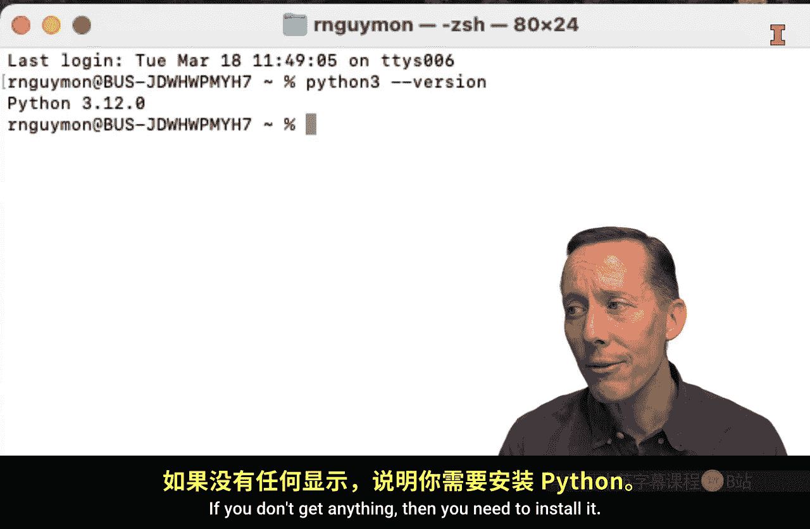
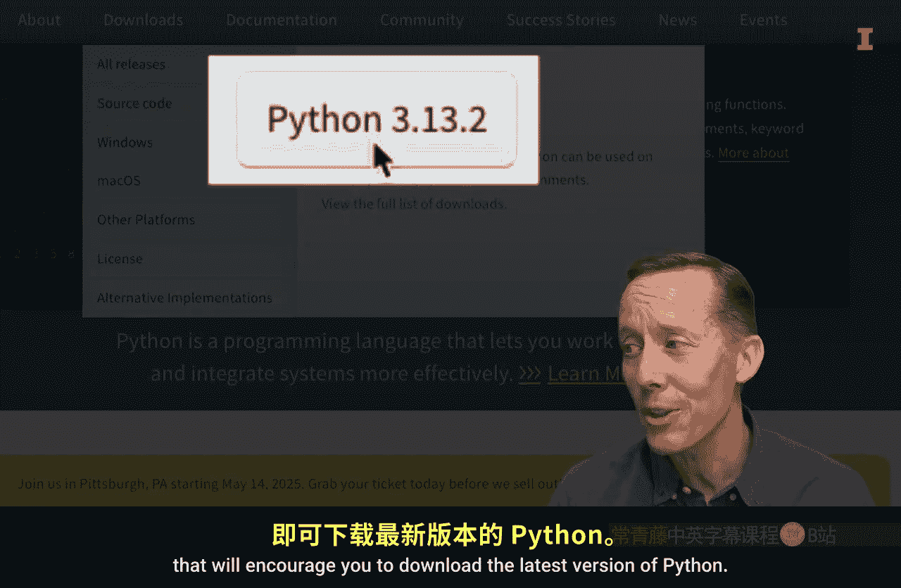
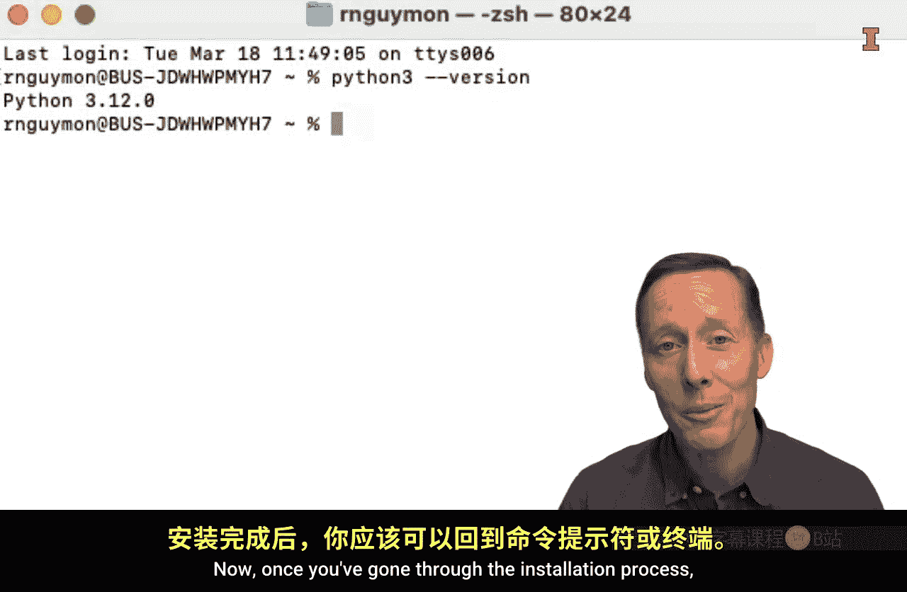
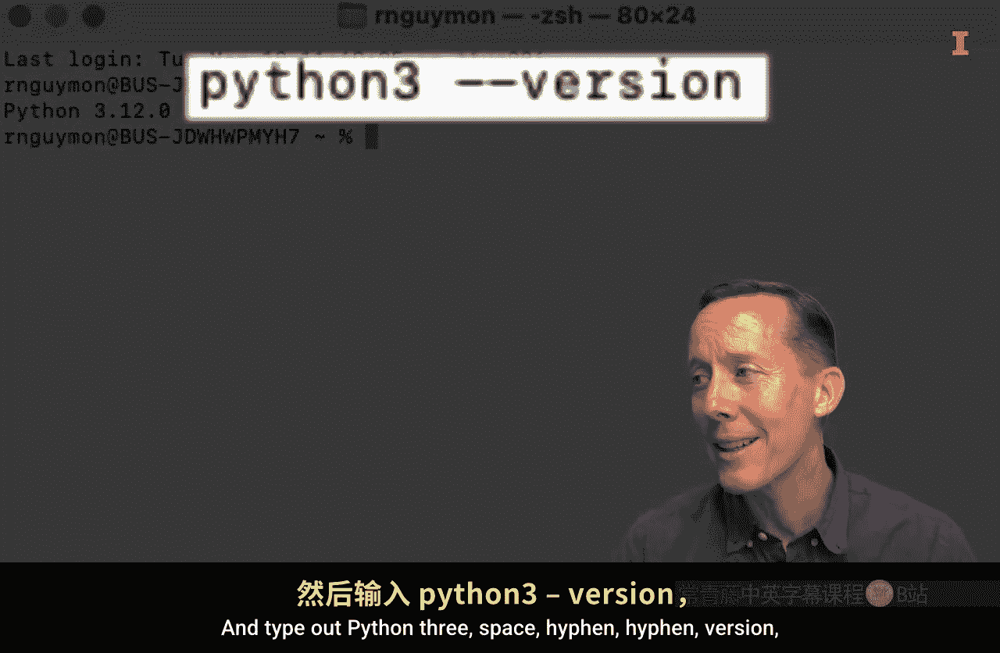
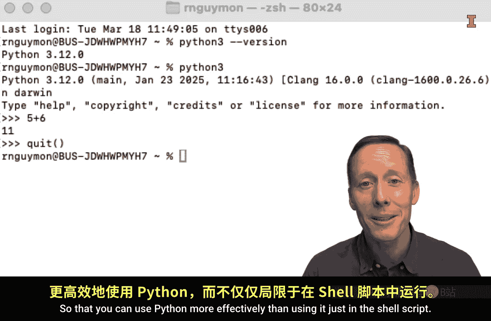

#  013：Python安装指南 🐍


在本节课中，我们将学习如何在您的计算机上安装Python。我们将重点介绍从Python官方网站直接下载安装的方法，并涵盖安装前检查、安装步骤以及安装后的验证过程。

有多种方法可以在计算机上安装Python。本视频将演示直接从Python.org安装Python的方法。

对于使用Mac操作系统的用户，建议观看另一个视频，其中介绍了通过Homebrew安装Python的方法、其优势以及具体操作步骤。尽管如此，您也可以在Windows和Mac操作系统上通过Python.org安装Python。

## 检查现有安装

在开始安装之前，您应该首先确认计算机上是否已经安装了Python。

以下是检查方法：打开命令提示符（Windows）或终端（Mac）。例如，在Mac上，可以通过按下 `Command + 空格键` 打开聚焦搜索，输入“terminal”并按回车键来启动终端。

打开终端后，输入以下命令并按回车：

```bash
python3 --version
```



如果已经安装了Python 3，您将看到一条消息，显示Python及其版本号。例如，输出可能类似于 `Python 3.12.0`。

如果没有任何输出，则说明需要安装Python。





## 下载Python安装程序

要安装Python，请访问Python.org网站，然后进入下载页面。

您的浏览器通常会检测您使用的操作系统类型，并显示一个下载最新版本Python的按钮。



点击该按钮（例如“Python 3.13.2”）开始下载。安装程序将下载到您计算机的“下载”文件夹中。

## 运行安装程序

下载完成后，前往文件管理器，双击下载的安装程序文件。这将启动安装向导，引导您完成安装步骤。

您需要阅读并同意各种信息，例如安装内容、安装位置、许可协议等。您可以自行决定阅读多少内容。

对于Mac用户，通常可以接受所有默认设置进行安装。

对于Windows用户，安装过程中会到达一个关键步骤：您可以选择“立即安装”或“自定义安装”。

**在点击“自定义安装”之前，请务必勾选“Add Python X to PATH”选项。** 这将使您能够更轻松地从命令行启动Python。

然后，您可以决定是否在安装可执行文件时使用管理员权限，接着点击“自定义安装”。

这将带您进入另一个窗口，其中列出了可以随Python一起安装的所有附加功能。

您可以勾选所有选项，但关键是要确保 **pip** 被选中。pip是一个包管理器，对于安装额外的模块非常有用，这些模块能扩展Python以实现多种不同用途。

## 完成安装

勾选所需选项后，点击“下一步”。对于Mac和Windows用户，都可以接受剩余的默认设置，然后完成Python的安装。

## 验证安装

安装过程结束后，您应该能够返回命令提示符或终端，再次输入验证命令：

```bash
python3 --version
```

以确认已安装最新版本的Python。

您甚至可以直接在这个Shell脚本（命令提示符或终端）中使用Python。只需输入 `python3` 并按回车，您将进入一个称为 **REPL** 的环境，其提示符是三个大于号 `>>>`。

在这里，您可以执行一些基本的Python计算。例如，输入 `5 + 6` 并按回车，会得到结果 `11`。

要退出REPL环境，请输入 `quit()` 并按回车。





## 后续步骤

现在，您已经成功安装了Python。但是，请务必观看后续的其他视频，我们将演示如何安装集成开发环境，例如 **Jupyter Lab** 或 **Visual Studio Code**。使用这些工具将比仅在Shell脚本中使用Python更高效。

## 总结




本节课中，我们一起学习了如何从Python.org官方网站下载并安装Python。我们涵盖了安装前的版本检查、详细的安装步骤（特别是Windows用户需注意的PATH设置和pip选择），以及安装后的基本验证方法。成功安装Python是开始编程之旅的第一步。