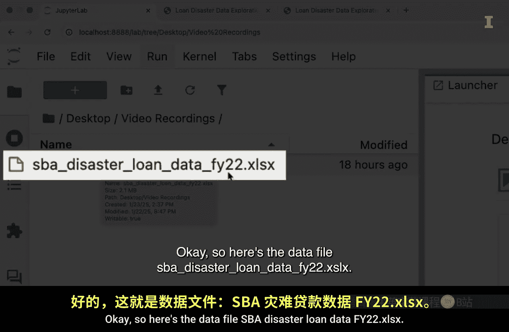
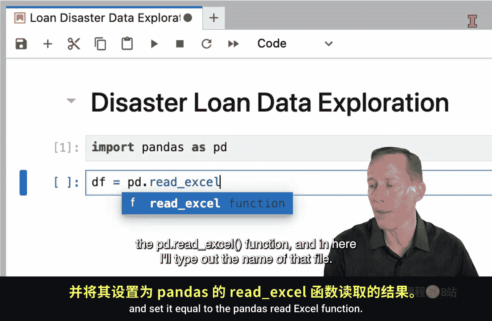
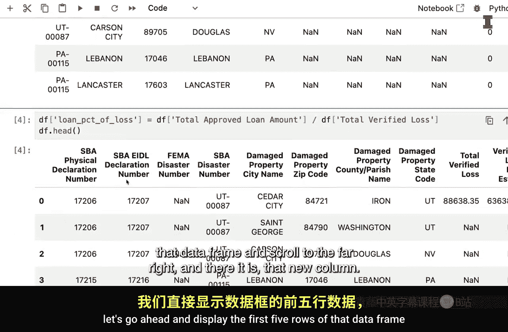
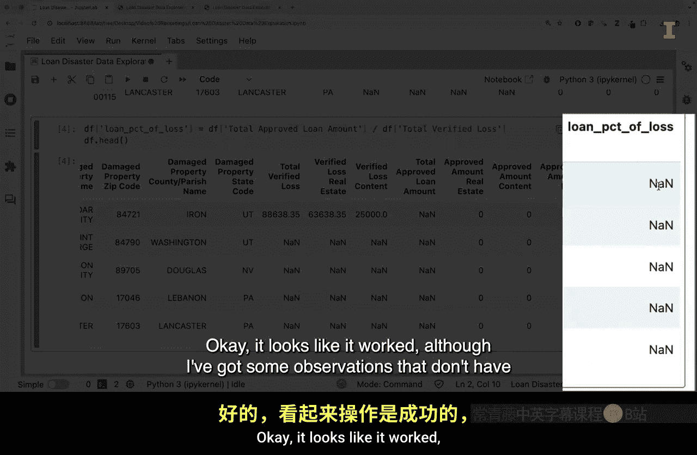
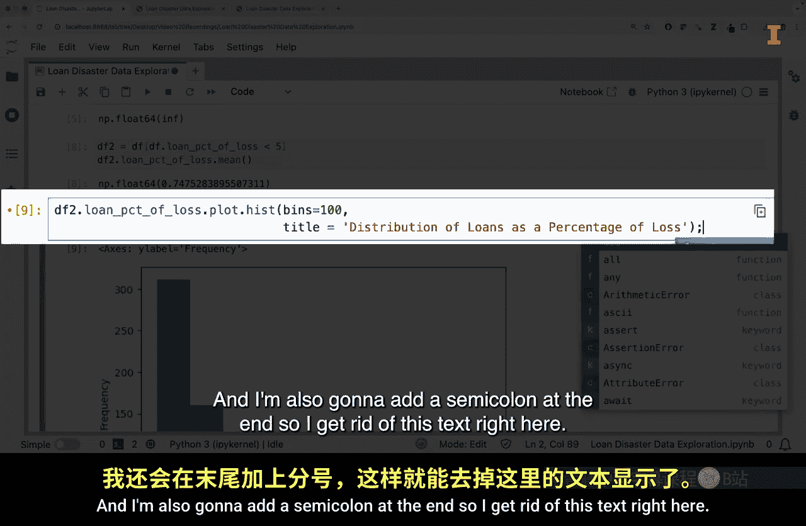
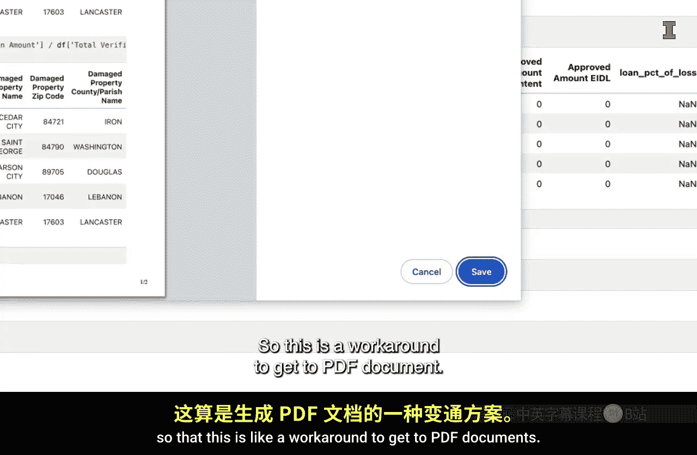

#  014：使用JupyterLab的一个示例工作流程 📊


在本节课中，我们将通过一个具体示例，学习如何在JupyterLab环境中进行数据分析。我们将从读取Excel数据开始，进行数据探索、处理和可视化，最后将结果保存为文件。这个流程将帮助你初步了解数据分析在JupyterLab中的工作方式。

## 启动与准备

上一节我们介绍了JupyterLab的基本概念，本节中我们来看看一个实际的工作流程。首先，我们启动JupyterLab并定位到数据文件所在的目录。

在文件浏览器中，导航至桌面上的目标文件夹。数据文件名为 `SPA disaster loan data FY 22.xlsx`。定位到正确位置后，我们将创建一个新的笔记本文件。


## 创建与命名笔记本




我们将这个新的未命名 `.ipynb` 文件保存为一个更具描述性的名称。

以下是保存和重命名步骤：
*   点击“保存笔记本”。
*   将文件重命名为 `disaster_data_exploration`。
*   重命名后，可以在同一文件夹中看到新的 `.ipynb` 文件。

关闭文件浏览器。接下来，为笔记本添加一个标题。将第一个单元格的类型改为 `Markdown`，然后输入标题并运行该单元格。


## 导入数据



现在开始进行分析。首先，从 `pandas` 模块导入功能。


```python
import pandas as pd
```

然后，读取数据并将其保存为一个 `DataFrame` 对象。使用 `pandas` 的 `read_excel` 函数。

```python
df = pd.read_excel('SPA disaster loan data FY 22.xlsx')
```

为了指定读取哪个工作表，需要添加 `sheet_name` 参数。数据位于名为 `FY 22 business` 的工作表中。此外，原始文件的前几行不是列名，因此需要跳过。

```python
df = pd.read_excel(
    'SPA disaster loan data FY 22.xlsx',
    sheet_name='FY 22 business',
    skiprows=4
)
```

运行代码后，显示 `DataFrame` 的前五行以确认数据已正确加载。

```python
df.head()
```


## 数据探索与处理

数据加载成功后，我们进行初步探索。关键列包括 `total verified loss`（总核验损失）和 `total approved loan amount`（总批准贷款金额）。

假设我们想评估批准贷款金额占核验损失的比例。为此，需要在数据中创建一个新列。

以下是创建新列的步骤：
*   创建一个新的代码单元格。
*   新列名为 `loan_pct_of_loss`。
*   其值等于 `total approved loan amount` 列除以 `total verified loss` 列。

```python
df['loan_pct_of_loss'] = df['total approved loan amount'] / df['total verified loss']
```

运行后，再次显示前五行数据，并滚动到最右侧以查看新列。






## 数据筛选与分析

新列创建成功，但部分观测值因缺少贷款金额而无法计算。接下来计算该新列的平均值。

```python
df['loan_pct_of_loss'].mean()
```

计算结果为无穷大，证实存在无效数据。因此，我们需要筛选数据，创建一个新的 `DataFrame`。

```python
df2 = df[df['loan_pct_of_loss'] < 1000]
```

然后，计算筛选后数据的平均值。

```python
df2['loan_pct_of_loss'].mean()
```

为了更详细地了解数据分布，我们创建一个直方图。


```python
df2['loan_pct_of_loss'].hist()
```




## 数据可视化

直方图显示大部分观测值集中在0到20之间，但存在一些极高的异常值。为了使图表更具信息性，我们进一步筛选数据并调整直方图参数。

将数据限制在贷款损失比小于5的范围内，并优化直方图。

```python
df2 = df2[df2['loan_pct_of_loss'] < 5]
df2['loan_pct_of_loss'].hist(bins=100, title='Distribution of Loan as Percentage of Loss');
```


## 保存结果与总结

分析完成后，将处理后的数据保存为CSV文件，以便未来使用。

```python
df2.to_csv('smaller_loans.csv', index=False)
```

保存后，可以在文件浏览器中看到新生成的 `smaller_loans.csv` 文件。

最后，总结本次分析的主要发现。创建一个Markdown单元格，列出要点。

以下是本次分析的关键发现：
*   部分发放的贷款金额超过了核验损失。
*   许多贷款的金额与核验损失完全相同。



## 导出与分享

笔记本可以导出为不同格式以便分享。例如，可以导出为HTML文件。

```python
# 通过JupyterLab菜单操作：File -> Save and Export Notebook As -> HTML
```


也可以进一步转换为PDF文档。一种方法是打印HTML文件并选择“另存为PDF”。


本节课中我们一起学习了在JupyterLab中执行端到端数据分析的完整工作流程。我们从读取Excel数据开始，进行了数据清洗、计算新指标、可视化分析，最后将结果保存并导出。在后续课程中，我们将更深入地讲解所使用的代码细节以及JupyterLab的操作技巧。