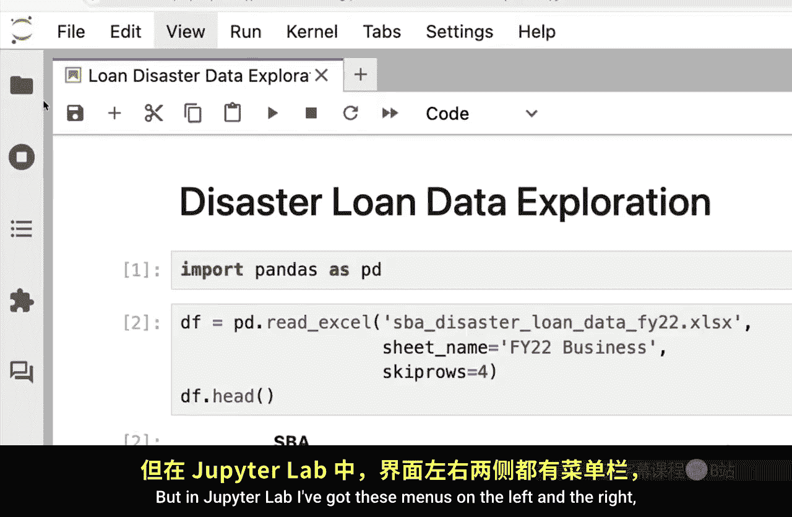
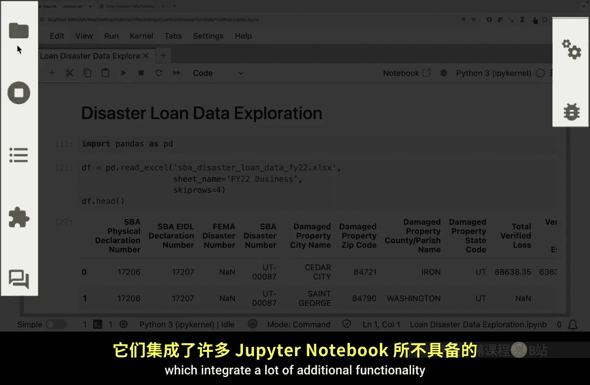
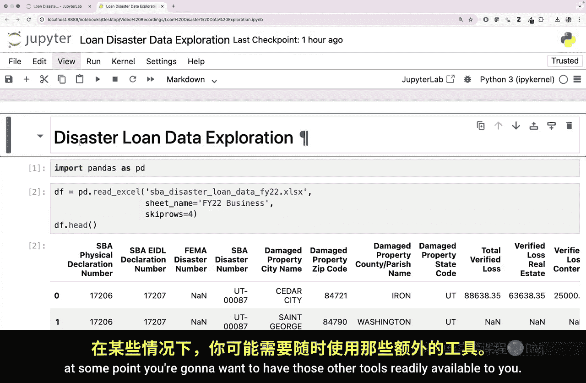
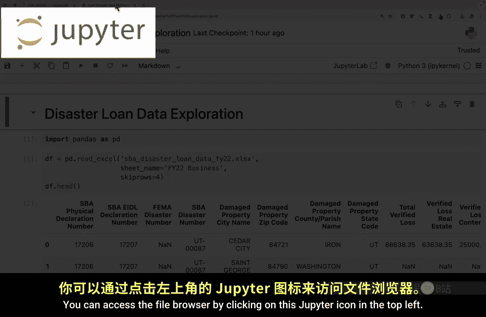
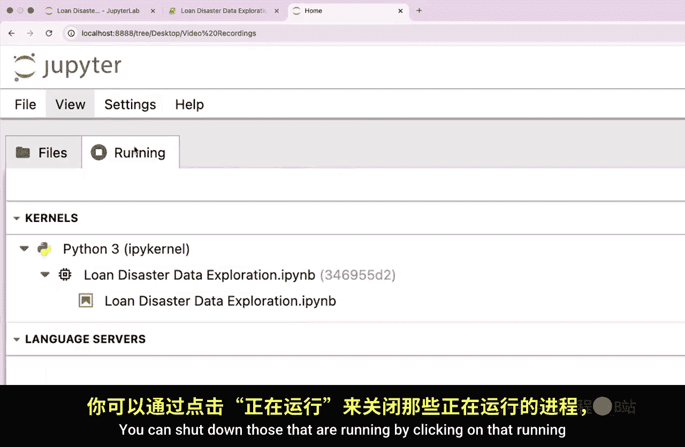

#  017：Jupyter Notebook 之旅 🚀

在本节课中，我们将学习 Jupyter Notebook 集成开发环境。这是一个简化版的 Jupyter Lab 环境。我们将了解如何访问它、其基本界面以及与 Jupyter Lab 的主要区别。

## 访问 Jupyter Notebook

首先，如何访问 Jupyter Notebook？主要有以下几种方式：

*   通过 **Anaconda Navigator** 图形界面启动。
*   在命令行界面中输入命令 `jupyter notebook` 并回车启动。
*   通过 **Jupyter Lab** 环境访问，这也是本教程将演示的方式。

在 Jupyter Lab 中，你可以看到一个笔记本图标。点击该图标，即可在 Jupyter Notebook 环境中打开对应的 `.ipynb` 文件。

## Jupyter Notebook 与 Jupyter Lab 的对比

上一节我们介绍了如何访问 Jupyter Notebook，本节中我们来看看它与 Jupyter Lab 的异同。

Jupyter Notebook 是 Jupyter Lab 的简化版本。这既是优点也是缺点。

*   **优点**：对于 Python 初学者，Jupyter Lab 可能因其丰富的功能而显得复杂。Jupyter Notebook 保持了简洁性，让用户能专注于运行代码单元、创建新单元和删除单元等核心操作，这些操作方式与 Jupyter Lab 中一致。
*   **缺点**：随着学习的深入，你可能会需要 Jupyter Lab 中那些随时可用的额外工具。

## Jupyter Notebook 的基本操作

在 Jupyter Notebook 中，你可以通过点击左上角的 Jupyter 图标来访问文件浏览器。这会在新的浏览器标签页中打开文件浏览器界面。

以下是文件浏览器的基本功能列表：
*   点击不同的文件夹或文件进行浏览和打开。
*   从浏览器窗口打开另一个 `.ipynb` 文件，它会作为一个新标签页在 Notebook 中打开。
*   通过点击“运行中”的标签并关闭标签页，来关闭正在运行的笔记本。

## 总结与建议

本节课中我们一起学习了 Jupyter Notebook 的基本概念和操作。它是一个轻量级的交互式编程环境。

当你在 Jupyter Lab 和 Jupyter Notebook 之间做选择时，建议优先使用功能更全面的 **Jupyter Lab**。但至少现在，你已经了解了 Jupyter Notebook 是什么以及如何使用它。