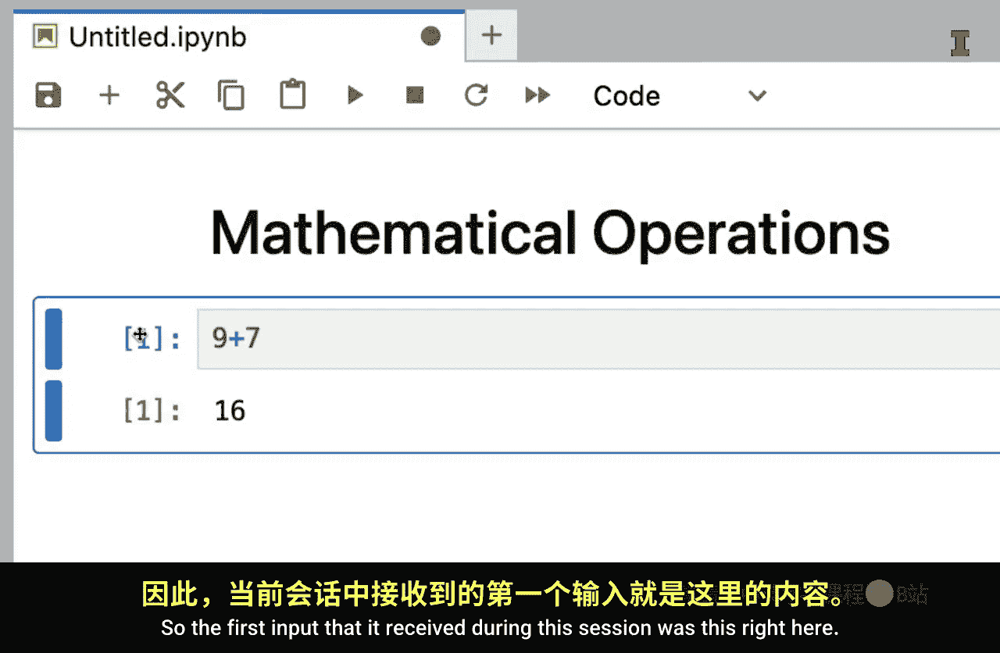
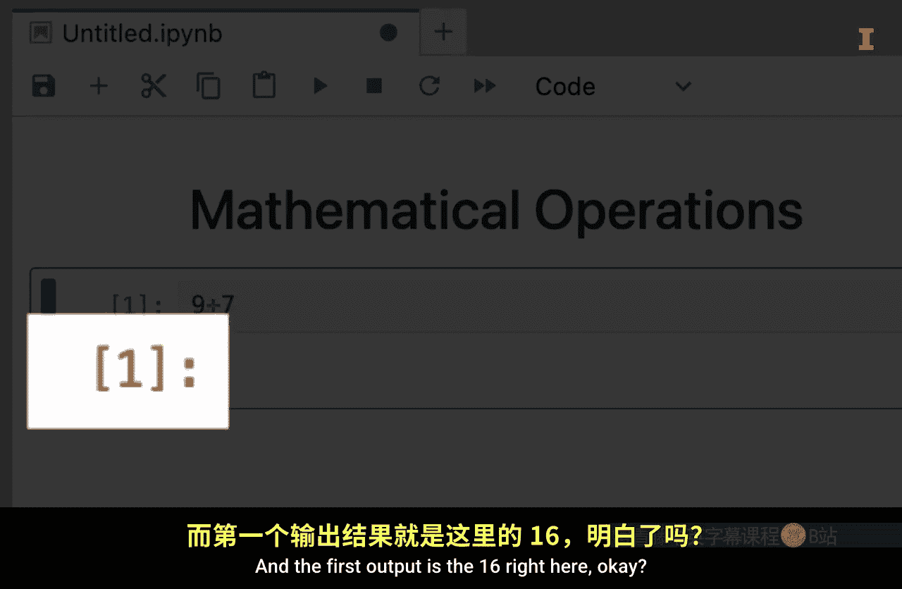
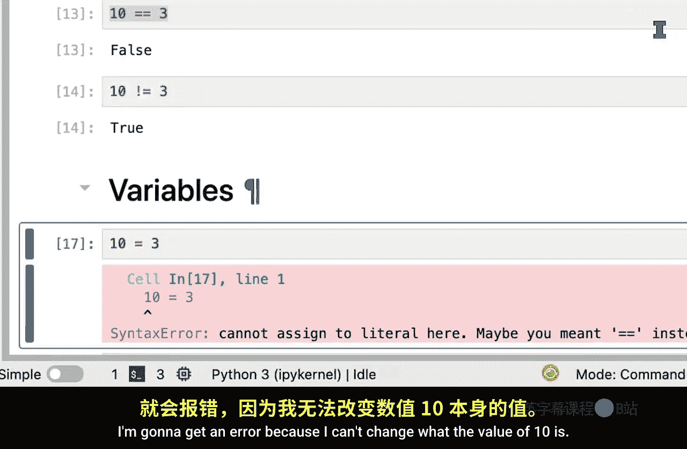
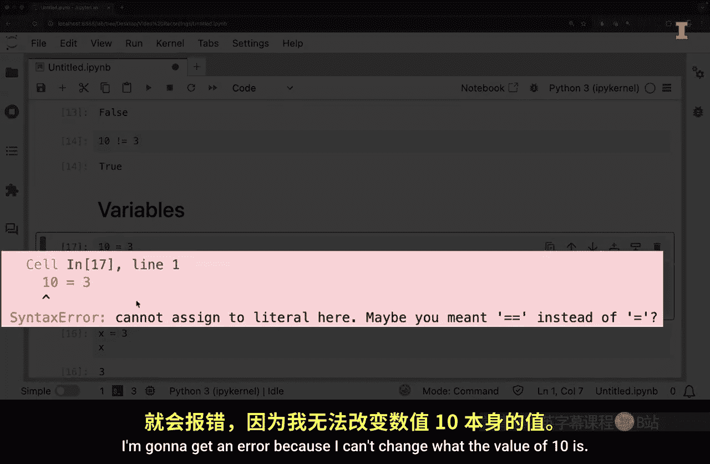
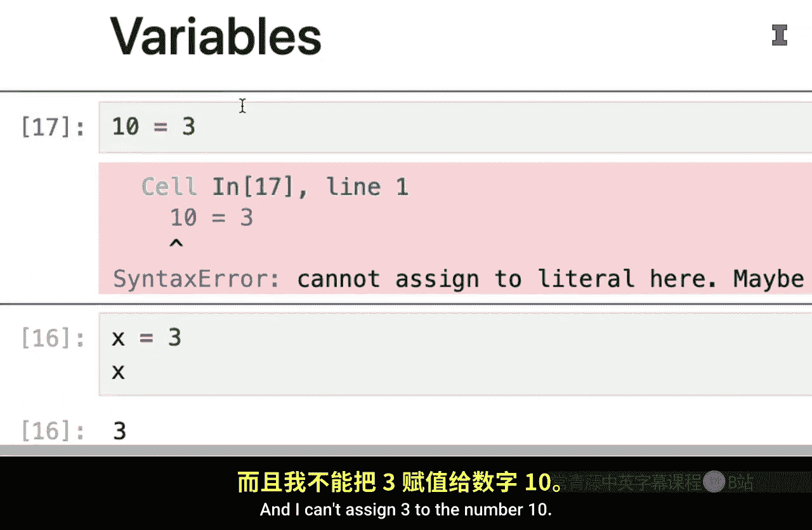
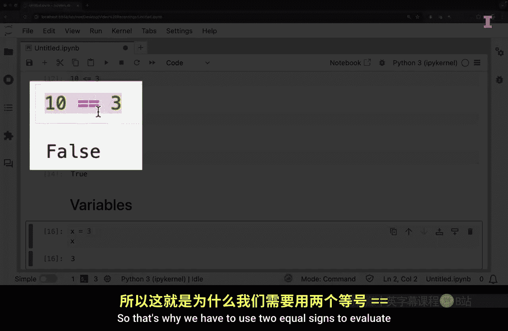
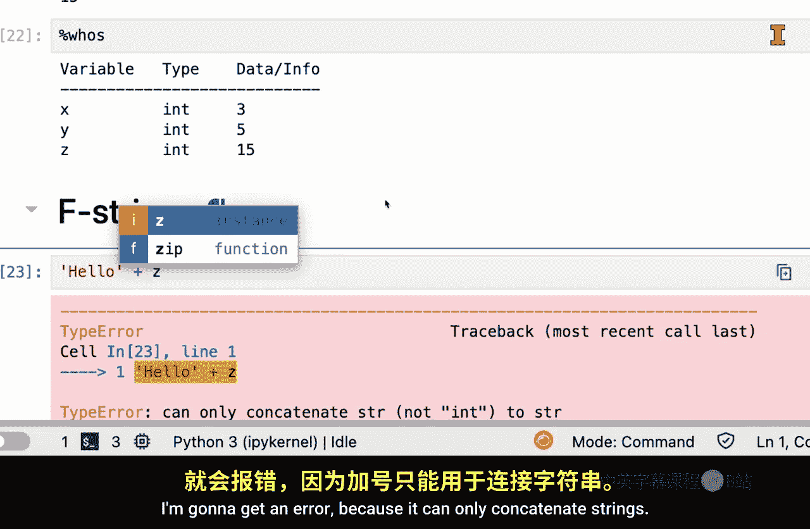
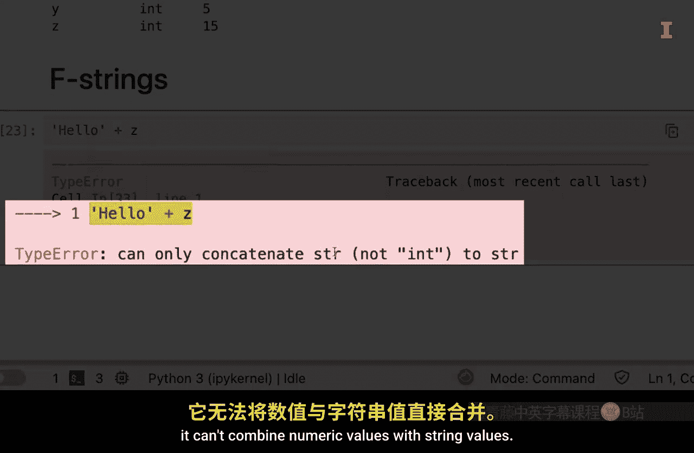

#  018：使用Python进行基础计算 🧮


在本节课中，我们将学习如何在Python中执行基础计算。这些操作大多与计算器或Excel中的功能类似，我们将通过Jupyter Lab环境进行演示，涵盖数学运算、比较运算符、变量以及格式化字符串。

## 数学运算

上一节我们介绍了课程目标，本节中我们来看看如何在Python中进行基础的数学运算。





在Jupyter Lab中创建一个代码单元格，输入`9 + 7`并运行，结果会显示为`16`。单元格旁边的`[1]`表示这是本次会话的第一个输入和输出。

以下是其他基础数学运算符的示例：

*   `9 / 4` 执行除法，结果为 `2.25`。
*   `9 * 3` 执行乘法，结果为 `27`。
*   `9 ** 3` 使用两个星号 `**` 表示幂运算，即9的3次方，结果为 `729`。

除了常见运算符，Python还有两个特殊的除法运算符：

*   `10 // 3` 使用两个正斜杠 `//` 执行**地板除法**，它返回除法结果的整数部分，忽略余数，结果为 `3`。
*   `10 % 3` 使用百分号 `%` 执行**取模运算**，它返回除法结果的余数部分，结果为 `1`。

## 文本的运算

数学运算符中的加法和乘法也可以应用于文本（字符串）。

在Python中，我们用单引号或双引号来定义文本。例如，`‘Hello’ * 2` 会将字符串重复两次，结果是 `‘HelloHello’`。

字符串加法 `‘Ho’ + ‘llo there’` 执行的是**拼接**操作，将两个字符串连接起来，结果是 `‘Hollo there’`。

## 比较运算符

比较运算符用于比较两个值，并返回布尔值（`True` 或 `False`）。

以下是常用的比较运算符示例：

*   `10 > 3` 判断10是否大于3，返回 `True`。
*   `10 <= 3` 判断10是否小于或等于3，返回 `False`。
*   `10 == 3` 使用**双等号** `==` 判断10是否等于3，返回 `False`。注意，单个等号 `=` 用于赋值，不能用于比较。
*   `10 != 3` 使用感叹号和等号 `!=` 判断10是否不等于3，返回 `True`。









## 变量与赋值

变量用于存储信息。我们使用单个等号 `=` 进行赋值。

例如，`x = 3` 将数值3赋给变量 `x`。之后，输入 `x` 并运行，Python会输出其值 `3`。

你可以创建多个变量并进行运算：
```python
x = 3
y = 5
z = x * y
print(z) # 输出 15
```
要同时查看多个变量的值，需要使用 `print()` 函数。如果直接在单元格中输入 `x` 和 `y`，默认只会显示最后一个变量 `y` 的值。

若想查看当前会话中创建的所有变量，可以使用Jupyter的魔法命令 `%whos`。

## 格式化字符串（F-strings）





当需要将变量值嵌入到字符串中时，直接拼接数字和字符串会导致错误。例如，`‘Hello’ + z` 会报错。

此时可以使用**格式化字符串（F-strings）**。在字符串引号前加上字母 `f`，然后在字符串内部用花括号 `{}` 包裹变量名。
```python
z = 15
print(f‘Hello {z}’) # 输出 ‘Hello 15’
```
F-strings 提供了一种简洁明了的方式来构建包含变量值的字符串。

---


本节课中我们一起学习了Python的基础计算知识。我们掌握了数学运算、比较运算符、变量的赋值与使用，以及如何用F-strings格式化字符串。这些计算虽然基础，但却是处理更复杂数据集的基石。每位专家都曾是初学者，持续练习并保持好奇，你将在接下来的几周内取得惊人的进步。