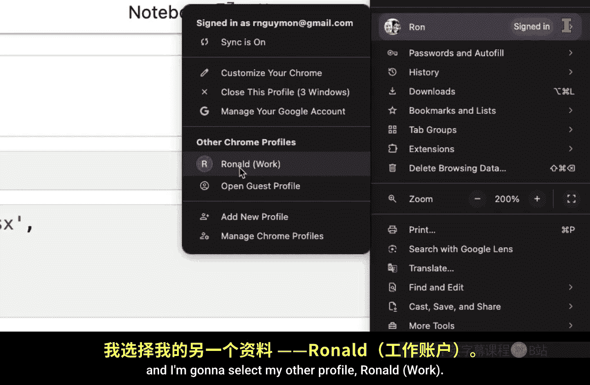
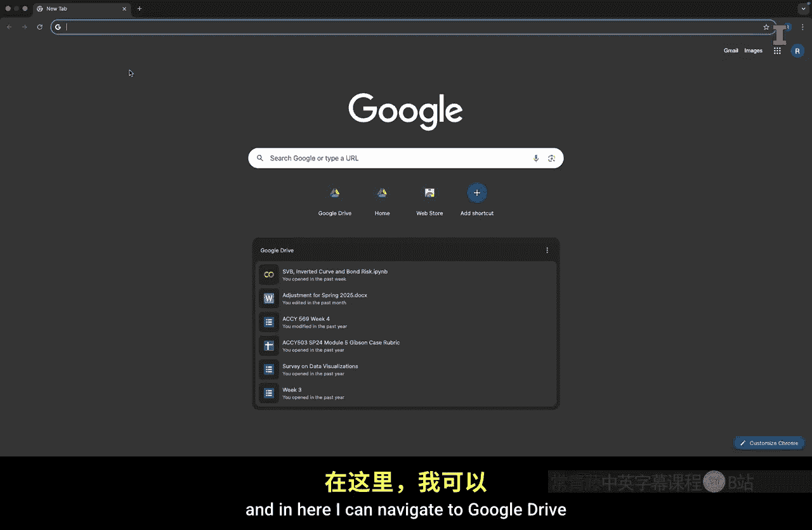
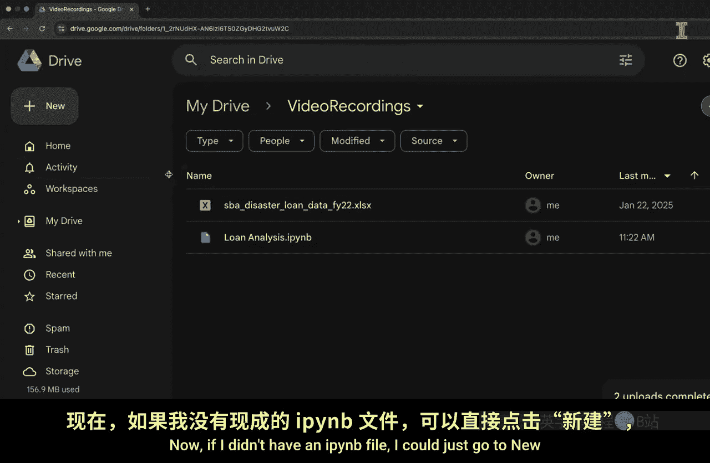
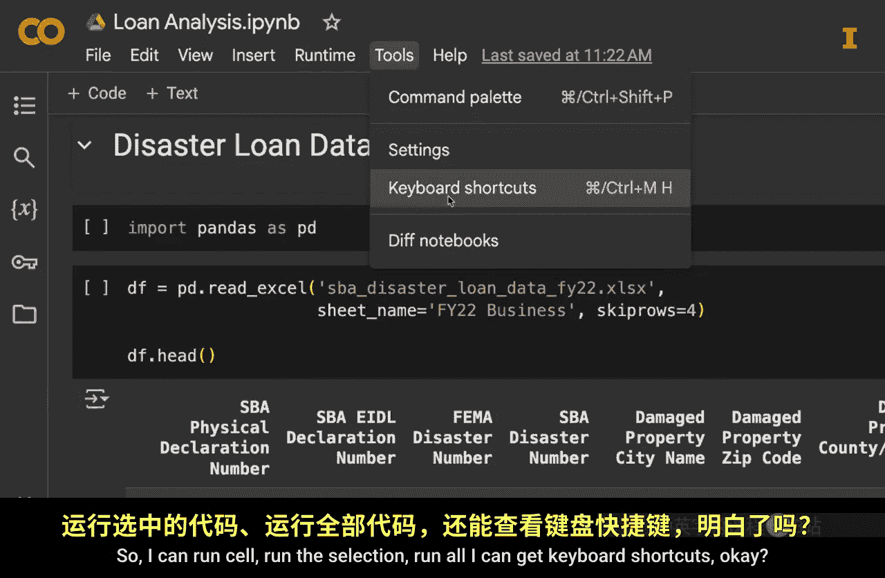
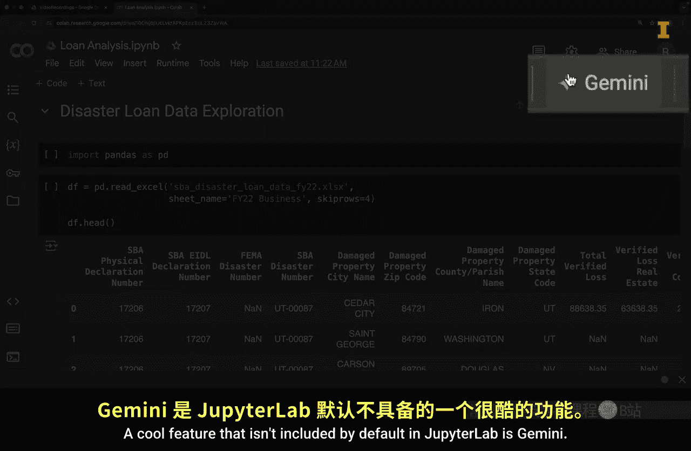
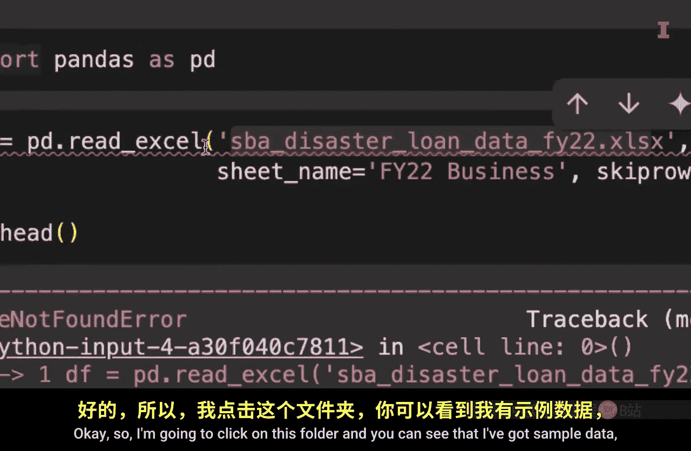
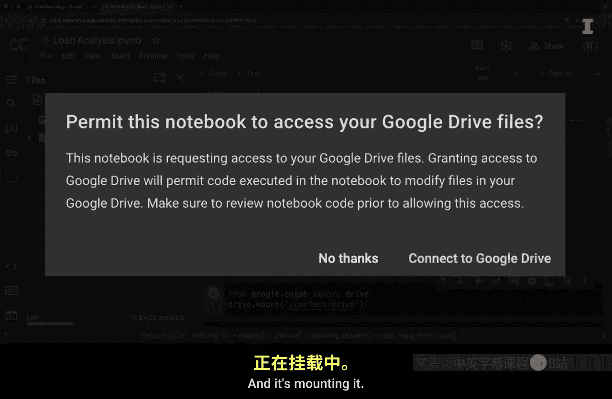
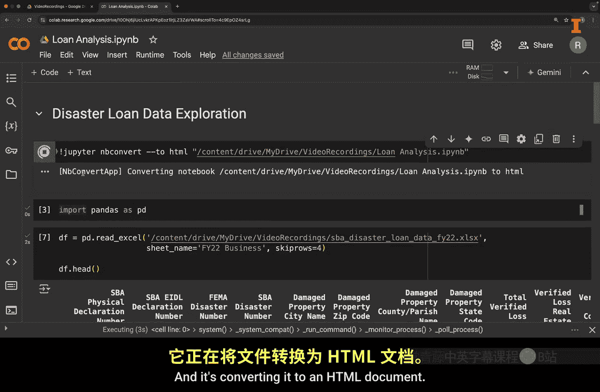
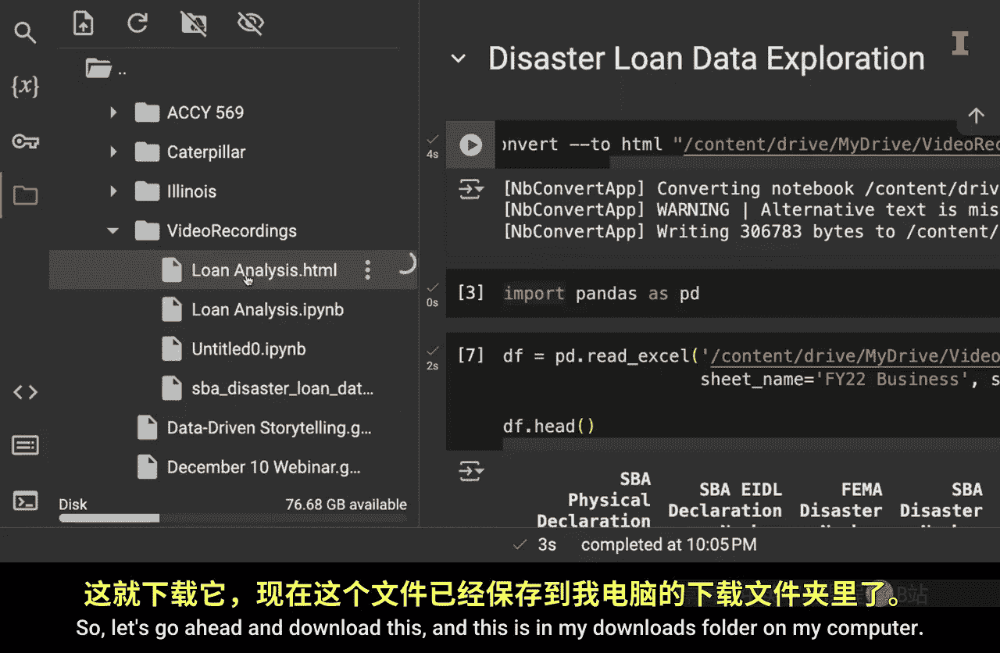
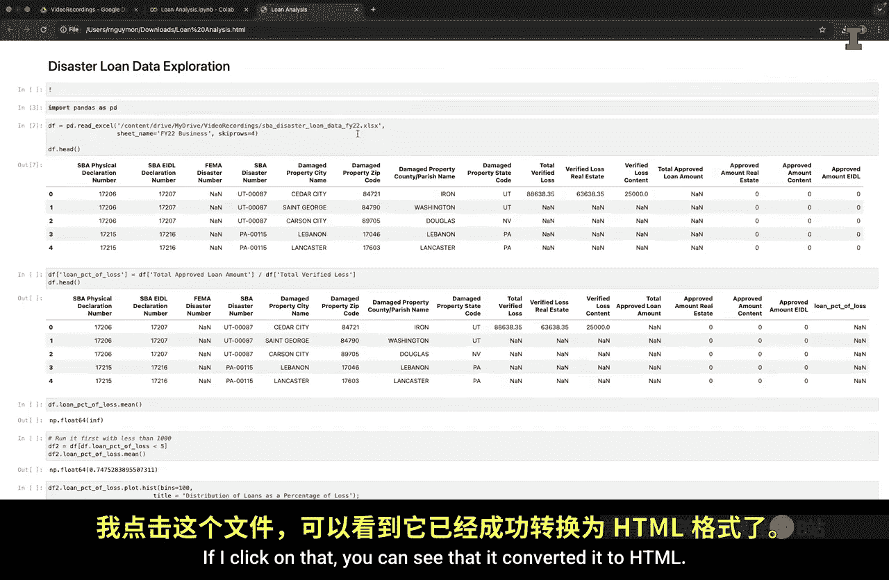

#  019：Google Colab - Jupyter Notebook的在线版本 🚀


在本节课中，我们将学习如何使用Google Colab，这是一个基于浏览器的集成开发环境，可以让你无需在本地安装Python或任何IDE就能运行Jupyter Notebook。我们将介绍如何访问Colab、上传数据、运行现有代码，并了解其核心功能与优势。

---

## 概述


Google Colab是Google提供的免费云端Jupyter Notebook服务。它允许用户在浏览器中编写和执行Python代码，特别适合数据分析、机器学习和协作项目。本节将引导你完成从访问Colab到运行一个完整数据分析项目的全过程。




---



## 访问Google Colab

首先，你需要使用Chrome浏览器并登录你的Google账户。如果你有多个账户，可以方便地在账户间切换。

1.  点击浏览器右上角的三个点。
2.  将鼠标悬停在你的个人资料图标上。
3.  从弹出的菜单中选择你想要使用的工作或个人账户。

切换账户后，你将打开一个新的浏览器窗口。

---

## 准备Google Drive



Google Colab与Google Drive深度集成，你的工作文件和数据通常存储在Drive中。以下是设置工作文件夹的步骤。

1.  在浏览器中导航至 `drive.google.com`。
2.  点击“新建”按钮。
3.  选择“文件夹”来创建一个新文件夹，建议命名时避免使用空格，例如 `videoRecordings`。
4.  双击进入新创建的文件夹。

---

## 上传文件

为了在Colab中分析数据，你需要将数据文件和Jupyter Notebook文件上传到Google Drive。

1.  在目标文件夹内，点击“新建” -> “文件上传”。
2.  从你的电脑中选择需要上传的文件（例如Excel数据文件和 `.ipynb` 笔记本文件）。
3.  点击“打开”完成上传。现在，这些文件已保存在你的Google Drive文件夹中。

---

## 创建与打开Notebook

如果你还没有现成的Notebook，可以直接在Colab中创建。



1.  在Google Drive文件夹中，点击“新建” -> “更多” -> “Google Colaboratory”。
2.  系统会创建一个名为 `Untitled0.ipynb` 的新笔记本。
3.  你可以像在Jupyter Lab中一样，创建代码单元格和文本（Markdown）单元格。例如，输入 `# 标题` 可以创建一个一级标题。



如果你想使用已上传的现有Notebook，只需在Google Drive中双击该 `.ipynb` 文件，它就会在Colab中打开。

---

## Colab界面与核心功能

打开Notebook后，你会看到与Jupyter Lab相似的界面。顶部菜单栏提供了运行单元格、查看快捷键等选项。

一个Colab特有的强大功能是集成了Google的AI工具Gemini，你可以通过点击相应图标访问它，获取代码解释或帮助。



左侧边栏提供了一些实用工具：
*   **目录**：方便导航大型笔记本。
*   **查找**：在笔记本中搜索文本。
*   **变量浏览器**：跟踪当前会话中创建的所有变量。例如，运行 `x = 3` 后，你可以在变量浏览器中看到变量 `x`。




---

## 读取本地数据

在Colab中运行代码时，一个关键步骤是访问你上传到Google Drive的数据文件。直接使用本地文件路径是行不通的，你需要先“挂载”Google Drive。

1.  点击左侧边栏的文件夹图标。
2.  点击“挂载Google云端硬盘”图标。
3.  运行自动生成的代码单元格，并根据提示授权访问你的Google Drive。
4.  授权成功后，你可以在文件浏览器中看到一个名为 `drive` 的新文件夹，里面包含了你的Google Drive内容。

要读取特定文件，你需要获取其正确路径：
1.  在文件浏览器中找到你的数据文件。
2.  点击文件右侧的三个点，选择“复制路径”。
3.  在代码中使用 `pd.read_csv()` 等函数时，粘贴这个路径作为文件名参数。路径通常类似 `/content/drive/MyDrive/videoRecordings/your_data_file.csv`。

---

## 导出与分享

Colab可以轻松地将Notebook导出为其他格式，例如HTML，便于分享结果。

你可以使用终端命令来完成转换：
```python
!jupyter nbconvert --to html "/content/drive/MyDrive/videoRecordings/your_notebook.ipynb"
```
运行此命令后，HTML文件将生成在相同目录下，你可以从Google Drive中下载它。



---




## 优势与注意事项

上一节我们介绍了Colab的基本操作，本节中我们来看看它的主要优势和需要注意的地方。



**Google Colab的主要优势包括：**
*   **无需本地安装**：无需在电脑上安装Python或任何IDE。
*   **云端协作**：可以轻松地与他人共享Notebook并实时协作。
*   **随处访问**：只要连接互联网，你可以在任何电脑上访问和继续你的工作。
*   **强大的计算资源**：免费提供GPU和TPU资源，对于机器学习任务非常有用。你也可以付费升级以获得更强大的处理能力。

**使用Colab时需要注意：**
*   **需要挂载数据**：必须先将Google Drive挂载到当前会话才能访问数据文件。
*   **会话限制**：免费版本的运行时会话在一段时间不活动后会断开，所有存储在内存中的数据会丢失（但Drive中的文件会保留）。
*   **默认资源限制**：免费版本的计算资源和内存有一定限制，对于非常大型的计算任务可能不足。

---

## 总结


本节课中我们一起学习了Google Colab的核心用法。我们了解了如何访问Colab、在Google Drive中管理文件和文件夹、上传数据、挂载Drive以读取数据，以及运行和导出Notebook。Colab作为一个强大的云端工具，极大地降低了数据分析的入门门槛，并促进了团队协作。尽管在数据挂载和资源方面有一些限制，但其便捷性和可访问性使其成为学习和执行数据分析项目的优秀平台。