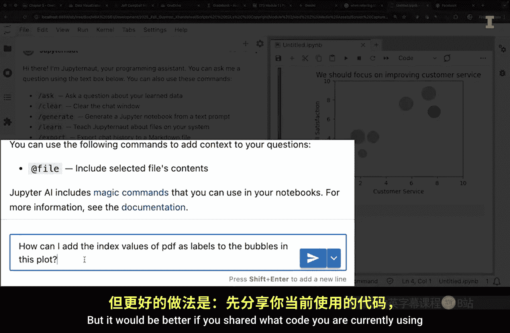
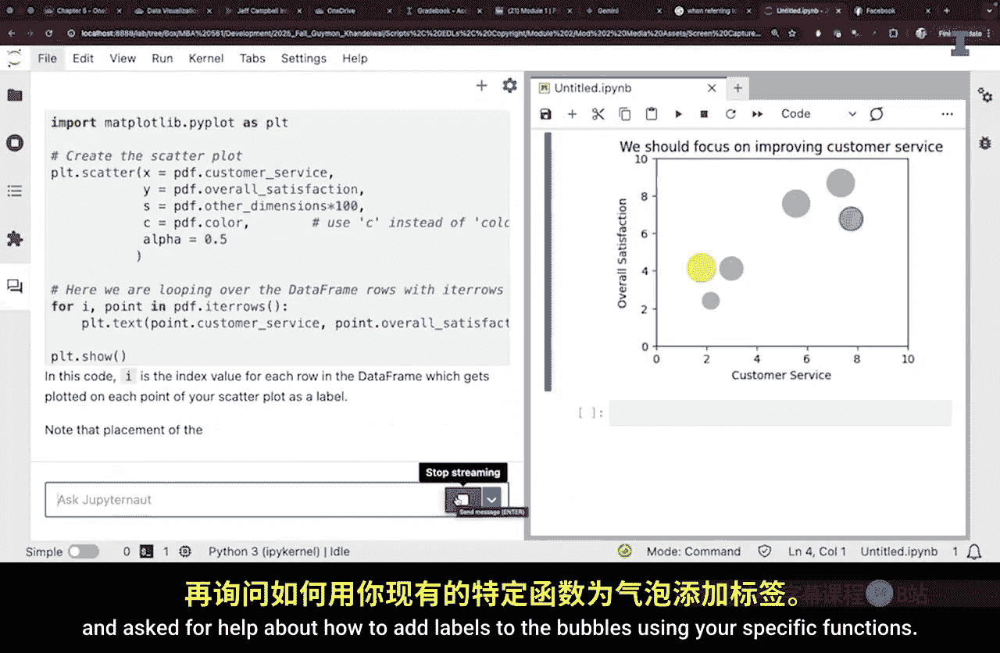
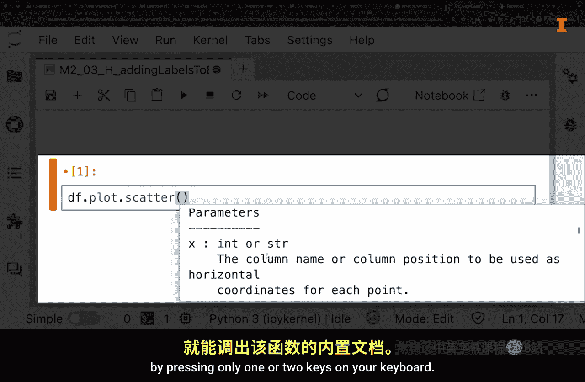
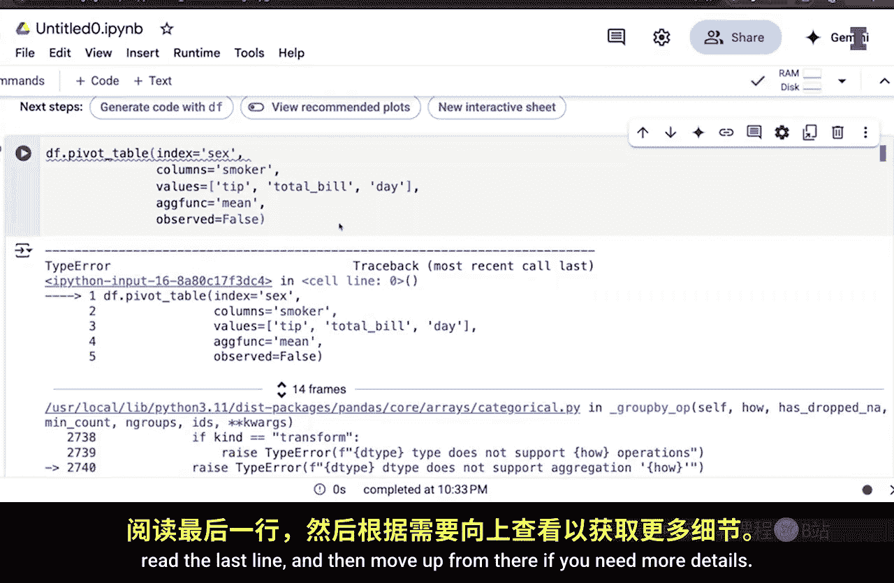
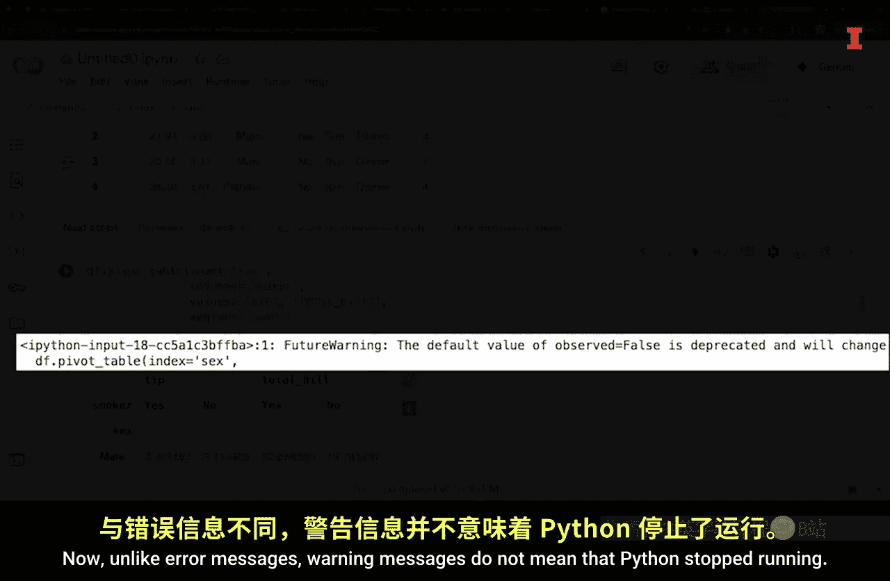

#  023：构建Python问题 🐍

在本节课中，我们将学习如何有效地构建关于Python的问题。无论是向他人请教还是使用AI工具，清晰地描述你的问题、提供足够的上下文信息，是获得有效帮助的关键。我们将探讨三种常见场景：开始新项目、扩展现有代码以及修复代码错误。

---

## 引言：从自然奇观到代码问题 🌄

大家好，欢迎来到本模块。今天，我们身处犹他州南部布莱斯峡谷令人惊叹的红色岩石群中。看看这些不可思议的峡谷层，这个地方会激发人们提出“这是如何形成的？”之类的问题。

在本模块中，我们将讨论如何构建问题，特别是关于使用Python的问题。我向一位经验丰富的程序员请教了他如何获得编码问题的答案。让我们听听他怎么说。

---

## 专家访谈：Jeff Campbell的经验分享 💡

**关于Jeff Campbell：**
Jeff Campbell是一位拥有超过30年经验的软件工程师。他目前为耶稣基督后期圣徒教会工作，担任移动团队的首席软件开发人员，负责移动应用程序。他的职业生涯涵盖了非营利和营利性企业，曾在Intuit（开发QuickBooks）、州政府以及初创公司工作。

**关于集成开发环境（IDE）的工具：**
编程语言及其库非常庞大。IDE提供的工具，如代码补全、自动编写代码段或重构功能，至关重要。重构尤其重要。一个好的IDE能帮助你识别潜在问题，让你专注于手头的任务，而不是去回忆具体的语法。这就像文字处理软件中的拼写检查器一样。

**关于人工智能（AI）工具：**
AI工具很有趣，它是一种爱恨交织的关系。AI的代码补全功能超越了基础的语法提示。它能够根据你正在编写的代码上下文，建议完成整段代码。很多时候，它能准确地写出你打算写的内容，节省了编写5到10行代码的时间。

然而，必须谨慎使用AI生成的代码。你总是需要二次检查。AI生成的代码在概念上可能是正确的，但具体实现可能有误。例如，在翻译工作中，AI填充的词语可能只有60%的正确率。如果盲目采用，可能导致数据损坏或误解。因此，使用这些工具时必须小心，并验证其输出。

未来的软件开发可能演变为AI辅助编写代码，而工程师则扮演代码审查的角色。AI可以根据设计图生成代码，但你仍然需要仔细检查和修正。对于新手开发者来说，尤其要注意，不能盲目接受AI的建议，因为可能隐藏着内存泄漏或效率低下的问题。你需要有扎实的软件开发基础，才能识别模式并确保其正确性。

---

## 构建Python问题的三种典型场景

现在，让我们考虑三种你会想要构建关于如何使用Python的问题的典型场景。这三种场景是：
1.  在开始新项目时，寻求帮助来创建Python代码。
2.  寻求帮助来扩展现有的Python代码。
3.  寻求帮助来修复代码中的错误。

---

### 场景一：开始新项目时创建代码 🚀

上一节我们了解了专家的建议，本节中我们来看看在项目伊始如何提问。假设你想使用历史销售数据来预测未来销售。

**以下是提问时的关键要点：**

*   **提供数据信息：** 无论向人类还是AI求助，都应尝试包含数据信息。包括数据集中每一行代表什么、列名是什么，以及数据样本（如前五行）。这为确定哪种分析方法最有效提供了有用的上下文，因为并非所有分析都适用于所有类型的数据。
*   **先问分析，再问代码：** 另一个重要细节是，在开始询问实现分析的代码之前，你可能会先就具体的分析提出广泛的问题。因此，计划提出后续问题，以帮助你了解更多关于建议分析的信息。
*   **善用视频和文档：** 当你开始一个从未做过的项目时，视频教程会很有帮助。每当需要做的不仅仅是实现代码时，视频可以帮助你更好地理解细节，例如等待时间或使用哪些按键。此外，无论是否有AI工具，都有内置文档可供访问。

---

### 场景二：扩展现有代码时 🔧

在上一节我们讨论了如何开始一个新项目，本节中我们来看看如何对已有代码进行扩展。在这种情况下，记住要提供你现有的代码。

这很重要，因为用代码做事通常有很多种方法。了解你的起点，以便在此基础上进行构建，而不是采用完全不同的方法，这样效率更高。

例如，假设你已经分析了销售数据并创建了预测的气泡图。现在你想在图表的气泡上添加标签。

如果你问一个关于“如何为气泡图添加标签”的通用问题，得到的回复可能会引导你创建一种不同类型的气泡图，这需要不同的函数和编程模块。这实际上是一个好处，因为Python中有许多优秀的编程模块可以用来创建气泡图。

但更好的做法是，分享你当前正在使用的代码，并询问如何使用你特定的函数来为气泡添加标签。

**以下是获取帮助的高效方法：**

*   **使用IDE内置文档：** 如果你想快速访问特定函数的参数，大多数IDE允许你只需按下一两个键盘按键，即可访问特定函数的内置文档。
*   **利用集成AI环境：** 当你在集成了AI的环境中工作时，你可能会对最初看到的内容感到惊讶，以为有人在读你的心思。有时，这些AI工具会从你现有的代码中推断出你想做什么，并建议大块的代码，你只需按Tab键即可实现。这非常棒。你可能只需要高亮显示需要帮助的代码，然后输入你的问题，这样就节省了将代码从IDE复制粘贴到AI工具中的时间。

---

### 场景三：修复代码错误时 🐛

最后，现在让我们考虑第三种场景：当你寻求帮助修复代码中的错误时。

首先，看到错误信息时不要惊慌。在这个过程中你肯定会遇到一两个错误信息，而且它们可能非常长。然而，这并不意味着你搞砸了什么，所以不用太担心。

当Python遇到错误时，它会停止运行并打印一条消息，以帮助你识别错误来源。对于我们的目的，你只需跳到错误信息的末尾，阅读最后一行，然后如果需要更多细节，再从那里向上看。

Python是一种通用编程语言，错误信息的长篇部分可能对创建新软件的人有用，但对你来说可能不是。你也可能会遇到警告信息。与错误信息不同，警告信息并不意味着Python停止了运行。

警告意味着你可能需要更改代码以澄清你的意图，或者更新代码以满足新标准。如果你使用的编程语言内置了AI，那么你可能只需要点击一个按钮，它就会解释你得到的错误信息或警告信息，甚至可能建议修复代码的方法。

---

## 总结 🎯

本节课中，我们一起学习了如何有效地构建Python问题。无论是探索Python的复杂性还是布莱斯峡谷的地质奇观，请记住清晰的沟通是关键。考虑你项目的背景，提供相关细节，并具体说明你的需求。无论你是开始新项目、扩展现有代码还是排查错误，清晰的沟通和分享相关信息都将帮助你获得最有效的帮助。