#  024：利用外部资源构建问题 💻

在本节课中，我们将学习如何利用外部资源来帮助编写Python代码。你不需要也不可能记住所有代码，掌握寻求帮助的方法至关重要。

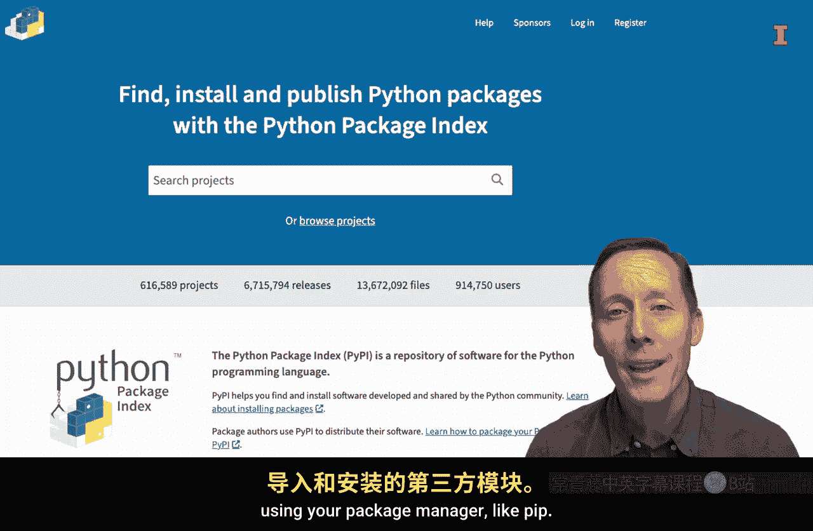

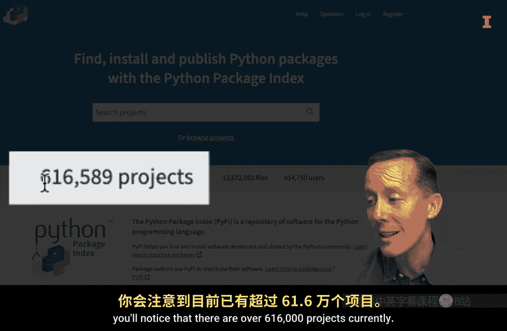

上一节我们介绍了编程的基本概念，本节中我们来看看如何借助外部工具高效地解决问题。

## 1. PyPI.org 📦

PyPI.org是Python的官方第三方软件包仓库。你可以在这里找到通过包管理器（如`pip`）安装的模块的文档。

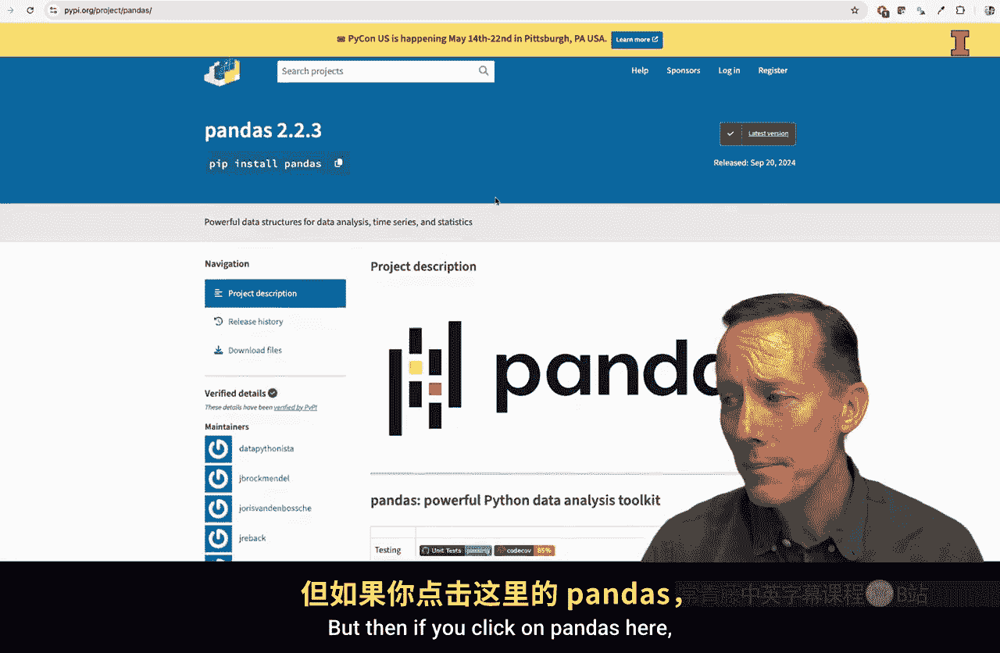

目前该网站上有超过616，000个项目，这正说明了记忆所有代码是不可能的。

当你对某个想使用的模块有疑问时，这个网站非常有用。例如，搜索`pandas`模块的信息。

以下是使用PyPI的步骤：
1.  访问PyPI.org网站。
2.  在搜索框中输入模块名称（如`pandas`）。
3.  从结果中找到正确的项目（通常是最相关或最流行的）。
4.  项目页面会提供当前版本、安装方法（如`pip install pandas`）等基本信息。
5.  对于像`pandas`这样流行的模块，通常会有详细的文档链接，引导你了解其功能和使用方法。

## 2. 互联网搜索引擎 🔍

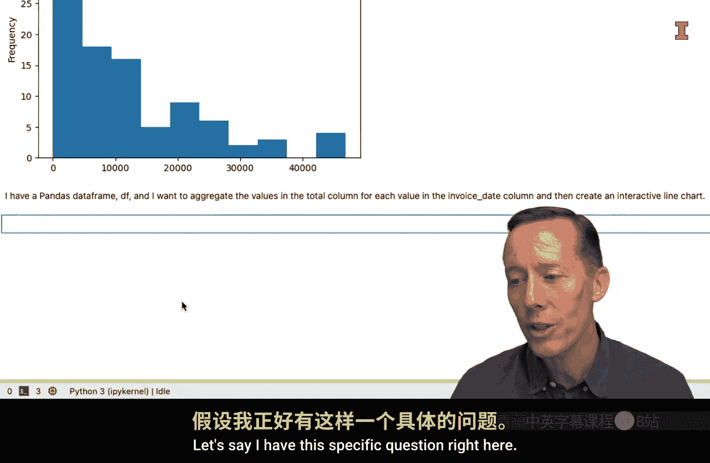

你的互联网搜索引擎是另一个强大的资源。关键在于如何清晰地描述你的问题。

假设你有一个具体问题：“我有一个pandas数据框`df`，想按`invoice_date`列的值聚合`total`列，并创建一个交互式折线图。”

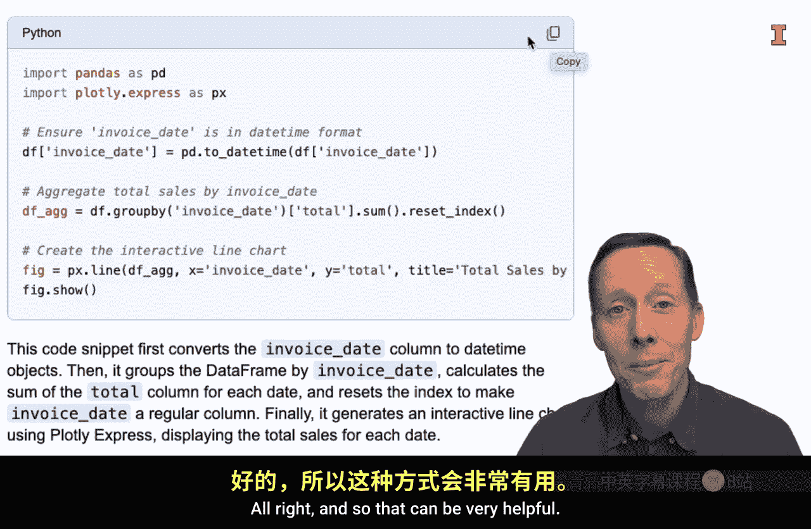

将这个问题输入搜索引擎，你会得到各种结果。通常，第一个结果可能是可以直接复制粘贴尝试的特定代码。此外，你经常会看到指向Stack Overflow的链接。

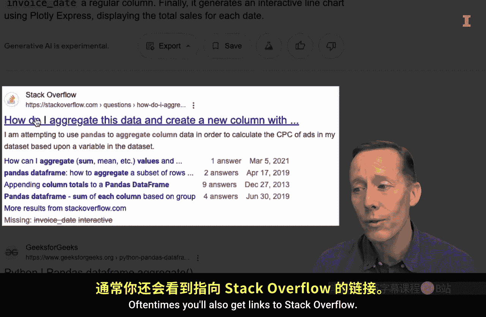

## 3. Stack Overflow 💬

Stack Overflow是一个编程问答社区，人们在这里提问和回答问题。

在搜索结果中，带有对勾标记的答案通常是评分最高的解决方案。使用Stack Overflow时，你需要阅读问题描述，然后将解决方案适配到你的具体场景中。

## 4. 独立AI工具（如ChatGPT）🤖

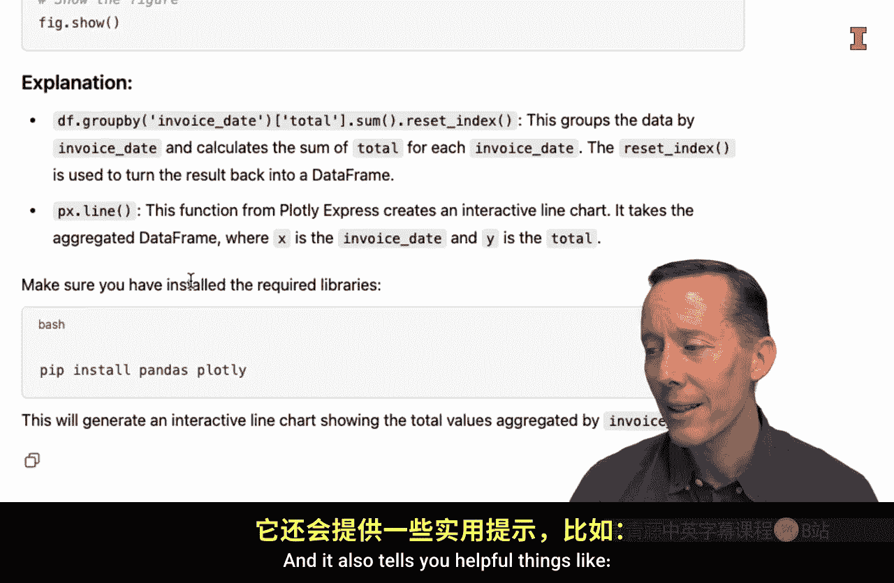

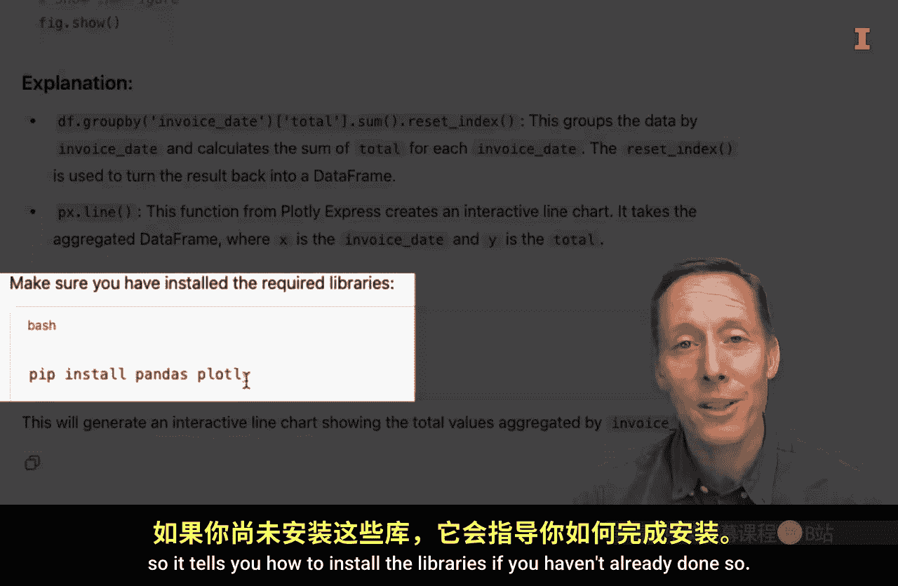

AI工具能提供更详尽、带有解释的代码建议。

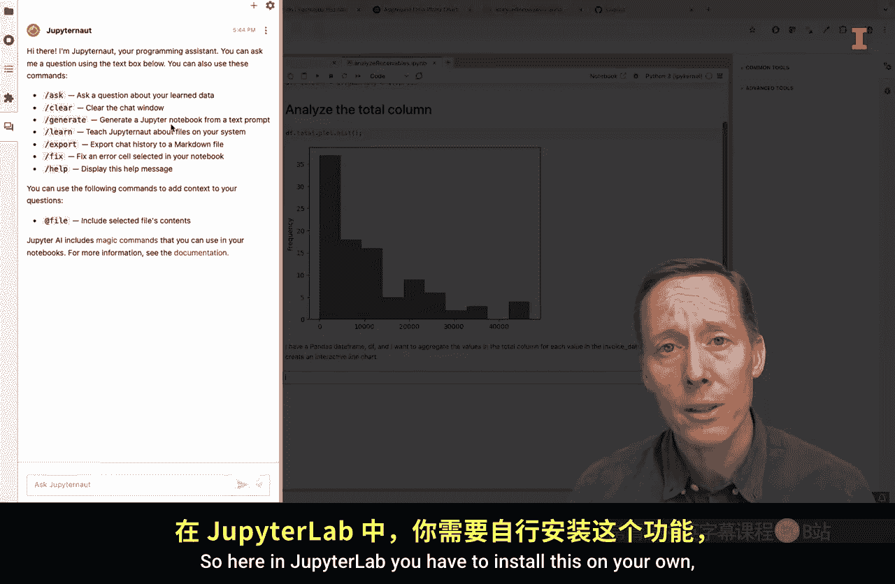

将同样的问题粘贴到ChatGPT中，它会生成一个更详细的响应，包括代码和每行代码作用的注释。它还可能提醒你安装必要的库。

这些工具的优点是，它们能生成可读性强的代码并附带解释，方便学习和理解。

## 5. 集成在IDE中的AI工具 ⚙️

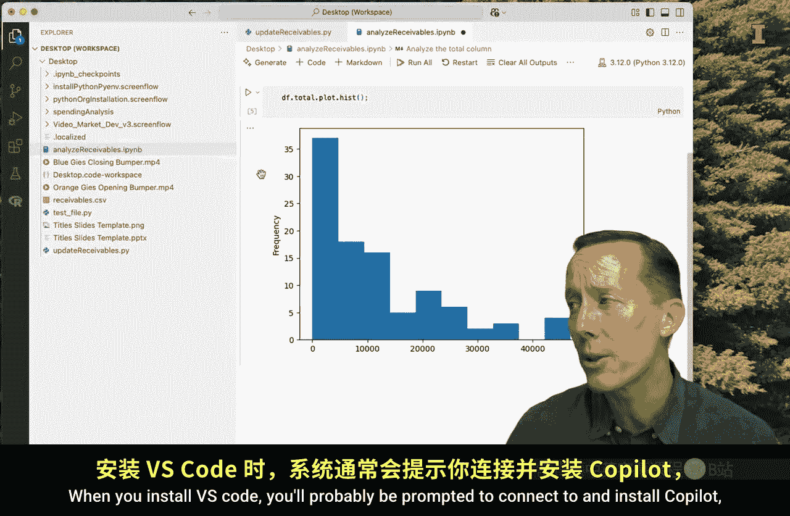

现在大多数集成开发环境都集成了AI功能，这使寻求帮助更加便捷。

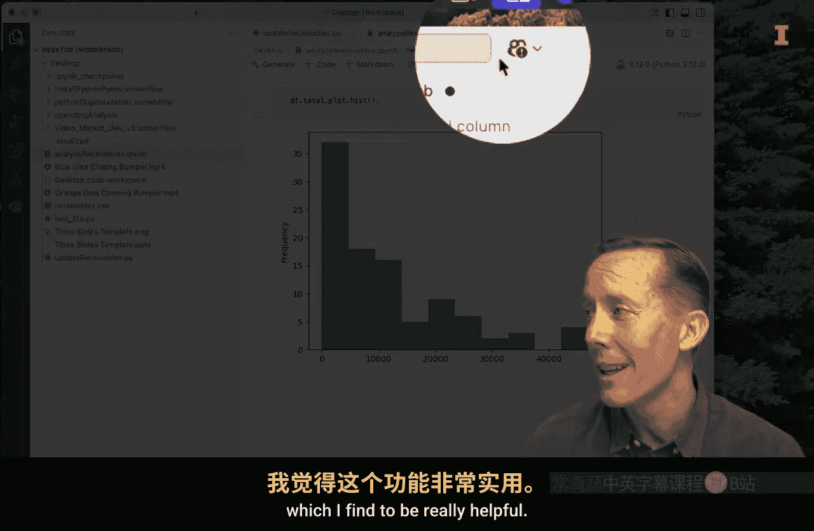

以下是几种常见IDE的AI集成方式：
*   **Jupyter Lab**：可以安装Jupyter AI等扩展，并连接到ChatGPT等AI服务。你可以直接在笔记本中提问，并一键将生成的代码插入单元格。
*   **Google Colab**：集成了Gemini。你可以打开侧边栏的助手，直接提问并获得代码，然后轻松插入到代码单元格中。
*   **VS Code**：安装后通常会提示连接Copilot。免费版本有一定使用限制。它可以提供代码自动补全，你也可以打开内联聊天直接向Copilot提问。

简而言之，集成AI工具让你无需切换浏览器标签，就能在编码环境中快速获得帮助并应用代码。

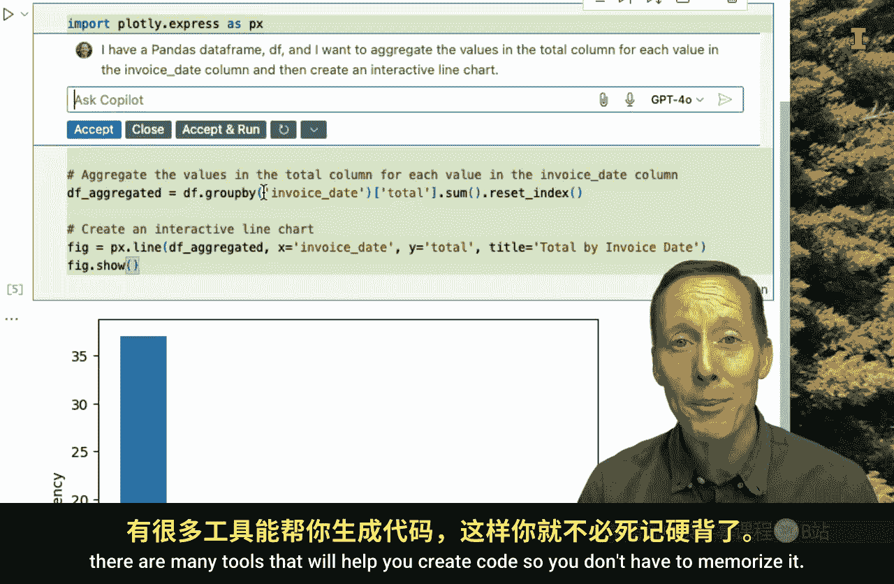

本节课中我们一起学习了五种利用外部资源构建Python代码的方法：PyPI.org、搜索引擎、Stack Overflow、独立AI工具以及集成在IDE中的AI工具。虽然这些工具非常高效，能节省大量时间，但它们无法替代你对Python的基础理解。你仍然需要能够清晰地表述问题。在掌握了基础知识后，这些外部工具将成为你使用Python完成任务时的得力助手。