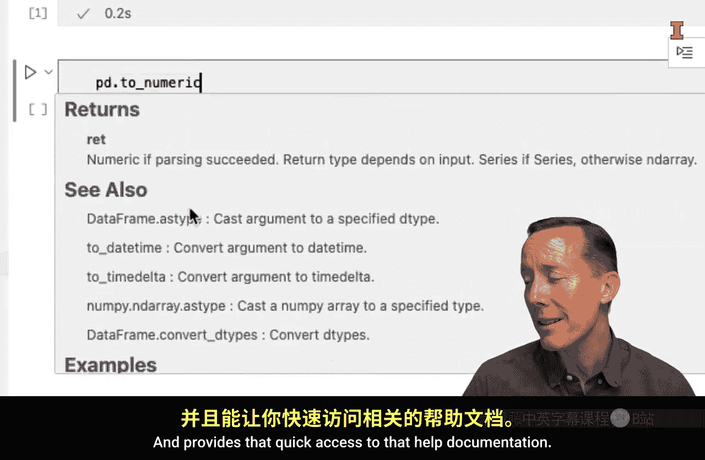

#  025：利用问题框架解析Python内置文档 📚


在本节课中，我们将学习如何从Python内置的帮助文档中获取信息。这类似于在Excel中使用函数向导，能帮助我们快速了解函数的功能和用法，从而提升编码效率。


## 访问内置函数列表 📋


上一节我们了解了在Excel中查找函数的方法。在Python中，我们同样可以查看所有可用的内置函数。

要查看Python内置的函数列表，可以使用`dir()`函数。具体操作是，将`__builtins__`作为参数传递给`dir()`函数。

以下是具体步骤：
*   在代码单元中输入`dir(__builtins__)`并运行。
*   运行后会得到一个函数列表。请注意，以大写字母开头或包含双下划线（如`__xxx__`）的函数通常是私有函数，我们一般不会直接使用。
*   我们主要关注那些使用蛇形命名法（全部小写，单词间用下划线连接，如`abs`）的函数，这些是我们常用的内置函数。

## 查看函数的帮助文档 ❓

一旦我们知道了想要使用的函数名，就可以使用`help()`函数来查看其详细文档。在Python中，这种内置的帮助文本被称为“文档字符串”。

例如，要查看绝对值函数`abs`的用法，可以运行`help(abs)`。执行后，你将看到关于`abs`函数功能、参数和用法的详细说明。

## 探索第三方模块的函数 🔍

大多数时候，我们会使用需要先导入的第三方模块中的函数。以数据分析中常用的`pandas`模块为例。

首先，我们需要导入`pandas`模块，通常我们为其设置一个简短的别名`pd`：
```python
import pandas as pd
```

导入后，我们可以使用`dir(pd)`来查看`pandas`模块提供的所有函数和属性列表。同样，我们主要关注那些使用蛇形命名法的函数。

例如，如果我们对`to_numeric`函数感兴趣，可以运行`help(pd.to_numeric)`来获取该函数详细的帮助文档。

## 使用IDE快捷键提高效率 ⚡

直接使用`dir()`和`help()`函数是基础方法，但利用集成开发环境（IDE）的快捷键可以更高效地访问帮助文档。

不同的IDE有不同的快捷方式。以下是两种常见环境的用法：

**在Jupyter Lab中：**
*   **自动补全**：输入`pd.`后，按`Tab`键会自动弹出可用函数列表。
*   **查看文档**：将光标放在函数名（如`pd.to_numeric`）上，按`Shift+Tab`键可以快速弹出格式清晰的帮助文档。

**在Visual Studio Code (VS Code) 中：**
*   **自动补全**：输入`pd.`后，IDE会自动提示函数列表。
*   **查看文档**：将鼠标悬停在函数名上，会以更美观的格式显示帮助文档。

掌握这些方法，无论是直接调用函数还是使用IDE快捷键，都将显著提升你在Python中编写代码的效率。

## 总结 📝




本节课我们一起学习了如何有效地利用Python的内置帮助系统。我们掌握了使用`dir()`函数查看可用函数列表，使用`help()`函数获取具体函数的详细文档。更重要的是，我们了解了如何在Jupyter Lab和VS Code等IDE中，通过`Tab`键自动补全和`Shift+Tab`/鼠标悬停等快捷键，更便捷地访问这些帮助信息。这些技能是独立学习和使用Python进行商业分析的重要基础。