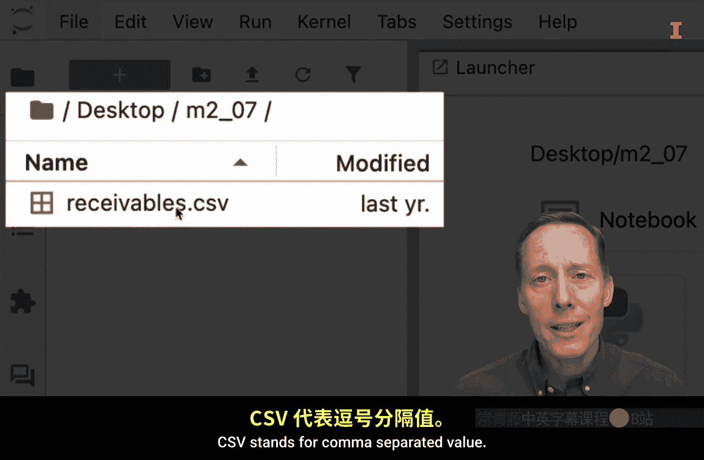
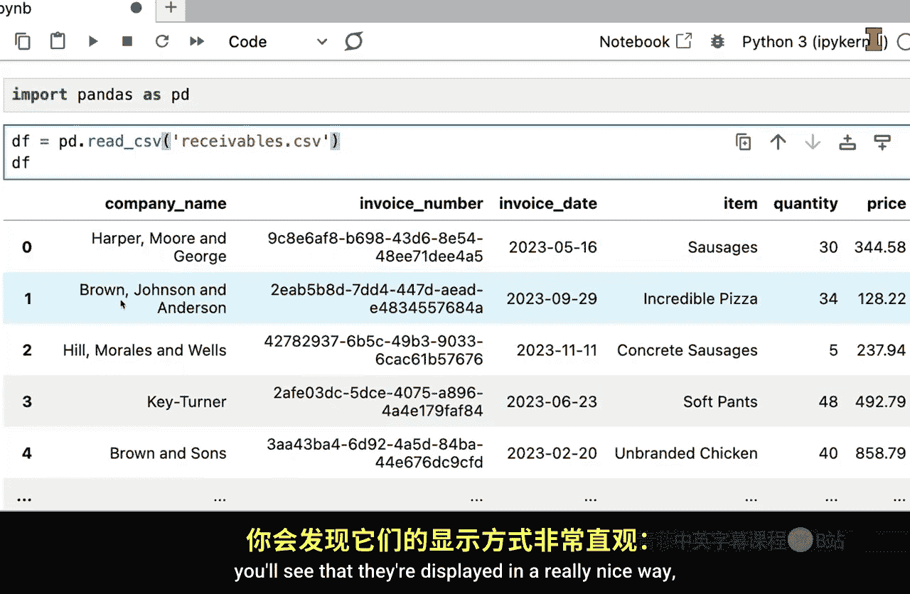
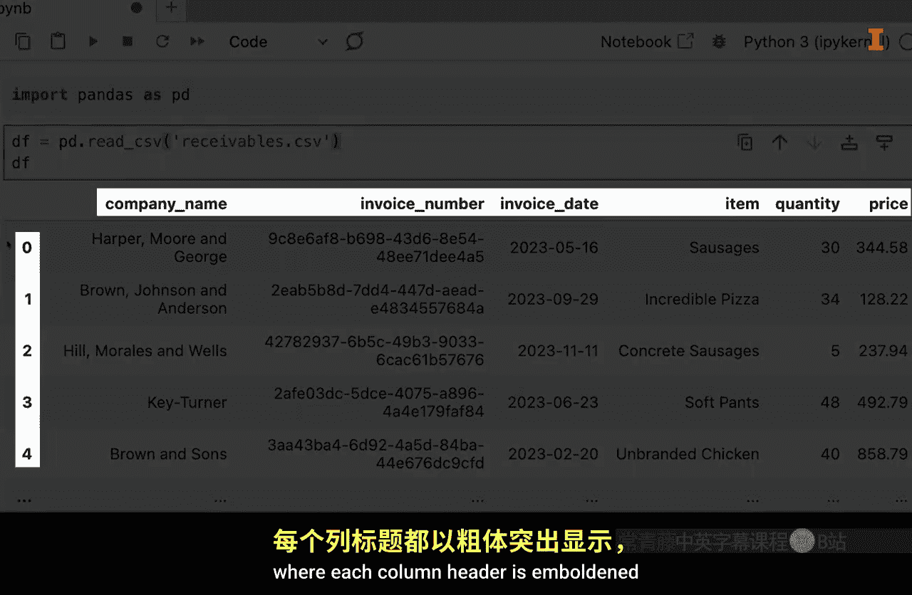

#  027：关于Pandas数据框的框架问题 🐼


在本节课中，我们将要学习Pandas库中一个核心的数据结构——数据框（DataFrame）。我们将了解如何创建数据框，以及如何查找和使用数据框自带的方法。

数据可以存储在许多不同的结构中。在本视频中，我们将重点介绍其中最重要的数据结构之一，即Pandas数据框，通常简称为数据框。关于数据框，我们有很多内容可以讨论，但在这个视频中，我们只想展示如何创建一个数据框，以便你随后可以提出关于如何使用数据框的问题。

## 数据框概述 📊




数据框类似于Excel工作表，数据被组织成行和列。通常，每一行代表一个观测值，每一列代表一个特征。

上一节我们介绍了数据框的基本概念，本节中我们来看看一些Pandas数据框的实际操作示例。


## 从CSV文件创建数据框 📂

首先，我们将演示如何将CSV文件作为Pandas数据框读入Python环境。

在创建Pandas数据框之前，需要从Pandas模块导入函数。我们通常从Pandas模块导入函数并将其重命名为`pd`，这样就不必每次都输入`pandas`。

```python
import pandas as pd
```

Pandas有很多不同的函数用于从不同文件格式读取数据，例如HTML、Excel文件、CSV文件等。由于我们要读取的数据是CSV格式，因此我们将使用`read_csv`函数。

```python
df = pd.read_csv('receivables.csv')
```

读取CSV文件中的数据并将其转换为Pandas数据框后，我们将其保存为一个变量`df`。然后我们可以输入数据框的名称来预览数据。

```python
df
```

运行代码后，数据框会以美观的格式显示，每个列标题和行索引值都会加粗显示。





## 从零创建数据框 🛠️

除了从文件读取，我们也可以从零开始创建数据框。这在某些情况下非常重要，并且你会发现数据框是由我们稍后将讨论的其他基础数据结构组成的。

以下是创建一个新数据框`df2`的示例：

```python
df2 = pd.DataFrame({
    'Column_A': [1, 2, 3],
    'Column_B': ['A', 'B', 'C']
})
df2
```


运行此单元格后，我们创建了一个包含三行两列的简单数据框。


## 数据框对象与方法 🔍

现在我们已经创建了两个数据框，可以开始对它们提出问题。Python中一个非常重要的概念是创建对象。对象是特定类型的实例。


数据框对象因其是Pandas数据框而继承了特定的函数。这些由对象继承的函数被称为**方法**。


要查看数据框对象可用的所有方法，可以在Jupyter Lab等IDE中输入数据框名称加一个点`.`，然后查看自动弹出的列表。

例如，`to_excel`方法允许我们将数据框对象写入Excel工作表。这是一个非常有用的功能。


要将我们创建的简单数据框写入Excel文件，只需使用`to_excel`方法：

```python
df2.to_excel('test_df.xlsx')
```

运行此代码后，你可以在文件资源管理器中找到新生成的`test_df.xlsx`文件。

这里要强调的是，为了访问Pandas数据框继承的这些函数或方法，首先必须创建一个数据框。一旦你知道如何创建Pandas数据框，就可以通过简单地输入数据框名称，然后使用IDE中的快捷方式来查找相关的帮助文档，并访问与它们关联的方法。

## 总结 📝


本节课中我们一起学习了Pandas数据框的基础知识。我们了解了数据框是一种类似于Excel工作表的结构，用于存储行列数据。我们掌握了两种创建数据框的方法：从外部文件（如CSV）读取数据，以及使用`pd.DataFrame()`函数从零创建。最重要的是，我们学习了数据框作为对象，拥有许多内置方法（如`to_excel`），并知道了如何在IDE中查找和使用这些方法的帮助文档。这是后续深入学习数据操作和分析的重要基础。