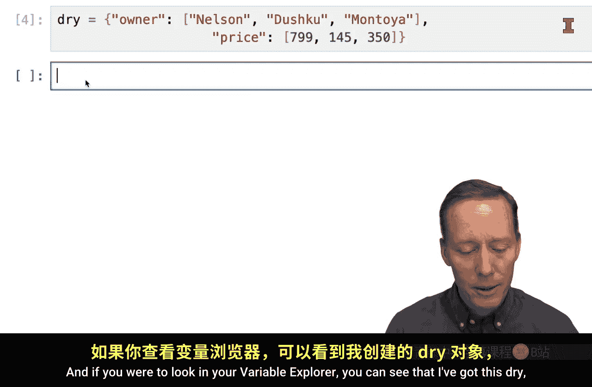
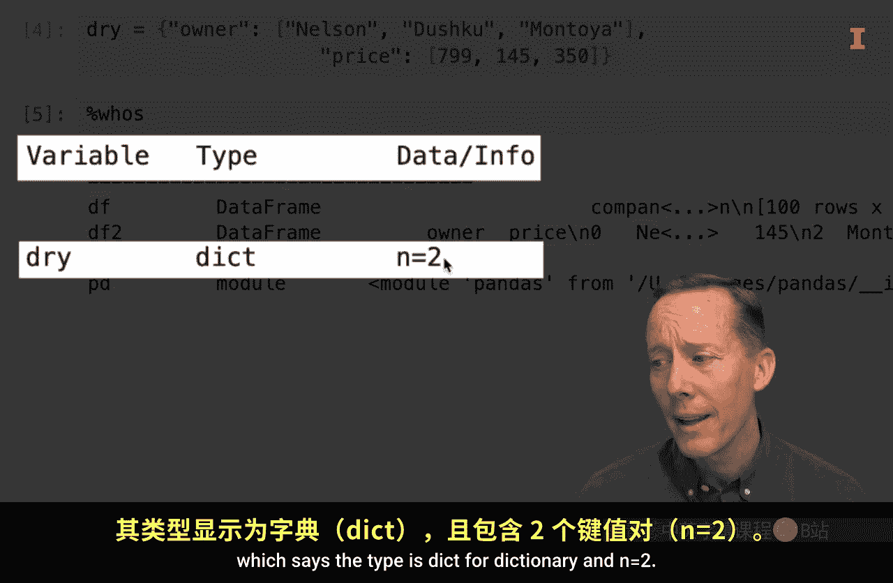
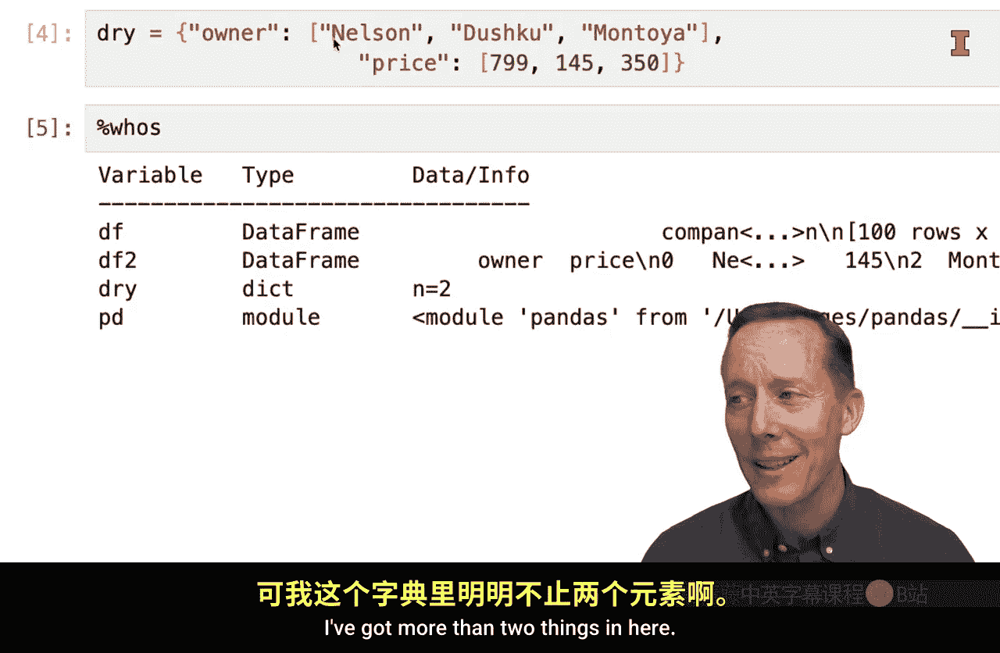
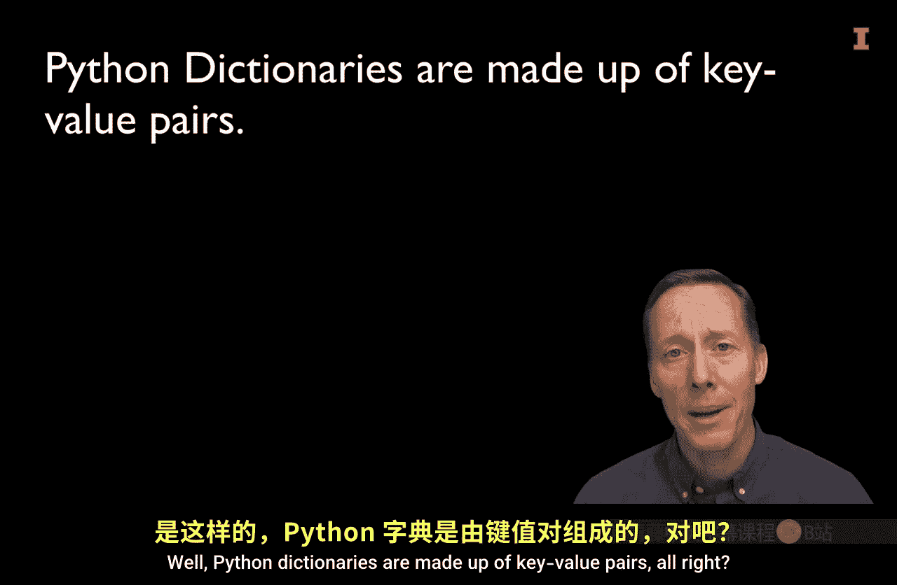
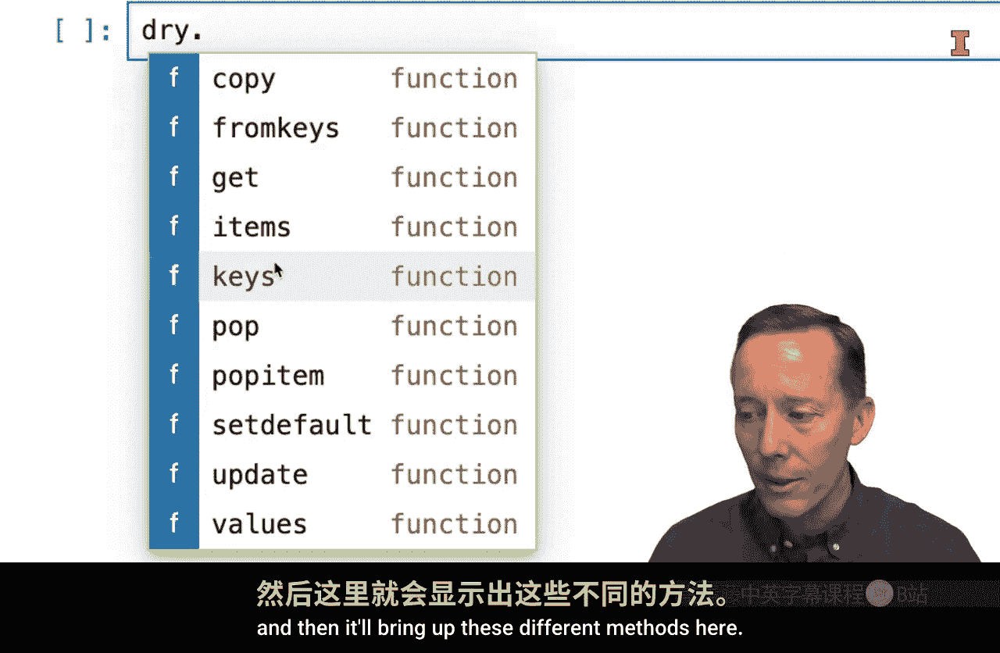
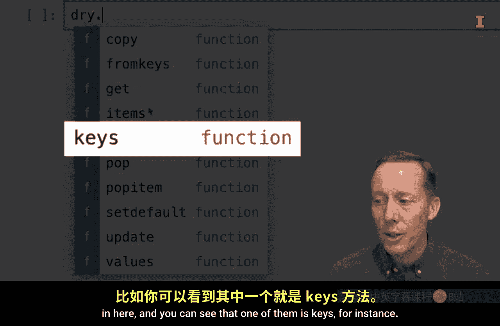
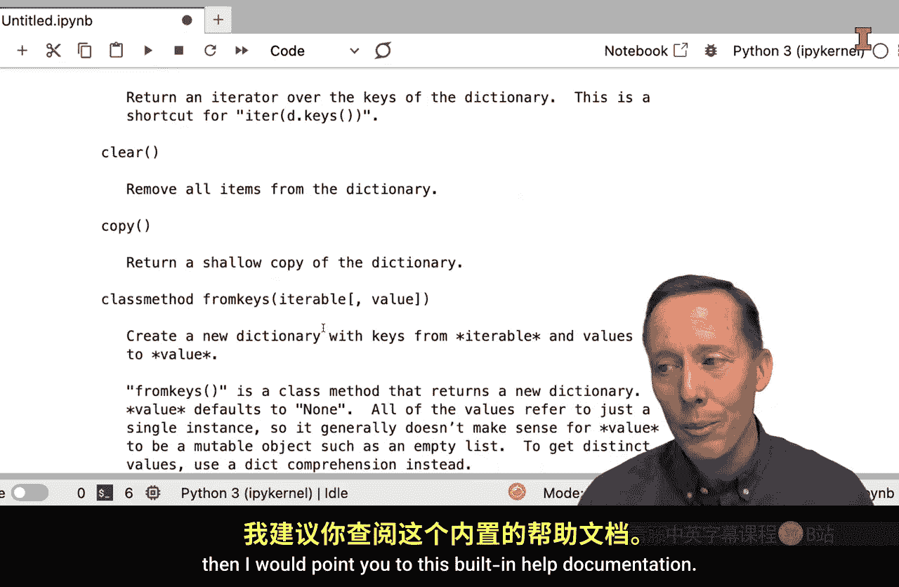

#  028：Python字典基础教程 📚


在本节课中，我们将要学习Python中的一种基础数据结构——字典。我们将了解字典的构成、特点以及如何查找和使用字典的帮助文档。

---

## 什么是Python字典？ 🔑

Python字典是一种基础数据结构，无需导入任何模块即可创建。在数据分析中，字典是一种常用且重要的数据结构。

字典由**键值对**组成。每个键值对包含一个键和一个对应的值，键和值之间用冒号分隔，键值对之间用逗号分隔，整个字典用花括号 `{}` 括起来。

例如，以下代码创建了一个字典：
```python
dry = {'owner': ['John', 'Jane'], 'price': [100, 200]}
```



在这个例子中，字典 `dry` 包含两个键值对：键 `'owner'` 对应值 `['John', 'Jane']`，键 `'price'` 对应值 `[100, 200]`。



---

## 字典的键值对结构 🗝️

上一节我们介绍了字典的基本概念，本节中我们来看看字典的核心结构——键值对。

字典中的每个条目都是一个键值对。键是唯一的，用于查找对应的值。你可以通过键来访问字典中的值。





例如，要访问字典 `dry` 中键 `'owner'` 对应的值，可以使用以下代码：
```python
dry['owner']
```
运行这段代码将返回 `['John', 'Jane']`。

这种访问方式类似于查字典：通过单词（键）查找定义（值）。

---

## 字典的常用方法 📖

了解了字典的基本结构后，我们来看看字典对象有哪些可用的方法。

字典作为Python对象，继承了一系列方法。要查看这些方法，可以先创建一个字典对象，然后使用点号 `.` 查看。

例如，对于字典 `dry`，输入 `dry.` 后，会显示一系列可用的方法，如 `keys()`、`values()`、`items()` 等。

以下是几个常用方法的示例：
*   `dry.keys()`：返回字典的所有键。
*   `dry.values()`：返回字典的所有值。
*   `dry.items()`：返回字典的所有键值对。

运行 `dry.keys()` 将返回 `dict_keys(['owner', 'price'])`。



---



## 如何查找字典的帮助文档 ❓

如果你需要更详细地了解字典的用法，可以查阅Python的内置帮助文档。

使用 `help(dict)` 函数可以获取关于字典数据类型的详细说明文档。这份文档包含了字典的创建、方法、操作等全面信息，是学习和查阅的好资源。

---



## 总结 📝


本节课中我们一起学习了Python字典的基础知识。我们了解到字典是一种由键值对组成的数据结构，可以通过键来快速访问对应的值。我们还学习了如何查看字典对象的方法以及如何利用 `help()` 函数获取详细的帮助文档。在后续的数据分析实践中，你会经常用到字典，例如作为函数参数或创建Pandas DataFrame。