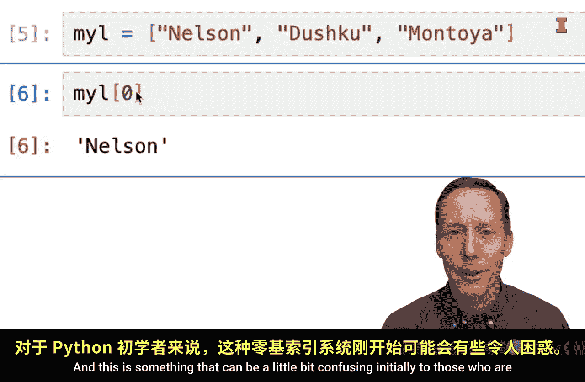
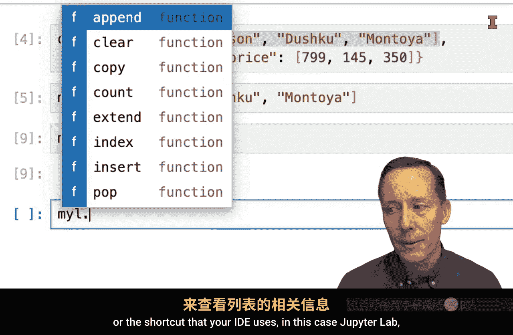
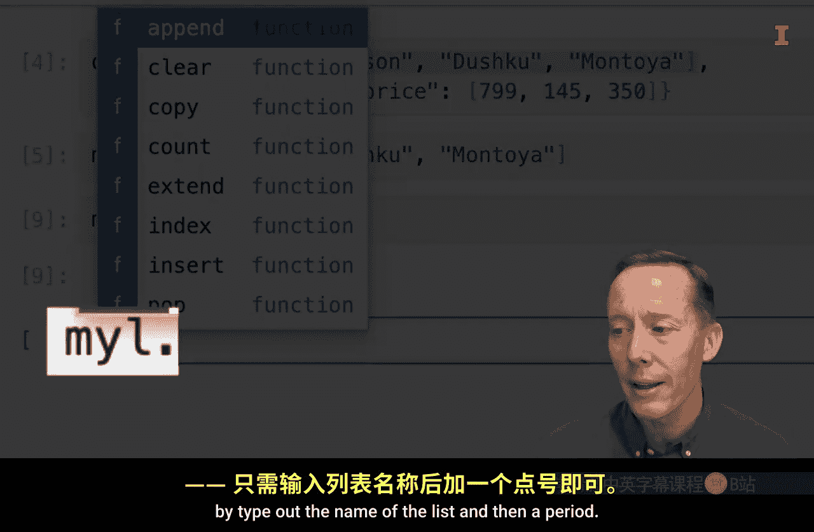
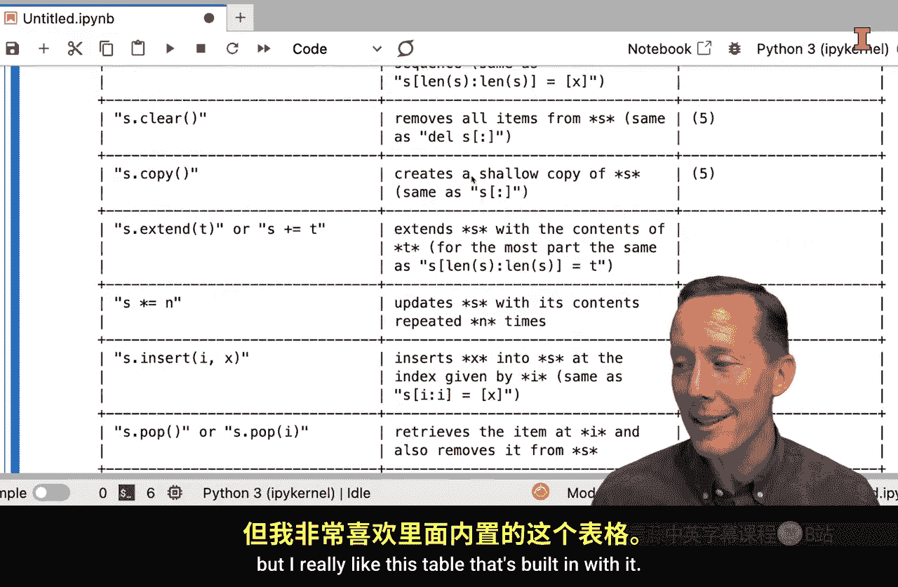

#  029：Python列表基础与提问框架 📚


在本节课中，我们将学习Python中另一个基础数据结构——列表。我们将了解列表是什么、它的特点、如何从中提取数据，以及如何查找关于使用列表的文档和帮助信息。

---

## 什么是Python列表？ 📝

列表是Python原生的一种数据结构。它用于存储一系列有序的元素。

在代码中，列表由方括号 `[]` 定义，其中的元素用逗号分隔。例如，从一个字典的值中提取出的列表可能如下所示：

```python
my_list = ['Nelson', 'Montoya']
```

---

## 如何访问列表中的元素？ 🔍

访问列表元素是列表最常用的操作之一。这通过索引实现。

Python使用**从0开始的索引系统**。这意味着第一个元素的索引是0，第二个是1，依此类推。

### 访问单个元素




要访问列表中的单个元素，需使用列表名称后跟方括号，并在方括号内指定元素的索引位置。

例如，要获取列表 `my_list` 的第一个元素 `'Nelson'`，应使用索引0：

```python
my_list[0]  # 返回 'Nelson'
```

要获取第三个元素 `'Montoya'`（假设列表中有足够元素），则使用索引2：

```python
my_list[2]  # 返回 'Montoya'
```

### 访问连续的元素（切片）

如果需要获取列表中连续的一段元素（即切片），可以使用冒号 `:` 分隔起始索引和结束索引。

**重要规则**：切片操作包含起始索引，但**不包含**结束索引。

*   要获取前三个元素（索引0, 1, 2），应使用 `my_list[0:3]`。因为结束索引3不被包含。
*   如果只想获取前两个元素（索引0, 1），则应使用 `my_list[0:2]`。

---

## 如何查找列表的方法和帮助文档？ ❓

列表作为Python的内置对象，拥有许多内置方法（函数）。当你不确定如何操作列表时，可以查阅相关文档。

以下是查找帮助信息的几种方法：

1.  **使用 `dir()` 函数或IDE提示**：输入列表变量名加一个点 `.`，大多数集成开发环境（如Jupyter Lab）会自动显示该列表可用的所有方法列表。
2.  **使用 `help()` 函数**：你可以对特定的列表方法使用 `help()` 函数来获取详细说明。例如：`help(my_list.append)`。
3.  **查阅官方文档**：你也可以直接使用 `help(list)` 来查看列表数据结构的完整官方文档。这份文档虽然不如字典的长，但包含了一个非常有用的方法汇总表格，清晰地列出了所有可用的操作。

---





## 总结 📌

本节课中，我们一起学习了Python列表的基础知识。

我们了解到列表是一种用方括号 `[]` 表示的有序数据结构。访问其元素需使用**从0开始的索引**，并通过 `list_name[index]` 的语法进行。对于连续元素的切片，则使用 `list_name[start:end]` 的语法，并记住结束索引不被包含。

最后，我们掌握了如何利用 `dir()`、`help()` 函数以及IDE的提示功能来查找列表的方法和官方文档，这是解决编程问题、自主学习的关键技能。




掌握了列表的基本操作后，你就能在数据分析中有效地组织和处理一系列数据了。