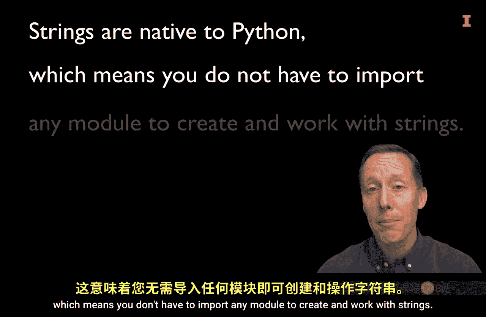
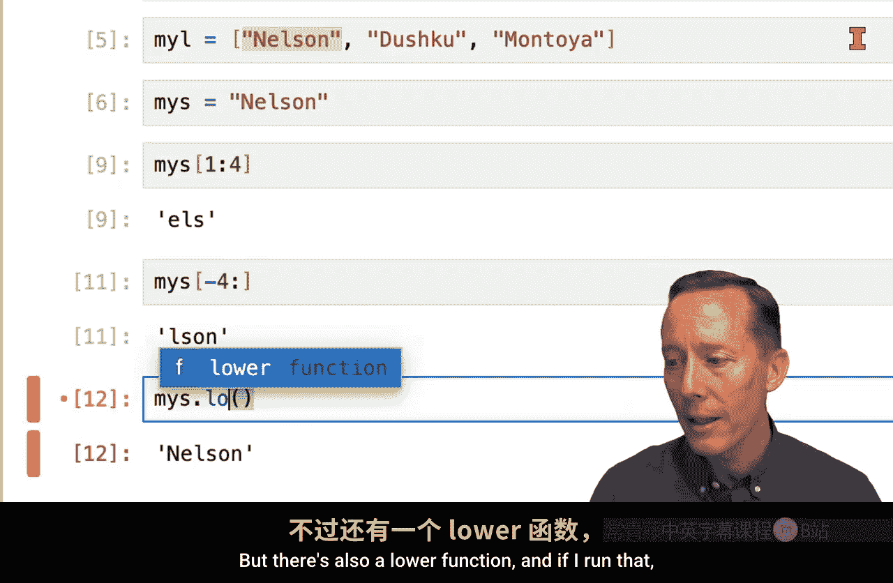
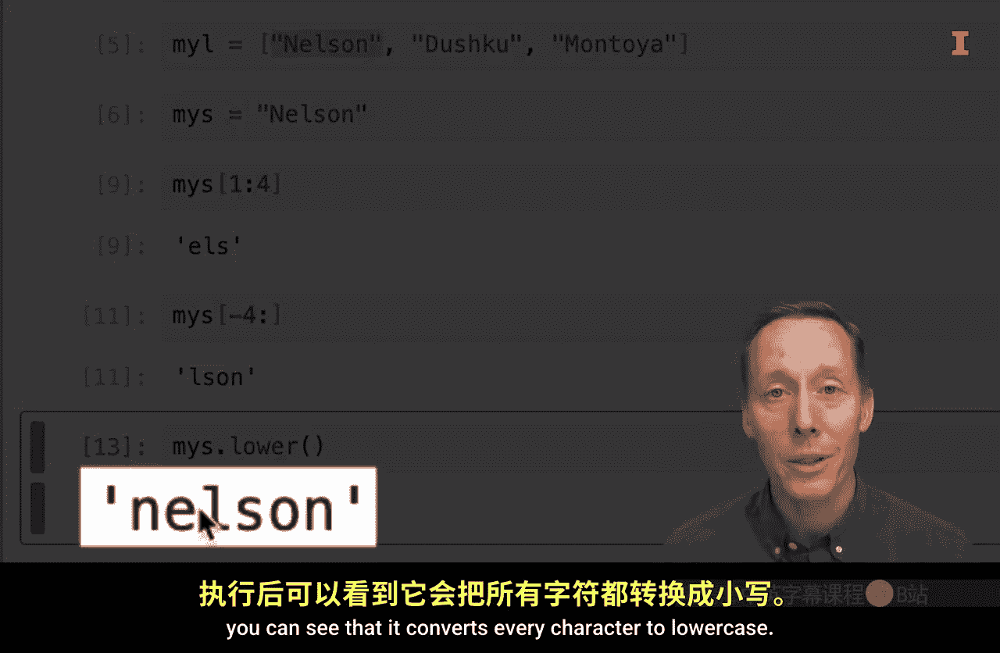
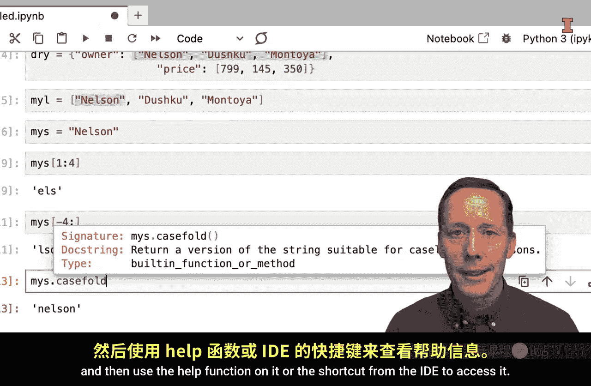
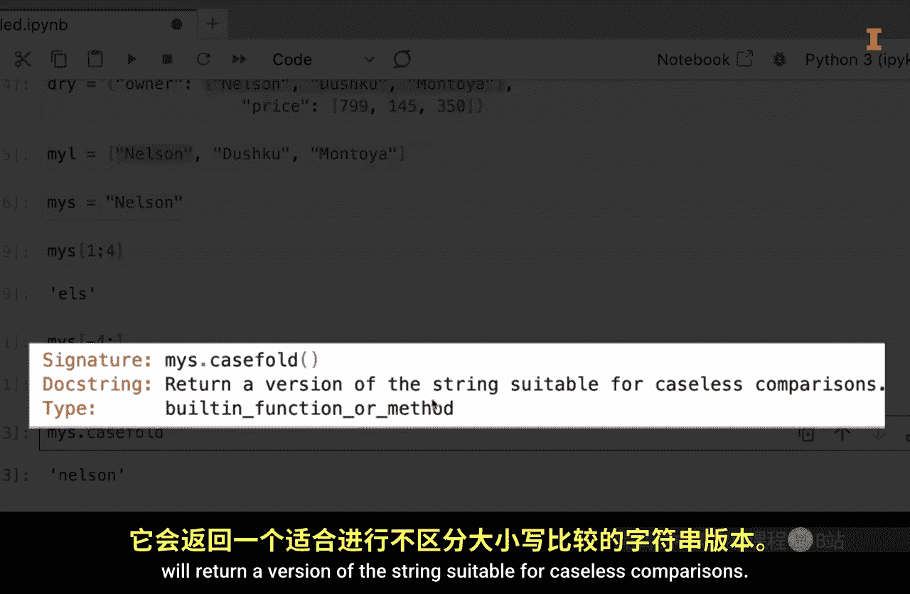
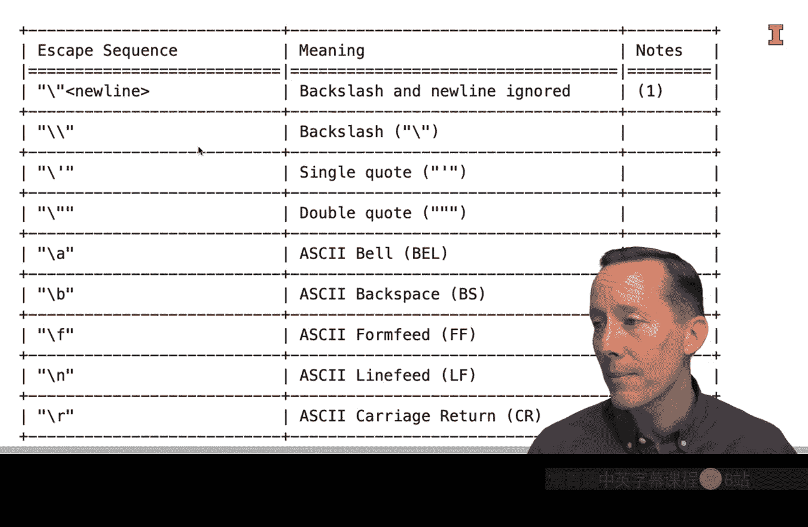
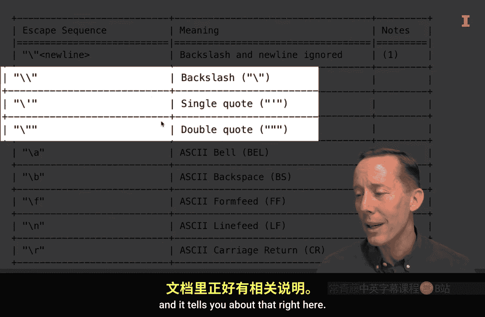
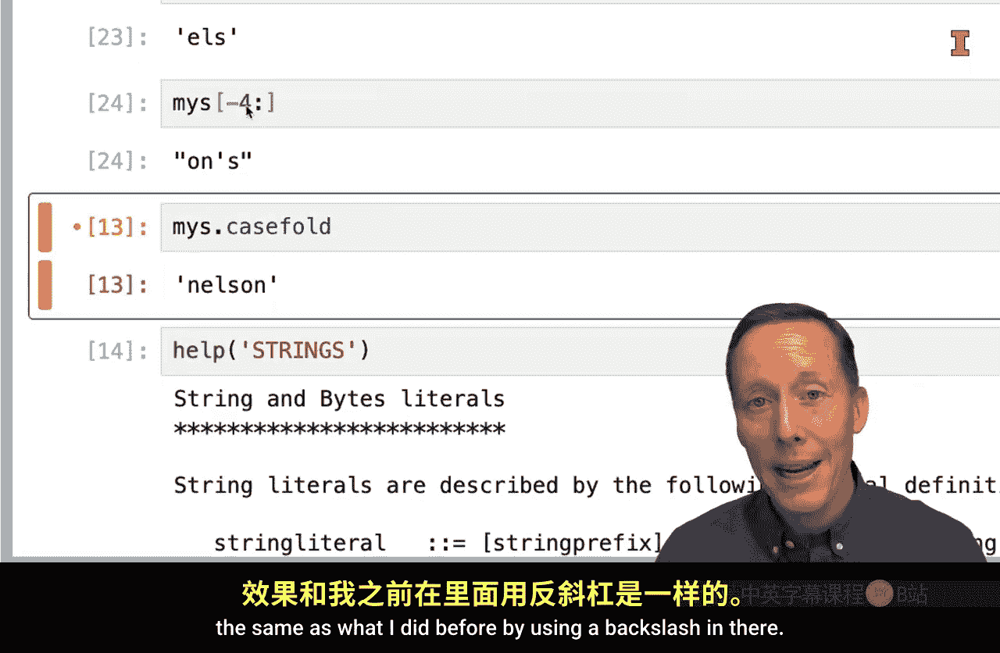

#  030：字符串基础与问题构建 🧵

在本节课中，我们将要学习Python中一个非常基础但极其重要的数据结构——字符串。你将了解到字符串是什么、如何创建它们、如何访问其中的字符，以及如何利用Python的内置帮助文档来探索字符串的各种操作方法。



## 什么是字符串？

字符串，顾名思义，是由字符“串”在一起组成的。在Python中，你可以通过将字符放在单引号 `'` 或双引号 `"` 内来创建一个字符串。字符串是Python的原生数据类型，这意味着你无需导入任何模块即可创建和使用它们。

## 创建与访问字符串

让我们通过一个例子来开始。假设我们创建一个名为 `my_s` 的字符串变量，其值为 `"Nelson"`。

```python
my_s = "Nelson"
```

创建字符串后，我们可以像处理列表一样，通过索引来访问其中的特定字符。字符串的索引也是从0开始的。

以下是访问字符串元素的方法：
*   **访问单个字符**：使用方括号 `[]` 和索引号。例如，`my_s[0]` 返回第一个字符 `'N'`。
*   **访问字符序列（切片）**：使用冒号 `:` 指定起始和结束索引。例如，`my_s[1:4]` 返回从索引1到索引3的字符（即 `'els'`），注意结束索引本身不包含在结果内。
*   **从末尾开始访问**：使用负索引。例如，`my_s[-1]` 返回最后一个字符 `'n'`。`my_s[-4:]` 则返回从倒数第四个字符到末尾的所有字符（即 `'lson'`）。

## 探索字符串的方法





字符串对象拥有许多内置方法（函数）。在Jupyter Lab等集成开发环境中，输入字符串变量名后加一个点 `.`，通常会弹出可用方法的列表。





例如，我们可以尝试一些方法：
*   `my_s.capitalize()`: 将字符串首字母大写（如果已经是，则无变化）。
*   `my_s.lower()`: 将字符串中所有字符转换为小写。

如果你想了解某个方法的具体用途，可以使用 `help()` 函数。例如，运行 `help(my_s.casefold)` 可以查看 `casefold` 方法的文档，该方法返回一个适用于不区分大小写比较的字符串版本。





## 处理字符串中的引号

有时，字符串本身需要包含引号字符。这可能会与定义字符串的引号产生冲突。Python的帮助文档提供了解决方案。

以下是处理字符串内引号的方法：
*   **使用转义字符**：在字符串内的引号前添加反斜杠 `\`。例如，`my_s = 'Nell\'s son'`。
*   **交替使用引号类型**：用双引号定义包含单引号的字符串，或用单引号定义包含双引号的字符串。例如，`my_s = "Nell's son"`。

当代码出现类似 `SyntaxError: unterminated string literal` 的错误时，通常就是因为引号匹配问题，上述方法可以帮助你解决。

## 总结




本节课中，我们一起学习了Python字符串的基础知识。我们了解了如何创建字符串、如何使用索引和切片访问字符串中的字符，并初步探索了字符串的内置方法。最重要的是，我们学会了如何利用 `help()` 函数和IDE的提示功能来构建关于字符串使用的问题并寻找答案，这是在Python学习中持续进步的关键技能。在后续课程中，你将获得大量使用字符串的实践机会。