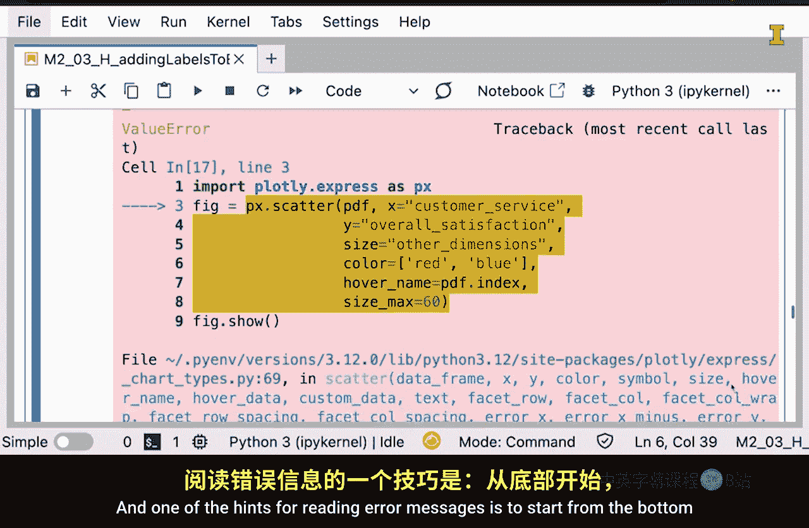

#  031：行动指南 🚀

在本节课中，我们将学习如何在学习Python数据分析时采取有效行动。我们将探讨三种具体方法，帮助你从提问、实验和错误中学习，从而更高效地掌握技能。

## 引言：行动的重要性 🏞️

今天我正沿着犹他州南部布莱斯角观景台附近一条美丽的小径徒步。徒步旅行本身就是一种行动，正如你所看到的蜿蜒曲折的小径。我必须留意落石，同时也想欣赏沿途的美景，让好奇心作为我的向导。

同样地，在学习如何使用Python进行数据分析时，你也需要采取行动。

## 三种行动方式 📝

以下是三种你可以采取的具体行动方式，它们将帮助你更好地学习和理解Python。

### 1. 审慎思考得到的回答

第一种方式是，仔细思考你提出的问题所得到的回答，尤其是那些来自人工智能的回答。我的意思是，你应该考虑这些回答如何与你现有的知识体系相契合。它们可能强化你目前对Python工作原理的理解，这很好。然而，如果你不理解某个回答，那么你应该尝试弄清楚它如何与你现有的理解相融合，这样你的理解就会增长。

### 2. 尝试小型代码实验

第二种方式是根据你得到的回答，尝试进行小型代码实验。我的意思是，你可以创建一小段代码并运行它，即使代码运行不成功也不必担心。事实上，我经常从失败的代码中学到的东西比从成功的代码中学到的更多。这有助于我更好地记住我正在学习的内容。

### 3. 阅读错误信息

第三件事是阅读错误信息。如果你像我一样，可能习惯于不阅读错误信息，因为它们看起来很可怕，你会想：“嘿，那是IT部门的问题。”但我想鼓励你去阅读这些错误信息。阅读错误信息的一个技巧是从底部开始，然后向上阅读，因为最有洞察力的部分通常位于错误信息的底部。

当然，会有一些错误信息你无法完全理解。如果是这种情况，只需将它们复制并粘贴到AI工具中，让它解释错误信息的含义。

## 总结与鼓励 🌟

正如我们讨论的，好奇心是那些在这条美丽小径上徒步前行者的驱动力。在学习使用Python进行数据分析时，也让好奇心成为你的向导：深思熟虑地对待你得到的回答，无畏地进行代码实验，并将错误信息视为学习和成长的机会。

现在，去实践吧！从你的Python代码得到的反馈中实验和学习，让好奇心成为你的向导，就像它是这条小径上徒步者的向导一样。

本节课中，我们一起学习了在学习Python数据分析时采取行动的三种核心方法：审慎思考回答、进行代码实验以及阅读错误信息。记住，行动和好奇心是学习过程中最强大的工具。