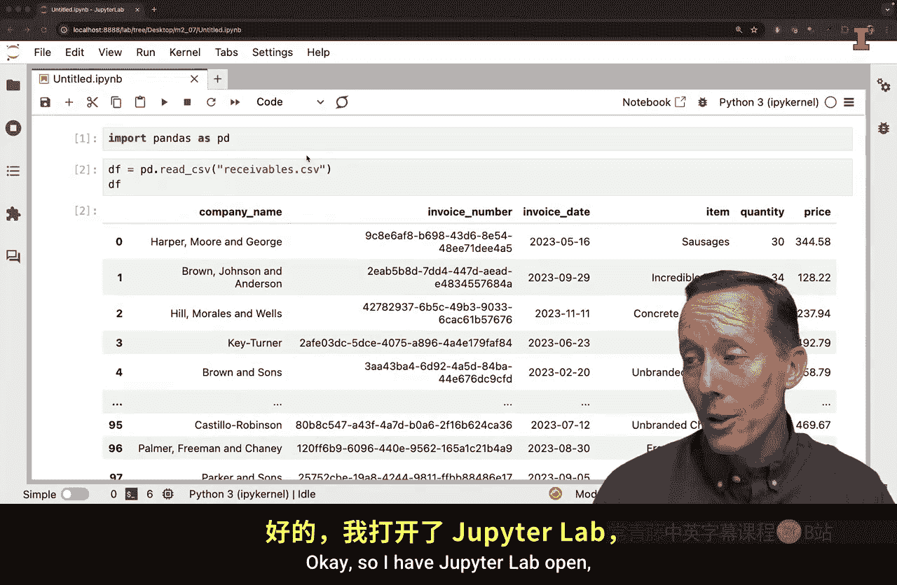
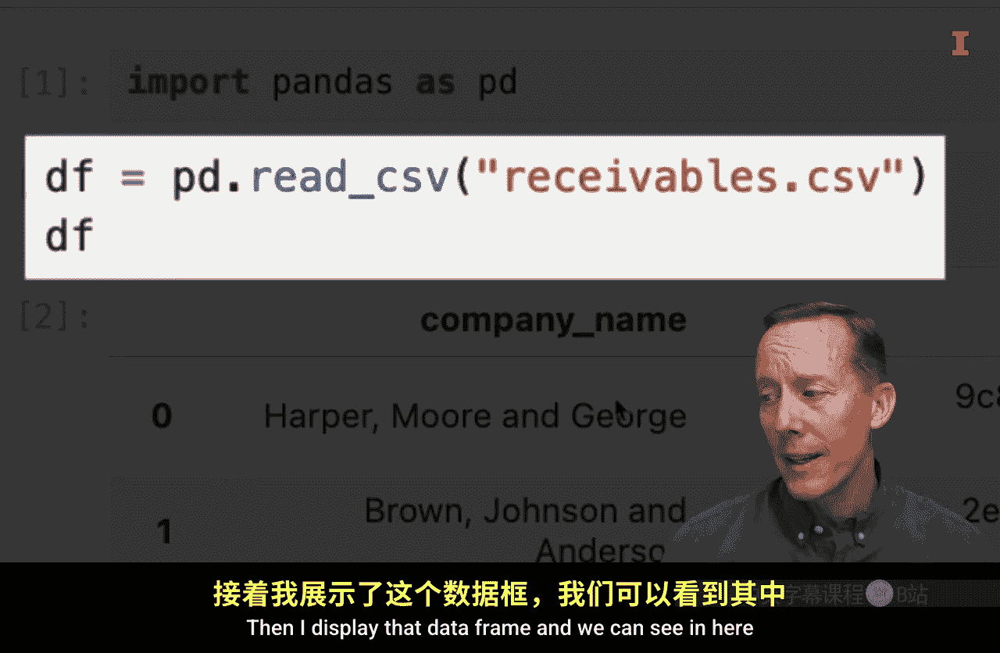
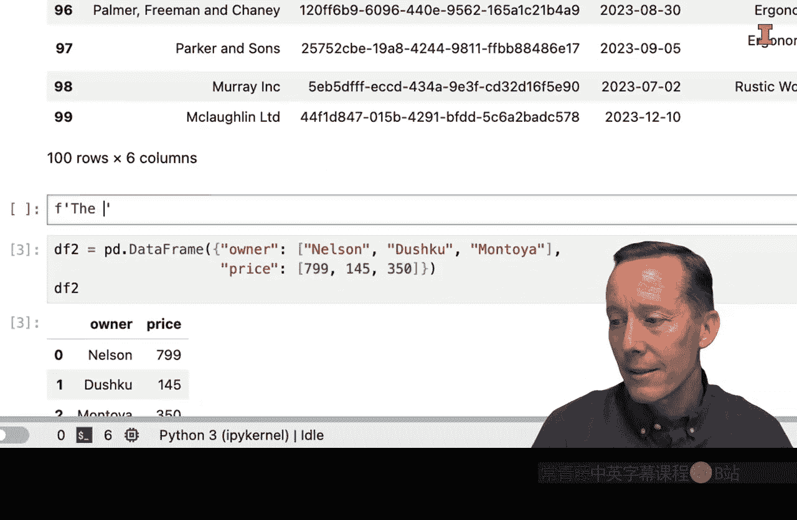
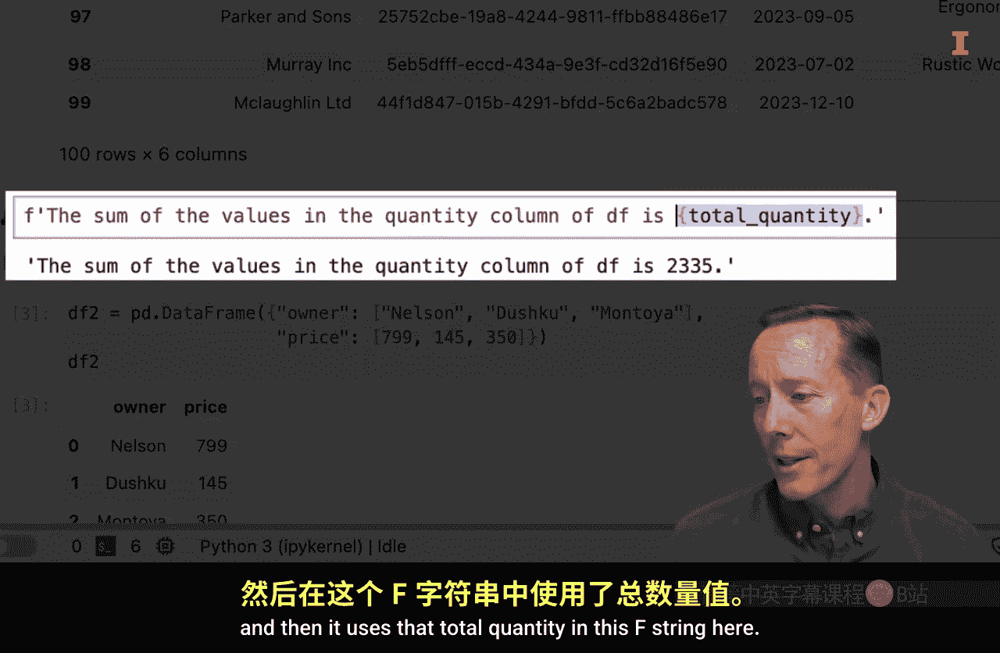
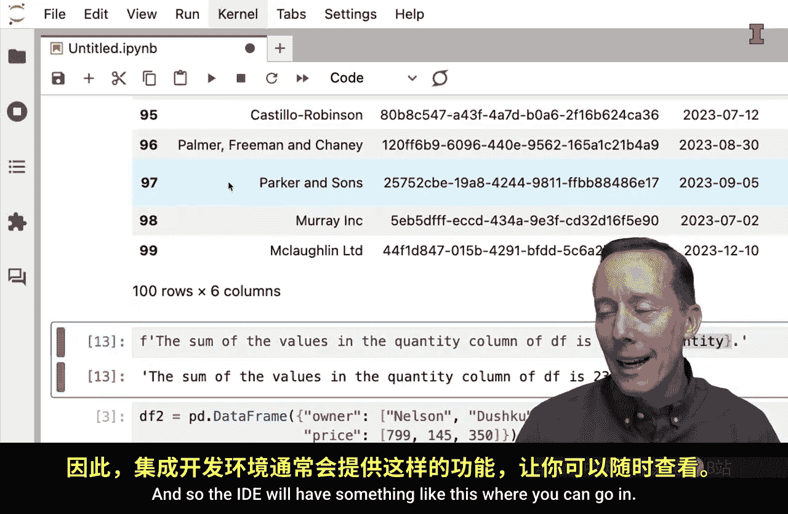
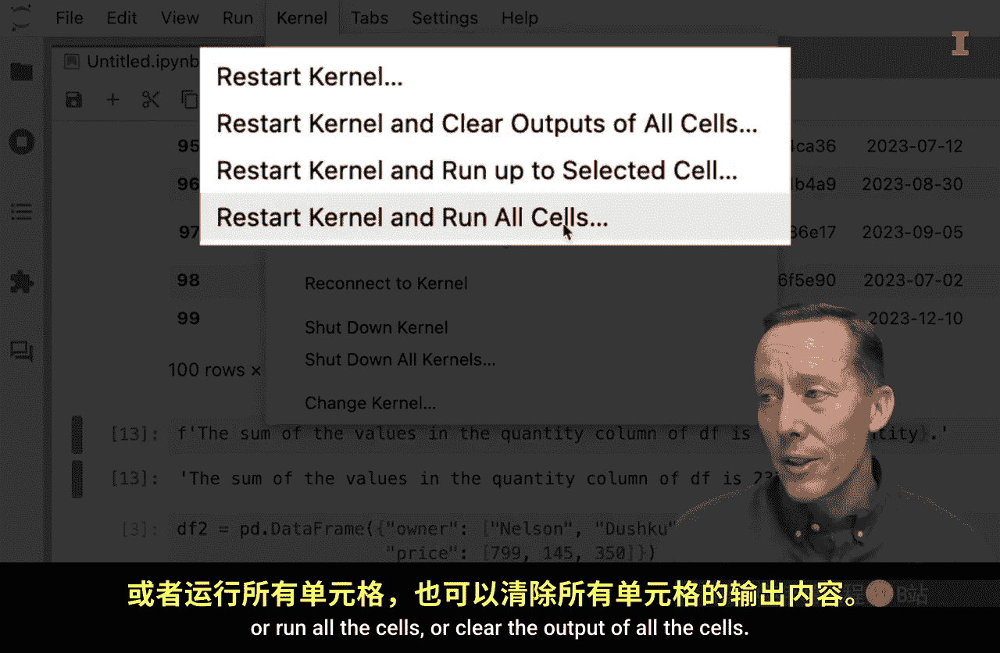
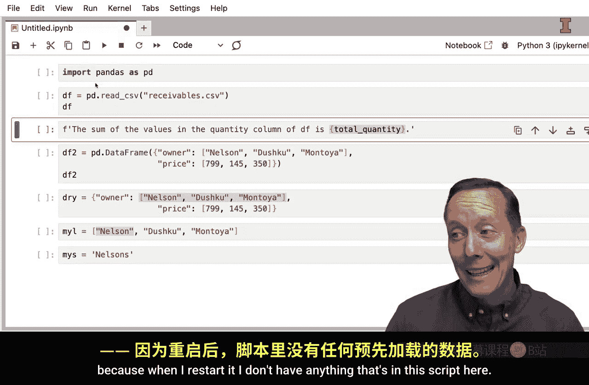
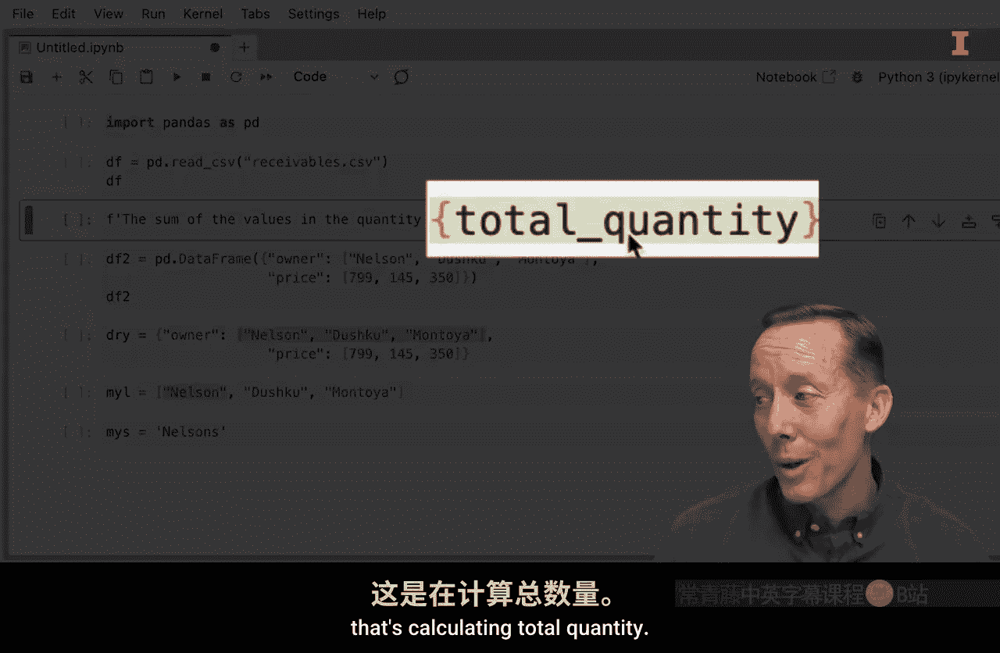
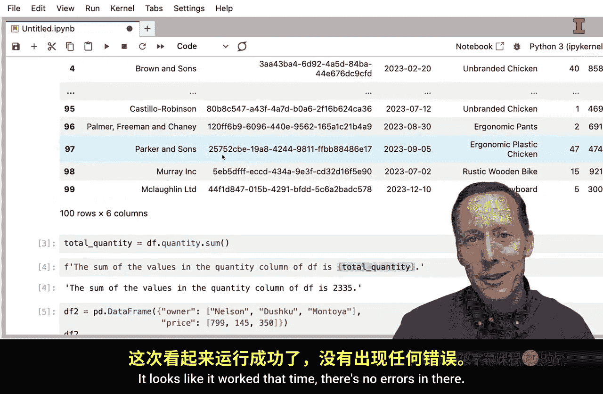
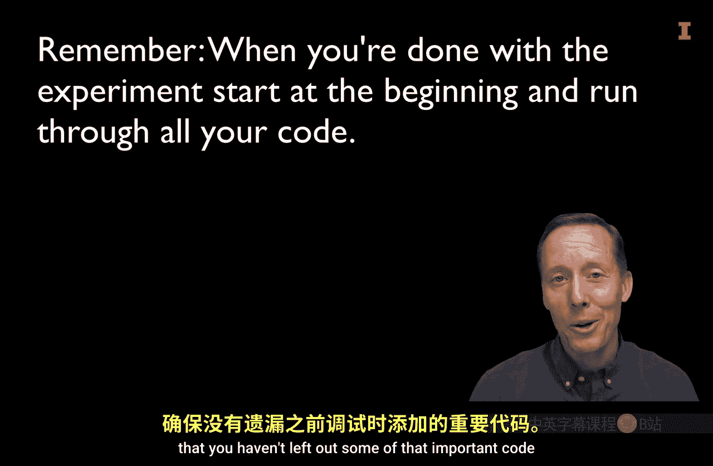

#  032：通过运行代码实验来实践答案 💻


在本节课中，我们将学习如何通过运行小型代码实验来探索和理解代码的功能。这是一种高效的学习和调试方法，尤其适合初学者。

与构建实体结构不同，编写代码允许我们快速尝试多种方案，即使失败，损失的也仅仅是少量时间。这种低成本的试错特性是编程的巨大优势。接下来，我们将介绍两种运行代码实验的方法，以及集成开发环境中一些有用的工具。



## 两种实验方法 🧪



以下是两种在编写代码时进行实验的常用方法。

### 方法一：使用控制台

第一种方法是使用IDE中的控制台。在控制台中输入的代码是临时的，不会直接添加到你的主脚本文件中。在Jupyter Lab中，你可以通过“文件”菜单新建一个控制台。

```python
# 例如，在控制台中测试对数据框某列的求和
df['quantity'].sum()
```

控制台的优势在于，你可以独立于主文件测试代码片段。如果测试成功，再将有效的代码复制到主文件中。

### 方法二：在代码单元中临时添加





第二种方法是直接在代码单元中添加实验性代码，并在确认其功能后将其删除。

```python
# 在代码单元中临时添加测试
total_quantity = df['quantity'].sum()
print(total_quantity)
# 测试完毕后，记得删除这行临时代码
```

这种方法的好处是实验环境与最终代码环境完全一致，但需要你记得清理这些临时代码。

## 重要工具与注意事项 ⚠️





在运行实验后，有一个至关重要的步骤：确保代码能从头到尾独立运行。



当你进行多次实验后，可能会忘记某些变量是在之前的某个实验中定义的，而没有将其正式写入代码流程。因此，在将代码交付他人或提交作业前，必须使用IDE的“重启内核并运行所有单元”功能。



这个操作会清除所有已定义的变量，然后从头开始执行文件中的所有代码单元。如果此时出现错误，就说明你的代码存在依赖缺失的问题，需要将实验成功的代码正式整合到脚本中。



## 总结 📝




本节课我们一起学习了通过运行小型代码实验来探索代码功能的实践方法。我们介绍了两种主要方法：使用独立的控制台进行测试，以及在代码单元中临时添加并随后删除实验代码。同时，我们强调了在实验完成后，务必使用“重启并全部运行”功能来验证代码的独立性和完整性，这是保证代码质量的关键一步。