#  033：通过阅读错误信息来解决问题 🔍


在本节课中，我们将要学习如何正确理解和利用Python编程中出现的错误信息。错误信息是学习编程过程中的重要工具，而非障碍。我们将通过具体实例，掌握阅读和理解错误信息的技巧。

错误信息可能令人畏惧，因为它们通常是红色的，并且有时包含大量难以理解的技术细节。过去，错误信息可能曾导致软件损坏或硬件故障，甚至数据丢失，从而引发负面情绪。然而，在数据分析的Python编程中，我们应将其视为学习机会。本节将分享一些技巧，帮助你从错误信息中学到最多。

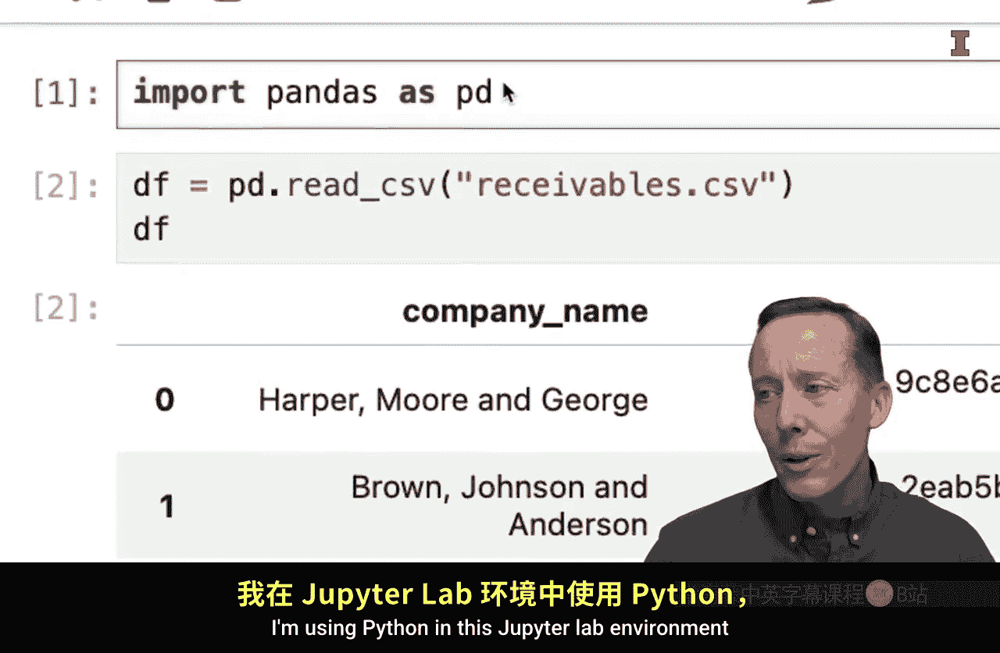

## 理解错误信息的价值 💡

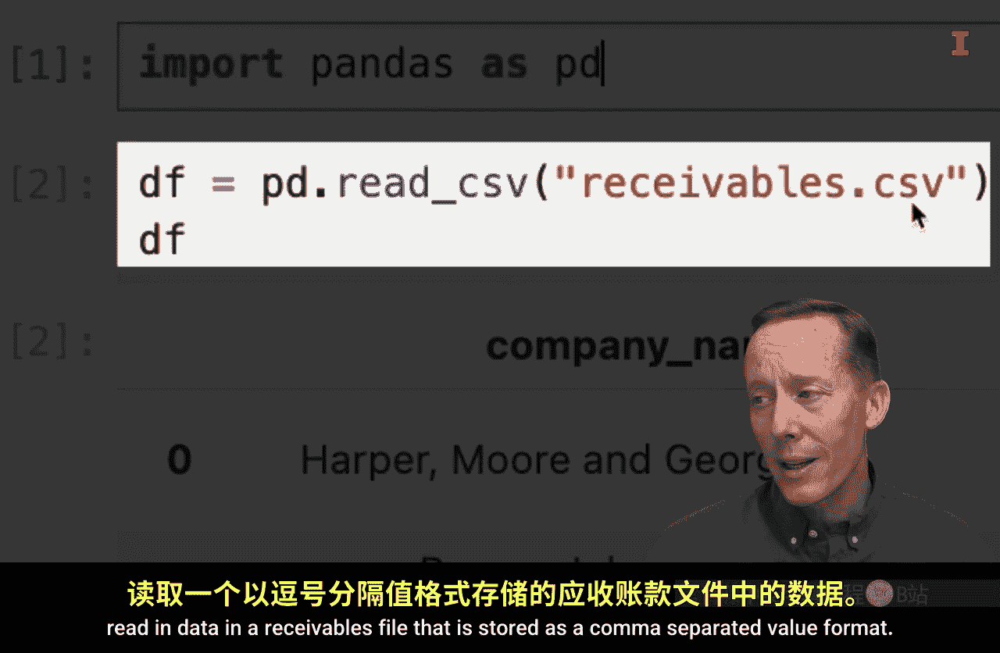

上一节我们提到了错误信息是学习机会，本节中我们来看看如何具体操作。首先，我们需要改变对错误信息的看法。


以下是对待错误信息的第一条核心建议：
*   **阅读错误信息**：不要仅仅将其视为表示“失败”的红灯，然后就去求助他人。请主动阅读错误信息本身。

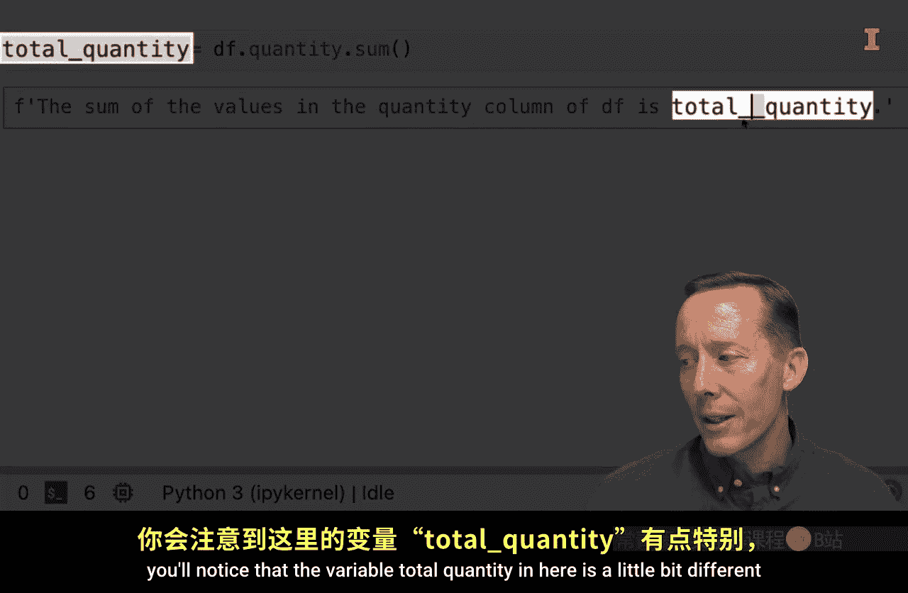

## 阅读错误信息的技巧 📖

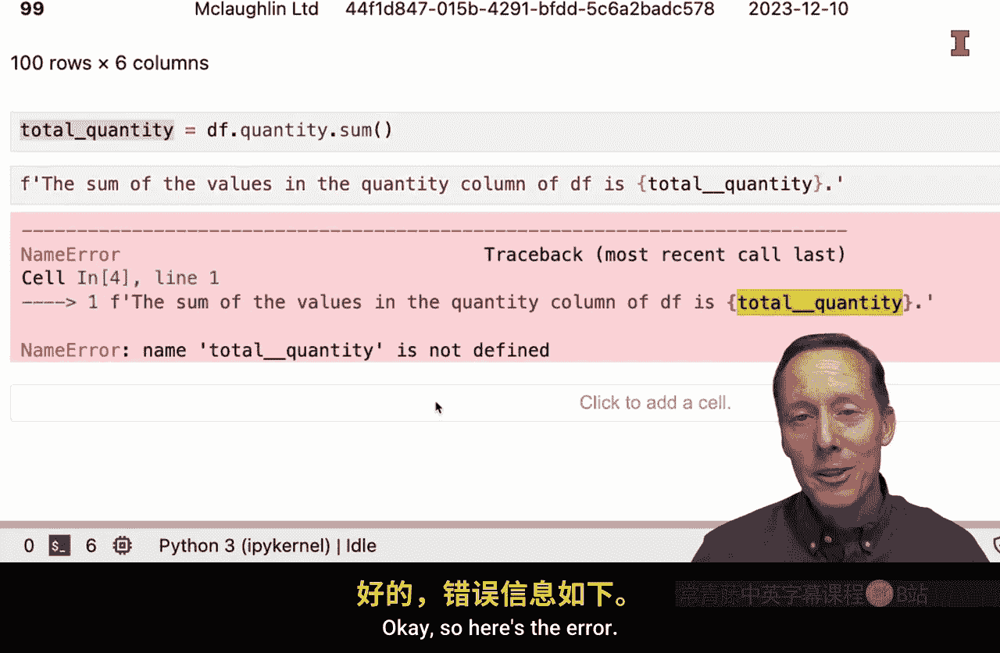


仅仅阅读还不够，我们需要掌握正确的阅读方法。这引出了第二条重要技巧。

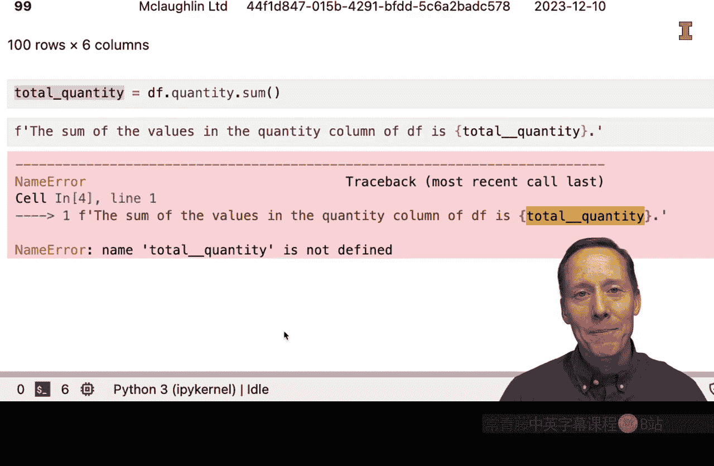

以下是阅读错误信息的正确顺序：
*   **自下而上阅读**：不要从上到下阅读错误信息。最有用、最核心的信息通常出现在最底部。从底部开始阅读，即使不能完全理解，通常也能推断出问题所在。


让我们通过一个具体例子来实践这些技巧。在Jupyter Lab环境中，我们尝试运行一段代码：导入pandas模块，读取一个CSV格式的应收账款文件，然后对`quantity`列进行求和，并将结果保存在变量`total_quantity`中，最后用这个变量生成一句话。但请注意，代码中变量名`total__quantity`多了一个下划线。

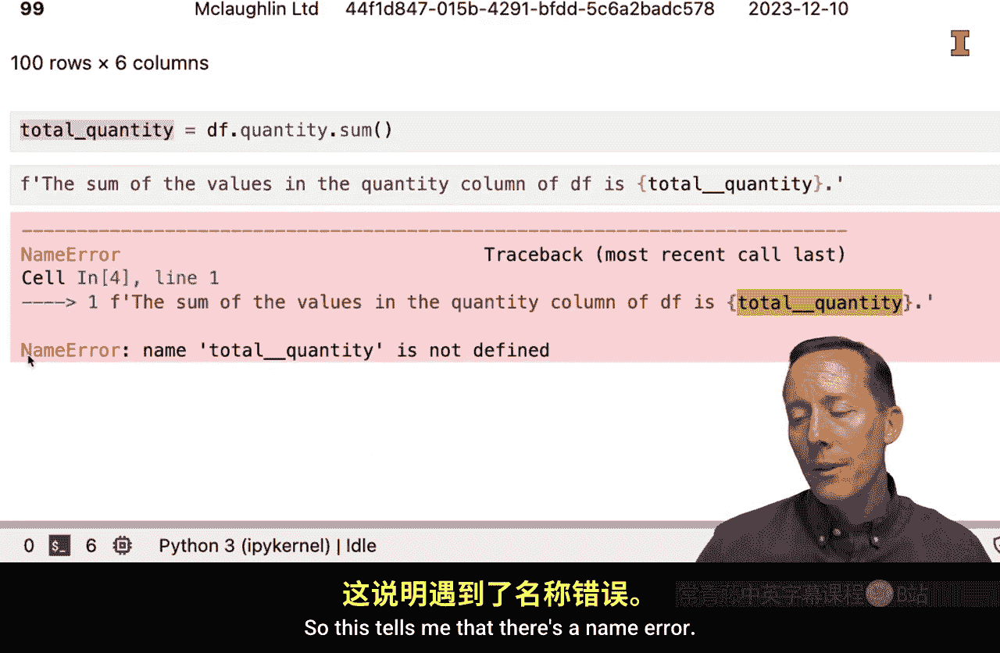

```python
import pandas as pd
df = pd.read_csv('receivables.csv')
total__quantity = df['quantity'].sum()
print(f"The total quantity is {total_quantity}")
```

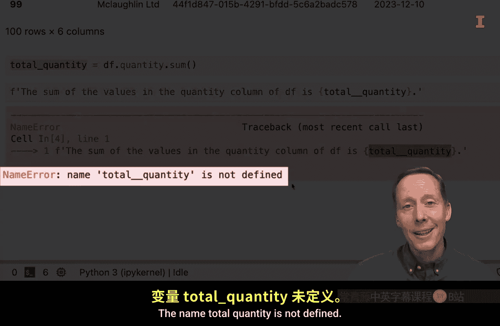

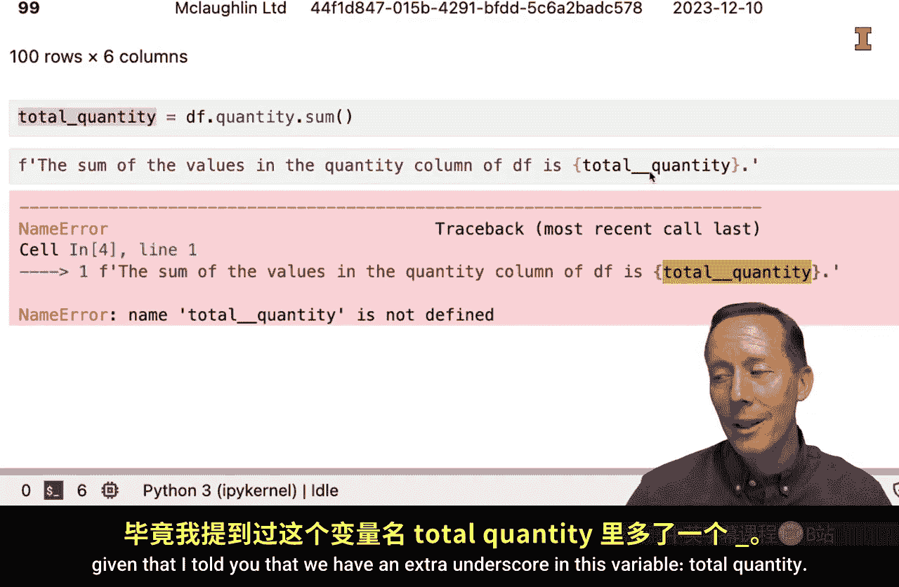

运行这段代码会产生一个错误。根据第二条技巧，我们从错误信息的底部开始阅读。底部显示：`NameError: name 'total_quantity' is not defined`。这明确告诉我们出现了名称错误，变量`total_quantity`未定义。结合我们已知的变量名拼写错误，问题就很清晰了。错误信息的上半部分会指出错误发生的具体行号和单元格信息，例如`Traceback (most recent call last)`等，这些信息在调试复杂代码时很有用。虽然看起来有些复杂，但并不可怕。

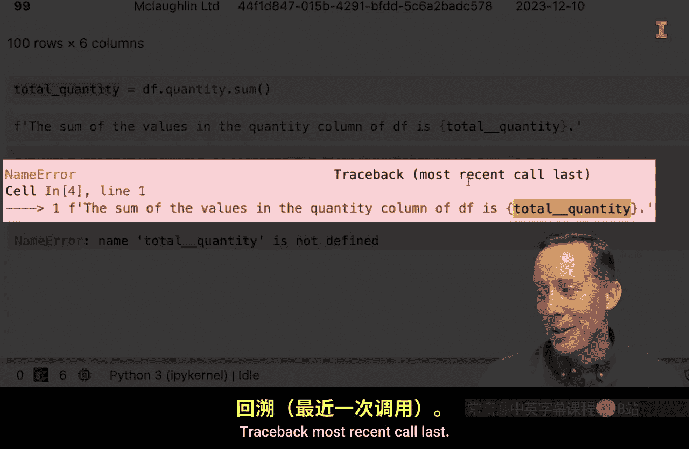

## 处理复杂错误信息 🧹

接下来，我们看另一种错误类型，并学习第三条技巧。我们尝试用`read_excel`函数去读取一个CSV文件，这显然会导致错误。

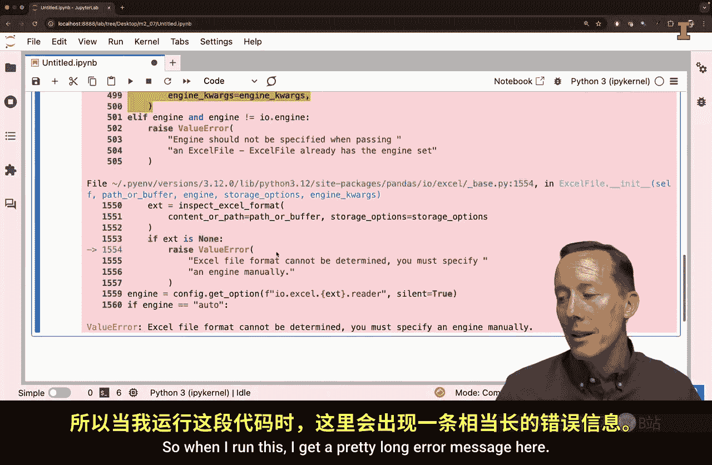

```python
df = pd.read_excel('receivables.csv')
```


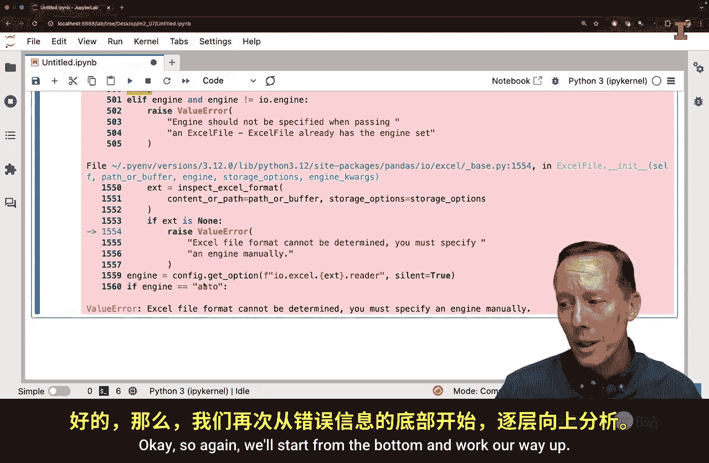

运行后会得到一个较长的错误信息。此时，第三条技巧就非常重要了。

以下是处理冗长错误信息的方法：
*   **忽略不必要的信息**：你可以忽略错误信息中的很多内容。同样，从底部开始阅读。底部可能显示：`ValueError: Excel file format cannot be determined, you must specify an engine manually`。关键信息是，它无法确定Excel文件格式。这足以让你意识到问题所在：你正在对CSV文件使用`read_excel`函数。如果往上阅读的内容变得过于技术化，可以忽略它们。这些内容很多是面向软件工程师和开发者的。

## 经验积累与总结 🎓

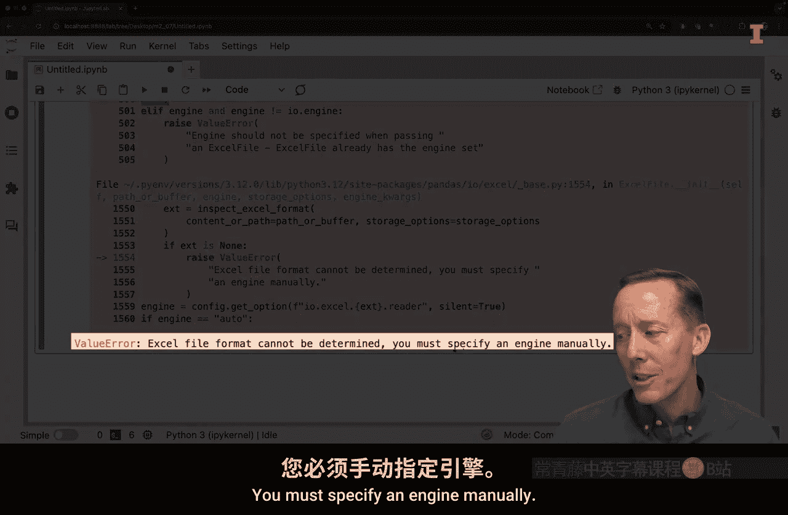

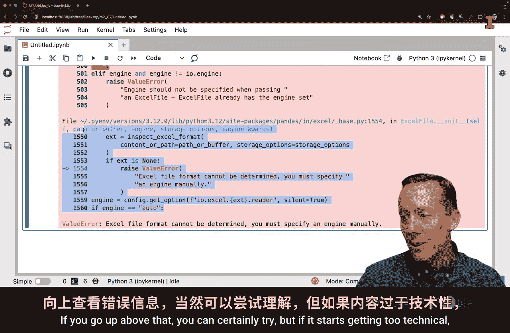


最后，第四条技巧关乎长期的学习过程。

关于错误信息的经验之谈：
*   **经验使信息更有意义**：请记住，随着经验的积累，错误信息对你来说会变得越来越有意义。最初，你可能会遇到一些完全无法理解的错误信息，但随着你反复遇到它们，你会逐渐理解其含义。要认识到你将从经验中学习。


在本节课中，我们一起学习了如何将Python中的错误信息转化为学习工具。我们掌握了四条核心技巧：主动阅读错误信息、自下而上阅读、忽略不必要的技术细节，以及相信经验积累的力量。确保将这些技巧付诸实践，你会发现错误信息能为你解答关于Python代码使用的疑问提供极其宝贵的信息。