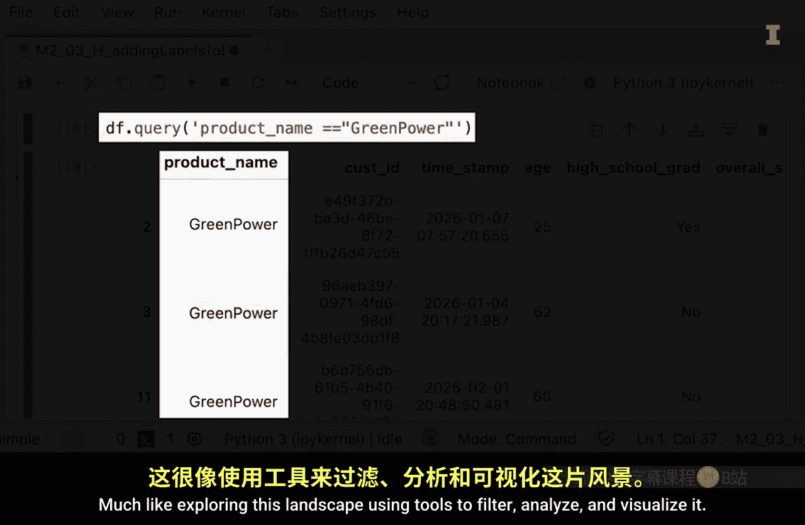

#  035：第三模块简介

在本节课中，我们将要学习数据价值的核心特征，并了解如何将这些原则应用于数据分析中最关键的数据结构——Pandas的DataFrame。

大家好，欢迎来到令人惊叹的布莱斯峡谷荒野。正如你所见，我们被一片广阔而复杂的景观所包围，充满了隐藏的美丽和宝贵的资源。这很像我们即将探索的数据世界。想象这片荒野是一个巨大的矿藏，富含着有价值的矿石。这很棒，对吧？关键在于，你必须经历大量的工作，才能将原始的泥土转化为有用的矿石。

那么，这个类比如何与数据分析联系起来呢？数据对于做出明智的商业决策非常有价值。例如，创建像ChatGPT这样的人工智能工具需要海量的数据。然而，在数据能被用于创造这些神奇的工具之前，它必须经过处理，这通常需要大量的工作。例如，一家制造公司可能希望利用其大量的历史数据，创建一个智能代理来帮助进行预测性维护、质量控制和供应链优化。

这些数据可能包括存储在内存芯片或SD卡中的传感器数据、存储在PDF文档和电子邮件中的发票数据、存储在电子表格和图表中的财务建模数据，甚至可能包括从会议录音中提取的智慧。在使用这些数据之前，他们必须提取并规范化数据，以便所有数据都能用于训练LLM（大型语言模型）。即使你只是尝试使用存储在具有相同数据结构的历史文件中的数据来制作一些可视化图表，在将其转化为可视化之前，也需要付出一些努力来准备数据。

本模块的重点有两个。首先，我们将探讨使数据具有价值的一般特征。其次，我们将演示这些原则如何应用于Pandas的DataFrame，这是数据分析中最重要的数据结构。

正如布莱斯峡谷荒野的美丽需要通过细致的观察和处理才能展现，数据的价值也需要通过仔细的分析才能揭示。当你完成本模块时，你将能够使用过滤器、条件语句、汇总统计和简单的可视化来探索Pandas的DataFrame，就像使用工具来过滤、分析和可视化这片景观一样。因此，无论你是准备数据还是指导整个过程，你都将获得将原始信息转化为有意义见解的技能。

正如我们将对这片景观的理解转化为欣赏一样。