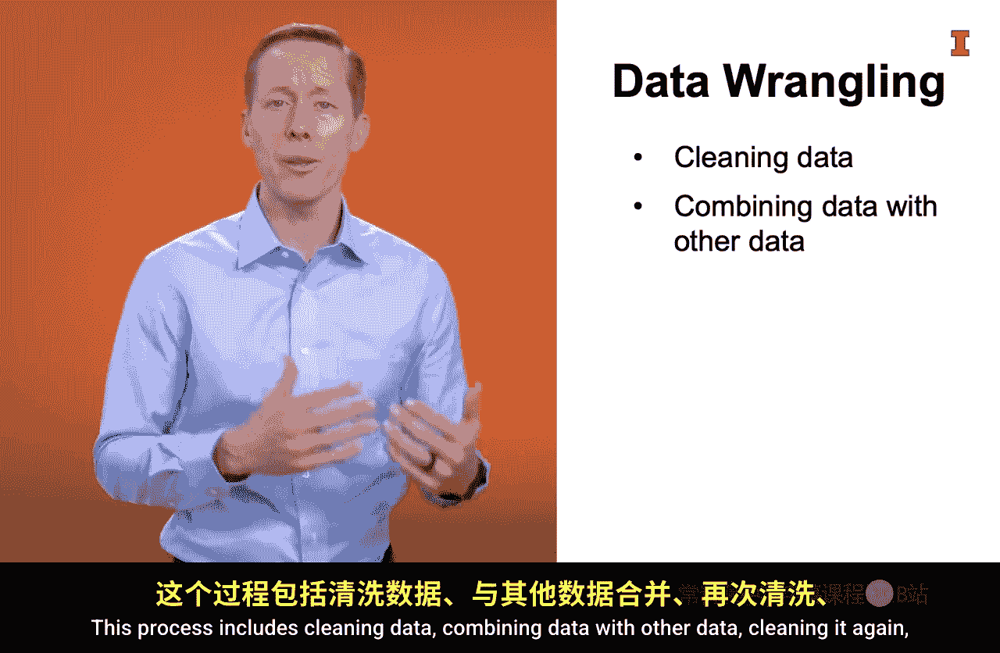

#  037：数据组装 📊

在本节课中，我们将深入学习FACT框架中的第二步：数据组装。数据组装至关重要，因为它通常直接影响问题能否被有效解答。有趣的是，这个过程往往比实际计算结果花费更多时间。

## 概述：数据组装的重要性

上一节我们介绍了FACT框架，本节中我们来看看其中的“A”——数据组装。数据专家路易斯·吉列尔莫分享了他的经验：大约80%的时间用于数据准备，只有20%的时间用于实际计算。这主要是因为数据质量、准确性、格式以及确保拥有所需全部数据是关键所在。一旦数据以所需形式准备就绪，在其上构建模型就变得非常简单。

## 为什么数据组装如此耗时？

数据组装通常涉及多个步骤，可以概括为**ETL**（提取、转换、加载）和**数据整理**。这个过程之所以耗时，是因为每一步都可能遇到挑战。

以下是数据组装通常包含的几个关键环节：

*   **寻找数据**：找到相关数据是第一步，但这往往并不容易。
*   **提取数据**：从数据源获取原始数据。
*   **转换数据**：将数据转换成适合分析的格式。
*   **加载数据**：将处理好的数据导入分析工具。
*   **数据整理**：对数据进行清洗、合并、重塑等操作。

## 寻找数据

寻找相关数据的重要性再怎么强调也不为过。数据常常因安全、法规和商业秘密保护而难以获取。有时，人们甚至不清楚自己组织内部存在哪些数据集。即使知道，也可能因安全和隐私问题而无法访问。

许多公司现在设立了首席数据官（CDO）。他们的职责是提高组织信息生态系统的效率和价值创造能力，确保员工知道有哪些数据可用以及如何获取。

数据来源可分为内部数据和外部数据。例如，分析销售下降原因时，除了内部销售数据，可能还需要外部天气数据、人口普查数据等。

美国等国家的政府机构会向公众开放大量数据集，例如天气、金融、人口普查数据。你可以通过 `www.data.gov` 等网站浏览数千个数据集。

如果问题足够重要，你可能需要自行收集数据。方式包括创建调查问卷、编写网络爬虫抓取分散的数据，或开始测量之前未记录的信息。

## 提取、转换与加载（ETL）

找到数据集后，你需要从其存储位置**提取**数据，将其**转换**成符合需求的格式，然后**加载**到数据处理工具中。这个过程简称为**ETL**。

这很重要，因为数据仓库以多种格式存储数据，并以其他格式返回给用户。通常，你需要将数据转换为表格格式以便进行可视化或分析。当然，也存在其他格式，例如图数据库格式。

最著名的数据仓库是**关系型数据库**，它将数据存储在多个表中。通常使用**结构化查询语言（SQL）** 来提取所需的数据子集，并以表格形式返回。这非常方便，因为数据已经是表格格式，可以直接使用。

以下是其他一些数据存储和提取方式：

*   **从网站收集**：你需要收集HTML或XML数据，这些数据包含大量标签来标识不同数据片段，然后必须提取关键信息并将其转换为表格格式。
*   **通过API访问**：有时数据存储在关系数据库中，但通过**应用程序编程接口（API）** 访问，其结构类似于网站而非SQL查询。数据通常以**JavaScript对象表示法（JSON）** 格式返回。这种格式是由花括号、冒号和逗号分隔的一系列嵌套列表。与HTML和XML数据一样，关键数据需要先转换为表格格式才能进行分析。

## 数据整理

数据转换为表格格式后，很可能还需要经历一个**数据整理**或数据清理过程。

这个过程包括清洗数据、将数据与其他数据合并、再次清洗、可能再次合并、再次清洗，然后改变其形状。

虽然你现在可能还不完全理解这个过程中的许多术语，但希望你能明白这不是一个简单的线性过程。在数据整理过程中，与数据组装相关的这些步骤经常需要迭代。你可能会发现找到的某些数据错误太多，从而决定需要寻找不同的数据集，然后重新开始整个过程。

其核心要点是：组装正确的数据非常重要，而且通常需要大量的工作。

## 总结

本节课中，我们一起学习了数据组装的核心步骤与挑战。我们了解到，数据组装（ETL与数据整理）是分析过程中最耗时的环节，涉及寻找、提取、转换、加载和反复清洗整理数据。确保数据的质量、相关性和正确格式，是为后续分析与建模打下坚实基础的**关键**。