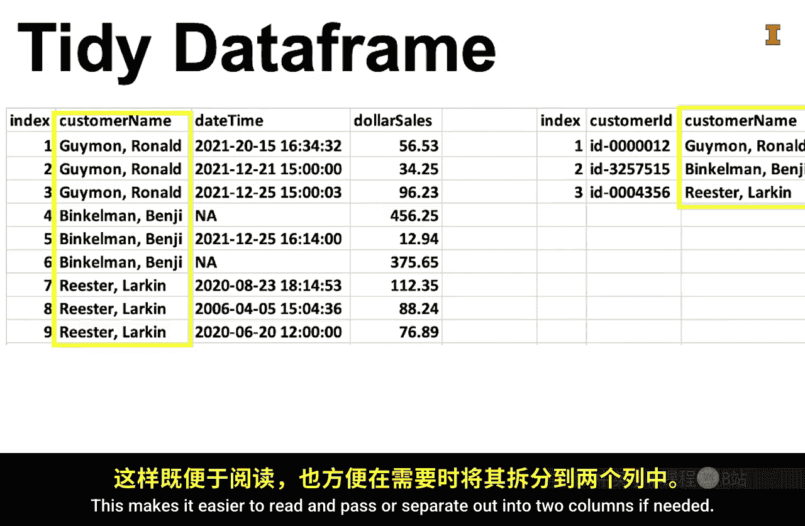

#  038：整洁数据框的特性 📊

在本节课中，我们将学习什么是“整洁”的数据框，以及它为何对商业分析至关重要。数据是商业分析的关键原料，但原始数据通常需要经过整理才能进行有效分析。我们将通过一个烹饪的类比，详细探讨整洁数据框的五个核心特性。

## 概述

数据是商业分析的核心要素。我们想要分析的数据，通常必须先进行整理。接下来，我们将延续烹饪的类比，来阐释“整洁数据框”的含义。

你是否注意过，在烹饪节目中，所有食材都被整齐地摆放、称量、放入碗中，或许还经过了切割。根据我的经验，创造一个整洁的烹饪环境所花费的时间，可能比实际混合食材进行烹饪的时间还要长。

我个人经验也表明，如果没有一个整洁的烹饪环境，很容易混淆食材。例如，我可能会把盐当成糖，或者在制作曲奇时把孜然当成肉桂，又或者把泡打粉当成小苏打。

## 整洁数据框的五要素

以下是构成一个整洁数据框的五个关键要素。

### 1. 行与列的结构

第一要素是：**每一行代表一个观测值，每一列代表该观测值的一个特征**。虽然这个概念很简单，但必须认识到，许多电子表格为了打印格式美观，常常违反这条规则。

有时，两个表格会并排出现在同一页上。如果数据属于同一个表格，那么它们需要上下堆叠在一起。如果数据不相关，则需要拆分成两个独立的表格。

### 2. 索引

第二要素是：**每一行通常有一个被称为“索引”的标签**。索引是唯一标识一个观测值的方式，其默认值通常是行号。

有时，索引是每个观测值的标签，例如时间戳或公司名称。有时，索引由数据中的多个列组成，例如时间戳和公司名称的组合，这被称为**多重索引**。

### 3. 列名规范

第三要素是：**列名应简短、具有描述性，且不包含空格或标点符号，并且是唯一的**。

当程序员无需处理空格和标点符号时，代码更易读，编写耗时也更少。如果名称简短，默认的图表标签也更容易阅读。

列名应遵循一致的命名规范。两种最常见的命名规范是**驼峰式**和**蛇形命名法**。

有时，数据框本身使用一种命名规范，而列名使用另一种，这样在阅读代码时更容易区分两者。

### 4. 明确标识缺失值

第四要素是：**明确标识缺失值，这对于数值型数据尤其重要**。缺失值和0之间存在巨大差异。

例如，考虑一下如果用零替换缺失值，平均值会受到怎样的影响。因此，你应该用 `NA`（或 `None` 等）来替换缺失的测量值，而不是用零或留空。

### 5. 列内一致性

第五要素是：**列内数据模式的一致性**。举个例子，假设我们有一个名为“客户姓名”的列，它指的是客户的名和姓。

一个整洁的数据框会使用相同的模式来记录所有客户姓名，例如都是“Ronald Geman”或都是“Geman Ronald”，或都是“R. Geman”，而不是混合使用不同的模式。这使得数据更易于阅读，并且在需要时更容易解析或拆分成两列。

一个整洁的数据框还要求**列内每个观测值的数据类型相同**。

那么，什么是数据类型？数据类型指的是数据的编码方式，这与它的显示方式不同。例如，数字3的二进制版本是 `0000011`。字符“3”的二进制版本是 `00110011`。

思考这个问题的一种方式是区分**数字三**和**单词“三”**。如果你想输入数字三以便它能与其他数字相加，那么你不会用字母拼写出“THREE”，而是输入数字3。

## 总结

本节课中，我们一起学习了整洁数据框的五个核心特性。创建整洁的数据框就像创造一个整洁的烹饪环境。在整理数据框的过程中，你会在一定程度上了解数据的内容。一旦你整理好了数据框，就可以开始更深入地理解数据的实际内容了。