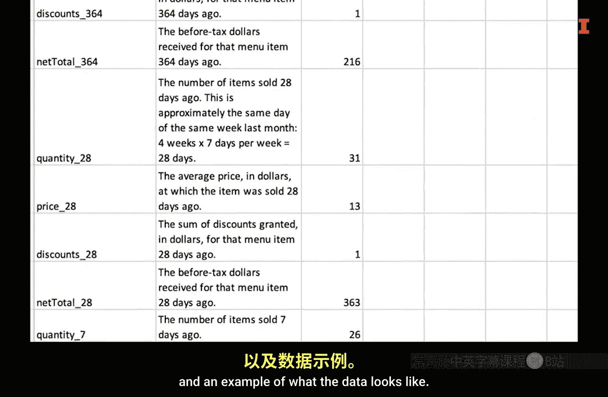
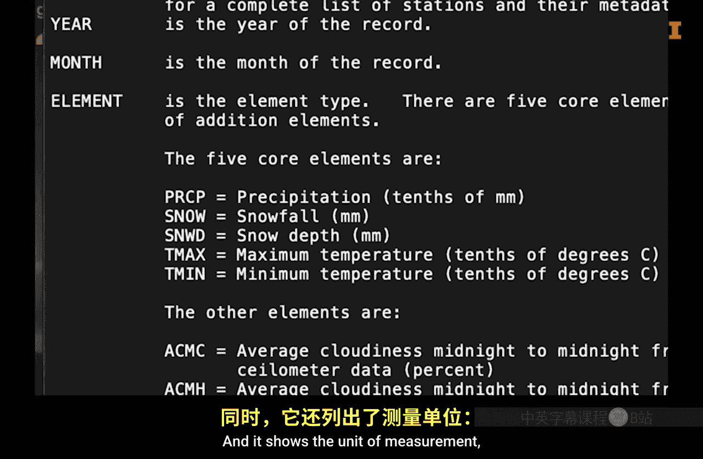

#  039：数据字典 📖

在本节课中，我们将要学习数据字典的概念、重要性以及如何创建一个有效的数据字典。数据字典是数据分析中确保数据理解一致性和准确性的关键工具。

---

## 概述

在数据分析中，我们经常会遇到使用缩写或含义不明确的列名。这就像在烹饪食谱中看到“TSP”和“TBSP”一样，如果不清楚其含义，就可能导致错误。为了避免这种混淆，并确保数据能被正确理解和使用，创建一份数据字典是至关重要的实践。

## 数据字典的重要性

上一节我们提到了数据中缩写可能带来的问题。本节中我们来看看为什么需要一个专门的工具来解决它。

在数据分析中，缩写经常被使用，但很容易被误解。在创建这些缩写的当下，其含义可能很清楚，但时间一长就容易忘记。即使不使用缩写，列名也可能不完整。例如，永远不应使用“时间”作为列名，因为它不清楚指的是秒、分钟、小时、天、周还是其他时间单位。

一个极佳的实践是创建所谓的“数据字典”。

## 数据字典的核心特征

一个理想的数据字典至少应具备以下两个核心特征。

以下是数据字典应包含的第一个特征：

1.  **数据的简要概述**。该概述可以包括：
    *   数据来源的描述。
    *   如何访问数据。
    *   每一行数据代表什么。
    *   收集数据的目的。
    *   任何刷新数据可能需要的特殊信息，例如获取密码或身份验证令牌的位置。
    *   如果数据可供许多人使用，则可能需要包含如何引用数据的说明。

以下是数据字典应包含的第二个特征：

2.  **每个列名的详细列表**。对于每一列，应提供：
    *   列名的完整描述，解释任何缩写的含义。
    *   数据的类型，例如：**字符串**、**数值型**、**日期型**等。
    *   数据示例。
    *   可能还需要一个“备注”列，用于指出数据的任何特殊之处。例如，在一些旧数据集中，可能用 **9999** 来表示缺失值，而不是 **NA**。这一点尤其重要，因为 **9999** 很容易被误当作一个有效的数值。

## 数据字典缺失的原因及常见形式

理解了数据字典应包含什么之后，我们来看看为什么有时会缺少它，以及它通常以何种形式出现。

数据字典容易被忽视，因为对创建者来说，在创建时其含义是显而易见的，并且人们可能更关注其他更紧迫的工作。数据集没有数据字典的其他原因包括：它最初并非为他人或未来的自己使用而设计。

当提供数据字典时，它们可以有不同的形式。

以下是数据字典常见的几种形式：

*   一种常见形式是 **`readme.txt`** 文本文件。使用文本文件是因为它不需要任何特殊软件就能打开。
*   如果数据集以电子表格形式提供，数据字典可能是同一电子表格中的一个独立工作表。
*   在其他情况下，例如财务会计数据，由于定义需要标准化，存在拥有非常庞大数据字典的网站。众所周知，财务报告中的项目有特定含义，对这些项目的解释在财务报表的附注中描述。从这个意义上说，财务报表附注也可以被视为数据字典，但它们通常比数据分析所需的内容要冗长得多。
*   XBRL（可扩展商业报告语言）有一个分类标准，本质上就是一个数据字典，它提供标签、文档和大量其他信息。你不需要担心这种复杂的数据字典，这里只是指出它的存在。

## 实例解析：NOAA气象数据

政府机构通常在提供数据字典方面做得很好。这里有一个来自美国商务部国家海洋和大气管理局（NOAA）数据集的气象数据 **`readme.txt`** 文件示例。

这个数据字典更接近你应该创建的类型，但它甚至比你最常需要的更复杂。以下是一些需要注意的事项：

1.  它展示了如何引用数据。
2.  接着展示了如何下载数据的说明。
3.  在第3部分，它展示了文件的格式。请注意，它说明了每个文件包含一个气象站一个月的数据。
4.  然后，它继续讨论每个变量或数据列的定义。重要的是，它显示了五个核心元素的数值是测量值，并展示了测量单位，例如降水是**十分之一毫米**，而雪深是**毫米**，最高和最低温度是**十分之一摄氏度**。
5.  第四个特点是，它为感兴趣的人提供了一堆其他信息。

## 总结

总而言之，数据字典对于跟踪数据集中包含哪些信息至关重要。在本节课中，我们一起学习了数据字典的作用、其应包含的核心特征（数据概述和列定义）、常见的呈现形式，并通过一个实际例子加深了理解。创建和维护数据字典是一个值得投入时间的好习惯，它能确保你和你的团队始终能准确理解和使用数据，避免因误解而导致的分析错误。