#  042：使用条件语句探索数据框


在本节课中，我们将学习如何基于条件语句筛选Pandas数据框。这是数据清洗和探索性分析中的核心技能，能帮助你聚焦于满足特定条件的行数据，从而简化分析过程。

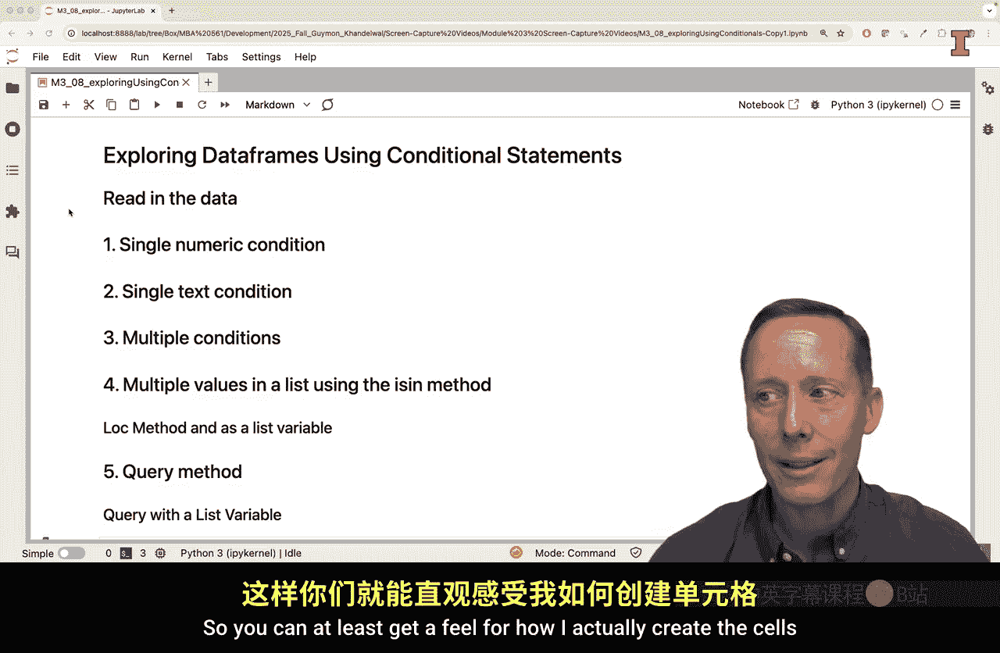

我们将从读取数据开始，然后介绍六种不同的条件筛选方法。

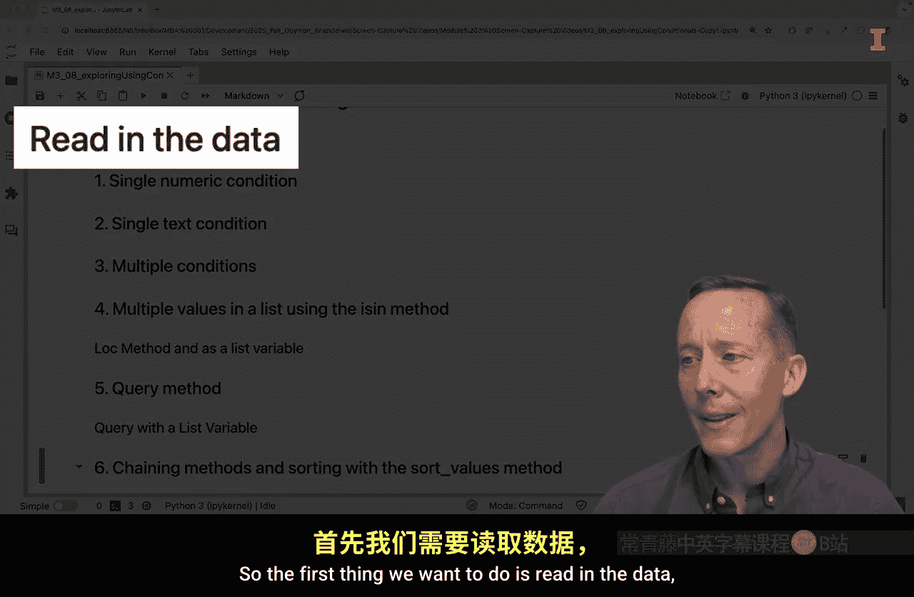

## 读取数据

首先，我们需要将数据读入Python环境。我们将使用Jupyter Lab，并逐步编写代码，以便初学者能跟上操作。


第一步是导入必要的库并读取数据文件。我们使用的数据是薪资调查数据，存储为`.pkl`格式（pickle文件），这种格式能高效地压缩和存储数据及其类型。

```python
import pandas as pd

# 读取pickle文件
df = pd.read_pickle(‘salary_survey_data.pkl.xz’)

# 显示前5行数据
df.head()
```

运行上述代码后，我们可以快速浏览数据的结构和内容。接下来，我们将重点学习如何根据`annual salary`（年薪）和`industry`（行业）等列的条件来筛选数据。

## 单数值条件筛选

上一节我们读取了数据，本节中我们来看看如何根据单一数值条件进行筛选。例如，我们想找出年薪超过100万的所有行。

以下是使用方括号`[]`进行筛选的基本方法：

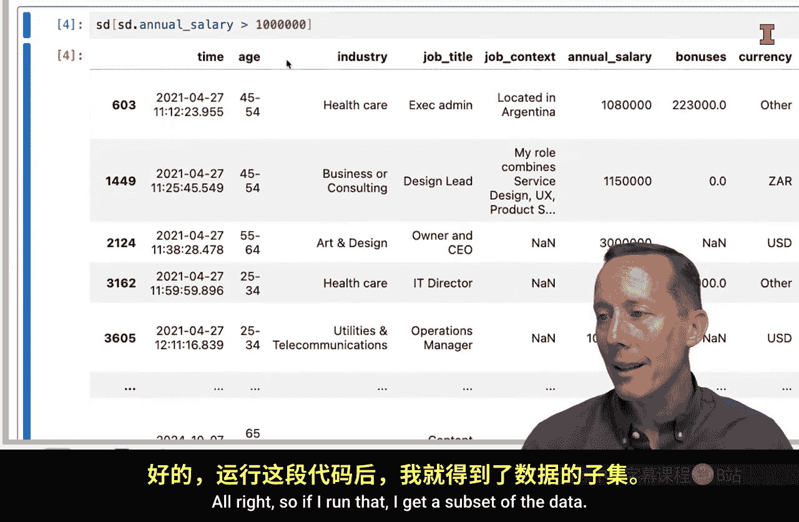

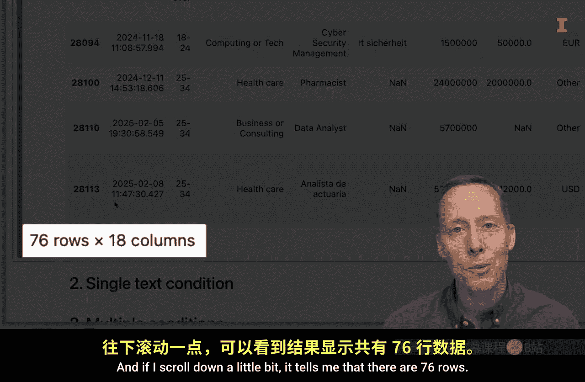

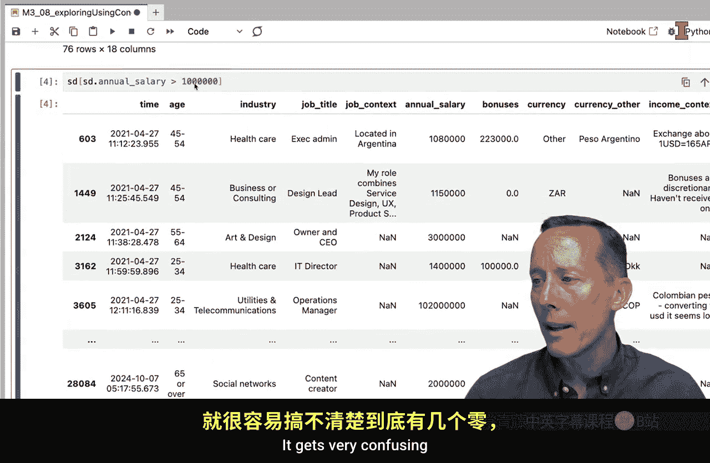

```python
# 方法1：使用方括号和列名
df[df[‘annual salary’] > 1000000]
```

为了更清晰地表示大数字，我们可以使用科学计数法`1e6`来代替`1000000`。

```python
# 方法2：使用科学计数法
df[df[‘annual salary’] > 1e6]
```

除了方括号，我们还可以使用`.loc`索引器达到同样的效果。`.loc`允许我们同时指定行和列的条件。

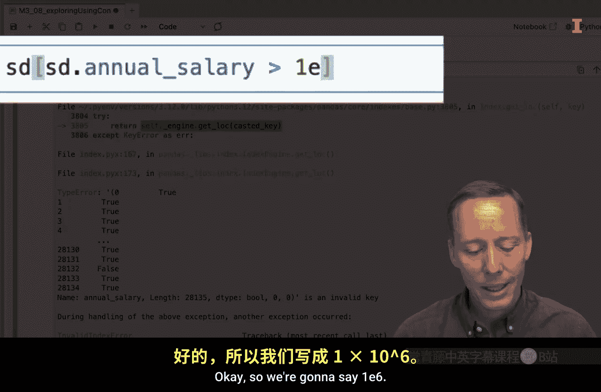

```python
# 方法3：使用 .loc 索引器
df.loc[df[‘annual salary’] > 1e6, :]
```

以上两种方法都能筛选出年薪超过100万的76行数据。

## 单文本条件筛选

接下来，我们看看如何根据文本条件进行筛选。例如，我们想筛选出行业为“艺术与设计”（Art and Design）的所有观测值。

使用方括号和双等号`==`进行判断：

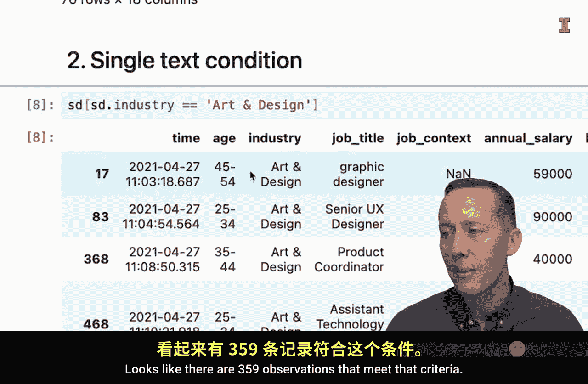

```python
# 筛选行业等于“艺术与设计”的行
df[df[‘industry’] == ‘Art and Design’]
```

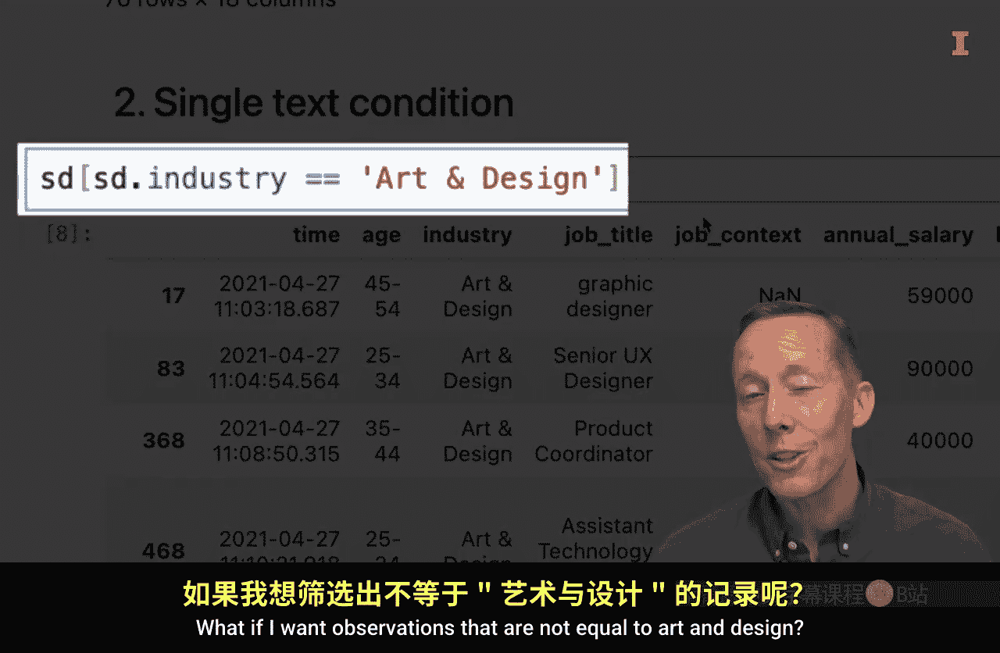

运行代码后，我们看到有359行数据满足条件。如果想筛选出行业**不是**“艺术与设计”的行，可以使用不等号`!=`。

```python
# 筛选行业不等于“艺术与设计”的行
df[df[‘industry’] != ‘Art and Design’]
```

同样，`.loc`索引器也适用于文本条件筛选，并且可以指定只输出某些列。

```python
# 使用 .loc 并指定输出列
df.loc[df[‘industry’] == ‘Art and Design’, [‘industry’, ‘job title’]]
```

## 多条件组合筛选

在实际分析中，我们经常需要组合多个条件。例如，我们想找出年薪超过100万**并且**行业是“艺术与设计”的行。

这需要使用逻辑运算符`&`（与）来连接条件，并且每个条件必须用括号`()`括起来。

```python
# 使用“与”条件（&）
df[(df[‘annual salary’] > 1e6) & (df[‘industry’] == ‘Art and Design’)]
```

运行后，我们只得到一行数据，即一位年薪远超100万的艺术设计公司CEO。

如果我们想找出年薪超过100万**或者**行业是“艺术与设计”的行，则需要使用逻辑运算符`|`（或）。

```python
# 使用“或”条件（|）
df[(df[‘annual salary’] > 1e6) | (df[‘industry’] == ‘Art and Design’)]
```

这次我们得到了434行数据，它们要么年薪超过100万，要么属于艺术设计行业。

## 使用 `.isin()` 方法筛选

当我们需要检查某一列的值是否属于一个给定的列表时，重复使用`|`运算符会很繁琐。这时，`.isin()`方法就非常方便。

例如，我们想筛选出行业属于“艺术与设计”或“医疗保健”的行。

```python
# 使用 .isin() 方法
df[df[‘industry’].isin([‘Art and Design’, ‘Health Care’])]
```

我们也可以先将列表存储在一个变量中，然后在`.isin()`方法中引用这个变量，使代码更清晰。

```python
# 将列表存储在变量中
my_industries = [‘Art and Design’, ‘Health Care’]
df[df[‘industry’].isin(my_industries)]
```

## 使用 `.query()` 方法筛选（推荐）

在介绍了多种基础方法后，本节我们来看一个更简洁、易读的筛选方法：`.query()`。这是我最推荐的方式。

它的语法更接近自然语言，无需重复输入数据框名称。

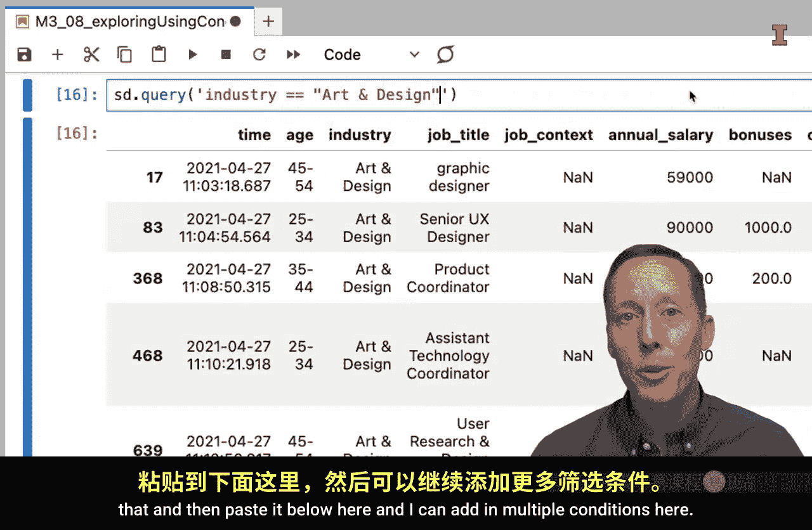

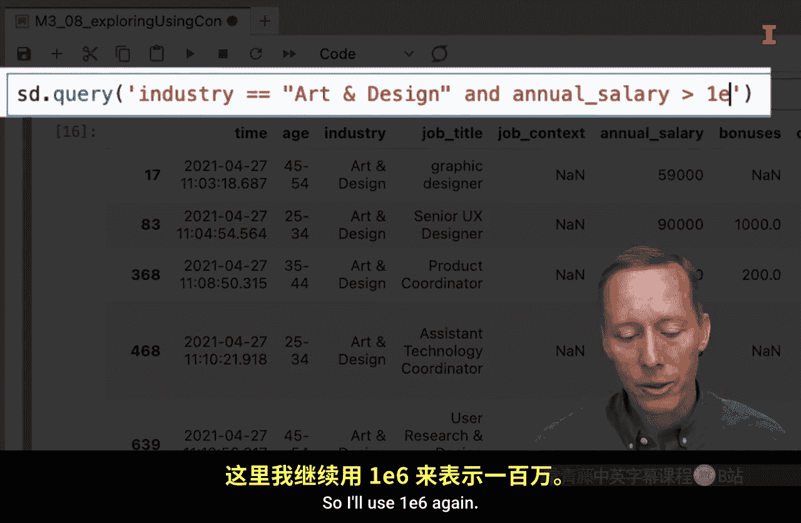

```python
# 使用 .query() 进行单条件筛选
df.query(“industry == ‘Art and Design’”)
```

对于多条件筛选，`.query()`同样简洁明了。

```python
# 使用 .query() 进行“与”条件筛选
df.query(“industry == ‘Art and Design’ and `annual salary` > 1e6”)
```

注意，如果列名包含空格，需要用反引号 `` ` `` 括起来。

如果想使用之前定义的变量列表，需要在变量前加`@`符号。

```python
# 在 .query() 中引用外部变量
df.query(“industry in @my_industries and `annual salary` > 1e6”)
```

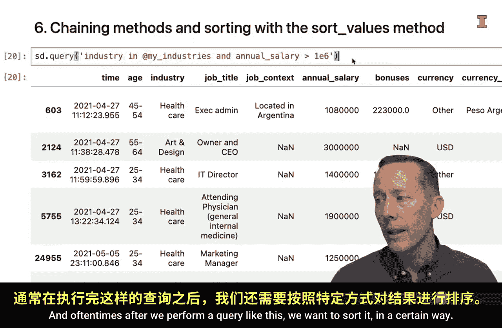

## 筛选后排序数据

最后，我们经常需要在筛选后对结果进行排序。Pandas的`.sort_values()`方法可以轻松实现这一点，并且我们可以将它与`.query()`等方法链式调用。

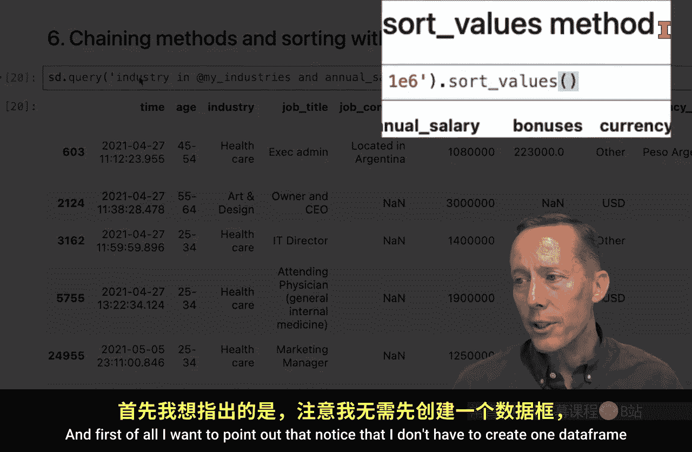

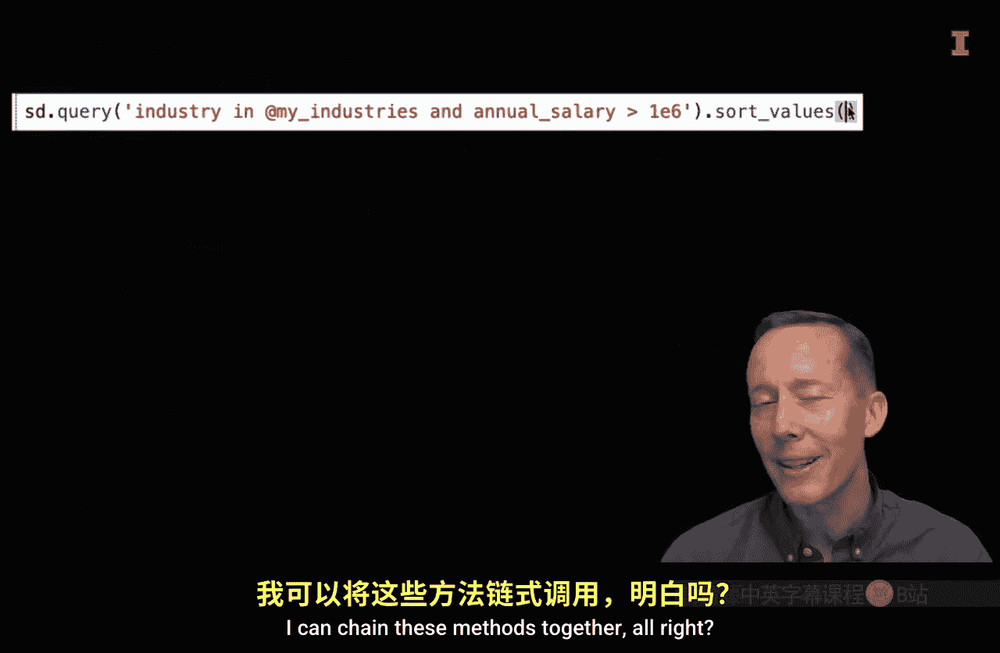

例如，将筛选后的结果按年薪降序排列：

```python
# 链式调用：筛选后按年薪降序排序
df.query(“`annual salary` > 1e6”).sort_values(by=‘annual salary’, ascending=False)
```

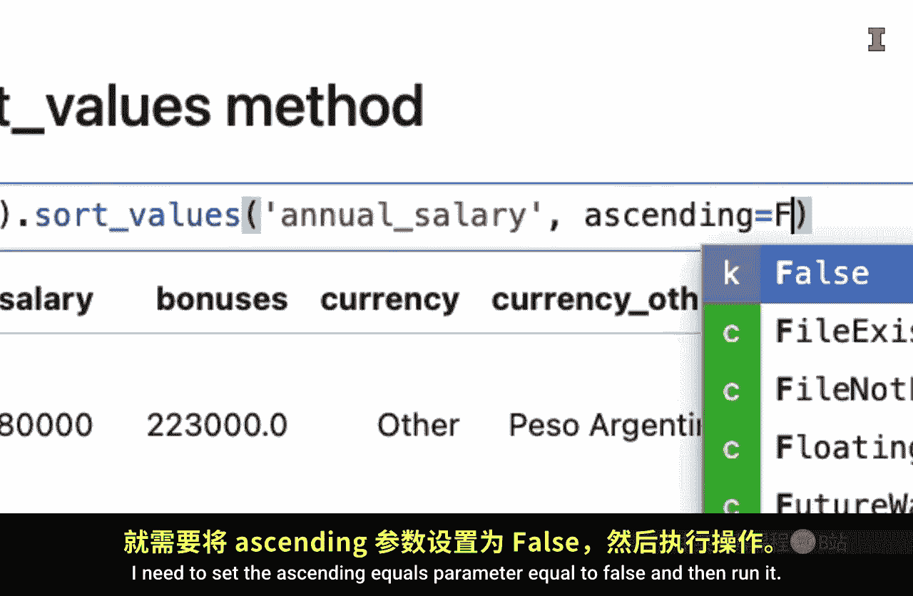

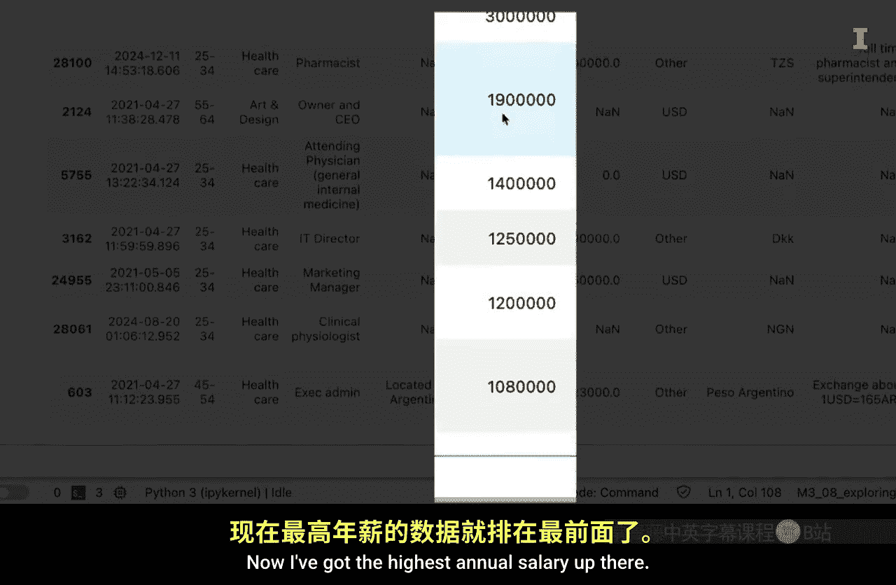

`.sort_values()`方法默认是升序（`ascending=True`）。通过设置`ascending=False`，我们可以得到降序排列的结果，便于查看最高薪资。

## 总结

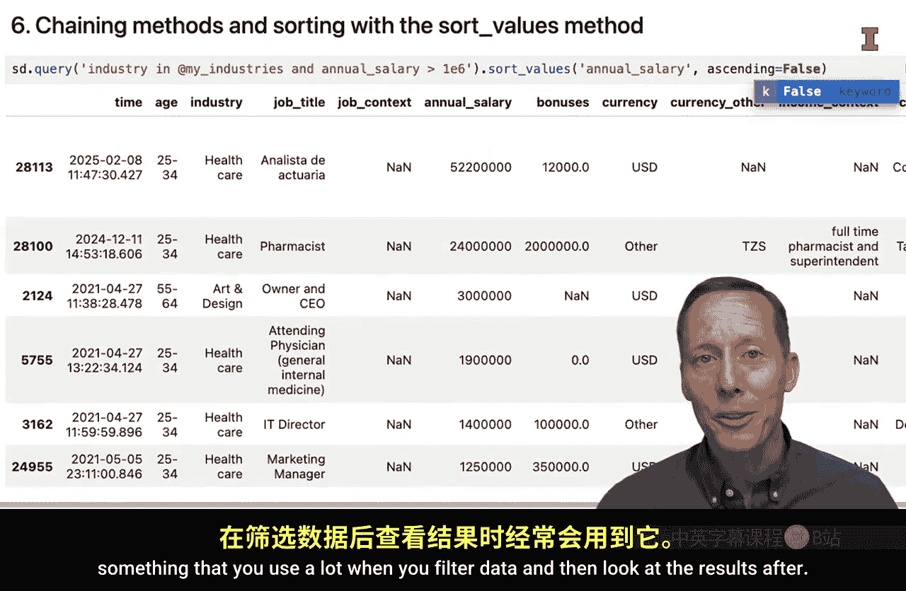

本节课中，我们一起学习了在Pandas中使用条件语句筛选数据框的六种核心方法：

1.  **单数值条件筛选**：使用比较运算符（如 `>`， `==`）。
2.  **单文本条件筛选**：使用 `==` 或 `!=`。
3.  **多条件组合筛选**：使用逻辑运算符 `&`（与）和 `|`（或），并用括号分隔每个条件。
4.  **`.isin()`方法**：高效检查值是否属于某个列表。
5.  **`.query()`方法**：语法简洁，推荐使用。
6.  **`.sort_values()`方法**：对筛选结果进行排序。

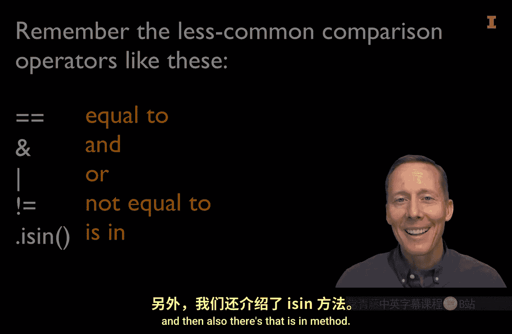


这些技能对于将分析聚焦于与目标相关的数据子集至关重要。记住，`.query()`方法因其可读性高而成为许多数据分析师的首选。熟练掌握这些筛选技巧，将极大提升你探索和理解数据的效率。