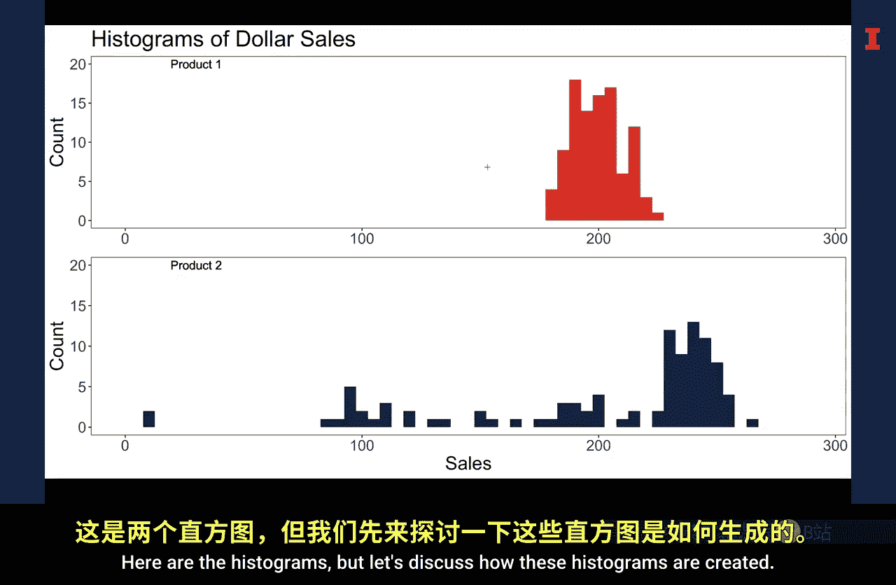
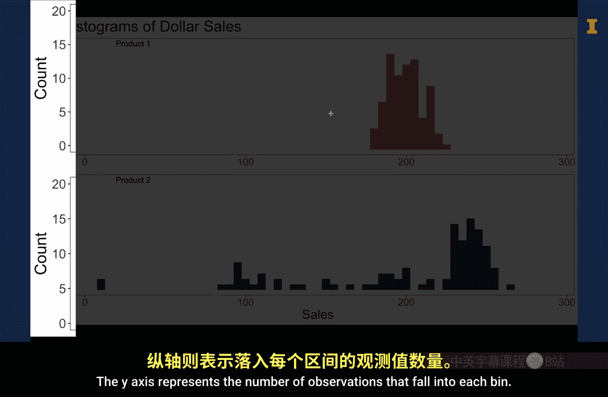
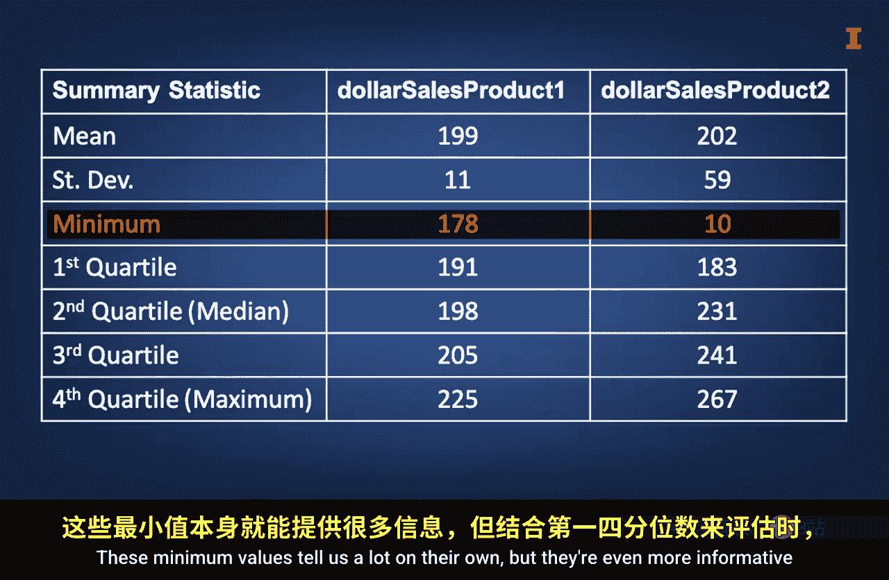
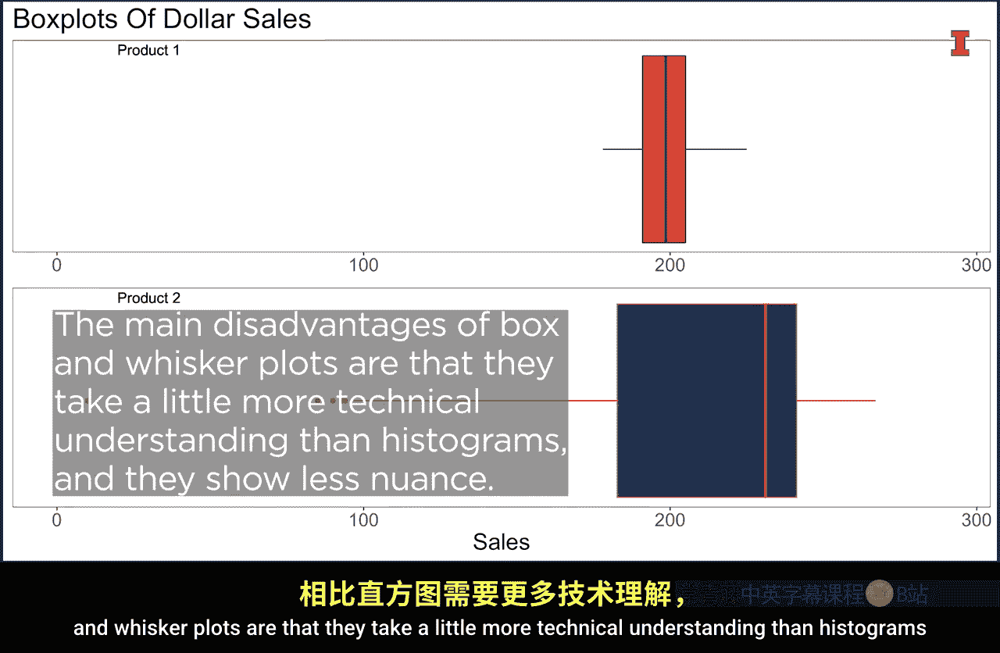

#  043：汇总统计 📊

在本节课中，我们将学习如何通过汇总统计来理解数据的基本构成。我们将探讨几种关键的统计量，包括均值、标准差和分位数，并学习如何通过直方图和箱线图来可视化数据的分布。这些工具能帮助我们快速评估数据的价值，并判断其是否适用于特定的商业决策。

## 整洁的数据框架

拥有一个整洁的数据框架，就像拥有一个干净、有序的烹饪环境。这为后续分析奠定了良好基础。

## 理解数据的构成

理解数据的构成同样重要。例如，糖有很多种类。制作“Snickerdoodle”饼干时，使用正确类型的糖至关重要。

*   制作“Snickerdoodle”饼干通常使用**普通白砂糖**。
*   与普通糖相比，**粗粒糖**的颗粒更粗、更硬，大小和形状差异更大。
*   与普通糖和粗粒糖都不同，**红糖**颜色更深，质地更粘。

数据也存在大量变异。这种变异通常很有用。理解变异有助于判断数据是否对特定商业决策有价值，从而评估其在商业决策中的用途。

## 一个示例

让我们通过一个例子来理解。这里有一个虚构的在线商店销售数据，包含两种不同产品的购买记录。

快速目视检查这个名为 `sales_data` 的数据框架，可以发现这是一个整洁的数据集。数据有两列：第一列记录产品1的美元销售额，第二列记录产品2的美元销售额。每种产品各有100笔交易记录。

这种快速目视检查有助于对数据形成初步印象。看起来，产品2的极端值数量比产品1更多。然而，即使只有100个观测值，这种方法也非常耗时且效率低下。

因此，我们通常使用汇总统计和可视化来评估数据的价值并寻找规律。

## 汇总统计

汇总统计也称为描述性统计。它们将数据每一列的不同特征简化为数字，用以描述数据的形态。

### 均值

或许最著名、最常用的、用于描述数据集中位置的汇总统计量是**均值**或**平均值**。这也被称为**集中趋势的度量**。

你可能熟悉如何计算平均值。通俗地说，平均值是将所有观测值相加，然后除以观测值数量得到的结果。

当你想将一个总数分成若干大小相同的部分时，这个统计量尤其有用。

对于两个产品的购买数据集，产品1的平均购买金额是199美元，产品2是202美元。它们的集中趋势相似，但这只是数据的一个特征。

### 标准差

另一个常用的汇总统计量是**标准差**，它描述了观测值围绕均值的分散或分布程度。从概念上讲，你可以将标准差视为每个数据点到均值的平均距离。

较高的标准差表明，相对于较低的标准差，数据平均而言在均值周围更分散。

对于两种产品的销售额，产品1的平均美元花费标准差是11，产品2是59。因此，尽管两种产品的平均销售额大致相同，但我们可以预期产品1的美元花费变异比产品2小。

## 可视化数据分布

让我们看看每种产品的直方图，以验证这一点。

以下是直方图，我们先讨论这些直方图是如何创建的。

直方图的X轴代表销售额可以取的值。在本例中，它被划分为宽度为5的区间，例如1到5，6到10，11到15，依此类推。Y轴代表落入每个区间的观测值数量。

让我们看看产品2最低的那个条形。它看起来是第二个区间（10到15），高度为2。如果我们核对数据，可以确认确实有两个值为10的观测值落在这个范围内。

比较这些直方图可以看出，产品2的区间在X轴上比产品1分布得更开。这证实了比较标准差得出的结论：产品2的观测值确实比产品1存在更多的变异。

这些直方图很好，因为它们能快速传达数据围绕均值分布的细微差别。例如，这些直方图显示，产品1的美元花费分布比产品2对称得多。具体来说，对于产品2，大量观测值紧密地聚集在240左右，而另一批观测值则散布在这个聚集点以下，包括两个远低于所有其他观测值的点。

虽然直方图有助于传达这些关系，但用语言描述它们却很困难。因此，还有另一组基于**分位数**的汇总统计量。

## 分位数

分位数是将数据按大小分组后形成的等份。分位数的形成过程是：将数据从小到大排序，形成大小相等的区间，然后报告每个区间起点的值。

*   将排序后的数据分成100个等份，形成**百分位数**。
*   将数据分成10个等份，形成**十分位数**。
*   将数据分成4个等份，形成**四分位数**。

报告分位数值时，通常也会报告最小值。为了更具体，让我们看看每种产品美元花费的最小值和四分位数值。

### 最小值与四分位数

对于产品1，最小值是178美元。相比之下，产品2的最小值是10美元，要小得多。这些最小值本身就能告诉我们很多信息，但当我们结合第一四分位数的值来评估它们时，信息量会更大。

对于产品1，第一四分位数值是191美元，比最小值178美元高出13美元。相比之下，对于产品2，第一四分位数值是183美元，比最小值10美元高出173美元，因此其范围比产品1大得多。这告诉我们数据在分布低端的分散程度。

第二四分位数值，产品1是198美元，产品2是231美元。因此，有50%的数据落在这点或低于这点，同时也有50%的数据落在这点或高于这点。

由于产品2的第二四分位数值大于产品1，而产品2的第一四分位数值又低于产品1，我们应再次预期产品2在第二四分位数内的观测值比产品1有更多的变异。

### 中位数

让我们稍作停顿，多谈谈第二四分位数。因为第二四分位数将数据一分为二，它有一个特殊的名称：**中位数**。中位数是衡量集中趋势时，均值的另一种选择。

中位数相对于均值的一个优势是，它不会受到极大或极小值的影响。这意味着当均值等于或接近中位数时（如产品1），数据很可能对称。另一方面，当均值小于中位数时（如产品2），则表明可能存在一些极小的值将均值拉低到中位数以下，或者低端有更大比例的观测值，或者两者兼有。反之，当均值大于中位数时，则可能存在一些极大的值将均值拉高到中位数以上，或者高端有更大比例的观测值。

第三四分位数值，产品1是205美元，产品2是241美元。正如你可能猜到的，这表示有75%的观测值落在这点或低于这点，25%的观测值落在这点或高于这点。产品1的第三四分位数范围比产品2略窄。同时，产品2的范围处于更高的美元花费水平。

最后，产品1的第四四分位数值225美元和产品2的267美元表明，100%的观测值落在这点或低于这点。这些值也称为**最大值**，或简称为**最大值**。

鉴于产品2的第三四分位数和最大值都大于产品1，我们应预期产品2在第四四分位数内的所有观测值都大于产品1。同样，产品2在第四四分位数内的值也更分散。

## 箱线图

希望这些四分位数值在直觉上是合理的。然而，我也意识到要比较的信息量很大。因此，另一种类型的图表常被用来直观地传达这些四分位数值以及它们之间的范围。这些图表被称为**箱须图**，但通常简称为**箱线图**。

让我们看看产品1的箱线图，以及叠加了所有四分位数值的产品1直方图。

请注意，箱体部分从第一四分位数值开始，到第三四分位数值结束。这被称为**四分位距**。中位数由穿过中间的那条线表示。左侧的须线延伸到最小值，而右侧的须线延伸到最大值。因此，箱线图简洁地传达了四分位数值以及这些值之间的距离。你可以很容易地看到第二和第三四分位数的大小大致相同。相比之下，第一和第四四分位数值则更大。

现在让我们看看产品2的箱须图，以及叠加了所有四分位数值的产品2直方图。如你所知，产品2的分布并不对称。具体来说，第一四分位数的范围非常大，这由左侧的长须线或线条说明。

现在，你可能还注意到一些“胡茬”或点。须线的最大长度通常是四分位距的1.5倍。因此，任何“胡茬”都表示那些距离数据主体部分极远的观测值，可被称为**异常值**。

就像比较前两种产品的直方图一样，比较它们的箱须图可以清楚地看出，产品2的分布比产品1更分散且更不对称。

箱须图的相对优势在于，它们能快速传达四分位数值、范围以及异常值。箱须图的主要缺点是，它们比直方图需要稍多的技术理解，并且显示的细节较少。

## 总结

本节课中，我们一起学习了如何利用汇总统计来理解和描述数据。我们介绍了均值、标准差、分位数（特别是四分位数和中位数）等核心概念，并探讨了如何通过直方图和箱线图来可视化数据的分布和变异。这些工具能帮助我们快速评估数据的集中趋势、离散程度和整体形态，从而判断数据是否适合用于特定的商业分析。虽然这不是关于汇总统计的全面课程，但这些知识足以帮助你充分描述一列数据，以判断其在你分析中的可用性。