#  044：使用汇总统计量探索数据 📊

在本节课中，我们将学习如何使用汇总统计量（也称为描述性统计量）来探索Pandas数据框。我们将学习如何计算数值列和分类列的统计量，以及如何利用这些统计量快速了解数据集的整体情况。

上一节我们介绍了数据框的基本操作，本节中我们来看看如何使用汇总统计量来概括数据。

汇总统计量使用单个数字（如平均值、中位数、最小值等）来总结数据框列中的信息。这些统计量非常有用，有时是数据分析中的关键计算，但更多时候它们被用来初步了解数据的分布和特征。

我将切换到Jupyter Lab的Python环境中，读取数据并演示如何计算汇总统计量。


---

首先，我们需要导入必要的库并读取数据。

```python
# 导入pandas库
import pandas as pd

# 读取数据文件
df = pd.read_pickle('Salary_survey_21.xz')

# 查看数据的前5行
df.head()
```

运行上述代码后，我们获得了薪资调查数据。接下来，我们将使用Pandas内置的汇总统计方法来探索这些数据。

---

### 使用`describe`方法

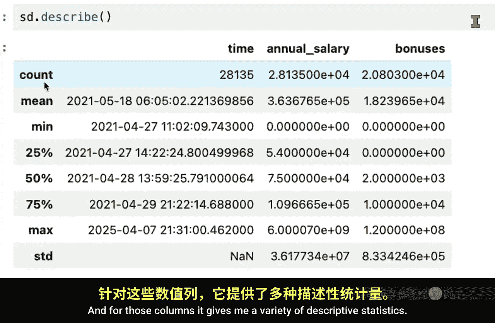

Pandas的`describe`方法可以快速生成数据框的汇总统计信息。让我们先对数据框应用此方法。

```python
# 对数据框使用describe方法
df.describe()
```

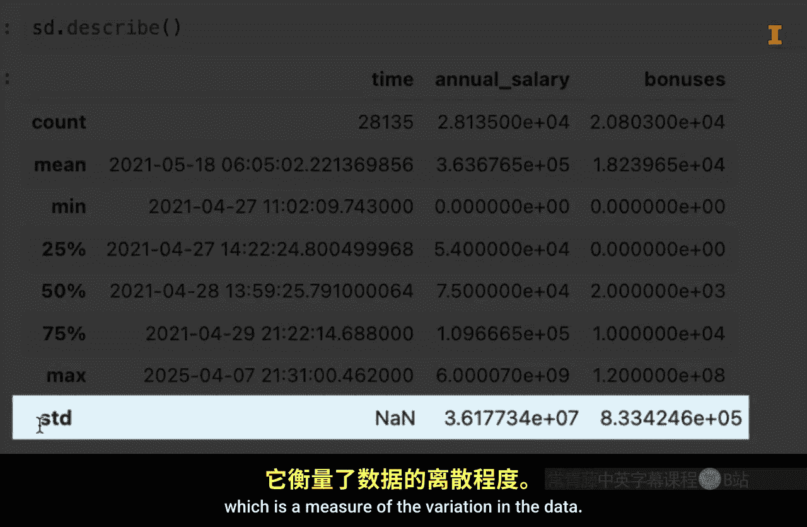

执行后，结果会显示三列数据：`time`、`annual salary`和`bonuses`。这是因为`describe`方法默认只处理数值型和日期时间型列。

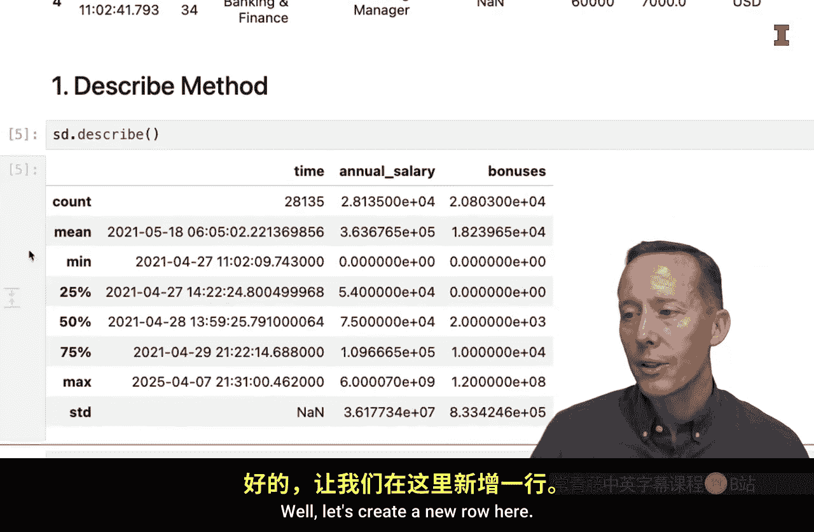

以下是输出的统计信息：
*   **count**：非缺失值的观测数量。
*   **mean**：平均值。
*   **std**：标准差，衡量数据的离散程度。
*   **min**：最小值。
*   **25%**：第一四分位数（25th percentile）。
*   **50%**：中位数（50th percentile）。
*   **75%**：第三四分位数（75th percentile）。
*   **max**：最大值。

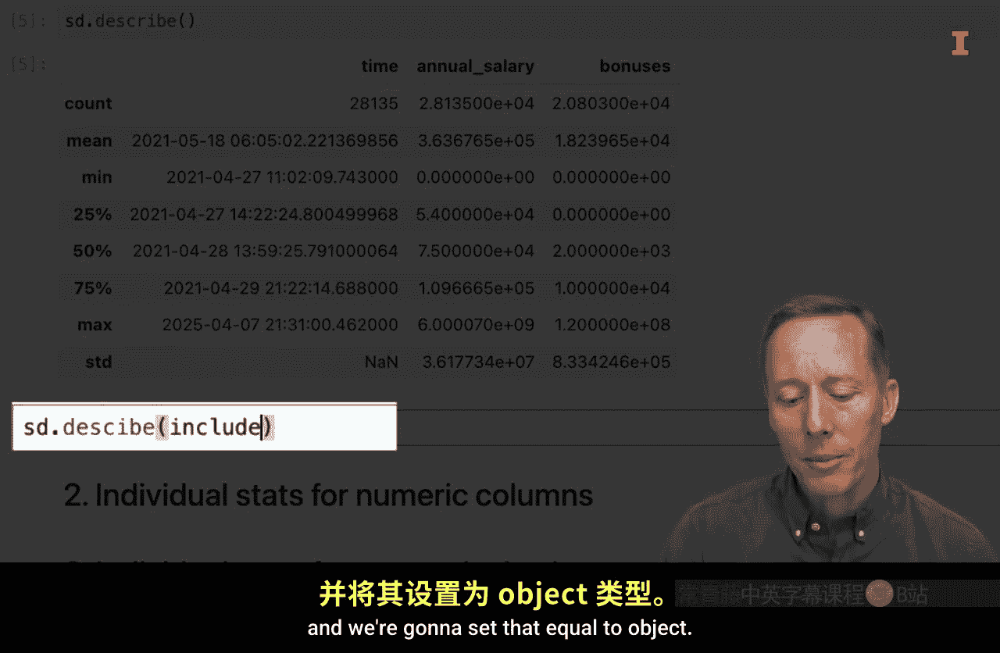

例如，从`bonuses`列的`count`小于总行数可以看出，该列存在缺失值。

---

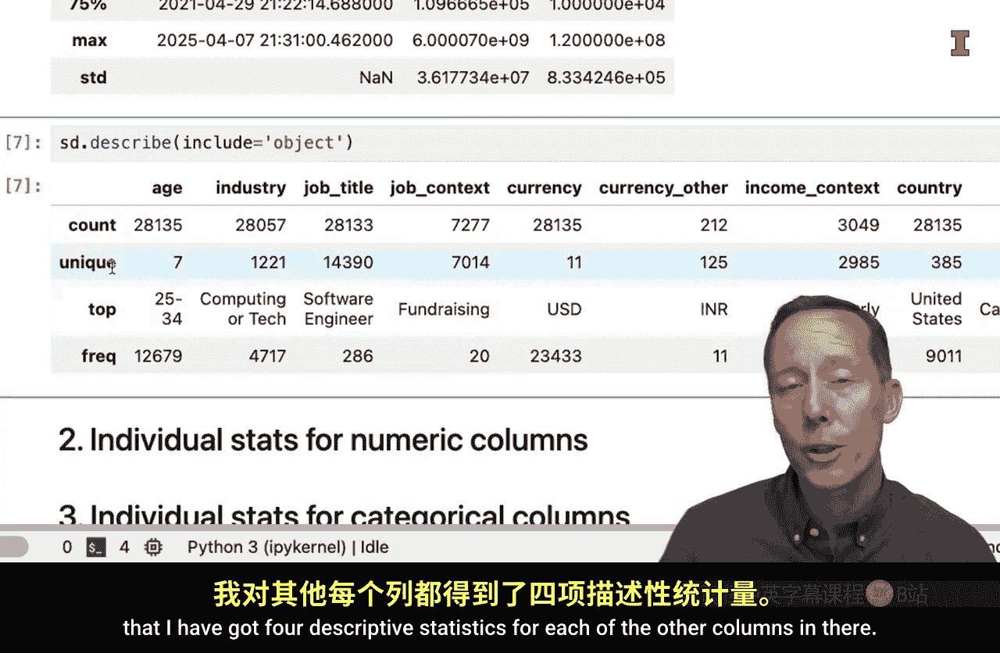

### 探索非数值型列

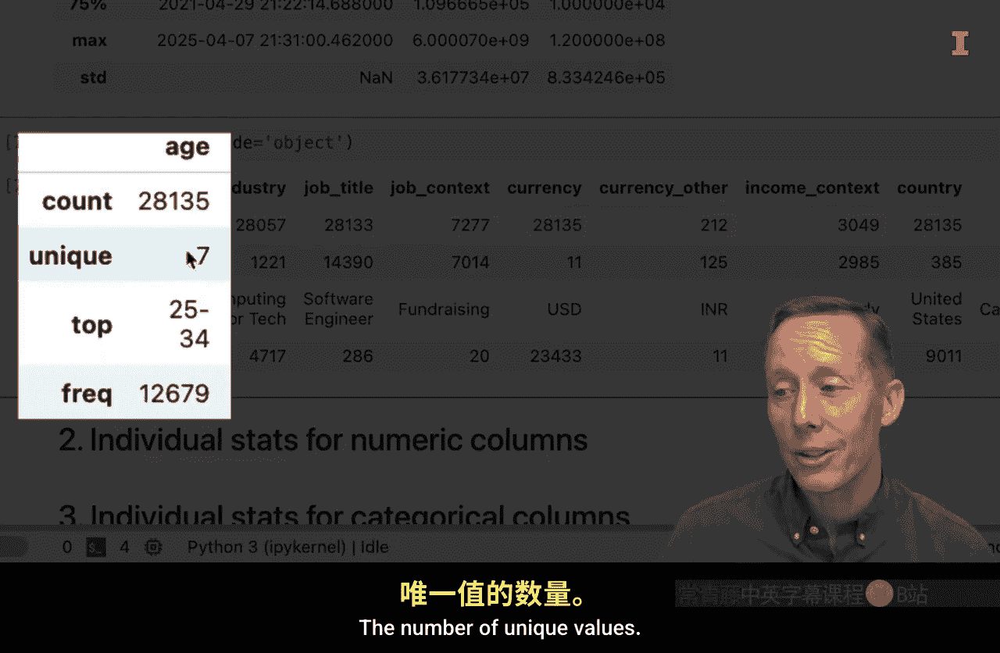

`describe`方法默认排除对象（字符串）类型的列。要查看这些分类列的统计信息，我们需要使用`include`参数。

```python
# 对对象类型的列使用describe方法
df.describe(include='object')
```

对于分类列，`describe`方法提供以下信息：
*   **count**：非缺失值数量。
*   **unique**：唯一值的数量。
*   **top**：出现频率最高的值（众数）。
*   **freq**：最高频值出现的次数。

例如，在`age`列中，有7个不同的年龄组，其中“25 to 34”类别出现次数最多，共12679次。

如果你想一次性查看所有列的统计信息，可以使用`include='all'`。

```python
# 显示所有列的汇总统计信息
df.describe(include='all')
```

---

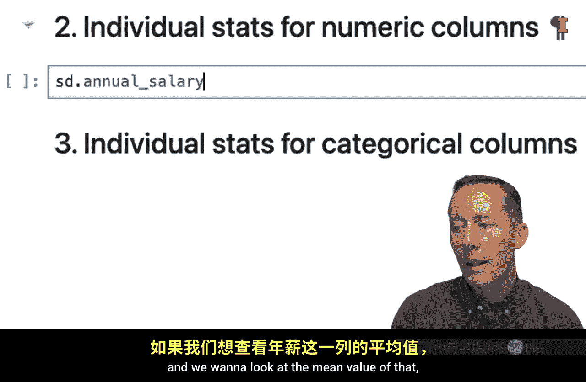

### 计算单个统计量（数值列）

有时我们只需要某个特定的统计量。Pandas为数据框提供了直接计算单个统计量的方法。

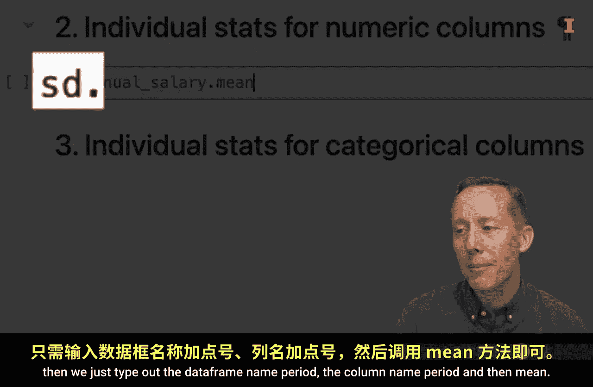

以下是计算`annual salary`列不同统计量的方法：

```python
# 计算平均值
df['annual salary'].mean()

# 计算中位数
df['annual salary'].median()

# 计算最小值
df['annual salary'].min()
```

要计算百分位数，可以使用`quantile`方法。

```python
# 计算第75百分位数
df['annual salary'].quantile(0.75)

# 计算多个百分位数（如第25和第75百分位数）
df['annual salary'].quantile([0.25, 0.75])

# 计算更极端的百分位数
df['annual salary'].quantile([0.01, 0.99])
```

为了生成一系列等间隔的百分位数，我们可以借助NumPy库的`arange`函数。

```python
# 导入NumPy库
import numpy as np

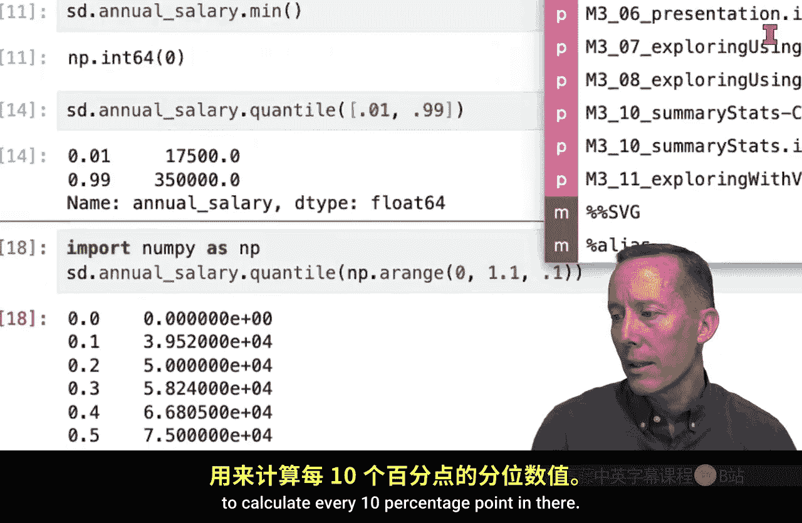

# 生成从0到1，步长为0.1的序列（不包含终点1）
np.arange(0, 1, 0.1)

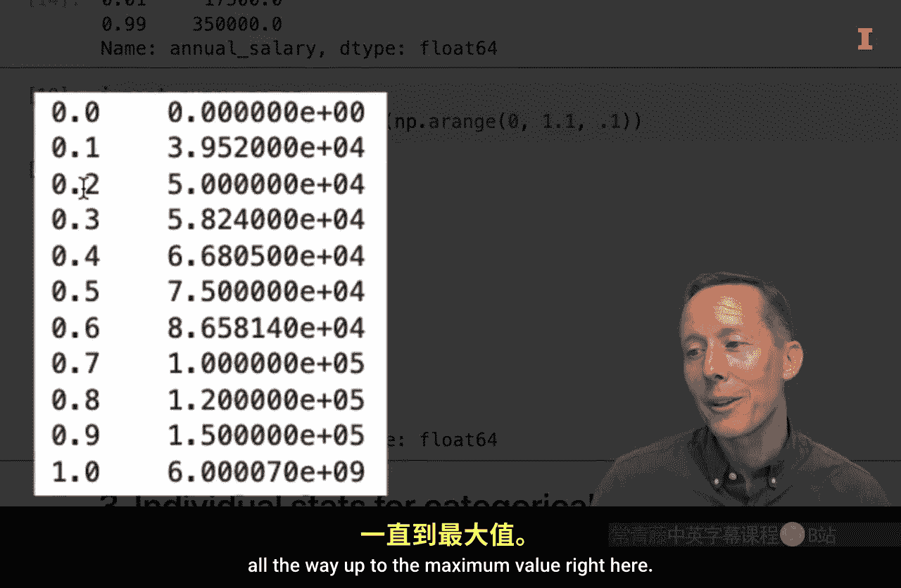

# 计算从10%到100%的十分位数
percentiles = np.arange(0.1, 1.1, 0.1)  # 注意终点设为1.1以包含1.0
df['annual salary'].quantile(percentiles)
```

---

### 计算单个统计量（分类列）

对于分类数据，常用的统计量包括唯一值数量、唯一值列表以及值计数。

以下是相关操作：

```python
# 计算‘industry’列的唯一值数量
df['industry'].nunique()

# 查看‘industry’列的所有唯一值（默认显示前后各几个，中间用...省略）
df['industry'].unique()

# 将唯一值以列表形式完整显示
df['industry'].unique().tolist()
```

在Jupyter Lab中，如果输出结果很长，可以点击输出区域左侧的灰色条将其折叠，以便于滚动查看其他代码。

最常用的分类列统计方法是`value_counts`，它可以计算每个值出现的次数并按降序排列。

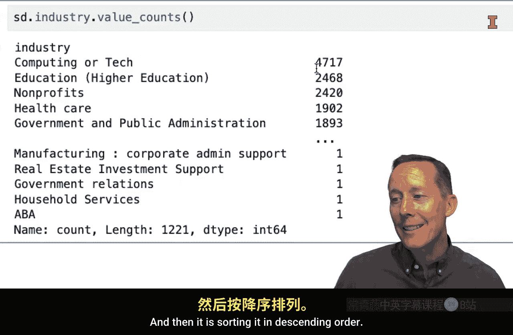

```python
# 计算‘industry’列各值的出现频率
df['industry'].value_counts()
```

结果显示，“Computing or Tech”行业出现次数最多（4717次），其次是“Education, Higher Education”（2468次），还有一些行业仅出现一次。

---

本节课中我们一起学习了如何使用Pandas计算汇总统计量来探索数据。我们介绍了：
1.  使用`describe`方法快速获取数据概览。
2.  分别针对数值列和分类列计算单个统计量，如均值、中位数、百分位数、唯一值计数和频数分布。
3.  利用`value_counts`方法分析分类数据的分布情况。

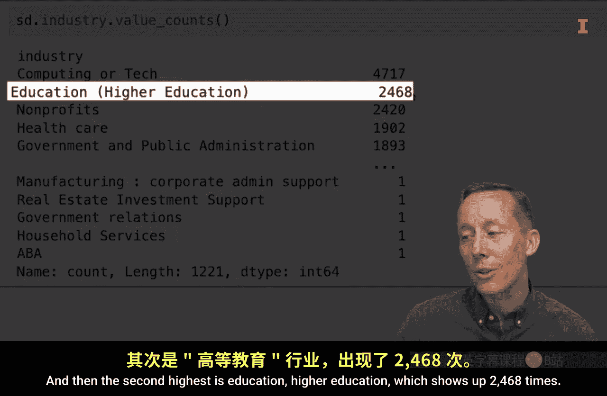

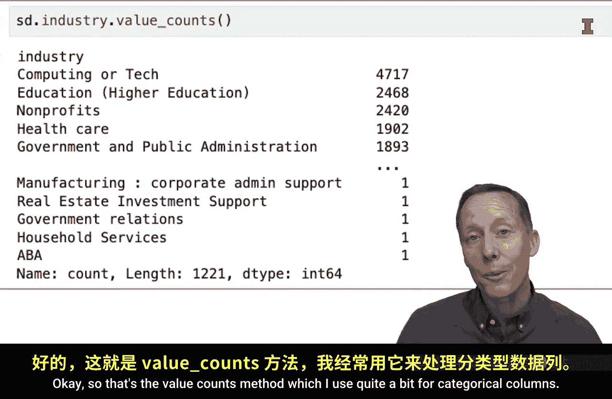


正如所见，仅使用Pandas模块就能轻松计算描述性统计量（NumPy模块也提供了更多相关函数）。这些统计量极其有用，有时本身就是核心分析结果，但更多时候它们会引发出更深层的问题，主要用于数据探索。当将这些统计量与探索性可视化结合使用时，能帮助你更好地理解数据的内涵。