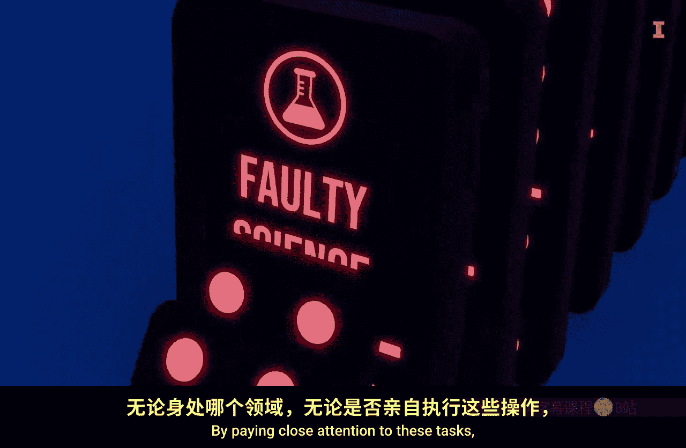
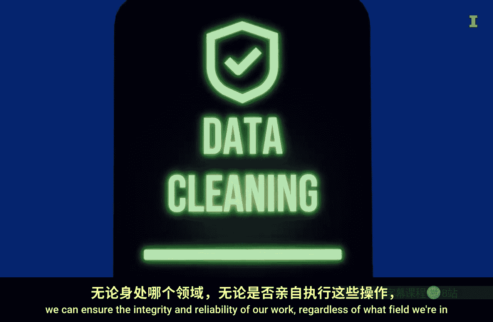
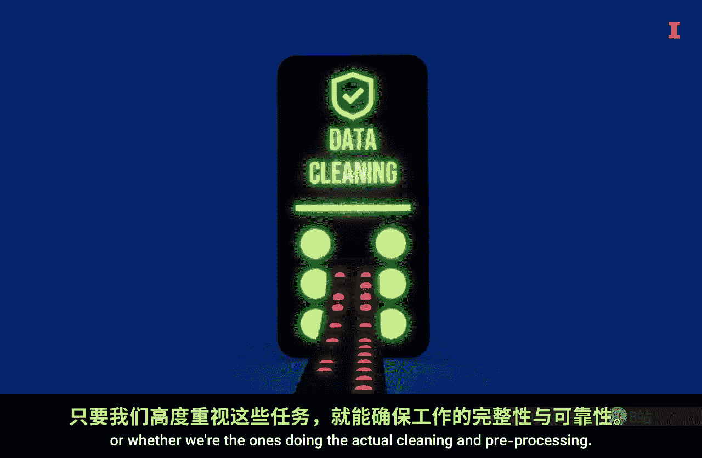

#  047：数据清洗与预处理介绍

在本节课中，我们将要学习数据清洗与预处理的重要性。这是数据分析流程中至关重要的一步，它确保了后续分析和决策的可靠性。

我非常喜欢山地自行车运动。

我如此喜欢它的部分原因，在于骑行时能沉浸于美丽的风景之中。

骑行时，我常想，有人开辟了这些骑行小径，这多么美好。

根据我的亲身经验，如果没有人开辟小径，我可能就无法骑车穿越山岭。

那么，我对山地骑行的热爱与数据分析有何关系？在利用数据之前，数据需要被清洗和预处理。正如小径需要被开辟和维护以确保安全与乐趣，数据也需要被清洗和准备，才能用于可视化和其他计算。

因此，在本模块中，我们将深入探讨数据清洗与预处理的关键任务。

为了说明这些任务的重要性，我们来看三个发人深省的场景。

以下是第一个场景：一个政党正在举行选举以选出新领袖。投票、计票，然后宣布了获胜者。但第二天，他们发现在将选票录入电子表格时出现了一个重大错误。有人犯了错，导致宣布了错误的获胜者。幸运的是，他们迅速发现并纠正了错误，在周一宣布了真正的获胜者。但可以想象，这对最初的获胜者及其支持者是多么沉重的打击，更不用说政党本身的尴尬与沮丧了。如果这个错误未被发现，后果可能相当严重。这一切都源于数据准备不当。

以下是第二个场景：这是一个在商业世界中很容易发生的假设故事。环球小工具公司的首席分析师莎拉，兴奋地准备展示第四季度销售报告。报告预测了一个破纪录的季度。但在她的演示过程中，一位敏锐的副总裁发现了异常。东海岸地区的数字看起来高得离谱。经过一番紧急调查，莎拉发现了问题所在：他们的销售数据库意外地导入了该地区的重复数据文件，导致报告的销售额翻倍。这描绘了一幅过于乐观的图景。这个尴尬的发现不仅损害了莎拉的信誉，还迫使公司撤回其预测。投资者信心受挫，基于错误数据制定的战略决策不得不暂停。这一切都源于一个未被发现的简单数据错误。

以下是第三个场景：这是一个真实案例，它清醒地提醒我们，干净、组织良好的代码是多么关键。一位司机在驶出高速公路时，车辆油门失控。由于汽车安全系统代码存在问题，司机无法减速，最终撞上了路堤。司机受重伤，不幸的是，她的乘客身亡。一位软件专家花了20多个月审查汽车关键系统的源代码。他的结论是：代码过于复杂，基本上无法测试。对其进行的任何修改都可能引入新的错误。这里的启示很明确：让你的代码具有可读性和可管理性不仅仅是为了方便，它可能关乎生死，尤其是当代码被用于做出关键决策时。

这三个故事突显了我们在清洗和预处理数据以及编写代码时为何需要如此谨慎。数据处理中的错误影响深远，可能波及从政治决策、商业战略到公共安全的方方面面。

随着我们继续学习本模块，请记住，数据清洗和预处理不仅仅是枯燥的杂务。它们是防止错误的重要保障，这些错误可能产生深远的后果。

通过密切关注这些任务，我们可以确保工作的完整性和可靠性，无论我们身处哪个领域，或者是否亲自执行这些清洗和预处理工作。

请记住，良好的数据卫生习惯，就像一条维护良好的小径，不仅仅是为了避免“撞车”，更是为了建立对我们分析和决策的信任。

现在，让我们卷起袖子，深入探索干净、可靠的数据世界。