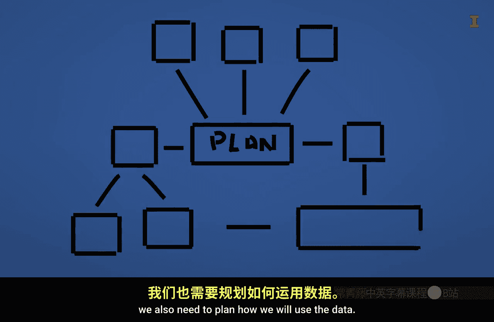

#  048：数据清洗与预处理 🧹➡️📊


在本节课中，我们将学习数据准备工作的两个核心类别：数据清洗与数据预处理。我们将通过一个生动的比喻来理解两者的区别与联系，并了解它们在真实商业分析场景中的应用。

---

我们可以将数据操作任务分为两类：**数据清洗任务**和**数据预处理任务**。

为了更好地理解这两类任务的区别，让我们用一个“徒步小径”的例子来类比。

具体来说，让我们思考一下修建和清理一条小径，与规划一次徒步或骑行有何不同。

---

### 数据清洗：修建与维护小径 🛤️

修建一条小径并非易事。例如，科纳峡谷步道系统已经开发了多年。通常需要使用小型拖拉机来清理灌木丛并平整土地。

之后，还需要定期维护小径，移除大的树枝和石块，并填平车辙。

保持小径没有垃圾也很重要，以维持其可用性和美观性。对于有许多徒步者和骑行者使用的小径，清理工作通常由大型团队定期进行，例如在季节开始时和整个季节的固定时间点。

现在，让我们将这个修建和清理小径的例子关联到数据清洗过程。

正如我们必须付出大量努力来创建可供徒步和骑行的小径一样，我们也需要付出大量努力来准备和清洗数据，以便其能够被使用。

具体来说，我们希望数据没有重复行，并且没有缺失值。

如果我们有日期列，我们希望确保它们被一致地记录。

如果有包含名称的列，那么我们也希望确保名称被一致地记录。



我们希望数值以数值数据类型存储，等等。这将产生干净、整洁的数据。

---

上一节我们介绍了数据清洗，它就像是为分析准备好一条“干净的小径”。本节中我们来看看，当数据已经干净整洁后，我们如何为具体的分析目标“规划路线”，这就是数据预处理。

### 数据预处理：规划徒步或骑行路线 🗺️

一旦你有了小径，并且确保它们干净整洁，你就可以规划路线了。但这个路线取决于很多因素。

首先，如果你是骑行，那么你会使用与徒步不同的一组小径。具体来说，一旦你爬到山顶，你可能想利用那些顺畅的下坡道。

如果你是徒步，那么你会希望确保你没有使用骑行者使用的下坡道。沿途的标志有助于提醒人们如何使用小径。

天气条件也会影响你选择哪条小径以及穿什么衣服。此外，如果你打算在小径上花费很多时间，你会希望确保有足够的水和食物。

现在，让我们将规划徒步或骑行路线的过程与数据预处理联系起来。

正如我们需要计划如何使用小径一样，我们也需要计划将如何使用数据。

以下是数据预处理中需要考虑的一些关键步骤：

首先，我们需要知道有哪些数据可用，并考虑是否需要将两个或多个数据集的数据连接在一起。

然后，我们需要根据想要执行的分析类型，考虑所需的其他转换。

如果我们计划创建可视化，那么我们可能希望将数据转换为**长格式**。
```python
# 示例：使用 pandas 将数据从宽格式转为长格式
df_long = pd.melt(df, id_vars=['ID'], value_vars=['Var1', 'Var2'])
```

相反，如果我们想对数据使用机器学习算法，那么我们可能希望它是**宽格式**。

我们可能还想对数据进行**归一化**或**标准化**。
```python
# 示例：使用 sklearn 进行标准化
from sklearn.preprocessing import StandardScaler
scaler = StandardScaler()
df_scaled = scaler.fit_transform(df[['feature1', 'feature2']])
```

我们甚至可能希望基于现有列的计算创建一些额外的数据列。

---

### 来自业界的见解：生物力学专家的实践 🎯

我采访了与高尔夫公司合作的生物化学家泰勒·斯坦福博士。他使用来自各种来源的数据，这些数据可能已经是干净的，但仍然需要进行预处理才能使用。

让我们听听他关于其领域内数据预处理的一些看法：

> “我的名字是泰勒·斯坦福。我是犹他谷大学的生物力学副教授，也是几家不同高尔夫公司的独立顾问，我与他们合作进行产品教育和数据分析。在汇集和清理数据、确保其准确性方面，我的许多硬件系统都与软件后端相连，帮助将所有数据合并在一起。无论是发射监测数据、观察身体运动的动作捕捉数据、测力台数据，甚至是肌肉激活数据，很多都会被导入我经常使用的一个软件。在那里，如果我通过编码器、同步盒和硬件很好地同步一切，那么我就能将所有数据推到一起，我知道它们是时间戳同步的，并且我得到了所有数据。之后，我就在一个叫 Visual 3D 的软件里做很多事情。它基本上是一个允许我可视化并执行我称之为简化版编码的软件，有很多图形用户界面，我可以在其中测量关节角度、选择最大值和最小值，并以这种方式对数据运行计算，然后基本上导出数据表格，让我能够进入并比较和对比其中一些变量。所以我的流程通常是：收集数据 -> 在 Visual 3D 软件中进行一些过滤技术处理 -> 提取对我有意义的数据到某种 Excel 电子表格中 -> 然后我可以在上面运行统计分析。我认为这个领域的学生需要理解、并且我希望我10年前在教育阶段就掌握的软件是……我现在正好有一个学生在我这里实习，他们问‘我们实习要做什么？’我说‘你要学习 Python’。因为即使在数据组织方面，我们产生了所有这些带有离散数据点的电子表格，手动提取这些数据对他们来说太繁琐了。所以我看到了让他们理解像 Python 或 R 这样的东西的巨大潜力，以便能够快速组织数据，然后根据数据做出一些决策。我通常用来激励他们这样做的方法是，我会打开应用运动科学或应用生物力学领域的招聘公告，现在几乎每一个都列出了 Python 或 R。所以他们希望他们的运动科学家理解这些材料。我最近参加了一个很棒的棒球会议，遇到了几个学生，应该说是刚完成学业的前学生，他们都在为美国职业棒球大联盟球队工作，两人都拥有应用运动科学学位，他们的全部优势就是他们知道如何用 Python 编码，他们知道如何很好地使用它，但他们也理解这个科学背景。所以我认为像 Python 和 R 这样的东西在这个领域向前发展是必不可少的。”

你可能已经注意到，斯坦福博士谈了很多关于合并、过滤和组织数据，以便随后进行统计分析。这就是数据预处理的核心。

同样相关的是，他提到了像 Python 和 R 这样的工具对于帮助进行预处理的实用性。

回到我们的小径类比，正如在小径上拥有良好的标志很重要一样，在你的代码中拥有良好的注释也很重要，以提醒你自己和其他人你在数据预处理步骤中的位置。

数据预处理的另一个方面是能够将数据保存为易于在分析工具中使用的格式。例如，我们可以将数据保存在 pickle 文件、parquet 文件或其他一些能够压缩数据并保留数据类型的结构中。

---

### 总结 📝

本节课中我们一起学习了数据准备的两个关键阶段。

*   **数据清洗** 是基础工作，旨在获得干净、一致、无错误的数据，就像修建和维护一条可供使用的小径。
*   **数据预处理** 是基于特定分析目标（如可视化、机器学习）对干净数据进行转换、整合和重塑的过程，就像为一次具体的徒步或骑行规划最佳路线。

两者都至关重要。希望小径的例子能帮助你更好地理解为什么需要这两种类型的数据准备任务。


另外，如果你有一段时间没有休息了，不妨考虑离开电脑，到一条小径上去走走。也许你会有一些额外的感悟。