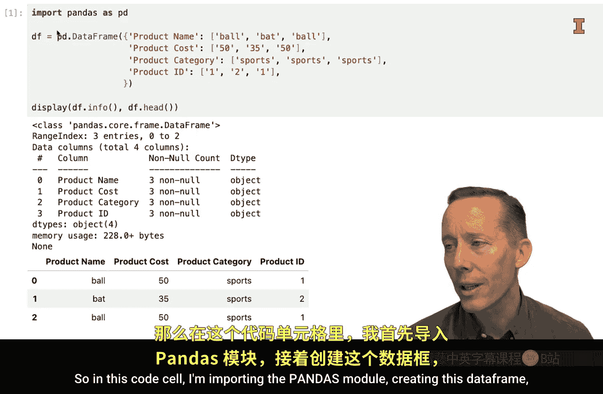
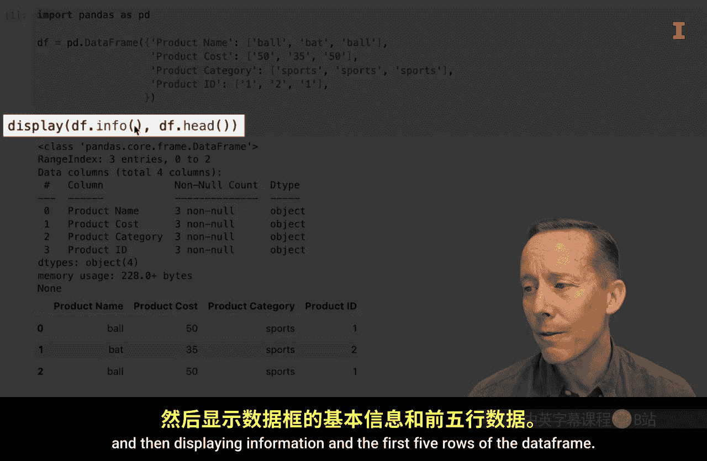
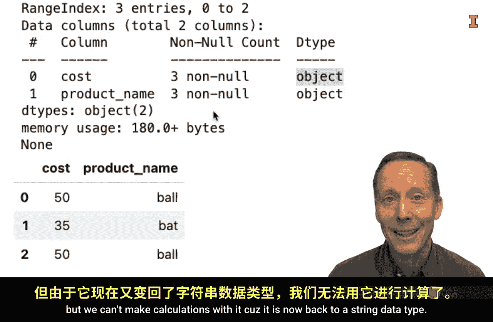

#  049：数据框列的一般数据清洗任务 🧹


在本节课中，我们将学习针对数据框（DataFrame）列进行的一些常见数据清洗任务。这些操作虽然简单，但却是数据分析工作流程中不可或缺的一部分。通过掌握这些技巧，你将能更高效地整理和准备数据。

上一节我们介绍了数据清洗的重要性，本节中我们来看看如何具体操作数据框的列。

## 准备工作

首先，我们需要导入必要的库并创建一个用于演示的小型数据框。这个数据框在多个方面都不够整洁，我们将逐步修复它。



```python
import pandas as pd



# 创建一个示例数据框
df = pd.DataFrame({
    'Product Name': ['Widget A', 'Widget B', 'Widget C'],
    'Product Cost': ['$30', '$50', '$55'],
    'Category': ['Spurs', 'Spurs', 'Spurs'],
    'ID': [101, 102, 103]
})

# 显示数据框信息和前几行
print(df.info())
print(df.head())
```

## 重命名列

观察数据框，你会发现有些列名中包含空格，这通常不是理想的格式。以下是重命名列的方法。

一种方法是直接使用数据框的 `.columns` 属性，将其设置为一个新的列名列表。这种方法适用于需要重命名所有列的情况。

```python
# 重命名所有列
df.columns = ['product_name', 'product_cost', 'category', 'id']
print(df.columns)
```

然而，更多时候你只想重命名其中的一列或几列。这时，可以使用 `.rename()` 方法配合字典来实现。

```python
# 使用.rename()方法重命名特定列
df = df.rename(columns={'product_name': 'Product Name'})
print(df.head())
```

如果需要重命名多列，只需在字典中添加对应的键值对即可。

## 删除列

你已经知道可以使用括号表示法或 `.loc` 方法来删除列。此外，数据框还有一个内置的 `.drop()` 方法。

假设我们想删除“category”列，因为它的值全部相同。

```python
# 使用.drop()方法删除列
df = df.drop(columns=['category'])
print(df.head())
```

`.drop()` 方法也可以同时删除多列，只需将要删除的列名放入一个列表中。

## 删除并重新排序列

有时，你不仅想删除某些列，还想改变剩余列的排列顺序。这可以通过 `.loc` 方法一步完成。

以下是具体操作：我们将只保留“cost”列和“product name”列，并调整它们的顺序。

```python
# 使用.loc方法选择并重排列
df = df.loc[:, ['product_cost', 'Product Name']]
print(df.head())
```

执行后，数据框将只包含指定的两列，并且顺序也按照列表中的顺序排列。

## 转换列的数据类型

数据清洗中一个关键步骤是确保每列都是正确的数据类型。例如，我们的“product_cost”列目前是字符串（object）类型，这导致无法对其进行数值计算。

尝试计算平均值会引发错误：

```python
# 尝试对字符串列进行计算会报错
# df['product_cost'].mean()
```

为了修复这个问题，我们需要将其转换为数值类型。Pandas 的 `pd.to_numeric()` 函数可以轻松地将字符串转换为数值。

```python
# 使用pd.to_numeric()将字符串列转换为数值
df['product_cost'] = pd.to_numeric(df['product_cost'].str.replace('$', ''))
print(df['product_cost'].mean())  # 现在可以成功计算平均值
```

转换后，该列的数据类型变为 `float64` 或 `int64`，从而支持数值运算。

当然，有时也需要进行反向操作，将数值列转换为字符串。这可以使用 `.astype()` 方法。

```python
# 使用.astype()将数值列转换回字符串
df['product_cost'] = df['product_cost'].astype(str)
print(df.info())  # 查看数据类型，确认已变回object
```

转换回字符串后，该列将无法再进行数值计算。

## 总结

本节课中我们一起学习了数据框列的几个核心清洗操作：
*   **重命名列**：使用 `.columns` 属性或 `.rename()` 方法。
*   **删除列**：使用 `.drop()` 方法。
*   **删除并重排列**：使用 `.loc` 方法进行选择和排序。
*   **转换数据类型**：使用 `pd.to_numeric()` 将字符串转为数值，或使用 `.astype()` 进行各种类型转换。




这些是构建整洁、可用于分析的数据集的基础步骤。虽然无需死记硬背所有语法，但理解其逻辑并知道如何查找应用，将极大地提升你使用 Python 进行数据分析的效率和优雅性。